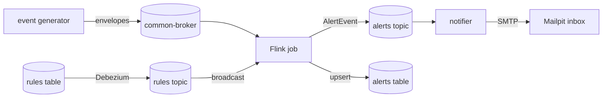
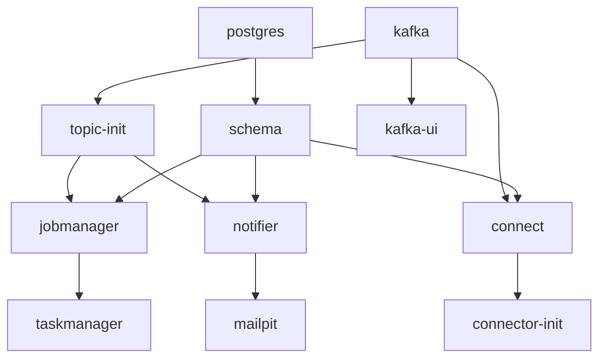

# 01. Getting started

**Goal.** Run the whole chargemon stack once on your machine and watch a single alert travel the
full path: the event generator writes OCPP traffic to the Kafka topic `common-broker`, the Flink
job decodes it and evaluates rules, an alert lands on the Kafka topic `alerts` and in the Postgres
table `alerts`, the notifier picks it up and sends an email that you can open in Mailpit. By the end
you will know which port belongs to which service, how to load rules, how to drive the generator,
and how to read the Flink job graph in the web UI.

**Prerequisites.** None. This is the first chapter. If you want to understand the Java code you
will see later, continue with [chapter 02](02-java-21-for-this-repo.md); if you want to understand
Kafka first, continue with [chapter 04](04-kafka-and-cdc-basics.md).

## Concepts (from scratch)

### What chargemon does

Electric-vehicle charging stations talk to a backend using a protocol called **OCPP** (Open Charge
Point Protocol). Every message a station sends or receives is a small JSON document. chargemon is a
program that watches that message stream for roughly one million stations, decodes every message
into one common shape, checks each message against a list of **alert rules** stored in a database
(for example "a connector reported FAULTED" or "no heartbeat for two minutes"), keeps track of
whether each alert is pending, open or resolved, and hands finished alerts to a **notifier** that
sends Slack, PagerDuty, email or webhook messages.

### The moving parts, in one sentence each

- **Kafka** is a durable message log. Producers append records to named streams called *topics*;
  consumers read them. chargemon reads OCPP messages from one topic and writes alerts to another.
- **Flink** is a stream-processing engine. It runs a *job*: a graph of small operators that each
  receive a record, maybe keep some state, and pass results on. chargemon's core is one Flink job.
- **Postgres** is the relational database. It stores rules, alerts, station master data and
  aggregate counters.
- **Debezium** is a change-data-capture tool. It watches Postgres for row changes and copies them
  into a Kafka topic, so the running Flink job learns about a new or edited rule within seconds
  without a restart.
- **The notifier** is a Spring Boot web application that reads the `alerts` topic and delivers each
  alert to its channels. In the local stack every alert falls back to email.
- **Mailpit** is a fake mail server with a web inbox. It lets you see the notifier's emails.
- **Kafka UI** is a web page for browsing topics and records.
- **The event generator** is a command-line program that pretends to be a fleet of stations and
  writes realistic OCPP traffic, including deliberate faults.

### The toolchain

- **JDK 21.** A Java Development Kit, version 21. The build uses a Gradle *toolchain*, which means
  Gradle looks for a JDK 21 on your machine. The root README suggests
  `export JAVA_HOME=~/.jdks/jdk-21.0.12.1+1`, but any JDK 21 works.
- **Docker with Compose.** All servers (Kafka, Postgres, Flink, ...) run as containers.
- **Gradle** via the wrapper script `./gradlew`. You do not install Gradle; the wrapper downloads
  the right version. [Chapter 03](03-gradle-multi-module-build.md) explains the build in depth.

### Three tiers of tests

`./gradlew build` compiles every module and runs its tests. The tests come in three tiers, and it
helps to know that before the first run because the slower tiers need Docker:

1. **Unit tests.** Plain JUnit tests of one class at a time, no framework. Most tests are here.
   Example: [IdsAndDurationsTest.java](../common/src/test/java/com/chargemon/common/IdsAndDurationsTest.java).
2. **Flink MiniCluster tests.** They start a tiny in-process Flink cluster and run the real job
   graph on in-memory sources and sinks. Slower, but no Docker needed. Example:
   [TopologyEndToEndTest.java](../flink-processor/src/test/java/com/chargemon/flink/topology/TopologyEndToEndTest.java).
3. **Testcontainers tests.** They start a real Postgres in Docker for the duration of the test.
   Files end in `IT`: [SchemaMigratorIT.java](../schema/src/test/java/com/chargemon/schema/SchemaMigratorIT.java)
   and [JdbcDeliveryLedgerIT.java](../notifier/src/test/java/com/chargemon/notifier/ledger/JdbcDeliveryLedgerIT.java).

If Docker is not running, tier 3 fails. To build the jars without any tests use
`./gradlew build -x test`, which is also what the header of the compose file recommends.

## In this repo

### Step 1: build the jars

```bash
export JAVA_HOME=~/.jdks/jdk-21.0.12.1+1     # any JDK 21
./gradlew build                              # or: ./gradlew build -x test
```

The Docker images are built *from* the jars, so this step must come first. The jars the compose
file expects are:

| Jar | Built by | Used by compose service |
|---|---|---|
| `flink-processor/build/libs/flink-processor-all.jar` | `:flink-processor:shadowJar` | `jobmanager`, `taskmanager` |
| `notifier/build/libs/notifier.jar` | `:notifier:bootJar` | `notifier` |
| `schema/build/libs/schema-all.jar` | `:schema:shadowJar` | `schema` |
| `event-generator/build/libs/event-generator-all.jar` | `:event-generator:shadowJar` | you, from the command line |

### Step 2: start the stack

```bash
docker compose -f deploy/docker-compose.yml up -d --build
```

`-d` runs in the background, `--build` rebuilds the images from the fresh jars. The compose file
is [deploy/docker-compose.yml](../deploy/docker-compose.yml). This is the service and port map:

| Service | Image or build | Host port | What you use it for |
|---|---|---|---|
| `kafka` | `apache/kafka:3.9.1` | 9092 | the message broker; the generator connects here |
| `topic-init` | `apache/kafka:3.9.1` | none | one-shot: creates all topics, then exits |
| `postgres` | `postgres:16-alpine` | 5432 | rules, alerts, master data |
| `schema` | `Dockerfile.java-app` + `schema-all.jar` | none | one-shot: runs Flyway migrations, then exits |
| `connect` | `quay.io/debezium/connect:3.1` | 8083 | Kafka Connect with the Debezium plugin |
| `connector-init` | `curlimages/curl` | none | one-shot: registers the `rules-cdc` connector |
| `jobmanager` | `Dockerfile.flink` | 8081 | Flink coordinator and web UI, runs `JobMain` |
| `taskmanager` | `Dockerfile.flink` | none | Flink worker with 4 slots |
| `notifier` | `Dockerfile.java-app` + `notifier.jar` | 8080 | Spring Boot notifier, actuator endpoints |
| `mailpit` | `axllent/mailpit` | 8025 (web), 1025 (SMTP) | inbox for notifier emails |
| `kafka-ui` | `ghcr.io/kafbat/kafka-ui` | 8090 | browse topics and records |

The one-shot services matter for ordering: `jobmanager` waits until `topic-init` and `schema` have
finished, and `connect` waits for `schema`, so the Debezium connector never sees a database without
the `rules` table. Check that everything is healthy:

```bash
docker compose -f deploy/docker-compose.yml ps
```

`topic-init`, `schema` and `connector-init` should show `Exited (0)`; the rest should be `Up`.

### Step 3: load the sample rules

Rules live in the Postgres table `rules`. The file
[deploy/local/sample-rules.sql](../deploy/local/sample-rules.sql) inserts six of them. Load it by
piping the file into `psql` inside the Postgres container (this is the command from the root README):

```bash
docker compose -f deploy/docker-compose.yml exec -T postgres psql -U chargemon -d chargemon < deploy/local/sample-rules.sql
```

The six rules, in the order they appear in the file:

| Name | Kind | What it watches | Grace | Suppression | Severity |
|---|---|---|---|---|---|
| Connector faulted | EVENT | `StatusNotification` with `event.status == FAULTED` | 0 s | 10 min | HIGH |
| No heartbeat 2 min | ABSENCE | no `Heartbeat` for `PT2M` | 30 s | 15 min | CRITICAL |
| Stuck preparing | STATE_DURATION | a connector stays `PREPARING` longer than 3 min | 0 s | 30 min | MEDIUM |
| Boot rejected | EVENT | `BootCompleted` with `event.status == REJECTED` | 0 s | 1 h | HIGH |
| Zero-energy sessions today | EVENT | `agg.zeroEnergy.daily >= 3` | 0 s | 6 h | LOW |
| CSMS call errors | EVENT | `CallFailed` with error code `InternalError` or `SecurityError` | 0 s | 5 min | MEDIUM |

Here is the first row so you can see the shape (the `spec` column is JSON text):

```sql
('11111111-1111-1111-1111-111111111111', 'Connector faulted', 'EVENT', 'STATION',
 '{"trigger":{"actions":["StatusNotification"]},"condition":{"op":"eq","field":"event.status","value":"FAULTED"}}',
 'PT0S', 'PT10M', 'HIGH', '{email:ops@example.test}'),
```
(deploy/local/sample-rules.sql:3)

*Grace* means the condition must stay true for that long before an alert opens; *suppression*
means repeat triggers on the same station are muted for that long after an alert opens. Both are
explained properly in [chapter 16](16-alert-lifecycle-and-alert-model.md). Because the rows go
through Debezium, the Flink job picks them up within seconds; no restart is needed.

### Step 4: generate traffic

The generator is a normal Java program with command-line flags. Its entry point is
[GeneratorMain.java](../event-generator/src/main/java/com/chargemon/generator/GeneratorMain.java);
every flag is an `@Option` field there. The flags and their defaults:

| Flag | Default | Meaning |
|---|---|---|
| `--bootstrap` | `localhost:9092` | Kafka address |
| `--topic` | `common-broker` | where OCPP envelopes go |
| `--stations-topic`, `--groups-topic` | `stations`, `groups` | where master data goes |
| `--stations` | `100` | number of simulated stations |
| `--rate` | `100` | target envelopes per second |
| `--profiles` | `normal` | comma list of fault profiles (see below) |
| `--v16-ratio` | `0.2` | fraction of stations speaking OCPP 1.6 (the rest speak 2.0.1) |
| `--duration` | `PT0S` | ISO-8601 run time; `PT0S` means run forever |
| `--speedup` | `1` | simulated seconds per wall-clock second |
| `--seed-master` | `false` | publish station and group master data first |
| `--seed` | `42` | random seed, so runs are repeatable |

The profiles are listed in the option's description string:

```java
@Option(names = "--profiles", split = ",", defaultValue = "normal",
        description = "comma list of: normal, heartbeat-drop, stuck-preparing, zero-energy, boot-rejected, call-error")
List<String> profiles;
```
(event-generator/src/main/java/com/chargemon/generator/GeneratorMain.java:38)

Each profile is designed to trip one of the six sample rules. A good first run, from the root README:

```bash
java -jar event-generator/build/libs/event-generator-all.jar \
     --stations 200 --rate 100 --profiles normal,heartbeat-drop,stuck-preparing,zero-energy,boot-rejected,call-error \
     --seed-master --speedup 10
```

Use `--seed-master` on the first run so that the `stations` and `groups` topics get filled; the
job uses them to attach vendor, model and group information to each event. Stop the generator with
`Ctrl-C`.

### Step 5: where to look

- **Flink UI**, <http://localhost:8081>: one running job named `chargemon-event-processor`. Click it
  to see the job graph (next section) and per-operator record counts.
- **Kafka UI**, <http://localhost:8090>: open *Topics*, then `common-broker` to see raw envelopes, and
  `alerts` to see alert events as JSON. Each alert record has a `type` (`OPENED` or `RESOLVED`),
  a `ruleName`, a `subjectId` (the station) and a `severity`.
- **Postgres**: the same alerts as rows.

  ```bash
  docker compose -f deploy/docker-compose.yml exec postgres psql -U chargemon -d chargemon \
    -c "select rule_name, subject_id, status, severity, opened_at from alerts order by opened_at desc limit 20"
  ```

- **Mailpit**, <http://localhost:8025>: one email per delivered alert. The compose file sets
  `NOTIFIER_FALLBACK_*` to `email:ops@example.test`, so even rules with empty `channels` produce an
  email.

### Reading the Flink job graph

On the job page the Flink UI draws boxes connected by arrows. Each box is an *operator* (or a chain
of operators that Flink fused together). The names come from `.name("...")` calls in
[TopologyBuilder.java](../flink-processor/src/main/java/com/chargemon/flink/topology/TopologyBuilder.java).
Read them left to right:

| Operator name | What it does | Chapter |
|---|---|---|
| `common-broker` (source) | reads envelopes from Kafka | 09, 17 |
| `decode` | parses the envelope and the OCPP frame; bad input goes to the `dead-letter` side output | 17 |
| `correlate` | joins a request (CALL) with its response (CALLRESULT) per station | 12, 17 |
| `enrich` | attaches station master data and group hierarchy | 17 |
| `sessions` | tracks charging sessions and detects zero-energy ones | 17 |
| `zero-energy aggregate` | counts zero-energy sessions per hour, day, 7 days, 30 days | 15, 17 |
| `rules-stage1` | evaluates EVENT, ABSENCE and STATE_DURATION rules per station | 15, 18 |
| `lifecycle-stage1` | turns rule signals into OPENED / RESOLVED alert events (grace, suppression) | 16, 18 |
| `rules-sequence` | stage-2 SEQUENCE rules over stage-1 alerts of one station | 15, 18 |
| `rules-group` | stage-2 GROUP_AGGREGATE rules over alerts of all stations in a group | 15, 18 |
| `lifecycle-stage2` | lifecycle for stage-2 alerts | 16, 18 |
| `alerts -> kafka`, `alerts -> postgres` | the two alert sinks | 09, 18 |
| `stations`, `groups`, `rules` (sources) | compacted control topics, replayed from the beginning | 04, 08 |

Hovering a box shows *Records received* and *Records sent*; these are the quickest way to see
whether traffic is flowing. The `decode` operator also exposes two custom counters,
`framesDecoded` and `framesRejected`, under the *Metrics* tab.

### Repo module map

| Module | One line | Chapter |
|---|---|---|
| `common` | Jackson factory, durations, UUIDv7, `Result`, `Env` | 02 |
| `ocpp-model` | the version-neutral sealed event hierarchy (`OcppEvent`) | 11 |
| `ocpp-codec` | envelope and frame parsing, mapper registry, correlator, `Fact` bridge | 12 |
| `alert-model` | `AlertEvent`, `ConditionSignal`, `ChannelRef`: the contract with downstream | 16 |
| `rule-engine` | condition AST, rule definitions, evaluators, lifecycle state machine; no Flink | 14, 15, 16 |
| `schema` | Flyway migrations and the `SchemaMigrator` one-shot | 03 |
| `flink-processor` | the Flink job; operators are thin adapters over rule-engine and codec | 06, 17, 18 |
| `notifier` | Spring Boot consumer of `alerts` with channels, retries, idempotency ledger | 19 |
| `event-generator` | CLI traffic simulator with fault profiles | 20 |
| `deploy` | compose stack, Dockerfiles, Debezium connector, Kubernetes manifest | 20 |

## Diagrams

The path one alert takes through the system:



The compose services and what waits for what:



## Hands-on exercises

### Exercise 1: make a "Boot rejected" alert and find its row

**What to do.** With the stack up and the sample rules loaded, run the generator with only the
`boot-rejected` profile and a small fleet:

```bash
java -jar event-generator/build/libs/event-generator-all.jar \
     --stations 20 --rate 20 --profiles boot-rejected --seed-master --speedup 10
```

After a minute, query Postgres:

```bash
docker compose -f deploy/docker-compose.yml exec postgres psql -U chargemon -d chargemon \
  -c "select rule_name, subject_id, status, opened_at from alerts where rule_name = 'Boot rejected'"
```

**What you should observe.** One or more rows with `status = OPEN`. In Kafka UI, topic `alerts`,
you can find the same alert as a JSON record whose `type` is `OPENED` and whose `ruleId` is
`44444444-4444-4444-4444-444444444444`. In Mailpit there is an email for it.

**Hint.** The `Boot rejected` rule triggers on the `BootCompleted` event, which only exists after
the `correlate` operator has joined a `BootNotification` CALL with its CALLRESULT. If you see no
alert, check the `correlate` box in the Flink UI: its *Records sent* count should be growing.

### Exercise 2: watch an ABSENCE rule fire

**What to do.** Run the generator with the `normal` profile for about a minute, then stop it with
`Ctrl-C`. Note the time. Watch the `alerts` table (re-run the query every 30 seconds) or the
`lifecycle-stage1` operator's *Records sent* count.

**What you should observe.** About two and a half minutes after the last heartbeat, one
`No heartbeat 2 min` alert per station opens with severity `CRITICAL`. The rule says a heartbeat is
expected `within` `PT2M`; when that window passes the rule signals TRIGGERED, and the lifecycle then
waits another 30 seconds of grace before it emits OPENED.

**Hint.** Nothing arrives from Kafka after you stop the generator, so the alert must come from a
*timer* inside Flink rather than from an event. Timers are the subject of
[chapter 07](07-flink-state-timers-serialization.md).

### Exercise 3: edit a rule live

**What to do.** Change the severity of the "Connector faulted" rule:

```bash
docker compose -f deploy/docker-compose.yml exec postgres psql -U chargemon -d chargemon \
  -c "UPDATE rules SET severity = 'CRITICAL' WHERE id = '11111111-1111-1111-1111-111111111111'"
```

Then open Kafka UI, topic `rules`, and look at the newest record.

**What you should observe.** A new record keyed by the rule id appears within a few seconds. Its
value is the whole row as JSON, with `severity` now `CRITICAL` and `version` incremented from 1 to 2
(a database trigger bumps it on every update). The Flink job was not restarted: the next
"Connector faulted" alert on the `alerts` topic carries `severity: CRITICAL`.

**Hint.** If nothing appears on the `rules` topic, check the connector:
`curl -s localhost:8083/connectors/rules-cdc/status`. Its `state` and its task state should both be
`RUNNING`. [Chapter 04](04-kafka-and-cdc-basics.md) explains the whole Debezium path.

## Self-check

1. Which two services must finish before the Flink `jobmanager` starts, and why does the order matter?
2. Why does the root README tell you to run `./gradlew build` *before* `docker compose up --build`?
3. Name the three test tiers and say which one needs Docker.
4. You changed a rule's `suppression_window` in Postgres. Do you need to restart the Flink job?
5. Which operator would you inspect first if no alerts appear at all, and which counter would you look at?

<details><summary>Answers</summary>

1. `topic-init` (creates the Kafka topics) and `schema` (runs the Flyway migrations). Without them
   the job would fail to subscribe to missing topics or to write to missing tables.
2. The Dockerfiles copy the already-built jars (`flink-processor-all.jar`, `notifier.jar`,
   `schema-all.jar`) into the images; nothing is compiled inside Docker.
3. Unit tests, Flink MiniCluster tests, and Testcontainers tests. Only the Testcontainers tier
   (`*IT` classes) needs Docker.
4. No. Debezium publishes the changed row to the `rules` topic and the job broadcasts it to every
   rule operator within seconds.
5. `decode`: if *Records received* is zero, nothing reaches the job from Kafka; if `framesRejected`
   grows, the envelopes are malformed and land on `dead-letter`.

</details>

## Glossary terms

- [topic](glossary.md#topic)
- [compacted topic](glossary.md#compacted-topic)
- [Debezium](glossary.md#debezium)
- [dead-letter topic](glossary.md#dead-letter-topic)
- [JobManager](glossary.md#jobmanager)
- [TaskManager](glossary.md#taskmanager)
- [MiniCluster](glossary.md#minicluster)
- [Flyway](glossary.md#flyway)
- [grace window](glossary.md#grace-window)
- [suppression window](glossary.md#suppression-window)
- [rule kind](glossary.md#rule-kind)
- [correlation](glossary.md#correlation)

## Further reading

- Root [README.md](../README.md): the quick-start commands and the extension table.
- Flink 1.20, "Flink Architecture": <https://nightlies.apache.org/flink/flink-docs-release-1.20/docs/concepts/flink-architecture/>
- Flink 1.20, web UI and REST monitoring: <https://nightlies.apache.org/flink/flink-docs-release-1.20/docs/ops/rest_api/>
- Kafka documentation, "Getting started": <https://kafka.apache.org/documentation/#gettingStarted>
- Debezium Postgres connector: <https://debezium.io/documentation/reference/stable/connectors/postgresql.html>
- Docker Compose reference: <https://docs.docker.com/compose/>
- Mailpit: <https://mailpit.axllent.org/>
