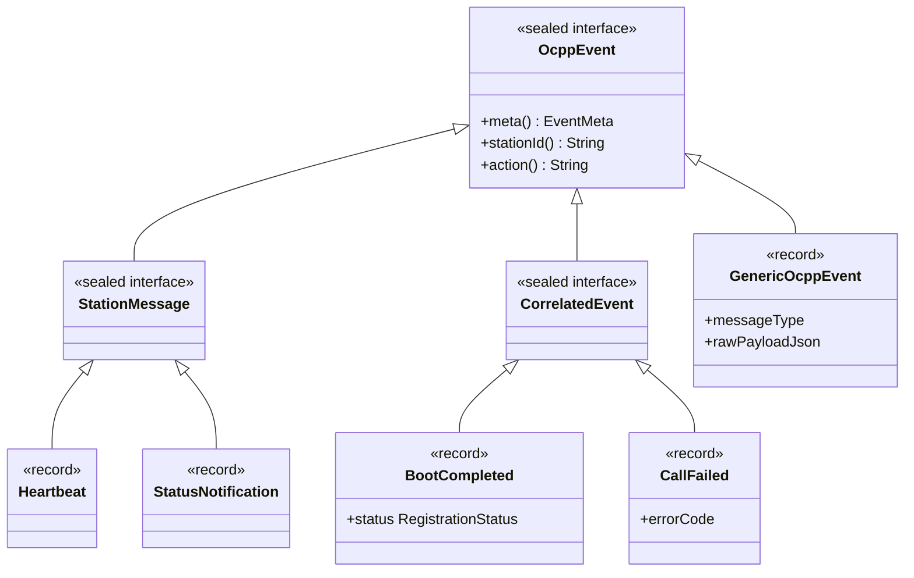
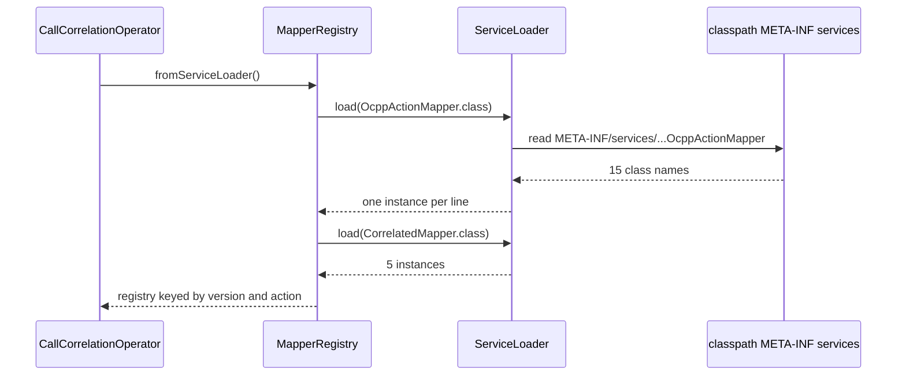

# 02. Java 21 for this repo

**Goal.** Learn exactly the Java constructs this codebase leans on, and nothing more: records,
sealed interfaces, pattern-matching `switch`, `Optional`, the repo's own `Result` type, checked
versus unchecked exceptions, just enough generics, lambdas and streams, `ServiceLoader`, Jackson
and the test libraries. Every construct is shown with a real type from the repo, so after this
chapter you can open any file under `src/main/java` and read it.

**Prerequisites.** [Chapter 01](01-getting-started.md) so you have built the project once. No Java
experience is assumed beyond "I have seen a class before". If that is not true for you, or this
chapter feels too dense, do the [Java from zero tutorial](java-tutorial/README.md) first; it
teaches every construct below with small runnable programs and points back to each section here.

## Concepts (from scratch)

### Classes, interfaces, enums, packages

A **class** bundles data (fields) and behaviour (methods). An **interface** lists method
signatures without bodies; a class *implements* an interface by providing those bodies. An **enum**
is a class with a fixed set of named instances, such as `Direction.STATION_TO_CSMS`. A **package**
is a folder-like namespace; `package com.chargemon.ocpp.model;` at the top of a file says which
namespace the type lives in, and `import` pulls in types from other packages.

`static` on a method means "belongs to the class, not to an instance"; you call it as
`Result.ok(value)` without creating a `Result` first. `final` on a field means "assigned once";
`final` on a class means "cannot be subclassed". A type whose fields are all `final` and which never
exposes a way to change them is **immutable**. This repo prefers immutable types everywhere: once an
event object exists it never changes, so it can be passed between threads and operators safely.

### Records

A **record** is a class whose only job is to carry data. You declare the fields once in the header
and Java generates the constructor, accessor methods (`stationId()`, not `getStationId()`),
`equals`, `hashCode` and `toString`. Fields are `final`, so records are immutable by construction.

The generated constructor is called the **canonical constructor**. You can add a **compact
constructor** (the record name followed by a block, no parameter list) to validate or normalise
the fields before they are stored. Because the fields cannot be changed later, "modifying" a record
means making a copy with one field different; by convention such methods are named `withX`.

### Sealed interfaces and exhaustiveness

A **sealed interface** names the complete list of types allowed to implement it with the `permits`
keyword. That list is closed: nobody outside the file (or package) can add a fourth implementation.
The reward is that the compiler can prove a `switch` over the interface covers every case. If
someone later adds a permitted type, every `switch` that forgot it stops compiling. This is how the
repo gets "add a rule kind and the compiler tells you every place to update".

### Pattern matching in `switch` and `instanceof`

Java 21 lets a `switch` branch on the *runtime type* of a value:

```java
return switch (frame) {
    case RawFrame.Call call -> ...;
    case RawFrame.CallResult result -> ...;
};
```

Each `case Type name ->` both tests the type and binds a variable of that type. With a sealed
interface no `default` is needed. You can also deconstruct a record in place:
`case Ok<T, E>(var value) -> ...`. The same idea works in `if`: `if (v instanceof String s)` tests
and binds in one step.

### `Optional`

`Optional<T>` is a box that holds one `T` or nothing. Returning it instead of `null` forces the
caller to think about the empty case. The methods you will meet: `isPresent()`, `isEmpty()`,
`get()`, `map(f)` (transform the value if present), `orElse(x)` (value or fallback),
`orElseThrow()`, and `Optional.ofNullable(x)` (empty if `x` is null).

### Checked versus unchecked exceptions, and the `Result` alternative

An **exception** is a signal that unwinds the call stack until something catches it. **Checked**
exceptions (subclasses of `Exception` but not `RuntimeException`, e.g. `IOException`) must be
declared with `throws` or caught; **unchecked** ones (`RuntimeException` and its subclasses, e.g.
`IllegalArgumentException`) need no declaration. Throwing is expensive (it captures a stack trace)
and awkward in stream operators, so on hot paths this repo returns a value that says "ok" or "error"
instead. That value is the sealed `Result` type described below.

### Generics

`List<String>` is a list *of strings*; the part in angle brackets is a **type parameter**. You can
write your own: `interface Fact` is plain, but `Result<T, E>` says "a result whose value is a `T`
and whose error is an `E`". A method can have its own parameter: `static <T, E> Result<T, E> ok(T
value)`. `?` is a wildcard: `List<? extends Foo>` accepts a list of `Foo` or any subtype;
`StationRuleKindEvaluator<?>` means "an evaluator for some spec type I do not care about here".

### Lambdas, functional interfaces, streams

A **functional interface** has exactly one abstract method. Any such interface can be implemented
inline with a **lambda**: `path -> Optional.empty()`. `Function<A, B>` (takes an `A`, returns a
`B`) and `Supplier<T>` are the standard ones. A **method reference** like `found::add` is a lambda
that just calls one method. **Streams** (`list.stream().filter(...).map(...).toList()`) are a
pipeline style for collections; this repo uses them sparingly and prefers plain loops where it
matters for speed.

### `ServiceLoader`

`java.util.ServiceLoader` is the JDK's built-in plugin mechanism. You put a text file at
`META-INF/services/<fully.qualified.InterfaceName>` on the classpath; each line is the name of a
class that implements the interface. `ServiceLoader.load(Interface.class)` reads every such file it
can find and instantiates the classes with their no-argument constructor. Adding a plugin means
adding a class and one line in the file; nothing else changes.

### Jackson

**Jackson** is the JSON library. `ObjectMapper` converts between Java objects and JSON text.
`JsonNode` is a generic in-memory JSON tree (`node.get("status").asText()`), used when the shape is
not known in advance. Records deserialize without extra annotations because the compiler keeps
parameter names (the build passes `-parameters`). For a sealed interface, Jackson needs to know
*which* record to build; `@JsonTypeInfo` names the property that carries the type name and
`@JsonSubTypes` maps each name to a class.

### Tests: JUnit 5, AssertJ, jqwik

A **JUnit 5** test is a class with methods annotated `@Test`. **AssertJ** provides fluent assertions
such as `assertThat(x).isEqualTo(y)`, which read better than JUnit's own. **jqwik** is a
property-based testing library: instead of one hand-picked input you describe how to generate many
random inputs (`@ForAll`) and state a property that must hold for all of them. The lifecycle state
machine has such a test; [chapter 16](16-alert-lifecycle-and-alert-model.md) walks through it.

## In this repo

### A record with a compact constructor: `EventMeta`

[EventMeta.java](../ocpp-model/src/main/java/com/chargemon/ocpp/model/EventMeta.java) is the
metadata attached to every canonical event. Its compact constructor rejects nulls for the required
fields and fills in a default for `eventTime`:

```java
public EventMeta {
    Objects.requireNonNull(stationId, "stationId");
    Objects.requireNonNull(version, "version");
    Objects.requireNonNull(direction, "direction");
    Objects.requireNonNull(receivedAt, "receivedAt");
    if (eventTime == null) {
        eventTime = receivedAt;
    }
}
```
(ocpp-model/src/main/java/com/chargemon/ocpp/model/EventMeta.java:23)

Note that inside a compact constructor you assign the *parameter* (`eventTime = receivedAt`); the
field is stored afterwards. The two `with` methods build modified copies:

```java
public EventMeta withAction(String newAction) {
    return new EventMeta(stationId, version, direction, uniqueId, newAction, receivedAt, eventTime, sourceRef);
}
```
(ocpp-model/src/main/java/com/chargemon/ocpp/model/EventMeta.java:33)

### A three-level sealed hierarchy: `OcppEvent`

[OcppEvent.java](../ocpp-model/src/main/java/com/chargemon/ocpp/model/OcppEvent.java) is the root:

```java
public sealed interface OcppEvent permits StationMessage, CorrelatedEvent, GenericOcppEvent {

    EventMeta meta();

    default String stationId() {
        return meta().stationId();
    }
```
(ocpp-model/src/main/java/com/chargemon/ocpp/model/OcppEvent.java:32)

A `default` method has a body in the interface, so every record gets `stationId()` for free.
Two of the three permitted types are themselves sealed:
[StationMessage.java](../ocpp-model/src/main/java/com/chargemon/ocpp/model/StationMessage.java)
permits ten records (`BootNotification`, `Heartbeat`, `StatusNotification`, ...) and
[CorrelatedEvent.java](../ocpp-model/src/main/java/com/chargemon/ocpp/model/CorrelatedEvent.java)
permits five (`BootCompleted`, `SessionStarted`, `AuthorizationResult`, `CallFailed`,
`CallTimedOut`). The leaves are tiny records, for example
`public record Heartbeat(EventMeta meta) implements StationMessage { }`.

The same file shows Jackson's polymorphism annotations:

```java
@JsonTypeInfo(use = JsonTypeInfo.Id.NAME, property = "type")
@JsonSubTypes({
    @JsonSubTypes.Type(value = BootNotification.class, name = "BootNotification"),
    @JsonSubTypes.Type(value = Heartbeat.class, name = "Heartbeat"),
```
(ocpp-model/src/main/java/com/chargemon/ocpp/model/OcppEvent.java:13)

So the JSON `{"type":"Heartbeat","meta":{...}}` becomes a `Heartbeat` record, and the `type`
field doubles as the action name that rules filter on.

A second sealed family is
[RuleSpec.java](../rule-engine/src/main/java/com/chargemon/rules/definition/RuleSpec.java): one
nested record per rule kind (`EventSpec`, `AbsenceSpec`, `StateDurationSpec`, `SequenceSpec`,
`GroupAggregateSpec`), all `permits`-listed on the interface. Note how `SequenceSpec` uses a
compact constructor to replace a null list with an empty immutable copy:

```java
record SequenceSpec(List<String> allOf, Duration within) implements RuleSpec {
    public SequenceSpec {
        allOf = allOf == null ? List.of() : List.copyOf(allOf);
    }
```
(rule-engine/src/main/java/com/chargemon/rules/definition/RuleSpec.java:48)

### Exhaustive `switch` on a sealed type: `CallCorrelator.onFrame`

[RawFrame.java](../ocpp-codec/src/main/java/com/chargemon/ocpp/codec/frame/RawFrame.java) is
sealed with three records, `Call`, `CallResult`, `CallError`. The correlator dispatches on it:

```java
public CorrelationOutcome onFrame(RawEnvelope env, RawFrame frame, PendingCallStore store) {
    return switch (frame) {
        case RawFrame.Call call -> onCall(env, call, store);
        case RawFrame.CallResult result -> onResponse(env, toPending(env, result), store);
        case RawFrame.CallError error -> onResponse(env, toPending(env, error), store);
    };
}
```
(ocpp-codec/src/main/java/com/chargemon/ocpp/codec/correlate/CallCorrelator.java:55)

No `default` branch: if a fourth frame type were ever added to `permits`, this method would fail
to compile. A `switch` over an enum works the same way; see `parseSpec` in
[RuleDefinitionParser.java](../rule-engine/src/main/java/com/chargemon/rules/definition/RuleDefinitionParser.java)
(line 131), which has one `case` per `RuleKind` and uses `yield` inside a block case to return a
value. Pattern-matching `instanceof` appears in
[FieldPathResolver.java](../ocpp-codec/src/main/java/com/chargemon/ocpp/codec/fact/FieldPathResolver.java):

```java
if (v instanceof BigDecimal bd) {
    return Optional.of(bd);
}
if (v instanceof Number num) {
    return Optional.of(new BigDecimal(num.toString()));
}
```
(ocpp-codec/src/main/java/com/chargemon/ocpp/codec/fact/FieldPathResolver.java:72)

### `Optional` as the "may be absent" answer: `Fact`

The rule engine reads data through one tiny functional interface,
[Fact.java](../rule-engine/src/main/java/com/chargemon/rules/condition/Fact.java):

```java
@FunctionalInterface
public interface Fact {

    Optional<Object> get(String path);

    static Fact empty() {
        return path -> Optional.empty();
    }
}
```
(rule-engine/src/main/java/com/chargemon/rules/condition/Fact.java:10)

`get("event.status")` returns the value or empty; there is no null to forget about. The
`empty()` factory shows a lambda implementing the interface in one line.

### The repo's own `Result`

[Result.java](../common/src/main/java/com/chargemon/common/result/Result.java) is a sealed
interface with two records and three combinators:

```java
public sealed interface Result<T, E> {

    record Ok<T, E>(T value) implements Result<T, E> {
    }

    record Err<T, E>(E error) implements Result<T, E> {
    }
```
(common/src/main/java/com/chargemon/common/result/Result.java:6)

```java
default <U> Result<U, E> map(Function<? super T, ? extends U> f) {
    return switch (this) {
        case Ok<T, E> ok -> new Ok<>(f.apply(ok.value()));
        case Err<T, E> err -> new Err<>(err.error());
    };
}
```
(common/src/main/java/com/chargemon/common/result/Result.java:26)

`map` transforms a success and passes an error through untouched; `flatMap` chains a step that can
itself fail; `orElseThrow` converts to an exception only at the edge where you really want one.
The envelope parser returns `Result<RawEnvelope, String>`: a malformed record becomes an `Err`
with a message that the decode operator routes to the dead-letter topic, and no stack trace is ever
built for the millions of good records.

### Generics you need to read `EvaluatorRegistry`

[StationRuleKindEvaluator.java](../rule-engine/src/main/java/com/chargemon/rules/eval/StationRuleKindEvaluator.java)
is declared `interface StationRuleKindEvaluator<S extends RuleSpec>`: each evaluator is tied to
one spec record type. The registry stores them without caring which:

```java
public static EvaluatorRegistry fromServiceLoader() {
    List<StationRuleKindEvaluator<?>> found = new ArrayList<>();
    ServiceLoader.load(StationRuleKindEvaluator.class).forEach(found::add);
    return of(found);
}
```
(rule-engine/src/main/java/com/chargemon/rules/eval/EvaluatorRegistry.java:20)

`StationRuleKindEvaluator<?>` reads "an evaluator of some spec type". `found::add` is a method
reference used as the lambda for `forEach`. The `of` method uses an `EnumMap<RuleKind, ...>` and
`putIfAbsent` to reject two evaluators for the same kind.

### `ServiceLoader` in three places

The mapper registry discovers OCPP mappers:

```java
public static MapperRegistry fromServiceLoader() {
    List<OcppActionMapper<?>> calls = new ArrayList<>();
    ServiceLoader.load(OcppActionMapper.class).forEach(calls::add);
    List<CorrelatedMapper<?>> correlated = new ArrayList<>();
    ServiceLoader.load(CorrelatedMapper.class).forEach(correlated::add);
    return of(calls, correlated);
}
```
(ocpp-codec/src/main/java/com/chargemon/ocpp/codec/mapper/MapperRegistry.java:34)

The matching registration file is
[META-INF/services/com.chargemon.ocpp.codec.mapper.OcppActionMapper](../ocpp-codec/src/main/resources/META-INF/services/com.chargemon.ocpp.codec.mapper.OcppActionMapper).
Its first and last lines:

```
com.chargemon.ocpp.codec.mapper.v16.BootNotificationMapper16
com.chargemon.ocpp.codec.mapper.v16.HeartbeatMapper16
...
com.chargemon.ocpp.codec.mapper.v201.AuthorizeMapper201
```

Fifteen mappers in total, seven for OCPP 1.6 and eight for 2.0.1. The rule engine uses the same
trick twice: condition operators come from
[ConditionOperatorProvider.java](../rule-engine/src/main/java/com/chargemon/rules/condition/ConditionOperatorProvider.java)
(one method, `Map<String, Class<? extends Condition>> operators()`), whose only built-in
implementation is
[BuiltinOperators.java](../rule-engine/src/main/java/com/chargemon/rules/condition/ops/BuiltinOperators.java):

```java
public Map<String, Class<? extends Condition>> operators() {
    Map<String, Class<? extends Condition>> m = new LinkedHashMap<>();
    m.put(AndCondition.OP, AndCondition.class);
    m.put(OrCondition.OP, OrCondition.class);
    m.put(NotCondition.OP, NotCondition.class);
    m.put(EqCondition.OP, EqCondition.class);
```
(rule-engine/src/main/java/com/chargemon/rules/condition/ops/BuiltinOperators.java:12)

and the file
[META-INF/services/com.chargemon.rules.condition.ConditionOperatorProvider](../rule-engine/src/main/resources/META-INF/services/com.chargemon.rules.condition.ConditionOperatorProvider)
contains the single line `com.chargemon.rules.condition.ops.BuiltinOperators`. Rule-kind
evaluators are listed in the sibling file for `StationRuleKindEvaluator`. When several jars each
carry a file with the same name, the shadow jar must merge them; that is why
[chapter 03](03-gradle-multi-module-build.md) insists on `mergeServiceFiles()`.

### One Jackson configuration for everything: `JsonMapperFactory`

[JsonMapperFactory.java](../common/src/main/java/com/chargemon/common/json/JsonMapperFactory.java)
builds two shared `ObjectMapper`s (text JSON and the binary Smile format) with the same settings:

```java
return builder
        .addModule(new JavaTimeModule())
        .addModule(new Jdk8Module())
        .disable(SerializationFeature.WRITE_DATES_AS_TIMESTAMPS)
        .disable(DeserializationFeature.FAIL_ON_UNKNOWN_PROPERTIES)
        .disable(DeserializationFeature.ADJUST_DATES_TO_CONTEXT_TIME_ZONE)
        .serializationInclusion(JsonInclude.Include.NON_NULL);
```
(common/src/main/java/com/chargemon/common/json/JsonMapperFactory.java:35)

Why each line matters: `JavaTimeModule` teaches Jackson about `Instant` and `Duration`; `Jdk8Module`
teaches it `Optional`; dates are written as ISO-8601 text, not numbers, so they are readable in
Kafka UI; **unknown fields are ignored**, which means a producer can add a field to an envelope or
an alert event before every consumer is upgraded (additive schema evolution); and nulls are left
out, which keeps records small.

### A JUnit 5 test in the repo

```java
@Test
void parsesIsoDurations() {
    assertThat(Durations.parse("PT10M")).isEqualTo(Duration.ofMinutes(10));
    assertThat(Durations.parseOptional(" ")).isEmpty();
    assertThatThrownBy(() -> Durations.parse("10 minutes")).isInstanceOf(IllegalArgumentException.class);
}
```
(common/src/test/java/com/chargemon/common/IdsAndDurationsTest.java:22)

`assertThat` and `assertThatThrownBy` are AssertJ; `@Test` is JUnit 5. The jqwik example is
[AlertLifecycleProperties.java](../rule-engine/src/test/java/com/chargemon/rules/lifecycle/AlertLifecycleProperties.java),
which generates random lists of `Trigger`, `Clear` and `Wait` steps (a small sealed interface of
its own) and checks invariants of the lifecycle.

## Diagrams

The sealed event hierarchy, three levels deep (leaf list abbreviated):



How `ServiceLoader` finds the mappers when the job starts:



## Hands-on exercises

### Exercise 1: a sealed `TrafficLight`

**What to do.** Create a scratch file `TrafficLight.java` anywhere outside the repo (or under
`/tmp`) with a sealed interface `TrafficLight` permitting three records `Red`, `Amber(int
secondsLeft)` and `Green`, and a static method `String advice(TrafficLight light)` that uses a
`switch` with one `case` per record and no `default`. Compile and run it with
`java TrafficLight.java` (Java 21 can run a single source file directly). Then add a fourth record
`FlashingAmber` to the `permits` list and recompile.

**What you should observe.** The first version compiles and prints your advice strings. After
adding `FlashingAmber` the compiler refuses the `switch` with a message like "the switch expression
does not cover all possible input values".

**Hint.** Model it on `Result`: the records can be nested inside the interface, and the
deconstruction form `case Amber(int s) -> "wait " + s` avoids calling the accessor.

### Exercise 2: prove `ServiceLoader` finds a new operator provider

**What to do.** In the `rule-engine` module's *test* source set, add a class
`ScratchOperators implements ConditionOperatorProvider` whose `operators()` returns a map with one
entry, say `"alwaysTrue"` mapped to a tiny `Condition` record you also write in the test. Create
`rule-engine/src/test/resources/META-INF/services/com.chargemon.rules.condition.ConditionOperatorProvider`
containing the class name. Write a test that calls `ConditionParser.fromServiceLoader()` and parses
`{"op":"alwaysTrue"}`. Run `./gradlew :rule-engine:test --tests '*Scratch*'`. Delete everything
afterwards.

**What you should observe.** The parser accepts the new `op` without any change to
`ConditionParser` or `BuiltinOperators`, because `fromServiceLoader()` collects every provider on
the classpath, and the test classpath includes both service files.

**Hint.** The provider class needs a public no-argument constructor; `ServiceLoader` cannot pass
arguments. If the test says "unknown op", check the resource path spelling character by character.

### Exercise 3: rewrite an `Optional` chain as `if`/`else`

**What to do.** Take `FieldPathResolver.resolve` and `asNumber` (lines 18 and 71 of
[FieldPathResolver.java](../ocpp-codec/src/main/java/com/chargemon/ocpp/codec/fact/FieldPathResolver.java))
and, in a scratch file, rewrite them to return `Object` and `BigDecimal` respectively with `null`
for the empty case. Then look at line 88 of
[CallCorrelator.java](../ocpp-codec/src/main/java/com/chargemon/ocpp/codec/correlate/CallCorrelator.java),
`return joined.drop().map(out::withDrop).orElse(out);`, and write the same logic with an `if`.

**What you should observe.** The `if` versions are slightly longer and every caller now has to
remember to check for `null`. The `Optional` versions push that decision to the type.

**Hint.** `x.map(f).orElse(y)` reads as "if x has a value, return f(value); otherwise return y".

## Self-check

1. What does a compact constructor let you do that the generated canonical constructor does not?
2. Why has `CallCorrelator.onFrame` no `default` branch, and what happens if someone adds a fourth `RawFrame` record?
3. Give two reasons the envelope parser returns `Result` instead of throwing.
4. What must be true for a class listed in a `META-INF/services` file to be loadable?
5. Which `JsonMapperFactory` setting makes it safe to add a new field to `AlertEvent` before the notifier is upgraded?

<details><summary>Answers</summary>

1. Validate or normalise the components before they are stored (null checks, defaults, defensive
   copies), without retyping the parameter list.
2. `RawFrame` is sealed, so the compiler knows the three cases are complete. Adding a fourth
   permitted record makes this `switch` (and every other exhaustive one) a compile error until it
   handles the new case.
3. No stack-trace cost on the hot path, and the failure is a plain value that the decode operator
   can route to the dead-letter side output; callers also cannot forget to handle it because the
   type forces a choice.
4. It must implement the interface named by the file, be public, and have a public no-argument
   constructor; the file must sit on the classpath under exactly that path.
5. `disable(DeserializationFeature.FAIL_ON_UNKNOWN_PROPERTIES)`: the old notifier ignores the
   field it does not know.

</details>

## Glossary terms

- [record](glossary.md#record)
- [sealed interface](glossary.md#sealed-interface)
- [pattern matching](glossary.md#pattern-matching)
- [Optional](glossary.md#optional)
- [Result](glossary.md#result)
- [ServiceLoader](glossary.md#serviceloader)
- [canonical event](glossary.md#canonical-event)
- [Fact](glossary.md#fact)
- [mapper](glossary.md#mapper)
- [condition AST](glossary.md#condition-ast)

## Further reading

- Java 21 language guides, records: <https://docs.oracle.com/en/java/javase/21/language/records.html>
- Java 21 language guides, sealed classes: <https://docs.oracle.com/en/java/javase/21/language/sealed-classes-and-interfaces.html>
- Java 21 language guides, pattern matching for switch: <https://docs.oracle.com/en/java/javase/21/language/pattern-matching-switch-expressions-and-statements.html>
- Java 21 language guides, record patterns: <https://docs.oracle.com/en/java/javase/21/language/record-patterns.html>
- `java.util.ServiceLoader` API: <https://docs.oracle.com/en/java/javase/21/docs/api/java.base/java/util/ServiceLoader.html>
- `java.util.Optional` API: <https://docs.oracle.com/en/java/javase/21/docs/api/java.base/java/util/Optional.html>
- Jackson polymorphic type handling: <https://github.com/FasterXML/jackson-docs/wiki/JacksonPolymorphicDeserialization>
- JUnit 5 user guide: <https://junit.org/junit5/docs/current/user-guide/>
- AssertJ core: <https://assertj.github.io/doc/>
- jqwik user guide: <https://jqwik.net/docs/current/user-guide.html>
