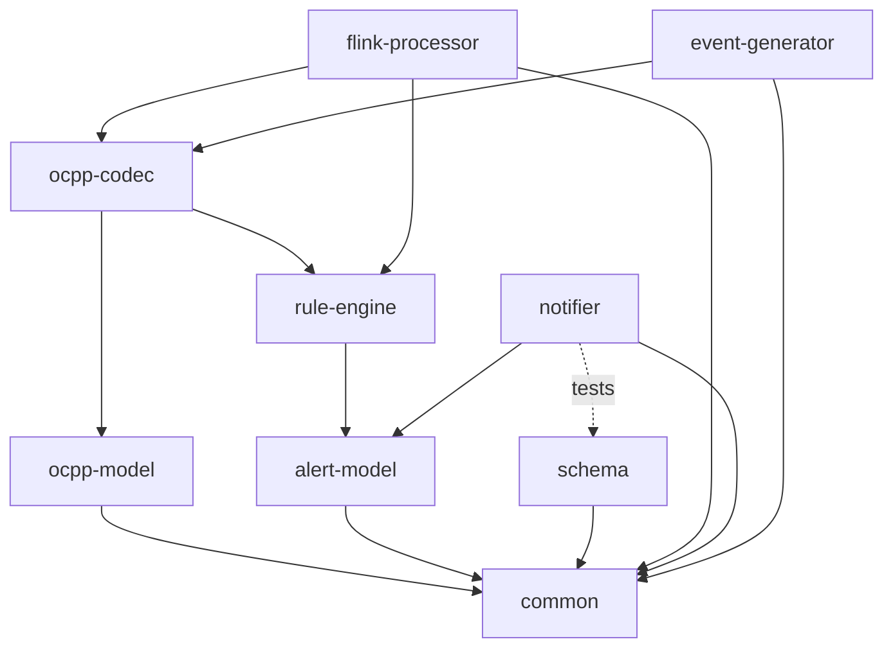
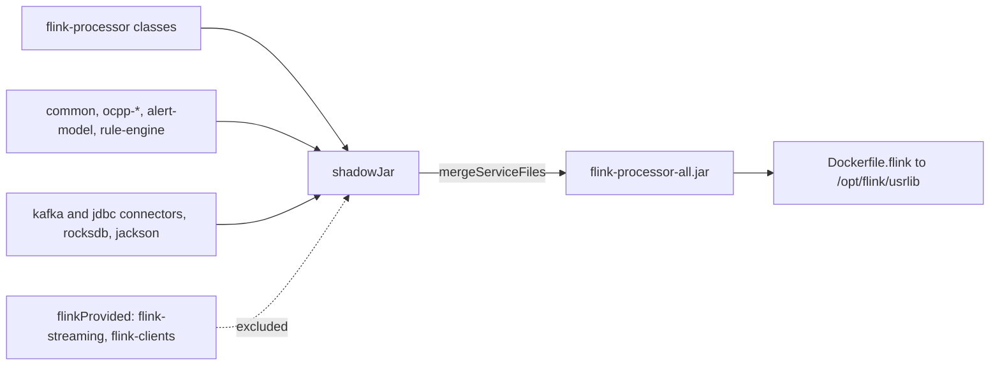

# 03. Gradle multi-module build

**Goal.** Be able to build any module, run only the tests you care about, find the jar or test
report a task produced, and understand why the build is organised the way it is: nine modules, three
convention plugins in `buildSrc`, one version catalog, fat "shadow" jars for the runnable modules,
and a Flyway module that owns the database schema.

**Prerequisites.** [Chapter 01](01-getting-started.md) (you have run `./gradlew build` once) and
[chapter 02](02-java-21-for-this-repo.md) (you know what `ServiceLoader` and `META-INF/services`
are, because the fat-jar section depends on it).

## Concepts (from scratch)

### What Gradle is

**Gradle** is a build tool: it compiles source code, runs tests, packages jars and downloads the
libraries (**dependencies**) your code needs. A build is described in scripts written in Kotlin
(`*.gradle.kts`). Gradle reads them, builds a graph of **tasks** (`compileJava`, `test`, `jar`, ...),
works out which tasks are out of date, and runs only those. Gradle is invoked as `./gradlew <task>`.

### The wrapper and the JDK

`./gradlew` is the **Gradle wrapper**, a small script checked into the repo together with
`gradle/wrapper/`. It downloads the exact Gradle version the project wants, so nobody installs
Gradle by hand. Gradle itself needs a Java runtime to start, which it finds via `JAVA_HOME` (the
root README shows `export JAVA_HOME=~/.jdks/jdk-21.0.12.1+1`). Separately, the *code* is compiled
with a **toolchain**: the build declares "Java 21" and Gradle locates a JDK 21 on the machine, or
fails with a clear message. In practice, pointing `JAVA_HOME` at a JDK 21 satisfies both.

### Multi-module builds

One repository can contain many **modules** (Gradle calls them subprojects). Each has its own
folder, its own `build.gradle.kts`, its own `src/main/java` and `src/test/java`. The root file
`settings.gradle.kts` lists them with `include(...)`. Modules depend on each other with
`project(":name")`. Task names are prefixed with the module path: `:rule-engine:test`.

### `api` versus `implementation`

When module A declares a dependency, it picks a **configuration**:

- `implementation(x)`: A uses `x` internally. Modules that depend on A do not see `x` at compile
  time. This keeps compile classpaths small and rebuilds fast.
- `api(x)`: `x` appears in A's public signatures (return types, parameters), so anyone compiling
  against A also needs `x`. Gradle passes it on.
- `compileOnly(x)`: needed to compile, but not packaged; somebody else provides it at run time.
- `testImplementation(x)`, `testRuntimeOnly(x)`: the same, for the test source set.

Rule of thumb in this repo: a module says `api(project(":common"))` when its records expose types
from `common`; an application module says `implementation(...)` for everything.

### Convention plugins and `buildSrc`

Nine modules would repeat the same twenty lines (toolchain, JUnit, compiler flags). Gradle's answer
is a **convention plugin**: a script in the special `buildSrc` folder that any module can apply with
`id("chargemon.java-library")`. Gradle compiles `buildSrc` before the rest of the build, so the
plugins are just code you can read.

### Version catalog

`gradle/libs.versions.toml` is the **version catalog**: one file listing every library and its
version. Build scripts refer to entries as `libs.flink.streaming`, and bumping a version is a
one-line edit. A `[versions]` table holds numbers, `[libraries]` maps names to coordinates, and
`[plugins]` lists Gradle plugins.

### Source sets and `testFixtures`

A **source set** is a folder of sources compiled together: `main`, `test`, and optionally
`testFixtures`. The `java-test-fixtures` plugin adds the third one for helper classes (builders,
canned data) that *other modules'* tests want to reuse. A consumer writes
`testImplementation(testFixtures(project(":ocpp-codec")))`.

### Shadow (fat) jars

A normal jar contains only your classes. To run a program you also need every dependency on the
classpath. A **shadow jar** (also called a fat or uber jar) copies all dependency classes into one
jar, named `<module>-all.jar` here. Two things can go wrong when merging jars: two jars carry a
file with the same path, and libraries that are already present on the target (Flink's own runtime)
get bundled a second time. The `flink-app` plugin handles both.

### Flyway

**Flyway** is a database migration tool. Migrations are SQL files named `V<number>__<name>.sql`;
Flyway runs each one exactly once, in order, and records what it ran in a history table
(`flyway_schema_history`). Running it twice is safe: the second run applies nothing.

## In this repo

### The module list

[settings.gradle.kts](../settings.gradle.kts) declares the root project and nine modules:

```kotlin
rootProject.name = "chargemon"

include(
    "common",
    "ocpp-model",
    "ocpp-codec",
    "alert-model",
    "rule-engine",
    "schema",
    "flink-processor",
    "notifier",
    "event-generator",
)
```
(settings.gradle.kts:14)

The root [build.gradle.kts](../build.gradle.kts) only sets `group = "com.chargemon"` and
`version = "0.1.0-SNAPSHOT"` for all projects. [gradle.properties](../gradle.properties) turns on
parallel execution and the build cache.

### The three convention plugins

All three live in [buildSrc/src/main/kotlin](../buildSrc/src/main/kotlin).

**`chargemon.java-library`** ([source](../buildSrc/src/main/kotlin/chargemon.java-library.gradle.kts))
is applied by every module, directly or through the other two. It sets the toolchain, shares the
Jackson BOM (a *bill of materials* that pins every Jackson artifact to one version) via `api`, adds
JUnit 5 and AssertJ to tests, and turns on all compiler warnings plus `-parameters`:

```kotlin
java {
    toolchain {
        languageVersion.set(JavaLanguageVersion.of(libs.versions.java.get()))
    }
    withSourcesJar()
}

dependencies {
    api(platform(libs.jackson.bom))
    implementation(libs.slf4j.api)

    testImplementation(platform(libs.junit.bom))
    testImplementation(libs.junit.jupiter)
    testImplementation(libs.assertj)
```
(buildSrc/src/main/kotlin/chargemon.java-library.gradle.kts:9)

```kotlin
tasks.withType<JavaCompile>().configureEach {
    options.encoding = "UTF-8"
    options.compilerArgs.addAll(listOf("-Xlint:all", "-Xlint:-serial", "-Xlint:-processing", "-parameters"))
}
```
(buildSrc/src/main/kotlin/chargemon.java-library.gradle.kts:27)

`-parameters` keeps constructor parameter names in the class files. Jackson reads them to map JSON
fields onto record components, which is why no record in the repo needs `@JsonProperty`.

**`chargemon.flink-app`** ([source](../buildSrc/src/main/kotlin/chargemon.flink-app.gradle.kts))
extends `java-library` with the Shadow plugin and the `application` plugin, and adds a custom
configuration for jars the cluster already has:

```kotlin
// Flink runtime jars are provided by the cluster; keep them off the fat jar.
val flinkProvided: Configuration by configurations.creating
configurations.compileOnly.get().extendsFrom(flinkProvided)
configurations.testImplementation.get().extendsFrom(flinkProvided)
```
(buildSrc/src/main/kotlin/chargemon.flink-app.gradle.kts:11)

Anything declared as `"flinkProvided"(...)` is visible when compiling and testing but is left out
of the fat jar, because the Flink Docker image ships `flink-streaming-java`, `flink-clients` and the
web UI itself. Bundling them would double the jar size and risk class conflicts. Next, a conflict
between two libraries that both claim to be the LZ4 compression library:

```kotlin
configurations.all {
    resolutionStrategy.capabilitiesResolution.withCapability("org.lz4:lz4-java") {
        selectHighestVersion()
    }
}
```
(buildSrc/src/main/kotlin/chargemon.flink-app.gradle.kts:18)

Flink 1.20.5 depends on a fork of lz4 and `kafka-clients` on the original; Gradle refuses to guess,
so the plugin says "take the newer one". Finally the shadow task itself:

```kotlin
tasks.shadowJar {
    archiveClassifier.set("all")
    archiveVersion.set("")
    mergeServiceFiles()
    isZip64 = true
    manifest {
        attributes["Main-Class"] = application.mainClass.get()
    }
```
(buildSrc/src/main/kotlin/chargemon.flink-app.gradle.kts:24)

`archiveClassifier("all")` plus an empty version gives the stable name `flink-processor-all.jar`.
`mergeServiceFiles()` is the important one: `ocpp-codec` ships
`META-INF/services/com.chargemon.ocpp.codec.mapper.OcppActionMapper`, `rule-engine` ships two
service files of its own, and Flink's connectors ship theirs. Without merging, the last jar copied
would silently overwrite the others and `ServiceLoader` would find no mappers at run time.

**`chargemon.spring-app`** ([source](../buildSrc/src/main/kotlin/chargemon.spring-app.gradle.kts))
applies the Spring Boot and dependency-management plugins on top of `java-library` and adds the
starter and starter-test. The Boot plugin's `bootJar` task produces its own executable jar; the
notifier renames it to `notifier.jar`.

### The `buildSrc/build.gradle.kts` trick

Convention plugins are compiled before the version catalog accessors exist, so they cannot write
`libs.flink.streaming` out of the box. [buildSrc/build.gradle.kts](../buildSrc/build.gradle.kts)
works around that:

```kotlin
dependencies {
    // Expose the generated version-catalog accessors (LibrariesForLibs) to precompiled script plugins.
    implementation(files(libs.javaClass.superclass.protectionDomain.codeSource.location))
    implementation("org.springframework.boot:org.springframework.boot.gradle.plugin:${libs.versions.springBoot.get()}")
```
(buildSrc/build.gradle.kts:10)

The first line puts the generated `LibrariesForLibs` class on the plugins' classpath; each plugin
then obtains it with `val libs = the<LibrariesForLibs>()`. The other lines pull the Spring Boot and
Shadow plugins in as ordinary libraries so the scripts can apply them by id.

### The version catalog

[gradle/libs.versions.toml](../gradle/libs.versions.toml) starts with the numbers:

```toml
[versions]
java = "21"
flink = "1.20.5"
flinkKafka = "3.4.0-1.20"
flinkJdbc = "3.4.0-1.20"
springBoot = "3.5.16"
springDependencyManagement = "1.1.7"
jackson = "2.21.4"
flyway = "11.20.3"
```
(gradle/libs.versions.toml:1)

Further down: `junit = "5.14.4"`, `assertj = "3.27.7"`, `jqwik = "1.10.1"`,
`testcontainers = "1.21.4"`, `shadow = "8.3.11"`, `kafkaClients = "3.9.2"`. Flink connectors are
versioned separately from Flink itself; `3.4.0-1.20` means "connector 3.4.0 built for Flink 1.20".
Library entries reference a version by name, e.g.
`flink-streaming = { module = "org.apache.flink:flink-streaming-java", version.ref = "flink" }`,
and become `libs.flink.streaming` in scripts (dashes turn into dots).

### Module dependencies, read from each `build.gradle.kts`

| Module | Plugin | Depends on |
|---|---|---|
| `common` | java-library | Jackson (`api`) |
| `ocpp-model` | java-library | `api(":common")` |
| `alert-model` | java-library | `api(":common")` |
| `rule-engine` | java-library + test fixtures | `api(":alert-model")`, jqwik for tests |
| `ocpp-codec` | java-library + test fixtures | `api(":ocpp-model")`, `api(":rule-engine")` |
| `schema` | java-library + shadow + application | `:common`, Flyway, Postgres driver; Testcontainers for tests |
| `flink-processor` | flink-app | all five libraries, Flink connectors, RocksDB, test fixtures of codec and rule-engine |
| `notifier` | spring-app | `:common`, `:alert-model`, Spring starters, `:schema` for tests |
| `event-generator` | java-library + shadow + application | `:common`, `:ocpp-model`, `:ocpp-codec`, its test fixtures, `kafka-clients`, picocli |

The README's summary "`common ← ocpp-model ← ocpp-codec`, `common ← alert-model ← rule-engine ←
ocpp-codec`" matches: `ocpp-codec` is the only library that sees both the OCPP world and the rule
engine, because it hosts the `Fact` bridge between them. `rule-engine` itself never imports an
OCPP type.

Two modules publish test fixtures. [ocpp-codec/build.gradle.kts](../ocpp-codec/build.gradle.kts):

```kotlin
plugins {
    id("chargemon.java-library")
    `java-test-fixtures`
}

dependencies {
    api(project(":ocpp-model"))
    api(project(":rule-engine"))
    testFixturesApi(project(":ocpp-model"))
    testFixturesImplementation(libs.jackson.databind)
}
```
(ocpp-codec/build.gradle.kts:1)

Its fixtures are
[Frames.java](../ocpp-codec/src/testFixtures/java/com/chargemon/ocpp/codec/fixtures/Frames.java)
(canned OCPP frames and the `envelopeJson` helper; the event generator uses it in production code)
and `InMemoryPendingCallStore.java`. `rule-engine` provides `RuleFixtures.java`, `MapFact.java`
and `FakeRuleContext.java` under
[rule-engine/src/testFixtures](../rule-engine/src/testFixtures/java/com/chargemon/rules/fixtures).

### Where outputs land

| Output | Path |
|---|---|
| compiled classes | `<module>/build/classes/java/main` |
| plain jar | `<module>/build/libs/<module>-0.1.0-SNAPSHOT.jar` |
| shadow jar | `<module>/build/libs/<module>-all.jar` (flink-processor, schema, event-generator) |
| Spring Boot jar | `notifier/build/libs/notifier.jar` |
| test report | `<module>/build/reports/tests/test/index.html` |
| test XML (for CI) | `<module>/build/test-results/test/` |

The Dockerfiles consume the jars directly.
[deploy/docker/Dockerfile.flink](../deploy/docker/Dockerfile.flink):

```dockerfile
# Flink 1.20 has no official Java 21 image; overlay a Temurin 21 JRE on the java17 image.
FROM eclipse-temurin:21-jre-jammy AS jre
FROM flink:1.20.5-scala_2.12-java17
COPY --from=jre /opt/java/openjdk /opt/java/openjdk21
ENV JAVA_HOME=/opt/java/openjdk21
ENV PATH=/opt/java/openjdk21/bin:$PATH
COPY flink-processor/build/libs/flink-processor-all.jar /opt/flink/usrlib/flink-processor.jar
```
(deploy/docker/Dockerfile.flink:1)

The job is compiled for Java 21 (records, sealed types), but the official Flink image only offers
Java 17, so the Dockerfile copies a Temurin 21 runtime into it and switches `JAVA_HOME`. Jars in
`/opt/flink/usrlib` are put on the job classpath automatically.
[Dockerfile.java-app](../deploy/docker/Dockerfile.java-app) is generic: a `JAR` build argument
names which jar to copy to `/app/app.jar`, and the compose file passes
`schema/build/libs/schema-all.jar` or `notifier/build/libs/notifier.jar`.

### Common commands

| Command | Effect |
|---|---|
| `./gradlew build` | compile, test and package every module |
| `./gradlew build -x test` | the same, skipping tests (`-x` excludes a task) |
| `./gradlew :rule-engine:test` | tests of one module only |
| `./gradlew :rule-engine:test --tests 'AlertLifecycle*'` | test classes matching a pattern |
| `./gradlew :flink-processor:shadowJar` | rebuild only the fat jar |
| `./gradlew :rule-engine:dependencies --configuration compileClasspath` | print the resolved dependency tree |
| `./gradlew tasks --all` | list every task |
| `./gradlew clean` | delete all `build/` folders |

Gradle prints `UP-TO-DATE` for tasks whose inputs have not changed and `FROM-CACHE` for outputs it
restored from the build cache; both are normal.

### The `schema` module and Flyway

[schema/build.gradle.kts](../schema/build.gradle.kts) makes the module runnable with the main class
`com.chargemon.schema.SchemaMigrator`. The class is short:

```java
public static MigrateResult migrate(DataSource dataSource) {
    Flyway flyway = Flyway.configure()
            .dataSource(dataSource)
            .locations("classpath:db/migration")
            .baselineOnMigrate(true)
            .validateMigrationNaming(true)
            .load();
    return flyway.migrate();
}
```
(schema/src/main/java/com/chargemon/schema/SchemaMigrator.java:32)

`main` reads `DB_URL`, `DB_USER`, `DB_PASSWORD` from the environment, builds a Postgres data
source and calls `migrate`. The compose `schema` service runs it once and exits. The migrations under
[schema/src/main/resources/db/migration](../schema/src/main/resources/db/migration):

| File | Creates |
|---|---|
| `V001__stations.sql` | `stations` (mirror of the compacted topic) |
| `V002__station_groups.sql` | `station_groups` hierarchy |
| `V003__rules.sql` | `rules`, the version-bump trigger, `REPLICA IDENTITY FULL` |
| `V004__alerts.sql` | `alerts` with `last_seq` guard and indexes |
| `V005__zero_energy.sql` | zero-energy aggregate tables |
| `V006__notification_deliveries.sql` | the notifier's idempotency ledger |
| `V007__group_parent_no_fk.sql` | drops a foreign key so groups may arrive in any order |

To add a table you add `V008__something.sql`; Flyway's `validateMigrationNaming(true)` rejects
files that do not follow the pattern. The notifier's tests depend on `:schema` so they can migrate a
Testcontainers Postgres before running.

## Diagrams

Module dependency graph (arrows point from a module to what it depends on):



How a fat jar is assembled by the `flink-app` plugin:



## Hands-on exercises

### Exercise 1: run one module's tests and open the report

**What to do.** Run `./gradlew :rule-engine:test`, then open
`rule-engine/build/reports/tests/test/index.html` in a browser. Then run
`./gradlew :rule-engine:test --tests 'AlertLifecycle*'` and look at the report again.

**What you should observe.** The first report lists every test class in the module (condition
parser, definition parser, evaluators, lifecycle, hourly buckets) with durations. The second run
re-executes only the two `AlertLifecycle*` classes; the report is regenerated for that subset. A
second identical run prints `UP-TO-DATE` and runs nothing.

**Hint.** If a test fails, the console shows the full stack trace because the convention plugin
sets `exceptionFormat = FULL`; the HTML report has the same text under the failed test.

### Exercise 2: bump a catalog version and watch what recompiles

**What to do.** In `gradle/libs.versions.toml` change `assertj = "3.27.7"` to another published
version (for example the previous minor). Run `./gradlew build -x test` and note which modules
report `compileJava UP-TO-DATE`. Then run `./gradlew :rule-engine:compileTestJava` and watch.
Revert the change afterwards.

**What you should observe.** Main compilation stays up to date everywhere: AssertJ is only a
`testImplementation` dependency of the convention plugin. Test compilation reruns in every module,
because the plugin puts AssertJ on every test classpath. This is the `api` versus `implementation`
lesson in action: a change on a configuration only invalidates the tasks that consume it.

**Hint.** `./gradlew :rule-engine:dependencies --configuration testCompileClasspath` shows the new
version resolved; the same command with `compileClasspath` shows AssertJ absent.

### Exercise 3: add a throw-away module

**What to do.** Create `scratch/build.gradle.kts` containing only
`plugins { id("chargemon.java-library") }`, add `"scratch",` to the `include(...)` list in
`settings.gradle.kts`, and create `scratch/src/main/java/scratch/Hello.java` with a record
`Hello(String name)`. Run `./gradlew :scratch:build`. Then delete the folder and the include line.

**What you should observe.** The module compiles with Java 21 and produces
`scratch/build/libs/scratch-0.1.0-SNAPSHOT.jar` and a sources jar, without you writing a single
line of toolchain or dependency configuration; the convention plugin supplied it all. Using a
`sealed` interface in `Hello.java` proves the toolchain is 21, not the JDK Gradle happened to start
with.

**Hint.** Do not commit the scratch module. If Gradle complains that the plugin id is unknown, the
`include` line is missing or `buildSrc` did not compile.

## Self-check

1. Why does `ocpp-codec` declare `rule-engine` with `api` rather than `implementation`?
2. What would break at run time if `mergeServiceFiles()` were removed from the `flink-app` plugin?
3. Why are `flink-streaming` and `flink-clients` in the `flinkProvided` configuration instead of `implementation`?
4. Where is the fat jar of the Flink job, and where does the Dockerfile put it inside the image?
5. What does Flyway do if you run `SchemaMigrator` a second time against the same database?

<details><summary>Answers</summary>

1. Its public types mention rule-engine types (`OcppEventFact implements Fact`), so any module
   compiling against `ocpp-codec` also needs `rule-engine` on its compile classpath.
2. Several jars carry `META-INF/services` files with the same path; only one copy would survive
   and `ServiceLoader` would miss the OCPP mappers, condition operators or evaluators registered in
   the others.
3. The Flink Docker image already contains them. `flinkProvided` feeds `compileOnly` and
   `testImplementation`, so they are available for compiling and testing but excluded from the
   fat jar.
4. `flink-processor/build/libs/flink-processor-all.jar`, copied to
   `/opt/flink/usrlib/flink-processor.jar`.
5. Nothing: it compares `flyway_schema_history` with the files in `db/migration`, finds all seven
   applied, and exits without changes.

</details>

## Glossary terms

- [convention plugin](glossary.md#convention-plugin)
- [version catalog](glossary.md#version-catalog)
- [shadow jar](glossary.md#shadow-jar)
- [testFixtures](glossary.md#testfixtures)
- [Flyway](glossary.md#flyway)
- [ServiceLoader](glossary.md#serviceloader)
- [MiniCluster](glossary.md#minicluster)

## Further reading

- Gradle user guide, multi-project builds: <https://docs.gradle.org/current/userguide/multi_project_builds.html>
- Gradle user guide, sharing build logic with convention plugins: <https://docs.gradle.org/current/userguide/sharing_build_logic_between_subprojects.html>
- Gradle user guide, version catalogs: <https://docs.gradle.org/current/userguide/version_catalogs.html>
- Gradle user guide, `api` vs `implementation` (Java Library plugin): <https://docs.gradle.org/current/userguide/java_library_plugin.html>
- Gradle user guide, test fixtures: <https://docs.gradle.org/current/userguide/java_testing.html#sec:java_test_fixtures>
- Gradle user guide, toolchains: <https://docs.gradle.org/current/userguide/toolchains.html>
- Gradle user guide, capability conflict resolution: <https://docs.gradle.org/current/userguide/dependency_capability_conflict.html>
- Shadow plugin: <https://gradleup.com/shadow/>
- Flyway documentation: <https://documentation.red-gate.com/flyway>
- Flink 1.20, project configuration and dependencies: <https://nightlies.apache.org/flink/flink-docs-release-1.20/docs/dev/configuration/overview/>
