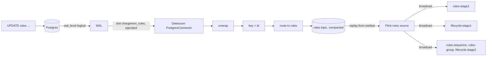
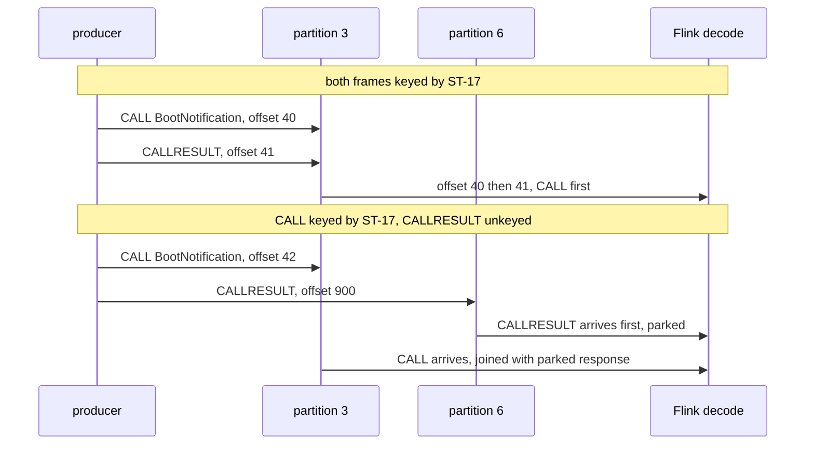

# 04. Kafka and CDC basics

**Goal.** Understand topics, keys, partitions, offsets, consumer groups, compaction and delivery
guarantees well enough to explain two design choices in chargemon: why the Flink job keys every
stream by station id, and why rule rows reach the job through Debezium and a compacted Kafka topic
rather than through a database query. You will also learn to inspect topics with Kafka UI and the
Kafka command-line tools, and to check the Debezium connector.

**Prerequisites.** [Chapter 01](01-getting-started.md) with the stack running. No prior Kafka
knowledge. [Chapter 05](05-stream-processing-concepts.md) builds on this chapter.

## Concepts (from scratch)

### Broker, topic, partition, offset

A **Kafka broker** is a server that stores streams of records on disk. A **record** is a small
unit of data with an optional **key**, a **value** (both just bytes), a timestamp and headers.
Records are grouped into named **topics**. Each topic is split into one or more **partitions**; a
partition is an append-only log, a file that only ever grows at the end. Every record in a partition
gets a sequential number, its **offset**. Kafka keeps records for a configured retention time
regardless of whether anyone has read them; reading does not delete.

### Producers and keys

A **producer** appends records to a topic. If the record has no key, the producer spreads records
across partitions round-robin. If it has a key, the producer hashes the key and always picks the
same partition for the same key. Because a partition is a strict sequence, this gives you one
crucial guarantee: **records with the same key are read in the order they were written**. Records
with different keys have no ordering relationship at all, even if one was written a millisecond
after the other, because they may sit in different partitions and be read by different consumers at
different speeds.

### Consumers, consumer groups, rebalance

A **consumer** reads records from partitions, starting at some offset and moving forward. It
periodically **commits** its position so that after a restart it can continue. A **consumer
group** is a set of consumers with the same `group.id`; Kafka divides the topic's partitions among
them so that each partition is read by exactly one member. Add a member and Kafka **rebalances**,
moving partitions around. This is how reading scales: a topic with 8 partitions can be read by up
to 8 consumers in parallel. Two different groups reading the same topic do not affect each other;
each keeps its own offsets.

### Compacted topics, changelogs, tombstones

By default Kafka deletes old records by age. A **compacted topic** instead keeps the *latest
record for each key* forever and eventually removes older records with the same key. Read from the
beginning, a compacted topic gives you the current state of every key: it behaves like a table
serialized as a stream, or a **changelog**. To delete a key you write a **tombstone**, a record
with that key and a `null` value; compaction later removes the key entirely. A new consumer that
replays a compacted topic from offset zero rebuilds the whole table in memory. That is exactly how
chargemon loads its rules, stations and groups.

### Delivery semantics

What happens when something crashes mid-way decides how many times a record is processed:

- **At-most-once**: commit the offset first, then process. A crash in between loses the record.
- **At-least-once**: process first, then commit. A crash in between means the record is processed
  again after restart. Simple and fast; the consumer must be **idempotent**, meaning that applying
  the same record twice has the same effect as once.
- **Exactly-once**: every effect happens precisely once. Kafka supports it between Kafka topics
  with transactions, but it is expensive and does not extend to email or HTTP calls.

chargemon uses exactly-once for the state *inside* Flink (checkpoints, [chapter 05](05-stream-processing-concepts.md))
and at-least-once for the `alerts` output. Duplicates are absorbed by idempotent consumers: the
Postgres upsert keeps a `last_seq` column and the notifier keeps a delivery ledger keyed by alert
event id and channel ([chapter 19](19-notifier-spring-boot.md)).

### Change Data Capture and Debezium

Postgres writes every change first to its **write-ahead log** (WAL), a sequential file used for
crash recovery and replication. With `wal_level=logical` the log carries enough detail to
reconstruct row-level changes. A client can open a **replication slot** (a named cursor into the
WAL that Postgres will not throw away until the client has read it) and subscribe to a
**publication** (a named set of tables). The **pgoutput** plugin is Postgres's built-in encoder for
that stream, so no extension needs installing.

**Debezium** is a connector for **Kafka Connect** (a framework that runs connectors as a service
with a REST API on port 8083). The Debezium Postgres connector opens a replication slot, decodes
the WAL and writes one Kafka record per row change to a topic named `<prefix>.<schema>.<table>`.
Each record is an envelope with `before`, `after` and `op` (`c` create, `u` update, `d` delete,
`r` snapshot read). **Single Message Transforms** (SMTs) are small steps configured on the connector
that reshape each record before it is written: unwrap the envelope, change the key, rename the
topic.

## In this repo

### The topics, created by `topic-init`

The `topic-init` service in [deploy/docker-compose.yml](../deploy/docker-compose.yml) runs
`kafka-topics.sh` once:

```bash
$$K --bootstrap-server $$B --create --if-not-exists --topic common-broker --partitions 8
$$K --bootstrap-server $$B --create --if-not-exists --topic alerts --partitions 4
$$K --bootstrap-server $$B --create --if-not-exists --topic alerts-dlq --partitions 1
$$K --bootstrap-server $$B --create --if-not-exists --topic dead-letter --partitions 1
$$K --bootstrap-server $$B --create --if-not-exists --topic late-events --partitions 1
for t in stations groups rules; do
  $$K --bootstrap-server $$B --create --if-not-exists --topic $$t --partitions 4 --config cleanup.policy=compact --config min.compaction.lag.ms=600000
done
```
(deploy/docker-compose.yml:42)

(The doubled `$$` is compose escaping for a literal `$`.) The purpose of each topic:

| Topic | Partitions | Policy | Producer | Consumer |
|---|---|---|---|---|
| `common-broker` | 8 | delete | event generator (or the real CSMS gateway) | Flink `decode` |
| `alerts` | 4 | delete | Flink alert sink | notifier |
| `alerts-dlq` | 1 | delete | notifier, after retries are exhausted | humans |
| `dead-letter` | 1 | delete | Flink `decode`, for undecodable envelopes | humans |
| `late-events` | 1 | delete | Flink zero-energy aggregator, for sessions too old to count | humans |
| `stations` | 4 | compact | generator `--seed-master` or master-data system | Flink `enrich`, Postgres mirror |
| `groups` | 4 | compact | same | Flink `enrich` (broadcast), Postgres mirror |
| `rules` | 4 | compact | Debezium | Flink rule and lifecycle operators (broadcast) |

The job reads the names from environment variables with these defaults in
[JobConfig.java](../flink-processor/src/main/java/com/chargemon/flink/config/JobConfig.java):

```java
env.get("KAFKA_BOOTSTRAP", "localhost:9092"),
env.get("KAFKA_GROUP", "chargemon-processor"),
env.get("TOPIC_EVENTS", "common-broker"),
env.get("TOPIC_STATIONS", "stations"),
env.get("TOPIC_GROUPS", "groups"),
env.get("TOPIC_RULES", "rules"),
env.get("TOPIC_ALERTS", "alerts"),
env.get("TOPIC_DEAD_LETTER", "dead-letter"),
env.get("TOPIC_LATE_EVENTS", "late-events"),
```
(flink-processor/src/main/java/com/chargemon/flink/config/JobConfig.java:33)

`KAFKA_GROUP` is the consumer group for `common-broker`. The compacted topics are read with
`OffsetsInitializer.earliest()` in
[KafkaSources.java](../flink-processor/src/main/java/com/chargemon/flink/source/KafkaSources.java)
(line 71): always replay from the beginning, because a compacted topic *is* the table.

### Why everything is keyed by station id

The generator's producer sets the station id as the record key:

```java
/** Thin Kafka producer wrapper; keys by station so per-station order is preserved. */
```
(event-generator/src/main/java/com/chargemon/generator/Publisher.java:12)

```java
producer.send(new ProducerRecord<>(topic, e.stationId(), Frames.envelopeJson(e)));
```
(event-generator/src/main/java/com/chargemon/generator/Publisher.java:31)

The key is also the *only* place the station id lives: the JSON body has no `stationId` field, and
the `decode` operator (chapter 17) reads it from `KafkaRecord.key`. A record with no key cannot be
attributed to a station and goes to `dead-letter`.

So every message of station `ST-17` lands on the same one of the 8 partitions, in send order. The
Flink job continues that discipline: after `decode`, the stream is re-partitioned with
`.keyBy(f -> f.envelope().stationId())` before `correlate`, and again by station before `enrich`,
`sessions` and `rules-stage1` (see
[TopologyBuilder.java](../flink-processor/src/main/java/com/chargemon/flink/topology/TopologyBuilder.java)
line 81 onward). Keying by station means all state about one station (pending CALLs, connector
status, absence timers) lives in one place and is updated in order.

Now the subtle case. A station sends a `BootNotification` CALL and the backend answers with a
CALLRESULT. If the upstream gateway publishes the two *directions* with different keys, or without
keys, the response can sit on a different partition and be read by Flink before the request. The
topology comment says why the decode operator is chained to the source:

```java
// Decode inherits the source parallelism so it chains (forward partitioning): per-partition order
// survives until the keyBy, which is what keeps CALL before CALLRESULT for a station.
```
(flink-processor/src/main/java/com/chargemon/flink/topology/TopologyBuilder.java:71)

When the order still breaks, the correlator does not drop the response; it **parks** it for
`CORRELATION_TIMEOUT` (default 60 s) and joins when the CALL arrives. The full mechanism is in
[chapter 12](12-ocpp-codec-parsing-mapping-correlation.md).

### The envelope on `common-broker`

Each record is a string key (the station id) plus a JSON object value; the parser in
[EnvelopeParser.java](../ocpp-codec/src/main/java/com/chargemon/ocpp/codec/envelope/EnvelopeParser.java)
documents the canonical shape and accepts a few field-name variants in the body:

```java
 * <pre>key:   ST-1
 * value: {"ocppVersion":"2.0.1","direction":"STATION_TO_CSMS",
 *         "receivedAt":"2026-01-01T00:00:00Z","message":[2,"42","Heartbeat",{}]}</pre>
```
(ocpp-codec/src/main/java/com/chargemon/ocpp/codec/envelope/EnvelopeParser.java:18)

The station id is never in the body; the parser takes it from the record key and returns an error
for a blank or missing key. `direction` may be omitted (defaults to `STATION_TO_CSMS`) and `receivedAt` may be omitted
(defaults to now). `message` is the untouched OCPP-J frame; `[2, ...]` is a CALL, `[3, ...]` a
CALLRESULT, `[4, ...]` a CALLERROR ([chapter 10](10-ocpp-protocol-primer.md)).

### Postgres prepared for logical replication

The `postgres` service starts with the flags Debezium needs:

```yaml
command: ["postgres", "-c", "wal_level=logical", "-c", "max_wal_senders=10", "-c", "max_replication_slots=10"]
```
(deploy/docker-compose.yml:56)

And the `rules` table itself, in
[V003__rules.sql](../schema/src/main/resources/db/migration/V003__rules.sql), ends with:

```sql
-- Debezium needs full row images for deletes / compaction keys.
ALTER TABLE rules REPLICA IDENTITY FULL;
```
(schema/src/main/resources/db/migration/V003__rules.sql:39)

`REPLICA IDENTITY FULL` makes Postgres write the *whole old row* to the WAL on update and delete,
so Debezium can fill `before` and, for a delete, still knows the `id` to use as the Kafka key. The
same migration installs a trigger that bumps `version` and `updated_at` on every `UPDATE`
(lines 25-37), which is how the job tells a new revision of a rule from a replayed old one.

### The connector, field by field

[deploy/debezium/rules-connector.json](../deploy/debezium/rules-connector.json) is registered by
`connector-init` with `PUT /connectors/rules-cdc/config`. Reading it top to bottom:

| Field | Value | Meaning |
|---|---|---|
| `connector.class` | `io.debezium.connector.postgresql.PostgresConnector` | which connector plugin |
| `tasks.max` | `1` | Postgres CDC is single-threaded per slot |
| `database.*` | `postgres:5432/chargemon` as `chargemon` | how to connect |
| `topic.prefix` | `cdc` | raw topics are named `cdc.<schema>.<table>` |
| `plugin.name` | `pgoutput` | the built-in logical decoding plugin |
| `slot.name` | `chargemon_rules` | the replication slot Debezium creates |
| `publication.name` | `chargemon_rules_pub` | the publication Debezium creates |
| `publication.autocreate.mode` | `filtered` | publication contains only the included tables |
| `table.include.list` | `public.rules` | only this table is captured |
| `snapshot.mode` | `initial` | on first start, read all existing rows once, then follow the WAL |
| `tombstones.on.delete` | `true` | after a delete event, also write a tombstone so compaction can drop the key |
| `key.converter` | `StringConverter` | the key is written as a plain string, not JSON |
| `value.converter` | `JsonConverter` with `schemas.enable=false` | the value is plain JSON without a schema wrapper |
| `transforms` | `unwrap,key,route` | the three SMTs, applied in this order |

The SMTs:

```json
"transforms": "unwrap,key,route",
"transforms.unwrap.type": "io.debezium.transforms.ExtractNewRecordState",
"transforms.unwrap.delete.tombstone.handling.mode": "rewrite-with-tombstone",
"transforms.key.type": "org.apache.kafka.connect.transforms.ExtractField$Key",
"transforms.key.field": "id",
"transforms.route.type": "org.apache.kafka.connect.transforms.RegexRouter",
"transforms.route.regex": "cdc\\.public\\.rules",
"transforms.route.replacement": "rules"
```
(deploy/debezium/rules-connector.json:20)

1. **`unwrap`** (`ExtractNewRecordState`) throws away the `before`/`after`/`op` envelope and keeps
   just the `after` row, so the value is simply the row as JSON with column names. The
   `rewrite-with-tombstone` mode says: for a delete, first emit the old row with an extra field
   `__deleted: "true"`, then emit the tombstone.
2. **`key`** (`ExtractField$Key`) replaces the key struct `{"id": "..."}` with the bare `id`
   string, so the topic key is the rule's UUID. Compaction and Flink both key on it.
3. **`route`** (`RegexRouter`) renames the topic from `cdc.public.rules` to `rules`, matching
   `TOPIC_RULES`.

On the Flink side,
[RuleChangeDeserializer.java](../flink-processor/src/main/java/com/chargemon/flink/control/RuleChangeDeserializer.java)
accepts all three shapes (unwrapped row, full Debezium envelope, or a plain document) and turns a
`null` value or a `__deleted` row into a `RuleChange` with `ruleJson == null`, which means "delete".
Column names are snake_case (`grace_window`); `RuleDefinitionParser.camelCaseKeys` converts them.

### Inspecting topics

**Kafka UI** at <http://localhost:8090>: *Topics* lists every topic with partition count and
cleanup policy; click a topic, then *Messages*, to read records with key, value, partition and
offset. The *Kafka Connect* tab shows the `rules-cdc` connector and its task state.

**Command line.** The `apache/kafka:3.9.1` image ships the scripts under `/opt/kafka/bin`. The
broker listens on `kafka:19092` inside the compose network:

```bash
docker compose -f deploy/docker-compose.yml exec kafka /opt/kafka/bin/kafka-console-consumer.sh \
  --bootstrap-server kafka:19092 --topic rules --from-beginning \
  --property print.key=true --property print.partition=true --property print.offset=true
```

Replace `rules` with `common-broker` or `alerts`. Add `--max-messages 5` to stop after five.
`kafka-topics.sh --describe --topic rules` prints the partitions and configs, and
`kafka-consumer-groups.sh --describe --group chargemon-processor` shows how far the Flink job has
read on each partition (the *lag* column).

**Connect REST.**

```bash
curl -s localhost:8083/connectors/rules-cdc/status
```

A healthy answer has `"state": "RUNNING"` for the connector and for its single task. If the task
is `FAILED`, the `trace` field contains the Java exception; the usual cause is the connector
starting before the `rules` table existed, which the compose `depends_on` ordering prevents.

## Diagrams

The rule path from a SQL statement to every rule operator:



Same key keeps order; different keys do not:



## Hands-on exercises

### Exercise 1: produce one envelope by hand

**What to do.** Start a console producer that reads `key|value` lines:

```bash
docker compose -f deploy/docker-compose.yml exec -it kafka /opt/kafka/bin/kafka-console-producer.sh \
  --bootstrap-server kafka:19092 --topic common-broker \
  --property parse.key=true --property key.separator='|'
```

Paste one line (use a `receivedAt` close to the current time so the event is not treated as old;
the example from the parser's javadoc uses `2026-01-01T00:00:00Z` and works too):

```
ST-1|{"ocppVersion":"1.6","direction":"STATION_TO_CSMS","receivedAt":"2026-01-01T00:00:00Z","message":[2,"42","Heartbeat",{}]}
```

Then press `Ctrl-D`. Open the Flink UI, click the job, select the `decode` box and open *Metrics*.

**What you should observe.** The `framesDecoded` counter increased by one and `framesRejected` did
not. The `dead-letter` topic (Kafka UI) stays empty. Now send the same line with `"message":"oops"`
instead of the array: `framesRejected` increases and a record appears on `dead-letter` with the
parser's error text "frame is not a JSON array".

**Hint.** The separator must not appear inside the JSON, which is why `|` is used rather than the
default tab or a colon. If the producer prints a `LEADER_NOT_AVAILABLE` warning once, it is only
fetching metadata; the record still goes through.

### Exercise 2: update a rule and read the CDC record

**What to do.** Start the console consumer on `rules` (command above, keep it running in one
terminal). In another terminal:

```bash
docker compose -f deploy/docker-compose.yml exec postgres psql -U chargemon -d chargemon \
  -c "UPDATE rules SET name = 'No heartbeat 2 min (edited)' WHERE id = '22222222-2222-2222-2222-222222222222'"
```

**What you should observe.** The consumer prints one new line: partition and offset, then the key
`22222222-2222-2222-2222-222222222222` (a bare string, thanks to the `key` SMT), then the value: a
flat JSON object with snake_case columns (`"grace_window":"PT30S"`, `"spec":"{...}"` as a JSON
string, `"version":2`). There is no `before`/`after`/`op` wrapper because `unwrap` removed it.

**Hint.** With `--from-beginning` you also see the six snapshot records written when the connector
first started (`snapshot.mode=initial`); the update is the last line. If the update appears twice
after a Connect restart, that is at-least-once delivery, and compaction plus the `version` column
make it harmless.

### Exercise 3: delete a rule and watch the tombstone resolve alerts

**What to do.** Make sure at least one "No heartbeat 2 min" alert is `OPEN`. The generator's
`normal` profile never reports a fault, so use `--profiles heartbeat-drop` and wait about three
minutes (two-minute absence window plus a 30 second grace), then check
`select rule_name, status from alerts`. Keep the `rules` consumer running. Then:

```bash
docker compose -f deploy/docker-compose.yml exec postgres psql -U chargemon -d chargemon \
  -c "DELETE FROM rules WHERE id = '22222222-2222-2222-2222-222222222222'"
```

Query the alerts a few seconds later:

```bash
docker compose -f deploy/docker-compose.yml exec postgres psql -U chargemon -d chargemon \
  -c "select subject_id, status, resolve_reason from alerts where rule_id = '22222222-2222-2222-2222-222222222222'"
```

**What you should observe.** On the `rules` topic, two records with the deleted key: first the old
row with `"__deleted":"true"` (the rewrite), then a record whose value prints as `null` (the
tombstone). In Postgres every alert of that rule is now `RESOLVED` with `resolve_reason =
RULE_REMOVED`, and the `alerts` topic carries matching `RESOLVED` events. The lifecycle operator
does this in `processBroadcastElement`: it walks all keyed state for the vanished rule id and
resolves each non-idle alert ([AlertLifecycleOperator.java](../flink-processor/src/main/java/com/chargemon/flink/lifecycle/AlertLifecycleOperator.java)
line 71 onward). Disabling a rule (`UPDATE rules SET enabled = false`) does the same with reason
`RULE_DISABLED`.

**Hint.** Reload the sample rules afterwards with the `psql < deploy/local/sample-rules.sql`
command from chapter 01; `ON CONFLICT (id) DO NOTHING` means the other five rows are untouched.

## Self-check

1. Two records are written to `common-broker` one after the other with keys `ST-1` and `ST-2`. Is the Flink job guaranteed to see them in that order? Why or why not?
2. What does a consumer that starts at offset zero of the `rules` topic obtain, and why is that enough to run rules without a database connection?
3. What is a tombstone, which connector setting makes Debezium emit one, and what does the job do with it?
4. Why does the `rules` table need `REPLICA IDENTITY FULL`?
5. The `alerts` topic is at-least-once. Name the two mechanisms that make duplicate alert events harmless.

<details><summary>Answers</summary>

1. No. Different keys usually hash to different partitions, and Kafka orders records only within a
   partition. Only records with the same key are ordered relative to each other.
2. The latest version of every rule row (compaction keeps the last record per key, and deletes have
   been tombstoned away). Replaying it rebuilds the full rule table in broadcast state.
3. A record with a key and a `null` value. `tombstones.on.delete=true` (together with the
   `rewrite-with-tombstone` unwrap mode) emits it after a delete; `RuleChangeDeserializer` turns
   it into a `RuleChange` with null JSON, the operators drop the rule, and the lifecycle resolves
   its open alerts with `RULE_REMOVED`.
4. So that update and delete events carry the complete old row in the WAL. Debezium then always
   has the `id` for the key SMT, even for deletes, and compaction can match the tombstone to earlier
   records.
5. The Postgres upsert guards with the `last_seq` column, and the notifier's delivery ledger
   (`notification_deliveries`) records each `alertEventId` and channel before sending.

</details>

## Glossary terms

- [topic](glossary.md#topic)
- [partition](glossary.md#partition)
- [offset](glossary.md#offset)
- [message key](glossary.md#message-key)
- [consumer group](glossary.md#consumer-group)
- [compacted topic](glossary.md#compacted-topic)
- [tombstone](glossary.md#tombstone)
- [at-least-once](glossary.md#at-least-once)
- [exactly-once](glossary.md#exactly-once)
- [CDC](glossary.md#cdc)
- [Debezium](glossary.md#debezium)
- [pgoutput](glossary.md#pgoutput)
- [SMT](glossary.md#smt)
- [dead-letter topic](glossary.md#dead-letter-topic)
- [envelope](glossary.md#envelope)
- [parked response](glossary.md#parked-response)

## Further reading

- Kafka documentation, design: <https://kafka.apache.org/documentation/#design>
- Kafka documentation, log compaction: <https://kafka.apache.org/documentation/#compaction>
- Kafka documentation, message delivery semantics: <https://kafka.apache.org/documentation/#semantics>
- Kafka documentation, consumer configuration: <https://kafka.apache.org/documentation/#consumerconfigs>
- Debezium Postgres connector: <https://debezium.io/documentation/reference/stable/connectors/postgresql.html>
- Debezium transformations index: <https://debezium.io/documentation/reference/stable/transformations/index.html>
- Debezium `ExtractNewRecordState` (event flattening): <https://debezium.io/documentation/reference/stable/transformations/event-flattening.html>
- Postgres logical replication: <https://www.postgresql.org/docs/16/logical-replication.html>
- Kafka Connect REST API: <https://kafka.apache.org/documentation/#connect_rest>
- Flink 1.20 Kafka connector: <https://nightlies.apache.org/flink/flink-docs-release-1.20/docs/connectors/datastream/kafka/>
