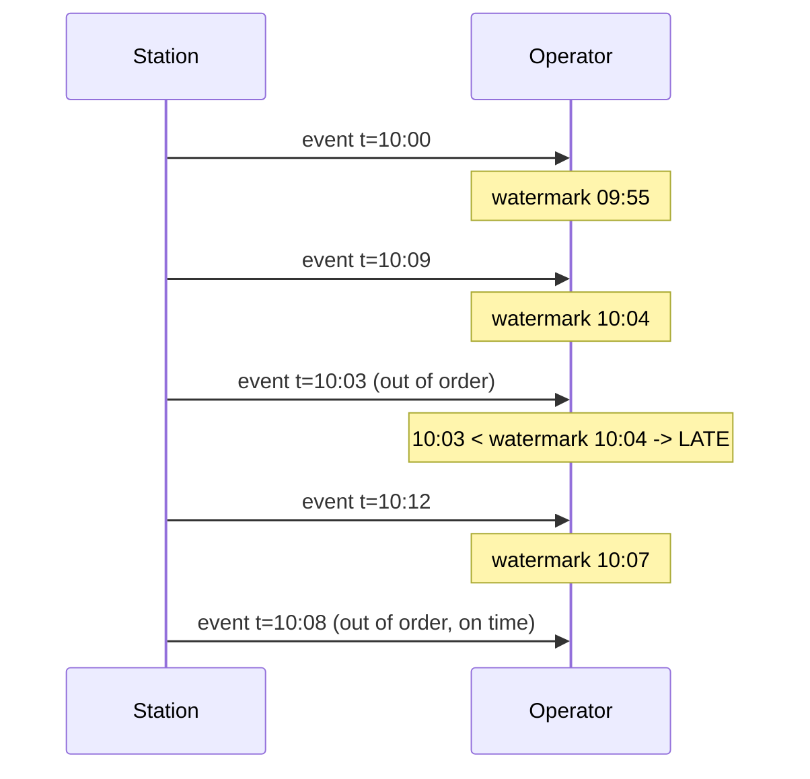
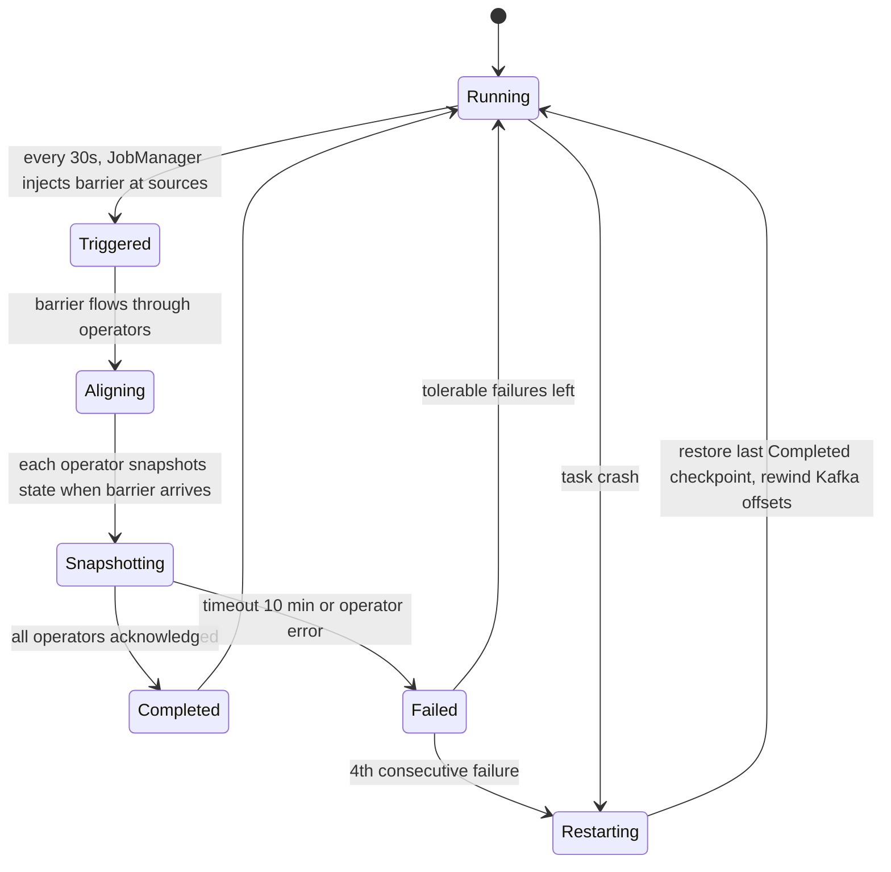
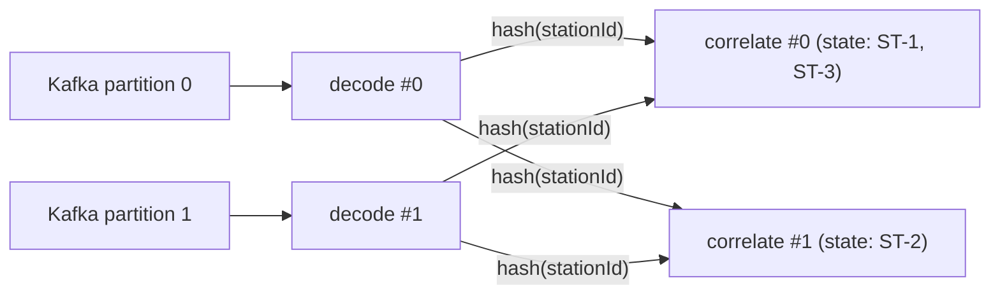

# 05. Stream processing concepts

**Goal.** After this chapter you can explain, without any Flink vocabulary, why a stream
processor needs state, keys, a notion of time, watermarks, windows and checkpoints, and you can
point at the chargemon operator that uses each of those ideas. Everything here is
language-agnostic; the Flink API arrives in [chapter 06](06-flink-programming-model.md).

**Prerequisites.** [Chapter 04](04-kafka-and-cdc-basics.md) (topics, partitions, offsets).
[Chapter 01](01-getting-started.md) helps because you will have seen an alert travel end to end.

## Concepts (from scratch)

### Batch versus stream

A **batch job** reads a finite pile of data, computes an answer, writes it, and exits. "How many
zero-energy sessions happened yesterday?" is a batch question: wait until midnight, read the day,
count.

A **stream job** never exits. Records arrive one at a time, forever, and the job must produce
answers *while* the data is still arriving. "Tell me within a minute when a station has not sent
a heartbeat for ten minutes" is a stream question: there is no moment at which all the data is in.

Everything that makes stream processing hard follows from one fact: **the job cannot see the
future and cannot re-read the past for free.** A batch job can scan the file twice. A stream job
saw record 17 a week ago; if it needs to remember anything about it, it had to write that down at
the time.

### Why state is the whole problem

Anything the job "writes down" between two records is called **state**. Examples in chargemon:

- "Station ST-1 sent a CALL with message id 42 and nobody has answered yet."
- "Station ST-1 has been in `Preparing` on connector 2 since 10:04."
- "Group `site:berlin` has 37 member stations."
- "Alert (rule `faulted`, station ST-1) is OPEN and its suppression window ends at 10:20."

If a plain program kept these in a `HashMap`, three things would go wrong:

1. **Memory.** One million stations times a few kilobytes each does not fit in one process.
2. **Crashes.** If the process dies, the map is gone, and every open alert is forgotten.
3. **Parallelism.** If you run ten copies of the program to keep up, which copy owns ST-1?

A stream processor is, at heart, a system that solves those three problems for you: it spreads
state across machines, snapshots it durably, and guarantees that every record about ST-1 lands on
the copy that holds ST-1's state. The rest is API.

### Keys and partitioned state

The trick that makes state scale is **keying**. You declare a function from record to key
("the station id"), and the processor promises:

- every record with the same key is processed by the same parallel instance, in arrival order;
- state is scoped to the key: when your code runs for ST-1, it sees only ST-1's state.

This is the same idea as a Kafka partition key (chapter 04), applied one level down. The
processor hashes the key, picks an instance, and routes the record there. Because state is
partitioned by key, it can be spread over any number of machines and snapshotted in slices.

The price is **hot keys**. If one key gets 50% of all traffic, one instance does 50% of the work
and no amount of parallelism helps. chargemon keys almost everything by station id, and one
station cannot send more than a few frames per second, so keys are naturally cool. The
group-level operators key by group id, which *can* be hot (a country group receives every alert
from every station in it), which is why those operators do very little work per record.

### Three clocks: event time, processing time, ingestion time

A record can carry up to three timestamps:

| Clock | Meaning | Who sets it |
|---|---|---|
| **Event time** | when the thing actually happened | the charge point, in the OCPP payload or the Kafka record timestamp |
| **Ingestion time** | when the record entered the pipeline | the Kafka broker or the source operator |
| **Processing time** | the wall clock of the machine running your code right now | the operator |

Processing time is cheap and always available, but it depends on *when the job happened to run*.
Replay yesterday's topic today and every "ten minutes without heartbeat" timer fires
instantly, because ten wall-clock minutes elapse in no time while the job is catching up.

Event time gives the same answer no matter when you run the job. Its cost is that records arrive
**out of order**: a station behind a flaky modem may deliver a 10:00 status at 10:07, after its
10:05 status already arrived. To reason about event time the processor needs to know *how far
the stream has progressed*. That is the job of watermarks.

### Watermarks, out-of-order arrival and lateness

A **watermark** is a special record that flows through the stream and says:
"no more records with event time earlier than *T* will follow (probably)." An operator that sees
watermark *T* may safely close every window that ends before *T* and fire every timer set for a
time before *T*.

Where does *T* come from? Typically `max event time seen so far - allowed lateness`. With an
allowed lateness of 5 minutes and the newest record stamped 10:12, the watermark is 10:07. Any
record older than the current watermark is **late**. A processor can drop late records, route
them to a **side output** (a second, named output stream) for inspection, or accept them and
correct earlier results.

Two subtleties matter in practice:

- **Watermarks are per partition, merged as a minimum.** If a source reads eight Kafka
  partitions in parallel, the operator's watermark is the *smallest* of the eight. One
  partition that receives no data at all would freeze the whole job's clock. The fix is an
  **idleness timeout**: a partition silent for N minutes is ignored when taking the minimum.
- **Watermarks only advance when data arrives.** During a quiet night the event-time clock may
  stand still. Rules that say "nothing happened for 10 minutes" therefore cannot be implemented
  with event time alone; they need processing time. chargemon uses both, deliberately.

### Windows

A **window** groups records by time so you can aggregate them. Three classic shapes:

- **Tumbling**: fixed size, no overlap. `[10:00, 11:00)`, `[11:00, 12:00)`, ...
- **Sliding**: fixed size, overlapping. Size 7 days, slide 1 hour: a new window starts every
  hour and each record belongs to 168 windows.
- **Session**: no fixed size; a window closes after a gap of inactivity.

Sliding windows are the expensive one. Naively, a record that belongs to 168 windows is stored
168 times. chargemon needs "zero-energy sessions in the last hour / today / last 7 days / last
30 days" for a million stations, so it does not use the built-in sliding window at all. Instead
it keeps **one counter per epoch hour** and sums the relevant hours on demand. The
[`HourlyBucketAggregator`](../rule-engine/src/main/java/com/chargemon/rules/window/HourlyBucketAggregator.java)
javadoc says why:

```java
/**
 * Keeps one counter per hour bucket and derives every configured window from
 * them. Avoids Flink sliding windows (which duplicate state per pane) and lets
 * rolling 7d/30d coexist with tumbling hour/day in one small map.
 *
 * <p>All times are epoch-hours. "Now" is the hour the caller considers current
 * (max of event hour and watermark hour).
 */
```
(../rule-engine/src/main/java/com/chargemon/rules/window/HourlyBucketAggregator.java:9)

At most 720 integers per subject (30 days of hours), and the same map answers all four windows.
An event older than the largest window is rejected by `accepts(eventHour, nowHour)` and treated
as late.

### Checkpoints, snapshots and replay

A **checkpoint** is a consistent snapshot of *all* state in the job plus the position (offset) in
every input, written to durable storage on a schedule (chargemon: every 30 seconds by default).
When the job crashes, the processor restores the last checkpoint and rewinds each input to the
saved offset. Records after that offset are read again, so the job ends up exactly where it would
have been had it never crashed.

The word to be careful with is **exactly-once**. A checkpointed stream processor gives
exactly-once *state*: every record affects the state exactly once, even across failures. It does
**not** automatically give exactly-once *side effects*. If the job emitted an alert to Kafka at
10:00:20 and crashed at 10:00:25 before the 10:00:30 checkpoint, the restart rewinds to 10:00:00
and emits the same alert again. End-to-end exactly-once needs either transactional sinks (the
output becomes visible only when the checkpoint completes, which adds latency) or **idempotent
consumers** that recognise the duplicate. chargemon picks the second option; [chapter 09](09-flink-event-time-connectors-and-delivery.md) works through it.

A **savepoint** is a checkpoint you trigger by hand, for upgrades: stop the job, keep the
snapshot, start the new version from it.

### Backpressure

Operators run at different speeds. If the database sink can write 1,000 rows per second and the
decoder produces 5,000, something has to give. A stream processor does not buffer without bound;
it **slows the upstream operators down** until the slow one catches up, all the way back to
reading Kafka more slowly. This is backpressure. It is a good property (no out-of-memory) but a
visible symptom: the Flink UI colours backpressured operators red, and consumer lag grows.

### Parallelism

Each operator runs as *p* parallel instances (its **parallelism**). Keyed operators split keys
between instances; non-keyed ones split records round-robin or forward them from the matching
upstream instance. Choosing *p* is a capacity decision: too low and the job cannot keep up, too
high and every instance holds a sliver of state and a share of the fixed overhead. chargemon
leaves *p* unset in tests (defaults to the number of slots), sets 2 in docker-compose and 32 in
Kubernetes.

## In this repo

The table below maps each concept to the operator that embodies it. Operator names are the
`.name()` strings you will see in the Flink UI; the deep dives are chapters 17 and 18.

| Concept | Where it lives | Chapter |
|---|---|---|
| Keyed state (station id) | `correlate`, `enrich`, `sessions`, `rules-stage1`, `rules-sequence` | [17](17-flink-job-ingest-pipeline.md), [18](18-flink-job-rules-lifecycle-sinks.md) |
| Keyed state (rule, subject) | `lifecycle-stage1`, `lifecycle-stage2` | [18](18-flink-job-rules-lifecycle-sinks.md) |
| Keyed state (group id), possibly hot | `rules-group`, `zero-energy aggregate` | [17](17-flink-job-ingest-pipeline.md), [18](18-flink-job-rules-lifecycle-sinks.md) |
| Processing-time timers | `correlate` (CALL timeout), `rules-stage1` (ABSENCE, STATE_DURATION), lifecycle (grace, suppression, auto-resolve) | [07](07-flink-state-timers-serialization.md), [18](18-flink-job-rules-lifecycle-sinks.md) |
| Event-time timers + watermark | `zero-energy aggregate` | [09](09-flink-event-time-connectors-and-delivery.md), [17](17-flink-job-ingest-pipeline.md) |
| Late data side output | `zero-energy aggregate` → `late-events` topic | [09](09-flink-event-time-connectors-and-delivery.md) |
| Hand-rolled windows | `HourlyBucketAggregator` inside `zero-energy aggregate` | [15](15-rule-engine-evaluators-and-windows.md), [17](17-flink-job-ingest-pipeline.md) |
| Broadcast (replicated) state | rules into five operators, groups into `enrich` | [08](08-flink-broadcast-state-and-connected-streams.md) |
| Checkpoints, exactly-once state | `JobMain.configure` | [06](06-flink-programming-model.md), [07](07-flink-state-timers-serialization.md) |
| At-least-once sinks + idempotent consumers | `ProductionSinks`, notifier ledger, Postgres upsert | [09](09-flink-event-time-connectors-and-delivery.md), [19](19-notifier-spring-boot.md) |
| Parallelism | `PARALLELISM` env, `decode` inherits source parallelism | [06](06-flink-programming-model.md), [20](20-deploy-generator-testing-extending.md) |

Two design decisions are worth noticing already:

**Timers are mostly processing time.** Rules such as "no heartbeat for 10 minutes" must fire
even when no data arrives, and event-time watermarks only advance with data. So
[`CallCorrelationOperator`](../flink-processor/src/main/java/com/chargemon/flink/correlate/CallCorrelationOperator.java),
[`StationRuleEvaluatorOperator`](../flink-processor/src/main/java/com/chargemon/flink/rules/StationRuleEvaluatorOperator.java)
and [`AlertLifecycleOperator`](../flink-processor/src/main/java/com/chargemon/flink/lifecycle/AlertLifecycleOperator.java)
all call `registerProcessingTimeTimer`. The one place that needs "which hour does this belong
to" semantics, the zero-energy aggregate, uses event time and the watermark:

```java
long eventHour = HourlyBucketAggregator.hourOf(s.endedAt());
long wm = ctx.timerService().currentWatermark();
long nowHour = wm == Long.MIN_VALUE ? eventHour : Math.max(eventHour, Math.floorDiv(wm, 3_600_000L));
```
(../flink-processor/src/main/java/com/chargemon/flink/aggregate/ZeroEnergyAggregator.java:65)

**Windows are not Flink windows.** The aggregator stores `MapState<Long, Integer>` (hour →
count) and asks `HourlyBucketAggregator` for every window's value. Note that
`Long.MIN_VALUE` is the "no watermark yet" sentinel; on a fresh start the event's own hour is
taken as "now".

## Diagrams

### Events versus the watermark

Allowed lateness is 5 minutes. Time flows left to right; each arrow is one record with its event
time. The watermark lags the newest event time by 5 minutes, so the 10:03 record arriving after
the 10:09 record is still on time, but the 10:01 record arriving after 10:12 is late.



Read the third arrow carefully: 10:03 is older than the watermark 10:04, so it is late even
though it is only six minutes behind the newest record. Lateness is measured against the
watermark, not against "now".

### Checkpoint lifecycle



### Keyed routing



Records for ST-1 may arrive on either partition, but after the key hash they always reach the
same `correlate` instance, which is what makes "is there a pending CALL for ST-1" answerable.

## Hands-on exercises

### 1. Paper watermark exercise

**What to do.** Take a sheet of paper. Write down these records in arrival order, each with its
event time: `A 10:00`, `B 10:06`, `C 10:02`, `D 10:11`, `E 10:05`, `F 10:07`. Assume bounded
out-of-orderness of 5 minutes. After each record write the watermark (max event time seen minus
5 minutes) and mark the record as on time or late.

**What you should observe.** The watermark after `D` is 10:06, so `E` (10:05) is late and `F`
(10:07) is on time, even though `F` is older than `D`. Then repeat with 1 minute of tolerance
and count how many records become late.

**Hint.** Late means `event time < current watermark`, evaluated *before* the record updates
the watermark. In chargemon the tolerance is `MAX_OUT_OF_ORDERNESS` (default 5 minutes, see
[`JobConfig`](../flink-processor/src/main/java/com/chargemon/flink/config/JobConfig.java)).

### 2. Read `HourlyBucketAggregatorTest` and design a "too old" case

**What to do.** Open
[`HourlyBucketAggregatorTest`](../rule-engine/src/test/java/com/chargemon/rules/window/HourlyBucketAggregatorTest.java)
and trace `computesWindowsAndRollsOver` by hand: a bucket map with four entries, two calls to
`values(...)` at hours `h0` and `h0 + 1`. Then write (on paper or in a scratch test) a new
case: buckets at `now - 5` and `now - 900`, call `accepts(now - 900, now)` and `expire(b, now)`.

**What you should observe.** With the default four windows the retention is 720 hours
(`retentionHours()`), so `accepts(now - 900, now)` is false and `expire` removes the old bucket
while keeping `now - 5`. That is exactly the decision `ZeroEnergyAggregator` makes before routing
a session to the `LATE` side output.

**Hint.** `accepts` is `eventHour > nowHour - maxHours`; `expire` drops keys strictly below
`nowHour - maxHours + 1`. Run the existing test with
`./gradlew :rule-engine:test --tests '*HourlyBucketAggregatorTest*'` to confirm your reading.

### 3. Classify rules by clock

**What to do.** Look at the rule kinds in the root [README](../README.md) (`EVENT`, `ABSENCE`,
`STATE_DURATION`, `SEQUENCE`, `GROUP_AGGREGATE`) and the `zeroEnergy` aggregate. For each,
decide: does it need event time, processing time, or neither?

**What you should observe.** `EVENT` needs neither (react to one record). `ABSENCE` and
`STATE_DURATION` need processing time (they fire when nothing arrives). `SEQUENCE` and
`GROUP_AGGREGATE` use processing-time windows over alerts. Only the `zeroEnergy` hourly
buckets need event time, because "which hour" must be stable across replays.

**Hint.** Ask "would this rule give a different answer if I replayed yesterday's topic
tonight?" If the answer must be *no*, you need event time.

## Self-check

1. Why can a batch job get away without explicit state management while a stream job cannot?
2. A source reads 8 partitions; partition 5 has had no traffic for an hour. What happens to
   the job's event-time clock without an idleness timeout, and with one?
3. Why does chargemon keep hourly buckets instead of a 7-day sliding window?
4. A checkpoint gives exactly-once state. Give a concrete sequence of events in which an alert
   is still delivered twice to the notifier.
5. Which chargemon operators use processing-time timers, and why not event time?

<details><summary>Answers</summary>

1. A batch job can re-read its input any number of times, so "remembering" is just scanning
   again. A stream job sees each record once as it arrives; anything it needs later must be
   stored, replicated and recovered, which is state management.
2. Without idleness, the job's watermark is the minimum over partitions, so partition 5's
   stale watermark freezes all event-time timers and windows. With `withIdleness(1 minute)`,
   partition 5 is excluded from the minimum after a minute of silence and the clock moves on.
3. A sliding window stores each record in every pane it belongs to (168 panes for 7 days
   sliding hourly). One counter per hour, at most 720 per subject, answers hourly, daily, 7d
   and 30d from the same map with no duplication (`HourlyBucketAggregator` javadoc).
4. Job emits alert at 10:00:20 to the Kafka sink, crashes at 10:00:25, last checkpoint was
   10:00:00. Restart restores state at 10:00:00 and rewinds the Kafka offset; the same
   input is reprocessed and the same alert is emitted again. The Kafka sink is
   at-least-once, so the notifier sees it twice and its ledger drops the second copy.
5. `correlate` (CALL timeout), `rules-stage1` (ABSENCE and STATE_DURATION deadlines) and both
   `lifecycle` operators (grace, suppression, auto-resolve). Event-time watermarks only advance
   when records arrive; a silent station must still time out, so wall-clock timers are needed.

</details>

## Glossary terms

- [keyed state](glossary.md#keyed-state)
- [keyBy](glossary.md#keyby)
- [event time](glossary.md#event-time)
- [processing time](glossary.md#processing-time)
- [watermark](glossary.md#watermark)
- [window](glossary.md#window)
- [hourly bucket](glossary.md#hourly-bucket)
- [checkpoint](glossary.md#checkpoint)
- [savepoint](glossary.md#savepoint)
- [exactly-once](glossary.md#exactly-once)
- [at-least-once](glossary.md#at-least-once)
- [side output](glossary.md#side-output)
- [parallelism](glossary.md#parallelism)
- [partition](glossary.md#partition)
- [timer](glossary.md#timer)

## Further reading

- Flink concepts: stateful stream processing —
  <https://nightlies.apache.org/flink/flink-docs-release-1.20/docs/concepts/stateful-stream-processing/>
- Flink concepts: timely stream processing (event time, watermarks, lateness) —
  <https://nightlies.apache.org/flink/flink-docs-release-1.20/docs/concepts/time/>
- Generating watermarks (bounded out-of-orderness, idleness) —
  <https://nightlies.apache.org/flink/flink-docs-release-1.20/docs/dev/datastream/event-time/generating_watermarks/>
- Checkpointing —
  <https://nightlies.apache.org/flink/flink-docs-release-1.20/docs/dev/datastream/fault-tolerance/checkpointing/>
- Tyler Akidau, "The world beyond batch: Streaming 101" —
  <https://www.oreilly.com/radar/the-world-beyond-batch-streaming-101/>
