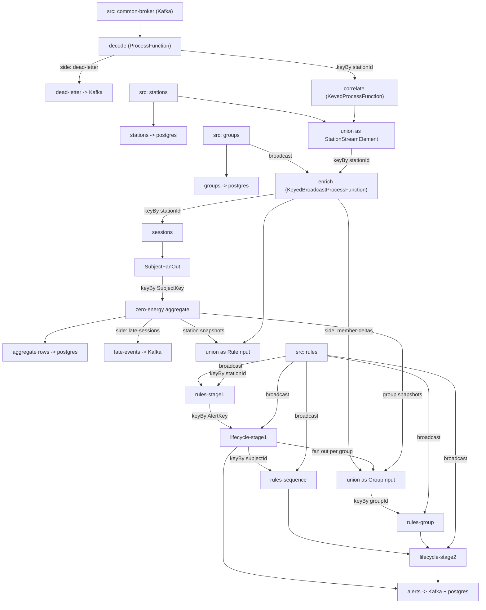
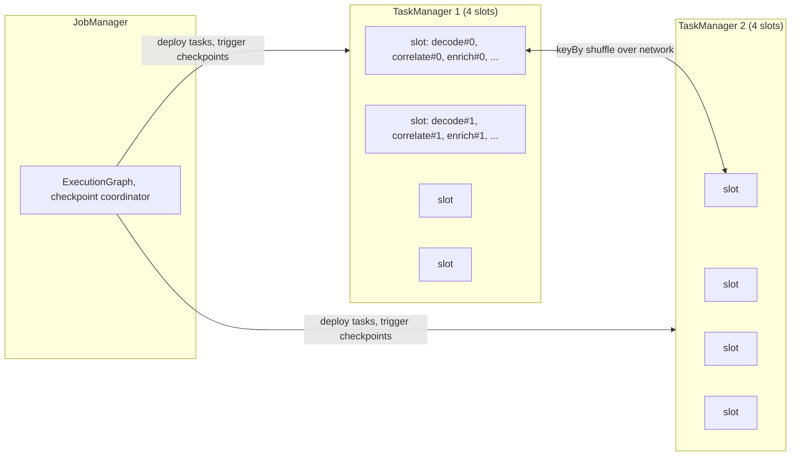

# 06. Flink programming model

**Goal.** Read [`JobMain`](../flink-processor/src/main/java/com/chargemon/flink/JobMain.java)
and [`TopologyBuilder`](../flink-processor/src/main/java/com/chargemon/flink/topology/TopologyBuilder.java)
top to bottom and understand every API call: how a `StreamExecutionEnvironment` turns a chain of
method calls into a graph, how that graph becomes tasks on a cluster, what a `ProcessFunction`
is, what `keyBy`, side outputs and `.uid()` do, and how the same graph is run in tests with
in-memory sources.

**Prerequisites.** [Chapter 02](02-java-21-for-this-repo.md) (records, lambdas, generics) and
[chapter 05](05-stream-processing-concepts.md) (keys, state, time).

## Concepts (from scratch)

### The environment and lazy graphs

Every Flink program starts with a `StreamExecutionEnvironment`. Think of it as a notebook in
which you *describe* a pipeline. Calling `env.fromSource(...)`, `.map(...)`, `.keyBy(...)` and
`.process(...)` does not process anything. Each call appends a node to a graph and returns a
`DataStream<T>` handle so you can keep chaining. Nothing runs until `env.execute()`.

This laziness is why the whole job can be built in a static method (`TopologyBuilder.build`)
and inspected in a unit test without any cluster.

### DataStream

`DataStream<T>` is a handle to "a stream of `T` somewhere in the graph". It is generic over the
element type: `DataStream<KafkaRecord>`, `DataStream<OcppEvent>`, and so on. The important
subtypes you will meet:

- `SingleOutputStreamOperator<T>`: the result of one operator; adds `.uid()`, `.name()`,
  `.setParallelism()`, `.returns()` and `.getSideOutput()`.
- `KeyedStream<T, K>`: what `keyBy` returns; only on a keyed stream can you use keyed state.
- `BroadcastStream<T>`: what `.broadcast(descriptor)` returns; see [chapter 08](08-flink-broadcast-state-and-connected-streams.md).

### From your code to running tasks: three graphs

1. **StreamGraph**: one node per API call, exactly what you wrote.
2. **JobGraph**: the client fuses neighbouring nodes that can share a thread into one vertex
   (**operator chaining**), and serializes every user function into it. This is the artefact sent
   to the cluster.
3. **ExecutionGraph**: the cluster expands each vertex into *parallelism* parallel subtasks and
   schedules them into slots.

### JobManager, TaskManager, slots, parallelism

- A **JobManager** coordinates: it holds the ExecutionGraph, triggers checkpoints, restarts on
  failure. One per job (plus standbys with high availability).
- A **TaskManager** is a worker JVM. It offers a fixed number of **slots**; each slot hosts one
  parallel subtask of *each* operator in the job (a "slice" of the pipeline).
- **Parallelism** is how many subtasks an operator has. Job parallelism 32 with 8 TaskManagers
  of 4 slots each means every operator runs 32 subtasks, spread over 32 slots.

### Chaining and partitioning

Between two operators, records are either **forwarded** (same subtask index, same thread, no
serialization, this is chaining), **hashed** by key (`keyBy`), **rebalanced** (round-robin) or
**broadcast** (every record to every subtask). Chaining only happens when the partitioning is
forward *and* both operators have the same parallelism.

### Functions: ProcessFunction and KeyedProcessFunction

Flink's simplest operators are lambdas (`map`, `filter`, `flatMap`). When you need state, timers
or side outputs you write a class:

- `ProcessFunction<IN, OUT>`: `processElement(IN value, Context ctx, Collector<OUT> out)`.
  `out.collect(x)` emits; `ctx.output(tag, y)` emits to a side output; `ctx.timestamp()` is the
  element's event time. No keyed state, no timers.
- `KeyedProcessFunction<K, IN, OUT>`: the same, but on a keyed stream. Adds keyed state
  (`getRuntimeContext().getState(...)`), timers (`ctx.timerService()`) and
  `onTimer(long ts, OnTimerContext ctx, Collector<OUT> out)`.
- `KeyedBroadcastProcessFunction<K, IN1, IN2, OUT>`: keyed input plus a broadcast input;
  [chapter 08](08-flink-broadcast-state-and-connected-streams.md).

All of them have `open(OpenContext)` (called once per subtask before any element, where you
create state handles and non-serializable helpers) and are `Serializable` themselves, because
the JobGraph ships them to the cluster. Fields marked `transient` are not shipped and must be
recreated in `open`.

### keyBy and key selectors

`stream.keyBy(record -> record.stationId())` takes a **key selector** function. The key type
must be hashable and comparable in a deterministic way across JVMs. Strings and numbers are fine.
For a composite key such as "(ruleId, subjectType, subjectId)" you use a record and tell Flink
how to treat it, `Types.POJO(AlertKey.class)`, so that Flink hashes the fields rather than the
object identity. The reason chargemon's JSON type information is not usable for keys is in
[chapter 07](07-flink-state-timers-serialization.md).

### Side outputs

An operator normally has one output stream. An `OutputTag<T>` declares an extra, named output of
a different type. Inside the function, `ctx.output(TAG, value)`; outside,
`operator.getSideOutput(TAG)` gives you the `DataStream<T>`. Typical uses: dead letters, late
data, secondary facts. Note the odd `new OutputTag<>("name") {}` with the empty braces: the
anonymous subclass makes the generic type `T` recoverable at runtime.

### TypeInformation and `.returns(...)`

Flink serializes every record that crosses a network boundary or lands in state, so it must
know each stream's type. It infers it from method signatures where it can. Lambdas and generic
records defeat inference, so you supply it: `.returns(TypeInformation)`. chargemon calls
`.returns(JsonTypes.of(X.class))` after almost every operator; the why is in
[chapter 07](07-flink-state-timers-serialization.md). For now: it means "serialize `X` with
Jackson", and forgetting it makes the job fail at graph-build time with "generic types disabled".

### `.uid()` and `.name()`

`.name("decode")` is the label shown in the UI and metrics. `.uid("decode")` is the *identity*
of the operator's state in checkpoints and savepoints. If you restart from a savepoint and an
operator's uid changed, Flink cannot map the old state to it and refuses to start (or, with
`--allowNonRestoredState`, throws the state away). Always set uids on stateful operators, and
never rename them casually.

## In this repo

### `JobMain` line by line

```java
JobConfig cfg = JobConfig.fromEnv(Env.system());
StreamExecutionEnvironment env = StreamExecutionEnvironment.getExecutionEnvironment(baseConfig());
configure(env, cfg);
TopologyBuilder.build(env, cfg, new KafkaSources(cfg), new ProductionSinks(cfg));
env.execute("chargemon-event-processor");
```
(../flink-processor/src/main/java/com/chargemon/flink/JobMain.java:20)

- `JobConfig.fromEnv` reads every tunable from environment variables once
  ([`JobConfig`](../flink-processor/src/main/java/com/chargemon/flink/config/JobConfig.java)).
  The record is `Serializable` because operators capture it.
- `getExecutionEnvironment(Configuration)` returns a local environment when run from an IDE or
  test and the cluster's environment when submitted to a cluster; the same code works in both.
- `baseConfig()` sets two pipeline options for *every* environment, including tests:

```java
c.set(PipelineOptions.GENERIC_TYPES, false);      // fail fast on Kryo fallback
c.set(PipelineOptions.OBJECT_REUSE, true);        // everything we carry is immutable
```
(../flink-processor/src/main/java/com/chargemon/flink/JobMain.java:30)

- `configure` sets streaming mode, enables checkpointing (`EXACTLY_ONCE`, interval from config,
  minimum pause of half the interval, 10 minute timeout, 3 tolerable failures) and, only if
  `PARALLELISM > 0`, the job parallelism. Leaving it at 0 lets the cluster default apply.
- `build(...)` receives the **source and sink ports**
  ([`Sources`](../flink-processor/src/main/java/com/chargemon/flink/source/Sources.java),
  [`Sinks`](../flink-processor/src/main/java/com/chargemon/flink/sink/Sinks.java)). Production
  passes Kafka and JDBC; tests pass lists and in-memory queues. The graph in between is
  identical.
- `env.execute(name)` builds the JobGraph and submits it. This call blocks for the life of the
  job.

### `TopologyBuilder.build` line by line

**Control plane (lines 62-68).** `sources.rules(env)` is a `DataStream<RuleChange>`;
`.broadcast(RuleBroadcast.DESCRIPTOR)` turns it into a `BroadcastStream` that will be replicated
to every subtask of every operator that connects to it. `sources.ruleLoader()` returns a small
object that operators call in `open()` to preload rules (chapter 08). Station and group streams
are read and immediately mirrored to Postgres via the sink port.

**Decode (lines 73-78).**

```java
SingleOutputStreamOperator<DecodedFrame> frames = raw
        .process(new FrameDecodeFunction())
        .setParallelism(raw.getParallelism())
        .uid("decode").name("decode");
sinks.deadLetters(frames.getSideOutput(FrameDecodeFunction.DEAD_LETTER));
```
(../flink-processor/src/main/java/com/chargemon/flink/topology/TopologyBuilder.java:74)

`FrameDecodeFunction` is a plain `ProcessFunction<KafkaRecord, DecodedFrame>`
([source](../flink-processor/src/main/java/com/chargemon/flink/decode/FrameDecodeFunction.java)).
It parses bytes; on failure it calls `ctx.output(DEAD_LETTER, ...)` instead of throwing. The
`setParallelism(raw.getParallelism())` matters: with equal parallelism the decoder chains to the
Kafka source, so records stay in Kafka partition order until the first `keyBy`. That order is
what keeps a CALL ahead of its CALLRESULT for the same station.

**Correlate (lines 80-84).** `keyBy(f -> f.envelope().stationId())` hashes by station;
`process(new CallCorrelationOperator(...))` is a `KeyedProcessFunction` with `MapState` and
processing-time timers (chapter 07 walks through it). `.returns(JsonTypes.of(OcppEvent.class))`
declares the output type because `OcppEvent` is a sealed interface Flink cannot infer.

**Enrich (lines 87-96).** Two streams of different types are made one type
(`StationStreamElement.of(event)` / `StationStreamElement.of(station)`) and joined with
`.union(...)`. Union is the only way to feed two keyed inputs of one key space into one
operator with ordinary keyed state; `connect` would give two inputs but only one may be keyed.
Then `.keyBy(StationStreamElement::stationId).connect(groups.broadcast(GROUPS)).process(...)`
is the keyed-plus-broadcast pattern. The member-delta side output is captured for stage 2.

**Sessions and aggregates (lines 99-111).** `sessions` is keyed by station and emits one
`SessionEnergy` per finished session. `SubjectFanOut` (a `FlatMapFunction`) explodes a
zero-energy session into one record per station and per group. The `keyBy` uses
`Types.POJO(SubjectKey.class)` because the key is a two-field record. Snapshots are filtered
twice into station and group streams; the `LATE` side output goes to a Kafka topic.

**Stage 1 rules and lifecycle (lines 114-129).** Events and station snapshots are unioned as
`RuleInput`, keyed by station, connected to the rules broadcast, evaluated. The resulting
`ConditionSignal`s are keyed by `AlertKey.of(ruleId, subject)` with `Types.POJO(AlertKey.class)`
and fed to `AlertLifecycleOperator`, again with the rules broadcast connected.

**Stage 2 (lines 132-161).** Station alerts go to `rules-sequence` (keyed by subject id).
Station alerts fanned out per group, member deltas and group snapshots are unioned as
`GroupInput` and keyed by group id for `rules-group`. Note the inline `flatMap` lambda at line
141: because it is a lambda with a generic `Collector`, `.returns(JsonTypes.of(GroupInput.class))`
is mandatory. Both signal streams go through a second `AlertLifecycleOperator` with uid
`lifecycle-stage2`. The same `rulesBroadcast` object is connected to five operators.

**Sinks (line 163).** `sinks.alerts(alerts.union(stage2Alerts))`; in production this becomes
two sinks (Kafka and JDBC) attached to one stream. The returned `Streams` record exposes
intermediate streams so tests can hang extra sinks on them.

### Uids in this job

Stateful operators: `decode`, `correlate`, `enrich`, `sessions`, `zero-energy-agg`,
`rules-stage1`, `lifecycle-stage1`, `rules-sequence`, `rules-group`, `lifecycle-stage2`.
Sources: `src-events`, `src-rules`, `src-stations`, `src-groups`
([`KafkaSources`](../flink-processor/src/main/java/com/chargemon/flink/source/KafkaSources.java)).
Sinks: `sink-alerts-kafka`, `sink-alerts-jdbc`, `sink-dead-letter`, `sink-stations-jdbc`,
`sink-groups-jdbc`, `aggregate-rows`, `sink-agg-tumbling`, `sink-agg-rolling`, `sink-late`
([`ProductionSinks`](../flink-processor/src/main/java/com/chargemon/flink/sink/ProductionSinks.java)).
The `map`, `filter` and `union` steps in between carry no state and have no uid; Flink assigns
them generated ids, which is fine because there is nothing to restore.

### Testing the graph without Kafka

Three test files show the three levels of testing a Flink job:

- [`ProductionTopologyTest`](../flink-processor/src/test/java/com/chargemon/flink/topology/ProductionTopologyTest.java)
  builds the *real* graph with `KafkaSources` and `ProductionSinks` and calls
  `env.getStreamGraph().getJobGraph()` without executing. Building the JobGraph serializes
  every function, so a non-serializable captured field fails here, in seconds, not at deploy.
- [`ListSources`](../flink-processor/src/test/java/com/chargemon/flink/topology/ListSources.java)
  implements `Sources` with `env.fromData(...)` for stations/groups and a hand-written
  `SourceFunction` for events. The event source waits on a latch until the rules source has
  emitted, then sleeps briefly, so the broadcast reaches operators before the first event. It
  also stays open (`while (running) sleep`) because a finished source ends the job and
  processing-time timers would never fire.
- [`CollectingSinks`](../flink-processor/src/test/java/com/chargemon/flink/topology/CollectingSinks.java)
  implements `Sinks` with static `ConcurrentLinkedQueue`s keyed by a test id; this works because
  MiniCluster sinks run in the test JVM.
- [`TopologyEndToEndTest`](../flink-processor/src/test/java/com/chargemon/flink/topology/TopologyEndToEndTest.java)
  starts a `MiniClusterWithClientResource` (1 TaskManager, 4 slots), sets parallelism 2, runs
  the topology with `executeAsync`, polls the sink queue until the expected alerts appear, then
  cancels the job. Seven scenarios cover status faults, absence timers, group hierarchy,
  zero-energy aggregates, sequence and group rules, state duration and dead letters.

## Diagrams

### The job graph, by `.name()`



### Cluster: JobManager, TaskManagers, slots



With parallelism 2 and 4 slots per TaskManager (the docker-compose setting), only two slots are
used and every operator has two subtasks. Chained operators (`src-events` and `decode`) share a
slot and a thread.

## Hands-on exercises

### 1. A tiny `ProcessFunction` that counts frames per station

**What to do.** In `flink-processor/src/test/java/...` create a scratch test that builds a
`StreamExecutionEnvironment` with `JobMain.baseConfig()`, uses `env.fromData(...)` with three
`DecodedFrame`s for two stations (borrow `Frames` from the `ocpp-codec` test fixtures, see how
`TopologyEndToEndTest.envelope` builds them), keys by station id and applies a
`KeyedProcessFunction<String, DecodedFrame, String>` with a `ValueState<Integer>` counter that
emits `"ST-1:2"` style strings. Collect with `.executeAndCollect()`.

**What you should observe.** Two output lines per station in increasing count order. If you
forget `.returns(...)` on a lambda step, the job fails at build time with a message about
generic types being disabled: that is `GENERIC_TYPES=false` working as designed.

**Hint.** Create the `ValueStateDescriptor` in `open()`, not in the constructor; the function
instance is serialized before `open` runs. Delete the scratch test afterwards.

### 2. Add a side output

**What to do.** Extend the exercise-1 function with an `OutputTag<String>` that receives the
station id every time the counter passes 2. Attach `.getSideOutput(tag)` to a second
`executeAndCollect()` or print.

**What you should observe.** The main output is unchanged; the side output receives exactly one
record per station that reached 2. Compare with how `FrameDecodeFunction.DEAD_LETTER` is declared
and consumed in `TopologyBuilder` line 78.

**Hint.** Declare the tag as `new OutputTag<String>("over-two") {}` with the braces.

### 3. Match plan nodes to uids

**What to do.** Run `./gradlew :flink-processor:test --tests '*ProductionTopologyTest*'`.
Then temporarily add `System.out.println(env.getStreamGraph().getStreamingPlanAsJSON())` before
the assertions, rerun, and read the JSON.

**What you should observe.** One node per operator, with `"type"` and `"pact"` fields, and
`"predecessors"` listing `"ship_strategy"` values: `FORWARD` between `src-events` and `decode`,
`HASH` after each `keyBy`, `BROADCAST` from the rules source. Match the node names to the
uid list above.

**Hint.** `getStreamingPlanAsJSON()` is on `StreamGraph`. Revert the print afterwards.

## Self-check

1. What does `TopologyBuilder.build` actually do when called, and what does it not do?
2. Why is `decode` given the same parallelism as the Kafka source?
3. Why does `enrich` receive events and station records through `union` rather than `connect`?
4. What breaks if you rename `.uid("correlate")` to `.uid("call-correlation")` in production?
5. `ProductionTopologyTest` never runs the job. What class of bug does it still catch, and how?

<details><summary>Answers</summary>

1. It appends nodes to the environment's StreamGraph and returns handles to some streams. It
   reads no Kafka, allocates no state and starts no threads; execution begins only with
   `env.execute` / `executeAsync`.
2. Equal parallelism plus forward partitioning lets Flink chain the decoder to the source, so
   each Kafka partition's records are decoded in order by the same thread. Ordering survives
   until the `keyBy`, which keeps a station's CALL ahead of its CALLRESULT.
3. `connect` allows exactly one keyed input plus one non-keyed (or broadcast) input. Both events
   and station records must be keyed by station id and share the same keyed state, so they are
   wrapped in one union type and keyed together.
4. On restart from a savepoint, Flink looks for state under uid `correlate`, finds it, and finds
   no operator with that uid. The job refuses to start unless non-restored state is explicitly
   allowed, in which case all pending calls are lost.
5. Non-serializable captured fields in operators, missing `.returns(...)` (generic type
   fallback) and invalid graph shapes. Building the JobGraph runs the closure cleaner and
   serializes every user function, so these fail in the test.

</details>

## Glossary terms

- [DataStream](glossary.md#datastream)
- [job graph](glossary.md#job-graph)
- [JobManager](glossary.md#jobmanager)
- [TaskManager](glossary.md#taskmanager)
- [slot](glossary.md#slot)
- [parallelism](glossary.md#parallelism)
- [operator chaining](glossary.md#operator-chaining)
- [operator uid](glossary.md#operator-uid)
- [ProcessFunction](glossary.md#processfunction)
- [KeyedProcessFunction](glossary.md#keyedprocessfunction)
- [keyBy](glossary.md#keyby)
- [side output](glossary.md#side-output)
- [TypeInformation](glossary.md#typeinformation)
- [MiniCluster](glossary.md#minicluster)

## Further reading

- DataStream API overview —
  <https://nightlies.apache.org/flink/flink-docs-release-1.20/docs/dev/datastream/overview/>
- Process functions —
  <https://nightlies.apache.org/flink/flink-docs-release-1.20/docs/dev/datastream/operators/process_function/>
- Side outputs —
  <https://nightlies.apache.org/flink/flink-docs-release-1.20/docs/dev/datastream/side_output/>
- Flink architecture (JobManager, TaskManager, slots) —
  <https://nightlies.apache.org/flink/flink-docs-release-1.20/docs/concepts/flink-architecture/>
- Savepoints and operator uids —
  <https://nightlies.apache.org/flink/flink-docs-release-1.20/docs/ops/state/savepoints/>
- Testing (MiniCluster, test harnesses) —
  <https://nightlies.apache.org/flink/flink-docs-release-1.20/docs/dev/datastream/testing/>
