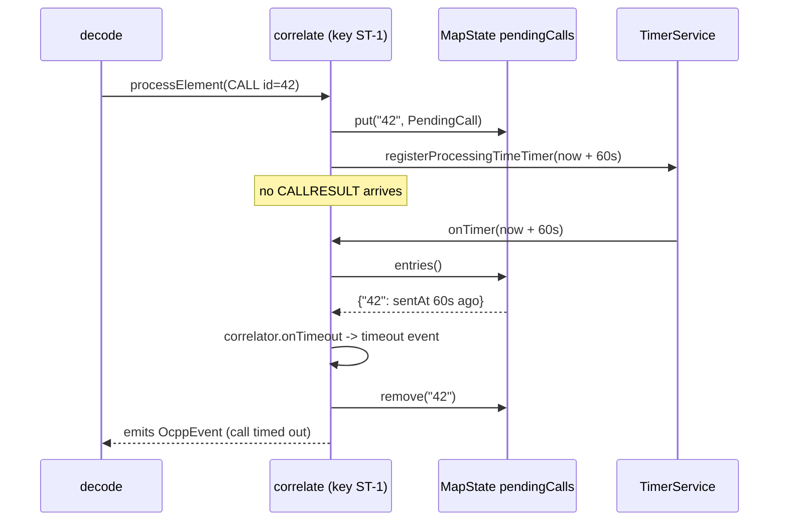
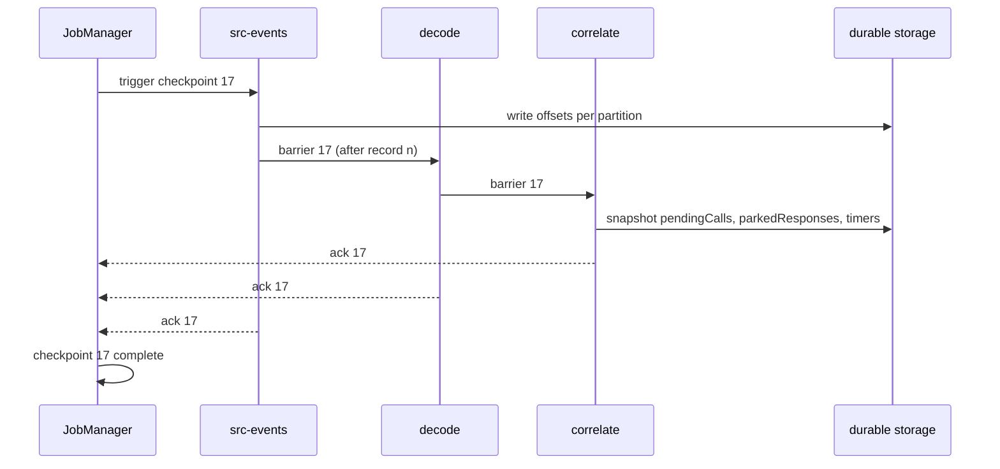
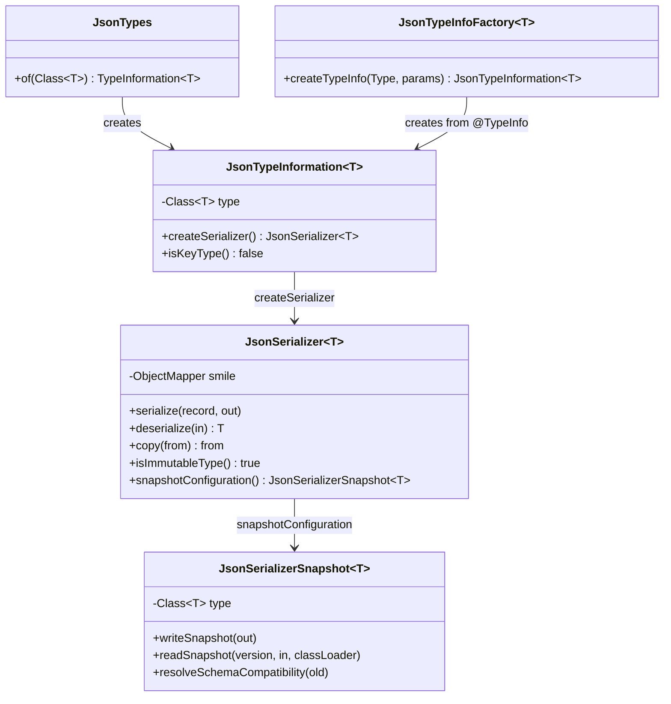

# 07. Flink state, timers, serialization

**Goal.** Understand the three things a keyed operator can do beyond transforming records:
keep state per key, set timers, and have that state survive crashes. You will read the two
operators that use these features most directly, `CallCorrelationOperator` and
`AlertLifecycleOperator`, learn what TTL, state backends, checkpoints and savepoints mean in
practice, and see why this repo ships its own Jackson-based serializer instead of letting Flink
guess.

**Prerequisites.** [Chapter 06](06-flink-programming-model.md) (KeyedProcessFunction, uids).

## Concepts (from scratch)

### Keyed state primitives

Inside a `KeyedProcessFunction` you never get a "map of all stations". You get handles that are
automatically scoped to the key of the record (or timer) being processed:

| Handle | Holds per key | Typical use |
|---|---|---|
| `ValueState<T>` | one value or `null` | current station record, lifecycle phase |
| `MapState<K, V>` | a small map | pending calls by message id, hourly buckets |
| `ListState<T>` | an append-only list | buffered events (not used in chargemon) |

You obtain a handle from a **descriptor**: a name plus the type information of the contents,
e.g. `new ValueStateDescriptor<>("lifecycle", JsonTypes.of(LifecycleState.class))`. The name is
the identity of that state in checkpoints; the type information decides how it is serialized.
Descriptors are created in `open()` and the handle stored in a `transient` field.

Reading `state.value()` for key ST-1 returns ST-1's value; five lines later, processing a record
for ST-2, the *same handle* returns ST-2's value. Flink swaps the "current key" before calling
you. That is what makes per-key logic look like single-threaded code.

### Timers

`ctx.timerService()` lets a keyed function ask to be called back at a timestamp:

- `registerProcessingTimeTimer(ts)`: fire when the wall clock reaches `ts`.
- `registerEventTimeTimer(ts)`: fire when the watermark passes `ts`.
- `deleteProcessingTimeTimer(ts)` / `deleteEventTimeTimer(ts)`: cancel.

When it fires, `onTimer(ts, ctx, out)` runs with the key set to the key that registered it.
Timers are part of state: they are checkpointed and restored, and a processing-time timer whose
time already passed during downtime fires immediately after restore.

Two rules of thumb:

- **Timers coalesce.** Registering the same `(key, timestamp)` twice yields one callback. This
  is why operators that need many logical deadlines per key keep their own bookkeeping.
- **You cannot attach data to a timer.** `onTimer` gets only a timestamp. To know *why* it
  fired, the operator must store the reason in state and compare timestamps. The **stale-timer
  guard** pattern: store each deadline in state; in `onTimer`, act only if the timestamp equals a
  stored deadline. A superseded deadline leaves an orphan timer that fires and is ignored, which
  is cheaper and simpler than deleting it.

### State TTL

State that is never read again still costs memory and checkpoint size. A `StateTtlConfig` on a
descriptor makes entries expire after a duration measured in processing time from their last
update (`OnCreateAndWrite`) or last access (`OnReadAndWrite`). Expired entries are hidden from
reads and physically removed by a background cleanup; for RocksDB the cleanup is a compaction
filter (`cleanupInRocksdbCompactFilter(n)` checks the timestamp of entries during compaction, and
`n` is how many entries to process before refreshing the current time).

### State backends

The **state backend** decides where keyed state lives on a TaskManager:

- `hashmap`: Java objects on the JVM heap. Fastest, no serialization on access, but bounded by
  heap and checkpoints must serialize everything on every checkpoint.
- `rocksdb`: an embedded key-value store on local disk. Every read deserializes and every write
  serializes, so it is slower per access, but state can exceed memory by orders of magnitude and
  **incremental checkpoints** upload only changed files.

One million stations with a few kilobytes each is a RocksDB workload. The choice is made in the
cluster configuration, not in code, which is why tests run on the default hashmap backend.

### Checkpoints versus savepoints, and EXACTLY_ONCE

A **checkpoint** is automatic, periodic and owned by Flink; old ones are deleted. A
**savepoint** is triggered by an operator (a person or a script), is never deleted by Flink and
is the unit of upgrades. Both contain the same thing: every operator's state keyed by uid, plus
source offsets.

`CheckpointingMode.EXACTLY_ONCE` describes how the snapshot is coordinated. The JobManager
injects a **barrier** into every source. An operator with two inputs waits until the barrier
has arrived on both (**alignment**) before snapshotting, so the snapshot reflects exactly the
records before the barrier on every input. `AT_LEAST_ONCE` skips alignment and is faster under
backpressure but may include records from after the barrier, which would double-count on
replay. **Unaligned checkpoints** (enabled in the Kubernetes config) get the best of both by
snapshotting in-flight buffers too.

### Serialization: TypeInformation, TypeSerializer, snapshots

Every record that crosses a network shuffle or enters state becomes bytes. Flink's model:

- `TypeInformation<T>` describes a type and can create a `TypeSerializer<T>`.
- `TypeSerializer<T>` does `serialize`, `deserialize`, `copy`, and reports whether the type is
  immutable.
- `TypeSerializerSnapshot<T>` is written into every checkpoint next to the state. On restore,
  the old snapshot is compared with the new serializer (`resolveSchemaCompatibility`) so Flink
  can tell "compatible as is", "needs migration" or "incompatible".

Flink infers `TypeInformation` for primitives, tuples, and POJOs (public class, no-arg
constructor, public or getter/setter fields; Java records are accepted since Flink 1.19). Anything
else becomes a **generic type** serialized by **Kryo**, which is slow, reflective, and brittle
across versions. `pipeline.generic-types: false` makes that fallback an error instead.

**Object reuse.** Between chained operators Flink normally deep-copies each record so that one
operator mutating it cannot corrupt another. If every record is immutable (Java records with
immutable collections) that copy is wasted work; `pipeline.object-reuse: true` turns it off.

## In this repo

### The serde package

[`JsonTypes.of(Class)`](../flink-processor/src/main/java/com/chargemon/flink/serde/JsonTypes.java)
returns a [`JsonTypeInformation`](../flink-processor/src/main/java/com/chargemon/flink/serde/JsonTypeInformation.java),
whose `createSerializer` returns a
[`JsonSerializer`](../flink-processor/src/main/java/com/chargemon/flink/serde/JsonSerializer.java):

```java
@Override
public void serialize(T record, DataOutputView target) throws IOException {
    byte[] bytes = mapper().writeValueAsBytes(record);
    target.writeInt(bytes.length);
    target.write(bytes);
}
```
(../flink-processor/src/main/java/com/chargemon/flink/serde/JsonSerializer.java:67)

The mapper is Jackson **Smile** (a binary JSON encoding) from `JsonMapperFactory.smile()`, the
same factory the rest of the codebase uses, so sealed interfaces such as `OcppEvent` serialize
exactly as they would on Kafka. Three details carry design weight:

- `isImmutableType()` returns `true` and `copy(from)` returns `from`. Together with
  `OBJECT_REUSE` this means a record passes through the chain untouched.
- `isKeyType()` in `JsonTypeInformation` is `false`: Flink cannot hash JSON bytes stably, so
  key records (`AlertKey`, `SubjectKey`) use `Types.POJO(...)` instead.
- `JsonSerializerSnapshot` writes only the class name. On restore it reports
  `compatibleAsIs` when the class matches, and `incompatible` otherwise:

```java
public TypeSerializerSchemaCompatibility<T> resolveSchemaCompatibility(TypeSerializerSnapshot<T> oldSnapshot) {
    if (oldSnapshot instanceof JsonSerializerSnapshot<T> old && old.type.equals(type)) {
        return TypeSerializerSchemaCompatibility.compatibleAsIs();
    }
    return TypeSerializerSchemaCompatibility.incompatible();
}
```
(../flink-processor/src/main/java/com/chargemon/flink/serde/JsonSerializerSnapshot.java:53)

**Schema evolution consequences.** Because the payload is JSON and the mapper ignores unknown
properties, you can *add* a field to a record (old bytes deserialize with the new field `null`)
and *remove* a field (old bytes carry an ignored extra property). You cannot rename a field or
change its type without a migration, and renaming or moving the class breaks
`Class.forName` in `readSnapshot`.

Types used only as operator outputs get `.returns(JsonTypes.of(...))` in `TopologyBuilder`.
Types that Flink must infer on its own (union elements, flatMap outputs) carry
`@TypeInfo(JsonTypeInfoFactory.class)`; see
[`StationStreamElement`](../flink-processor/src/main/java/com/chargemon/flink/model/StationStreamElement.java),
[`RuleInput`](../flink-processor/src/main/java/com/chargemon/flink/model/RuleInput.java),
[`GroupInput`](../flink-processor/src/main/java/com/chargemon/flink/stage2/GroupInput.java),
`EnrichedEvent`, `DecodedFrame`, `AggregateSnapshot`, `SessionEnergy`, `SubjectSession`.

### The three TTLs

| Descriptor(s) | TTL | Config | Where |
|---|---|---|---|
| `pendingCalls`, `parkedResponses` | 5 min | `PENDING_CALL_TTL` | [`CallCorrelationOperator`](../flink-processor/src/main/java/com/chargemon/flink/correlate/CallCorrelationOperator.java) |
| `sessionTracks` | 48 h | `SESSION_TRACK_TTL` | [`ZeroEnergySessionDetector`](../flink-processor/src/main/java/com/chargemon/flink/energy/ZeroEnergySessionDetector.java) |
| `ruleState`, `ruleTimers`, `aggregates`, `lastStation` | 30 d | `STATION_STATE_TTL` | [`StationRuleEvaluatorOperator`](../flink-processor/src/main/java/com/chargemon/flink/rules/StationRuleEvaluatorOperator.java), [`Stage2Support`](../flink-processor/src/main/java/com/chargemon/flink/stage2/Stage2Support.java) |

All use the same shape:

```java
desc.enableTimeToLive(StateTtlConfig.newBuilder(ttl)
        .setUpdateType(StateTtlConfig.UpdateType.OnCreateAndWrite)
        .cleanupInRocksdbCompactFilter(1000)
        .build());
```
(../flink-processor/src/main/java/com/chargemon/flink/correlate/CallCorrelationOperator.java:58)

The `buckets` map in `ZeroEnergyAggregator` deliberately has **no TTL**: expiry is decided by
`HourlyBucketAggregator.expire` in event time, and a processing-time TTL would silently drop
buckets during a long replay. `lifecycle` state in `AlertLifecycleOperator` has no TTL either;
it is set to `null` (removed) when the state machine returns to idle with `seq == 0`.

### Worked example 1: `CallCorrelationOperator`

Keyed by station id. The decision logic is in the codec's `CallCorrelator` (chapter 12); the
operator only owns Flink state and timers. Two `MapState`s: `pendingCalls` (message id → the
CALL awaiting a result) and `parkedResponses` (results that arrived before their CALL).

`processElement` hands the frame to the correlator together with a `MapStateStore`, a private
record that adapts the two `MapState`s to the codec's `PendingCallStore` port. Whatever the
correlator decides comes back as a `CorrelationOutcome`; the operator applies it:

```java
if (outcome.registered().isPresent()) {
    CorrelationOutcome.Registered r = outcome.registered().get();
    pending.put(r.key(), r.call());
    ctx.timerService().registerProcessingTimeTimer(ctx.timerService().currentProcessingTime() + timeout.toMillis());
}
```
(../flink-processor/src/main/java/com/chargemon/flink/correlate/CallCorrelationOperator.java:85)

One timer at `now + CORRELATION_TIMEOUT` per registration; timers for calls registered in the
same millisecond coalesce. `onTimer` does not know which call it was registered for, so it scans
all pending entries and expires those whose `sentAt + timeout` has passed, emitting a timeout
event for each via `correlator.onTimeout`. Then it drops parked responses older than the
timeout. This is the "scan on fire" variant of the stale-timer guard: no per-timer bookkeeping,
just a full pass over a map that is small per key.

### Worked example 2: `AlertLifecycleOperator`

Keyed by `AlertKey(ruleId, subjectType, subjectId)`. One `ValueState<LifecycleState>`; the pure
state machine `AlertLifecycle` (chapter 16) returns a `Decision` with the next state, events to
emit and `TimerRequest`s. Three timer kinds: `GRACE`, `SUPPRESSION`, `AUTO_RESOLVE`. The operator
registers scheduled timers and *ignores cancels*:

```java
for (TimerRequest t : d.timers()) {
    if (!t.isCancel()) {
        timerService.registerProcessingTimeTimer(t.at().toEpochMilli());
    }
    // Cancels are implicit: a fired timer whose timestamp no longer matches a stored deadline is ignored.
}
```
(../flink-processor/src/main/java/com/chargemon/flink/lifecycle/AlertLifecycleOperator.java:122)

The matching guard in `onTimer` compares the fired timestamp with the deadlines stored in
`LifecycleState`:

```java
for (TimerKind kind : TimerKind.values()) {
    Instant deadline = switch (kind) {
        case GRACE -> cur.graceDeadline();
        case SUPPRESSION -> cur.suppressedUntil();
        case AUTO_RESOLVE -> cur.autoResolveAt();
    };
    if (deadline != null && deadline.toEpochMilli() == timestamp) {
        apply(new LifecycleInput.TimerFired(kind, at), rule.get(), ctx.getCurrentKey(), now, ctx.timerService(), out);
        cur = state.value();
    }
}
```
(../flink-processor/src/main/java/com/chargemon/flink/lifecycle/AlertLifecycleOperator.java:103)

A condition that clears during the grace window leaves the grace timer registered; when it fires,
`graceDeadline` is `null` or different, so nothing happens. The third input,
`processBroadcastElement`, handles rule removal and is the subject of [chapter 08](08-flink-broadcast-state-and-connected-streams.md).

### A third variant: reference-counted timers in `FlinkRuleContext`

[`FlinkRuleContext`](../flink-processor/src/main/java/com/chargemon/flink/rules/FlinkRuleContext.java)
adapts state and timers for the rule engine. Rule evaluators may hold many named timers per
station (`ruleId|scope|kind` → deadline in a `MapState<String, Long>`). Because two logical
timers can share one Flink timestamp, deleting a Flink timer is only safe when no other entry
references that timestamp (`stillReferenced`). Evaluator state is stored as Smile `byte[]` blobs
keyed by `ruleId|scope`, so the rule engine stays free of Flink types.

### Checkpoint settings in `JobMain`

`enableCheckpointing(interval, EXACTLY_ONCE)`, min pause `interval / 2`, timeout 10 minutes,
3 tolerable consecutive failures. In Kubernetes the backend is RocksDB with incremental and
unaligned checkpoints on S3 ([`flink-deployment.yaml`](../deploy/k8s/flink-deployment.yaml));
docker-compose uses RocksDB with a local directory.

## Diagrams

### A CALL that never gets a result



### A checkpoint barrier through the pipeline



### The serde classes



## Hands-on exercises

### 1. Add a field to a stateful record

**What to do.** On paper (or in a scratch branch you discard), add a field
`String lastError` to `LifecycleState` in
[`LifecycleState.java`](../rule-engine/src/main/java/com/chargemon/rules/lifecycle/LifecycleState.java).
Trace what happens when the job restarts from a checkpoint written before the change:
`JsonSerializerSnapshot.readSnapshot` loads the class, `resolveSchemaCompatibility` compares
class names, `JsonSerializer.deserialize` feeds old Smile bytes to Jackson.

**What you should observe.** The class name is unchanged, so compatibility is `compatibleAsIs`;
Jackson finds no `lastError` property and leaves it `null`. Now do the same with a *rename*
of `graceDeadline` to `graceUntil`: the old bytes still parse, but every restored state has
`graceUntil == null`, so every pending alert silently loses its grace deadline. That is why
renames need an explicit migration and adds do not.

**Hint.** Check `JsonMapperFactory` in the `common` module for `FAIL_ON_UNKNOWN_PROPERTIES`.

### 2. Describe a harness test for the correlation timeout

**What to do.** Flink ships `KeyedOneInputStreamOperatorTestHarness` (in `flink-test-utils`,
already a test dependency of `flink-processor`). Write down the steps of a test that wraps
`CallCorrelationOperator` in a `KeyedProcessOperator`, keys by station id, pushes one `DecodedFrame`
containing a CALL, advances processing time past `CORRELATION_TIMEOUT` with
`harness.setProcessingTime(...)`, and asserts on `harness.extractOutputValues()`.

**What you should observe.** No output after the CALL alone; exactly one timeout event after
the clock passes `sentAt + timeout`; `pendingCalls` empty afterwards. Optionally implement it
and run with `./gradlew :flink-processor:test --tests '*Correlation*'`.

**Hint.** The harness needs a `TypeInformation` for the key (`Types.STRING`) and you must call
`harness.open()` before pushing elements, because state descriptors are created in `open()`.

### 3. Change `CORRELATION_TIMEOUT` in the end-to-end test

**What to do.** In
[`TopologyEndToEndTest.testConfig`](../flink-processor/src/test/java/com/chargemon/flink/topology/TopologyEndToEndTest.java)
the correlation timeout is `Duration.ofSeconds(2)`. Change it to 20 seconds and run only
`bootRejectedViaCorrelationAndMalformedGoesToDeadLetter`.

**What you should observe.** The test still passes and takes about the same time: the
CALLRESULT arrives immediately, so the timeout timer never matters. Now remove the CALLRESULT
envelope from that scenario and run again; with 2 seconds you get a timed-out boot event
quickly, with 20 seconds the test waits and eventually fails on its 30-second deadline. Revert.

**Hint.** `./gradlew :flink-processor:test --tests '*bootRejected*'`.

## Self-check

1. Why is a `ValueStateDescriptor` created in `open()` rather than in the constructor?
2. Why does `AlertLifecycleOperator` never call `deleteProcessingTimeTimer`?
3. What does `cleanupInRocksdbCompactFilter(1000)` do, and why is there no TTL on the
   aggregator's `buckets` state?
4. Why can `JsonTypeInformation` not be used as a key type?
5. Which schema changes to a record stored in state are safe with `JsonSerializer`, and which
   are not?

<details><summary>Answers</summary>

1. The function object is serialized into the JobGraph and shipped to TaskManagers before
   `open()` runs. State handles are bound to the runtime context of a specific subtask, which
   only exists in `open()`; hence the `transient` fields.
2. It stores every deadline in `LifecycleState`. When a timer fires it checks whether the fired
   timestamp still equals a stored deadline; if not, the timer is stale and ignored. Skipping
   deletion avoids extra state bookkeeping and is correct because each firing is cheap.
3. It removes expired entries during RocksDB compaction, re-reading the current time after every
   1000 entries. `buckets` expiry is driven by event time (`HourlyBucketAggregator.expire`) so a
   wall-clock TTL could delete valid buckets during a long replay.
4. `isKeyType()` returns `false`. Keys must hash identically on every subtask and Flink uses
   the type's own hashing for POJOs; a JSON serializer offers no stable field-based hash, so
   composite keys use `Types.POJO(...)`.
5. Adding or removing fields is safe (unknown properties are ignored, missing ones become
   `null`). Renaming a field silently loses data; changing a field's type fails to parse;
   renaming or moving the class fails in `readSnapshot`.

</details>

## Glossary terms

- [keyed state](glossary.md#keyed-state)
- [timer](glossary.md#timer)
- [state TTL](glossary.md#state-ttl)
- [state backend](glossary.md#state-backend)
- [RocksDB](glossary.md#rocksdb)
- [checkpoint](glossary.md#checkpoint)
- [savepoint](glossary.md#savepoint)
- [TypeInformation](glossary.md#typeinformation)
- [TypeSerializer](glossary.md#typeserializer)
- [operator uid](glossary.md#operator-uid)
- [correlation](glossary.md#correlation)
- [parked response](glossary.md#parked-response)
- [grace window](glossary.md#grace-window)
- [suppression window](glossary.md#suppression-window)
- [auto-resolve](glossary.md#auto-resolve)

## Further reading

- Working with state (ValueState, MapState, TTL) —
  <https://nightlies.apache.org/flink/flink-docs-release-1.20/docs/dev/datastream/fault-tolerance/state/>
- Process function timers —
  <https://nightlies.apache.org/flink/flink-docs-release-1.20/docs/dev/datastream/operators/process_function/>
- State backends —
  <https://nightlies.apache.org/flink/flink-docs-release-1.20/docs/ops/state/state_backends/>
- Checkpointing (modes, unaligned) —
  <https://nightlies.apache.org/flink/flink-docs-release-1.20/docs/dev/datastream/fault-tolerance/checkpointing/>
- Savepoints —
  <https://nightlies.apache.org/flink/flink-docs-release-1.20/docs/ops/state/savepoints/>
- Data types and serialization —
  <https://nightlies.apache.org/flink/flink-docs-release-1.20/docs/dev/datastream/fault-tolerance/serialization/types_serialization/>
- Custom serialization and schema evolution —
  <https://nightlies.apache.org/flink/flink-docs-release-1.20/docs/dev/datastream/fault-tolerance/serialization/custom_serialization/>
