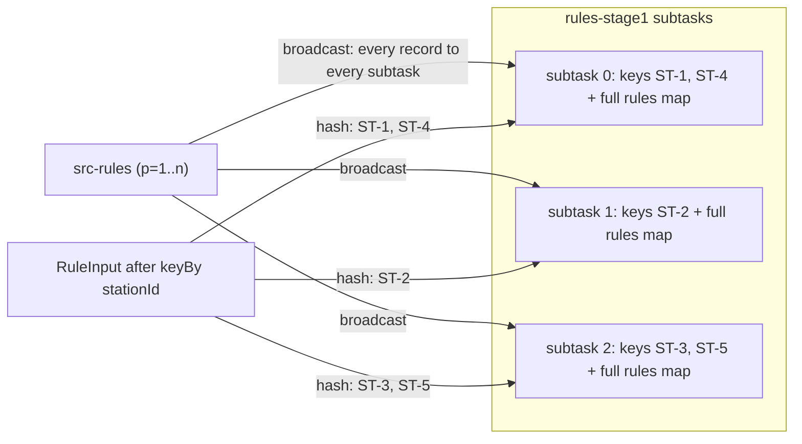
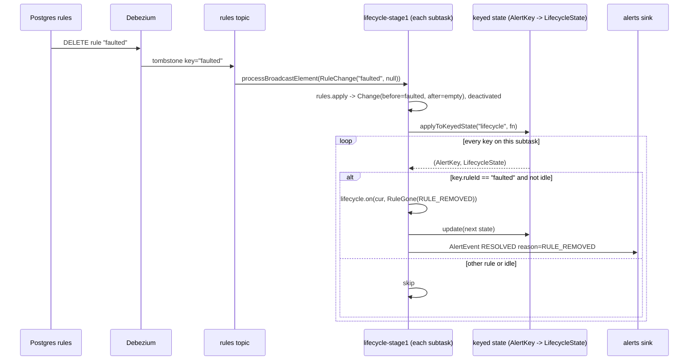
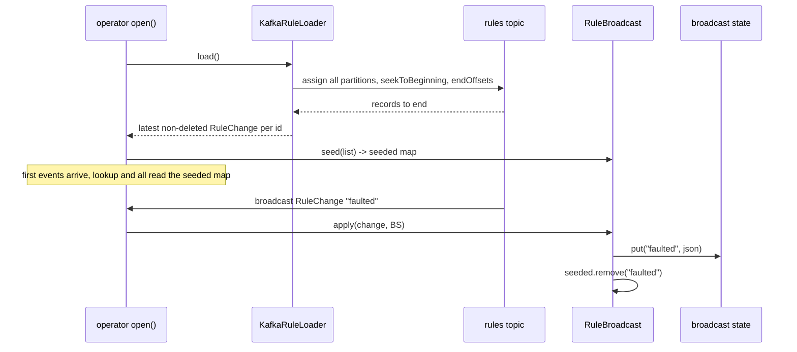

# 08. Broadcast state and connected streams

**Goal.** Learn how one small, slowly changing dataset (alert rules, the group hierarchy) is
pushed to *every* parallel instance of an operator, how such an operator reads it while
processing keyed records, how it walks all keys when a rule disappears, and why chargemon
solves the "operator starts before the rules arrive" race with a preloader. You will also see
why station master data is *not* broadcast.

**Prerequisites.** [Chapter 07](07-flink-state-timers-serialization.md) (keyed state, timers)
and [chapter 04](04-kafka-and-cdc-basics.md) (compacted topics, tombstones, Debezium).

## Concepts (from scratch)

### Two ways to bring two streams together

`keyBy` partitions one stream so that all records with one key meet on one subtask. But some
data must be visible to *all* keys: a rule that applies to every station, a group tree every
station is looked up in. Sending that data through `keyBy` would mean copying it once per key
(a million times). Instead you **broadcast** it: every subtask of the receiving operator gets
every record.

Flink's `connect` joins two streams into one operator with two inputs. The combination that
matters here is *keyed stream* `connect` *broadcast stream*, which produces a
`KeyedBroadcastProcessFunction`.

### BroadcastStream and MapStateDescriptor

`stream.broadcast(descriptor)` turns a `DataStream<T>` into a `BroadcastStream<T>`. The
descriptor is a `MapStateDescriptor<K, V>` that names and types the **broadcast state**: a map
that every subtask holds an identical copy of, that is checkpointed like keyed state, and that
the operator's broadcast side may write to.

### KeyedBroadcastProcessFunction

Three callbacks:

- `processElement(IN1 value, ReadOnlyContext ctx, Collector<OUT> out)`: a keyed record arrived.
  The current key is set, keyed state works, timers work, and
  `ctx.getBroadcastState(descriptor)` is **read-only**. Read-only is enforced because subtasks
  process keyed records at different speeds; if each could write, their copies would diverge.
- `processBroadcastElement(IN2 value, Context ctx, Collector<OUT> out)`: a broadcast record
  arrived. There is no current key, so keyed state is *not* directly accessible, but
  `ctx.getBroadcastState(descriptor)` is writable. Every subtask sees the same broadcast records
  in the same order, so applying the same deterministic update keeps the copies identical.
- `onTimer(...)`: as in `KeyedProcessFunction`.

`processBroadcastElement` has one more tool: `ctx.applyToKeyedState(descriptor, function)`
iterates over **every key** this subtask holds for the given keyed-state descriptor and calls
your function with the key and its state. It is the only way to touch keyed state from the
broadcast side, and the intended way to react to "this rule no longer exists" across all
subjects.

### The seeding problem

Broadcast and keyed inputs are independent streams. Nothing guarantees that the first rule
arrives before the first event; on a fresh start with a busy events topic, thousands of events
can pass through an operator whose broadcast state is still empty. There are three answers:

1. Buffer keyed records until the broadcast is "complete" (but a stream has no "complete").
2. Accept the gap.
3. **Preload** the broadcast dataset synchronously in `open()` from its source of truth, then
   let the broadcast deliver only changes.

chargemon does (3). Rules live in a compacted Kafka topic, so "read the topic to its end" is a
cheap, bounded operation that yields exactly the current rule set.

### What to broadcast and what to key

Broadcast state is replicated *p* times and lives on every subtask. It is right for data that is
small (thousands of rows) and read by every key. It is wrong for data that is large or keyed
naturally: a million station records would be a million-row map on each of 32 subtasks,
checkpointed 32 times. Such data belongs in **keyed state**, keyed by the same key as the
records that need it, delivered through `union` (chapter 06).

## In this repo

### The rules broadcast

`TopologyBuilder` creates one `BroadcastStream<RuleChange>` and connects it to five operators:
`rules-stage1`, `lifecycle-stage1`, `rules-sequence`, `rules-group`, `lifecycle-stage2`. The
descriptor is a map of rule id → raw JSON:

```java
public static final MapStateDescriptor<String, String> DESCRIPTOR =
        new MapStateDescriptor<>("rules", Types.STRING, Types.STRING);
```
(../flink-processor/src/main/java/com/chargemon/flink/control/RuleBroadcast.java:27)

Storing raw JSON rather than parsed `RuleDefinition` objects keeps the checkpointed form stable
and lets each operator cache the parsed definition per `(id, json)`.
[`RuleBroadcast`](../flink-processor/src/main/java/com/chargemon/flink/control/RuleBroadcast.java)
is the helper every one of the five operators creates in `open()`:

- `seed(loader)`: fills the `seeded` map from the preloader (below).
- `apply(change, state)`: writes to broadcast state on the broadcast side, removes the id from
  `seeded` ("broadcast is authoritative from now on for this id"), and returns a `Change`
  with `before`/`after` so the caller can detect deactivation. Invalid JSON is logged and the
  last good version kept.
- `lookup(id, state)` and `all(state)`: read paths, consulting `seeded` for ids the broadcast
  has not delivered yet, and caching parsed definitions.

A `RuleChange` with `ruleJson == null` is a delete; that is how a Kafka tombstone from Debezium
(chapter 04) reaches the job.

### Seeding: `RuleLoader` and `KafkaRuleLoader`

[`RuleLoader`](../flink-processor/src/main/java/com/chargemon/flink/control/RuleLoader.java) is
a `Serializable` functional interface returned by the `Sources` port, so tests inject
`RuleLoader.of(list)` and production injects
[`KafkaRuleLoader`](../flink-processor/src/main/java/com/chargemon/flink/control/KafkaRuleLoader.java):

```java
consumer.assign(parts);
consumer.seekToBeginning(parts);
Map<TopicPartition, Long> end = consumer.endOffsets(parts);
while (parts.stream().anyMatch(tp -> consumer.position(tp) < end.get(tp))) {
    ConsumerRecords<byte[], byte[]> records = consumer.poll(Duration.ofSeconds(1));
```
(../flink-processor/src/main/java/com/chargemon/flink/control/KafkaRuleLoader.java:54)

It uses a throwaway consumer group, reads every partition from the beginning to the end offset
captured at start, keeps the last record per rule id, drops deletes, and returns the list. It
runs inside `open()` of each subtask, so with parallelism 32 the topic is read 32 times per
start, which is fine for a topic of a few thousand compacted rows. If the topic does not exist
yet it logs a warning and returns no rules; if Kafka is unreachable it throws, failing the job
fast rather than running blind.

### Rule removal: `applyToKeyedState`

When a rule is deleted or disabled, alerts that are open under it must be resolved. Only
`AlertLifecycleOperator` does this, because it is the operator that owns alert state:

```java
ctx.applyToKeyedState(desc, (AlertKey key, ValueState<LifecycleState> s) -> {
    LifecycleState cur = s.value();
    if (cur == null || cur.isIdle() || !key.ruleId().equals(gone.id())) {
        return;
    }
    AlertLifecycle.Decision d = lifecycle.on(cur, new LifecycleInput.RuleGone(reason), gone, key.subject(), now);
    s.update(d.next());
    d.emits().forEach(e -> emit(e, out));
});
```
(../flink-processor/src/main/java/com/chargemon/flink/lifecycle/AlertLifecycleOperator.java:80)

The reason is `RULE_DISABLED` if a definition still exists but is disabled, `RULE_REMOVED` if it
is gone. The iteration visits every `(rule, subject)` key on the subtask, which is why the guard
skips keys of other rules quickly. The evaluator operators take the lazy route instead: their
`processBroadcastElement` just calls `rules.apply(...)`, and a timer that later fires for a
vanished rule clears that rule's state
([`StationRuleEvaluatorOperator.onTimer`](../flink-processor/src/main/java/com/chargemon/flink/rules/StationRuleEvaluatorOperator.java)).

### The groups broadcast and `StationEnrichmentOperator`

The second broadcast carries `GroupRecord`s into
[`StationEnrichmentOperator`](../flink-processor/src/main/java/com/chargemon/flink/enrich/StationEnrichmentOperator.java)
under the descriptor `GROUPS` (group id → record). The keyed side is the union of events and
station records (`StationStreamElement`), keyed by station id.

- On a **station record**, the operator stores it in `ValueState<StationRecord> station`.
- On an **event**, it reads the station, computes the station's **transitive group closure**
  (its direct groups plus all their ancestors) with
  [`GroupHierarchy`](../flink-processor/src/main/java/com/chargemon/flink/enrich/GroupHierarchy.java),
  and emits an `EnrichedEvent` carrying `StationContext` with `allGroupIds`.
- On a **group record** (broadcast side), it updates broadcast state and invalidates the
  closure cache:

```java
public void processBroadcastElement(GroupRecord g, Context ctx, Collector<EnrichedEvent> out) throws Exception {
    BroadcastState<String, GroupRecord> groups = ctx.getBroadcastState(GROUPS);
    if (g.deleted()) {
        groups.remove(g.groupId());
    } else {
        groups.put(g.groupId(), g);
    }
    hierarchy.invalidate();
```
(../flink-processor/src/main/java/com/chargemon/flink/enrich/StationEnrichmentOperator.java:114)

`GroupHierarchy.closure` walks `parentId` links with a cycle guard of 64 and caches per group id.

**Member deltas.** Group-level rules need to know how many stations a group has. The
enrichment operator remembers the closure it last announced for each station
(`ValueState<List<String>> announced`) and, whenever the closure differs, emits
`GroupMemberDelta(groupId, stationId, added)` records on the `MEMBER_DELTAS` side output. These
reach `rules-group` keyed by group id, where `GroupAggregateOperator` maintains
`MapState<String, Boolean> members` and `ValueState<Integer> memberCount`. Because the diff runs
on every event, a group record that arrives late or a re-parented group converges on the
station's next event without replaying the stations topic. The README lists this as a known
limitation: counters are only as fresh as the stations' traffic.

### Why stations are keyed, not broadcast

There are roughly a million stations; a broadcast copy per subtask would multiply that by the
parallelism in memory and in every checkpoint. Groups number in the thousands, rules in the
hundreds. So station records travel the keyed path (union, same key as the events) and only
groups and rules are broadcast.

The cost is the "unknown station" window in the README's known limitations: on a fresh start
with no checkpoint, the `stations` topic is replayed from the beginning (`OffsetsInitializer.earliest()`
in [`KafkaSources`](../flink-processor/src/main/java/com/chargemon/flink/source/KafkaSources.java)),
but nothing holds events back until that replay reaches each key. Events arriving first are
enriched with `StationContext.unknown(stationId)`, counted in the `unknownStationEvents` metric,
and evaluated with an empty group closure. Restarts from a checkpoint restore the station state
and are unaffected. The rules broadcast avoids the same race via the preloader; the stations
stream cannot, because a million-row preload per subtask would be the broadcast problem again.

## Diagrams

### Broadcast fan-out versus keyed partitioning



### Rule delete, end to end



### Startup: seeded rules versus broadcast



## Hands-on exercises

### 1. A toy broadcast job: banned words

**What to do.** In a scratch test, build a job with two `env.fromData(...)` streams: a keyed
stream of `(user, message)` pairs keyed by user, and a broadcast stream of banned words with a
`MapStateDescriptor<String, Boolean>`. Write a `KeyedBroadcastProcessFunction` that adds words
to broadcast state in `processBroadcastElement` and, in `processElement`, emits the message
only if it contains no banned word; count blocked messages per user in a `ValueState<Integer>`.

**What you should observe.** Depending on timing, some messages pass *before* the banned words
arrive: the seeding problem in miniature. Then add a constructor argument `List<String> seed`
and copy it into a transient set in `open()`, checking both the seed and the broadcast state
in `processElement`. Now the result is deterministic.

**Hint.** `fromData` sources finish immediately; use `env.executeAndCollect()` and expect the
race to show up only sometimes. That flakiness is exactly what `ListSources`'s latch and the
`RuleLoader` avoid.

### 2. Find the scenario that touches rules mid-stream

**What to do.** Read all seven scenarios in
[`TopologyEndToEndTest`](../flink-processor/src/test/java/com/chargemon/flink/topology/TopologyEndToEndTest.java)
and [`ListSources`](../flink-processor/src/test/java/com/chargemon/flink/topology/ListSources.java).
Determine for each whether rules are (a) seeded via `ruleLoader()`, (b) broadcast, or both, and
whether any rule changes *after* events start flowing.

**What you should observe.** Every scenario passes the same list to both `RuleLoader.of(rules)`
and the rules source; none deletes a rule mid-stream, so `applyToKeyedState` is not exercised
end to end. Sketch the scenario that would: open an alert with a `PT0S` grace rule, then emit
`new RuleChange("faulted", null)` from the rules source, and expect a second `AlertEvent` of type
`RESOLVED` with reason `RULE_REMOVED`.

**Hint.** The rules `SourceFunction` in `ListSources` emits its list and counts down the latch;
to emit a delete later you would need a second gate or a delay inside `run`.

### 3. Explain an empty rules topic at startup

**What to do.** Bring the stack up (`docker compose -f deploy/docker-compose.yml up -d`) but do
**not** load `deploy/local/sample-rules.sql`. Look at the jobmanager log for the line
`Preloaded 0 rule(s) from rules`, then insert the sample rules and watch the notifier or the
`alerts` topic after sending traffic with the event generator.

**What you should observe.** The job starts fine with zero rules (`KafkaRuleLoader` returns an
empty list, or warns about missing partitions if the topic is not created yet). Once Debezium
publishes the inserted rows, every rule operator receives them by broadcast and alerts begin
without a restart.

**Hint.** `docker compose -f deploy/docker-compose.yml logs jobmanager | grep -i preloaded`.

## Self-check

1. Why is broadcast state read-only in `processElement` but writable in
   `processBroadcastElement`?
2. What does `applyToKeyedState` give you that keyed state access in `processBroadcastElement`
   does not, and which chargemon operator uses it?
3. How does `RuleBroadcast` avoid evaluating events with no rules right after a restart?
4. Why are groups broadcast but stations keyed?
5. What happens to a station's group membership counter when a group is re-parented?

<details><summary>Answers</summary>

1. Subtasks process keyed records independently and at different speeds; if each could modify
   its broadcast copy from a keyed record, the copies would diverge. Broadcast records reach
   every subtask in the same order, so writes from that side stay consistent.
2. In `processBroadcastElement` there is no current key, so keyed state cannot be read at all.
   `applyToKeyedState` iterates every key the subtask holds. `AlertLifecycleOperator` uses it
   to resolve all alerts of a deleted or disabled rule with `RULE_REMOVED` / `RULE_DISABLED`.
3. Each operator calls `rules.seed(loader)` in `open()`; `KafkaRuleLoader` reads the compacted
   topic to its end and returns the current rules, which `lookup`/`all` consult until the
   broadcast supersedes each id.
4. Broadcast state is replicated per subtask and checkpointed per subtask; thousands of groups
   are cheap to replicate, a million stations are not. Stations use the keyed path via `union`
   so each record lives on exactly one subtask.
5. The new group record arrives by broadcast, `GroupHierarchy` is invalidated, and on the
   station's next event the closure is recomputed and diffed against `announced`; the enrichment
   operator emits REMOVE deltas for the old ancestors and ADD deltas for the new ones, which
   `GroupAggregateOperator` applies to `memberCount`. Until the station sends an event, the
   counter is stale (README known limitation).

</details>

## Glossary terms

- [broadcast state](glossary.md#broadcast-state)
- [KeyedBroadcastProcessFunction](glossary.md#keyedbroadcastprocessfunction)
- [keyed state](glossary.md#keyed-state)
- [compacted topic](glossary.md#compacted-topic)
- [tombstone](glossary.md#tombstone)
- [Debezium](glossary.md#debezium)
- [member delta](glossary.md#member-delta)
- [target groups](glossary.md#target-groups)
- [alert key](glossary.md#alert-key)
- [lifecycle phase](glossary.md#lifecycle-phase)
- [side output](glossary.md#side-output)

## Further reading

- The Broadcast State pattern —
  <https://nightlies.apache.org/flink/flink-docs-release-1.20/docs/dev/datastream/fault-tolerance/broadcast_state/>
- Working with state —
  <https://nightlies.apache.org/flink/flink-docs-release-1.20/docs/dev/datastream/fault-tolerance/state/>
- DataStream operators (connect, union) —
  <https://nightlies.apache.org/flink/flink-docs-release-1.20/docs/dev/datastream/operators/overview/>
- Kafka log compaction —
  <https://kafka.apache.org/documentation/#compaction>
- Debezium tombstone events —
  <https://debezium.io/documentation/reference/stable/connectors/postgresql.html#postgresql-tombstone-events>
