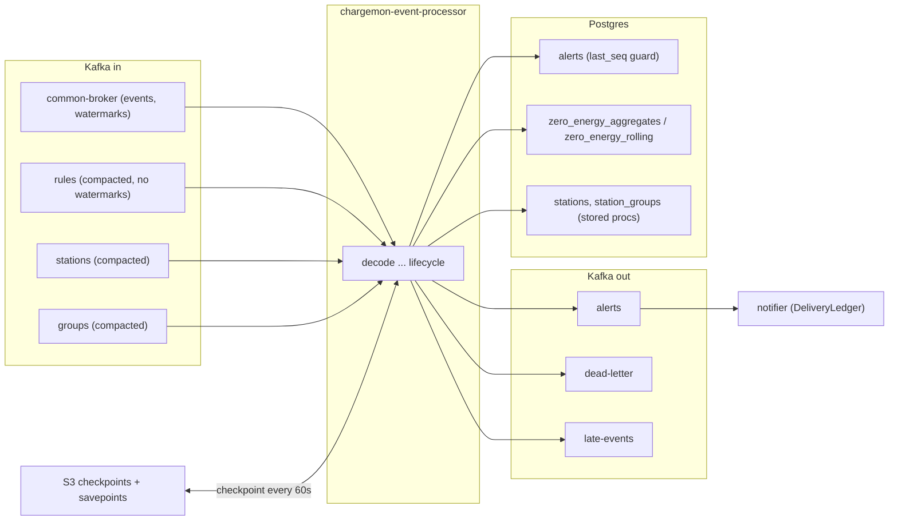
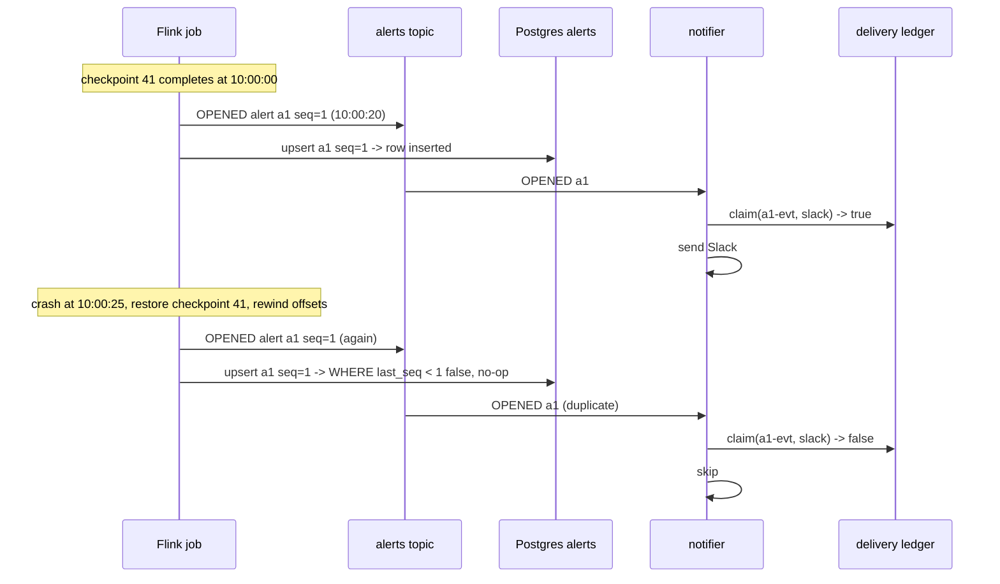
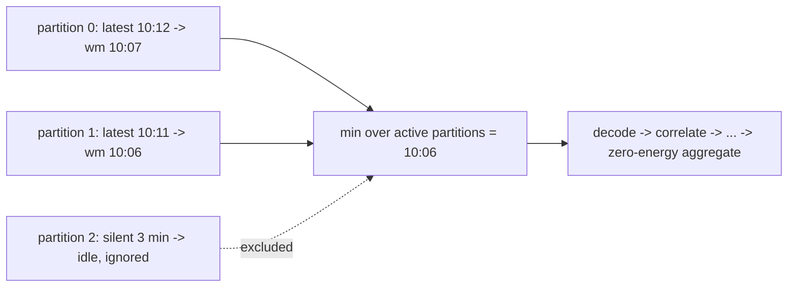

# 09. Event time, connectors, delivery

**Goal.** Connect the abstract ideas of chapters 05 and 07 to the edges of the job: where
timestamps and watermarks come from, how the Kafka source and the Kafka and JDBC sinks are
configured, what "at-least-once sink plus idempotent consumers" buys over transactional
exactly-once, and how the job is deployed, checkpointed to S3 and upgraded through savepoints.

**Prerequisites.** [Chapter 07](07-flink-state-timers-serialization.md) (checkpoints, state)
and [chapter 08](08-flink-broadcast-state-and-connected-streams.md) (control topics).

## Concepts (from scratch)

### Where an event timestamp comes from

Flink attaches a `long` timestamp to every record. A source can set it (Kafka's record
timestamp, for instance) and a `WatermarkStrategy` can override it with a
`TimestampAssigner` that extracts it from the payload. Downstream operators keep the input
record's timestamp on their outputs unless they say otherwise. Two things depend on it: the
watermark computation, and `ctx.timestamp()` inside process functions.

### WatermarkStrategy

A `WatermarkStrategy<T>` is built from a generator plus optional tweaks:

- `forMonotonousTimestamps()`: timestamps never go backwards; watermark = latest timestamp.
- `forBoundedOutOfOrderness(d)`: watermark = latest timestamp minus `d`.
- `.withTimestampAssigner(...)`: take the timestamp from the record instead of the source.
- `.withIdleness(d)`: a partition with no records for `d` stops holding the watermark back.
- `noWatermarks()`: the stream carries no event-time information at all.

The Kafka source applies the strategy **per partition** and forwards the minimum, which is why
idleness matters for topics with more partitions than active producers.

### Kafka source and sink, in delivery terms

`KafkaSource` reads partitions, tracks offsets in Flink state (checkpointed), and commits them
to Kafka only as a courtesy for monitoring. On restore the source rewinds to the checkpointed
offsets, so *reading* is exactly-once relative to state.

`KafkaSink` has three guarantees:

- `NONE`: fire and forget.
- `AT_LEAST_ONCE`: flush all pending writes before a checkpoint completes. A crash between a
  write and the next checkpoint replays the write.
- `EXACTLY_ONCE`: wrap writes in a Kafka transaction per checkpoint; commit the transaction when
  the checkpoint completes. Consumers with `isolation.level=read_committed` see records only
  after the commit, so end-to-end latency is at least the checkpoint interval, and Kafka must
  keep transactional state (`transaction.max.timeout.ms` above the checkpoint timeout).

### JDBC sink

Flink's `JdbcSink` batches prepared statements and flushes on size, interval or checkpoint.
There is an XA (two-phase commit) exactly-once mode, but the common pattern is at-least-once
with **idempotent statements**: an `INSERT ... ON CONFLICT DO UPDATE` that can be replayed any
number of times and leave the same row.

### Effectively-once

Combine three ingredients and the system as a whole behaves as if every alert was delivered
once, without transactions anywhere:

1. **Exactly-once state**: Flink checkpoints, so a replay reproduces the same alert with the
   same id and sequence number rather than a new one.
2. **At-least-once sinks**: duplicates are possible but every record is eventually written.
3. **Idempotent consumers**: every reader of the output can recognise a duplicate and drop it.

### Deployment vocabulary

- **Application mode**: the cluster is created for exactly one job; `main()` runs on the
  JobManager. This is what the Flink Kubernetes Operator's `FlinkDeployment` does and what
  `standalone-job` does in docker-compose.
- **Restart strategy**: what the JobManager does when a task fails. `exponential-delay` backs
  off between attempts; without a strategy a failed job stays failed.
- **High availability**: with `high-availability.type: kubernetes`, JobManager metadata (which
  checkpoint is latest) lives in a ConfigMap so a replaced JobManager pod can resume.
- **Savepoint upgrade**: stop with a savepoint, deploy the new image, start from the savepoint.
  With `upgradeMode: savepoint` the operator performs this on every spec change.

## In this repo

### Timestamps and watermarks for events

```java
WatermarkStrategy<KafkaRecord> wm = WatermarkStrategy
        .<KafkaRecord>forBoundedOutOfOrderness(cfg.maxOutOfOrderness())
        .withIdleness(cfg.sourceIdleness());
return env.fromSource(source, wm, "common-broker").uid("src-events");
```
(../flink-processor/src/main/java/com/chargemon/flink/source/KafkaSources.java:38)

There is **no `withTimestampAssigner`**, so the event timestamp is the **Kafka record
timestamp** (producer or broker time, depending on the topic's `message.timestamp.type`), not
the time inside the OCPP payload.
[`KafkaRecordDeserializer`](../flink-processor/src/main/java/com/chargemon/flink/source/KafkaRecordDeserializer.java)
copies `r.timestamp()` into `KafkaRecord.timestamp` for reference but does not assign it.
Defaults: `MAX_OUT_OF_ORDERNESS` 5 minutes, `SOURCE_IDLENESS` 1 minute
([`JobConfig`](../flink-processor/src/main/java/com/chargemon/flink/config/JobConfig.java)).

The deserializer never throws: bytes are passed downstream and malformed frames become dead
letters in `decode`, so one bad message cannot fail the source. The three compacted control
topics use `noWatermarks()` and `OffsetsInitializer.earliest()` with a per-topic consumer group
(`KAFKA_GROUP + "-rules"` and so on) because they must always be replayed in full.

In tests, [`ListSources`](../flink-processor/src/test/java/com/chargemon/flink/topology/ListSources.java)
uses `forMonotonousTimestamps().withTimestampAssigner((r, ts) -> r.timestamp())` where
`timestamp` is `System.currentTimeMillis()` at emission.

### Event-time timers and the LATE output in the aggregator

Only [`ZeroEnergyAggregator`](../flink-processor/src/main/java/com/chargemon/flink/aggregate/ZeroEnergyAggregator.java)
uses event time. The watermark it sees is derived from Kafka record timestamps of the frames
that produced the session; the hour a session belongs to is taken from `s.endedAt()` inside the
payload. A session whose hour is outside every window as of the watermark hour is diverted:

```java
if (!agg.accepts(eventHour, nowHour)) {
    late.inc();
    ctx.output(LATE, new LateSession(s.subject().subjectType(), s.subject().subjectId(), s.sessionId(),
            s.endedAt().toEpochMilli(), wm));
    return;
}
```
(../flink-processor/src/main/java/com/chargemon/flink/aggregate/ZeroEnergyAggregator.java:70)

After updating the bucket it calls `refresh`, which emits a snapshot if any window value changed
and registers an **event-time timer** at the next hour in which a value would change on its own
(a tumbling boundary, or the oldest rolling bucket dropping out). When the watermark passes that
hour, `onTimer` re-runs `refresh` so downstream rules can clear even if no new session arrives.
`ProductionSinks.lateSessions` writes `LateSession` records to the `late-events` topic.

### Sources and sinks as ports

[`Sources`](../flink-processor/src/main/java/com/chargemon/flink/source/Sources.java) and
[`Sinks`](../flink-processor/src/main/java/com/chargemon/flink/sink/Sinks.java) are interfaces
that `TopologyBuilder.build` receives. Production wires
[`KafkaSources`](../flink-processor/src/main/java/com/chargemon/flink/source/KafkaSources.java)
and [`ProductionSinks`](../flink-processor/src/main/java/com/chargemon/flink/sink/ProductionSinks.java);
tests wire `ListSources` and `CollectingSinks`. The topology never mentions Kafka or JDBC.

### Kafka sink: at-least-once by choice

```java
return KafkaSink.<T>builder()
        .setBootstrapServers(bootstrap)
        .setDeliveryGuarantee(DeliveryGuarantee.AT_LEAST_ONCE)
        .setRecordSerializer(KafkaRecordSerializationSchema.<T>builder()
                .setTopic(topic)
                .setKeySerializationSchema(new KeySchema<>(key))
                .setValueSerializationSchema(new JsonSchema<>())
                .build())
        .build();
```
(../flink-processor/src/main/java/com/chargemon/flink/sink/JsonKafkaSink.java:20)

[`JsonKafkaSink`](../flink-processor/src/main/java/com/chargemon/flink/sink/JsonKafkaSink.java)
is used for alerts (key `AlertEvent::alertKey`, so all events of one alert share a partition and
stay ordered), dead letters (key `sourceRef`) and late sessions (key `subjectId`). Switching to
`EXACTLY_ONCE` would require a `setTransactionalIdPrefix`, `read_committed` consumers, and would
make every alert wait for the next checkpoint (30 s locally, 60 s in Kubernetes) before the
notifier can see it. For alerting that latency is the wrong trade, so duplicates are accepted
and removed downstream.

### JDBC sinks: idempotent upserts

[`JdbcSinks`](../flink-processor/src/main/java/com/chargemon/flink/sink/JdbcSinks.java) builds
every sink with `buildAtLeastOnce`, batch size 500, batch interval 200 ms, 3 retries. The alert
upsert is guarded by the alert's sequence number:

```sql
ON CONFLICT (alert_id) DO UPDATE SET
    status = EXCLUDED.status, resolved_at = EXCLUDED.resolved_at, resolve_reason = EXCLUDED.resolve_reason,
    context = EXCLUDED.context, last_seq = EXCLUDED.last_seq, rule_version = EXCLUDED.rule_version,
    group_ids = EXCLUDED.group_ids, updated_at = now()
WHERE alerts.last_seq < EXCLUDED.last_seq
```
(../flink-processor/src/main/java/com/chargemon/flink/sink/JdbcSinks.java:25)

A replayed `OPENED` (seq 1) arriving after `RESOLVED` (seq 2) is a no-op; a duplicate of the
same seq is a no-op. Aggregate rows use `WHERE ... as_of <= EXCLUDED.as_of` the same way, split
into a `zero_energy_aggregates` table (tumbling windows, history kept) and `zero_energy_rolling`
(latest value per window). Station and group mirrors call the stored procedures
`upsert_station` / `upsert_group` with the record as JSON
([`V002__station_groups.sql`](../schema/src/main/resources/db/migration/V002__station_groups.sql)).

### The idempotent consumer: the notifier ledger

The notifier claims each `(alertEventId, channel)` pair before sending:

```java
/** Claims the delivery; false when it was already delivered (duplicate Kafka record). */
boolean claim(String alertEventId, ChannelRef channel);
```
(../notifier/src/main/java/com/chargemon/notifier/ledger/DeliveryLedger.java:9)

A replayed alert event has the same id, so the second claim returns `false` and no second Slack
message goes out. [Chapter 19](19-notifier-spring-boot.md) covers the implementation.

### Deployment

**docker-compose** ([`deploy/docker-compose.yml`](../deploy/docker-compose.yml)): the
`jobmanager` container runs `standalone-job --job-classname com.chargemon.flink.JobMain` with
`PARALLELISM=2`, RocksDB, checkpoints in `file:///tmp/flink-checkpoints` (lost with the
container) and a 30 s interval; one `taskmanager` with 4 slots.

**Kubernetes** ([`deploy/k8s/flink-deployment.yaml`](../deploy/k8s/flink-deployment.yaml)):

```yaml
state.backend.type: rocksdb
state.backend.incremental: "true"
state.checkpoints.dir: s3://chargemon-flink/checkpoints
state.savepoints.dir: s3://chargemon-flink/savepoints
execution.checkpointing.interval: 60s
execution.checkpointing.min-pause: 30s
execution.checkpointing.unaligned: "true"
high-availability.type: kubernetes
high-availability.storageDir: s3://chargemon-flink/ha
restart-strategy.type: exponential-delay
```
(../deploy/k8s/flink-deployment.yaml:11)

Plus `pipeline.generic-types: "false"` (belt and braces with `JobMain.baseConfig`), 8
TaskManagers of 4 slots, job parallelism 32, `upgradeMode: savepoint`, Prometheus metrics on
9249, and Kafka/DB settings from a Secret. Note that `PARALLELISM` in the environment overrides
the operator's `parallelism` if set, because `JobMain.configure` calls `env.setParallelism`.

**Savepoint upgrade by hand** (what the operator automates): trigger
`POST /jobs/<jobId>/savepoints` with body `{"target-directory": "s3://.../savepoints", "cancel-job": true}`,
poll `GET /jobs/<jobId>/savepoints/<triggerId>` until `status.id` is `COMPLETED` and read the
path, deploy the new jar, start it with `--fromSavepoint <path>`. Every stateful operator keeps
its `uid`, so state maps one to one.

## Diagrams

### Sources and sinks around the job



### A duplicate alert after restart, absorbed downstream



### Watermark per partition with idleness



## Hands-on exercises

### 1. Kill a TaskManager mid-run

**What to do.** Start the stack, load sample rules, run the event generator with
`--profiles normal,heartbeat-drop --speedup 10` for a minute, then
`docker compose -f deploy/docker-compose.yml kill taskmanager` followed by
`docker compose -f deploy/docker-compose.yml up -d taskmanager`. Watch the Flink UI
(http://localhost:8081) and the `alerts` topic in Kafka UI (http://localhost:8090).

**What you should observe.** The job goes to RESTARTING, then RUNNING from the last checkpoint
(the UI's Checkpoints tab shows which). Some alerts already in the topic appear a second time
with the same `alertId` and `seq`; `select alert_id, last_seq, count(*) from alerts group by 1,2`
still shows one row per alert, and `notification_deliveries` shows one delivery per event and
channel.

**Hint.** Checkpoints are under `/tmp/flink-checkpoints` *inside* the jobmanager container, so
`kill` the taskmanager, not the jobmanager, or the checkpoint directory disappears too.

### 2. Sketch the exactly-once sink switch

**What to do.** In `JsonKafkaSink.build`, write (do not commit) the changes for
`DeliveryGuarantee.EXACTLY_ONCE`: add `.setTransactionalIdPrefix("chargemon-" + topic)` and
`.setKafkaProducerConfig(props)` with `transaction.timeout.ms` below the broker's
`transaction.max.timeout.ms`. Then list what would have to change outside the job.

**What you should observe.** The notifier would need `isolation.level=read_committed`
(otherwise it still sees uncommitted duplicates), every alert would become visible only after
the next checkpoint (up to `CHECKPOINT_INTERVAL` plus checkpoint duration), and a checkpoint
failure would delay alerts further. The notifier ledger would still be needed for its own
retries. Revert the change.

**Hint.** The Flink Kafka connector docs list the transactional requirements under "Fault
Tolerance" for `KafkaSink`.

### 3. Take a savepoint via REST and restore from it

**What to do.** With the job running in docker-compose, find the job id with
`curl -s localhost:8081/jobs`, then
`curl -s -X POST localhost:8081/jobs/<id>/savepoints -H 'Content-Type: application/json' -d '{"target-directory":"file:///tmp/flink-savepoints","cancel-job":true}'`.
Poll `curl -s localhost:8081/jobs/<id>/savepoints/<request-id>` until `COMPLETED` and note the
path. Copy the savepoint out of the container, then restart the jobmanager with the
`standalone-job` command extended by `--fromSavepoint <path>` (edit the compose `command`
temporarily).

**What you should observe.** After restore, open alerts continue their lifecycle (a suppression
window that was running still ends at the original deadline) and pending CALLs still time out.
Rename one `.uid(...)` in `TopologyBuilder` and try again: the restore fails with a message
about state that cannot be mapped to an operator.

**Hint.** The savepoint path must be reachable by the restarted jobmanager; mount a host
directory or `docker cp` it back in. Revert the compose change and the uid afterwards.

## Self-check

1. Where does the event timestamp of a `KafkaRecord` come from in production, and what would
   change if `withTimestampAssigner` used the OCPP envelope time instead?
2. Why do the control topics use `noWatermarks()`?
3. Give the three ingredients of "effectively once" in chargemon and the file where each lives.
4. Why is the alerts Kafka sink at-least-once rather than exactly-once?
5. What must stay constant between two versions of the job for a savepoint restore to work?

<details><summary>Answers</summary>

1. From the Kafka record timestamp, because `KafkaSources.events` has no timestamp assigner.
   Using the envelope time would make watermarks follow station clocks (which can be wrong or
   far behind), so out-of-orderness and lateness would reflect device clocks, and the aggregator's
   `nowHour` would track the stations' notion of time.
2. Rules, stations and groups are reference data, not events in time. With `noWatermarks()`
   they neither advance nor hold back the event-time clock of the operators they join, which
   matters because a broadcast input with a stale watermark would freeze event-time timers.
3. Exactly-once state: `JobMain.configure` (`enableCheckpointing(..., EXACTLY_ONCE)`).
   At-least-once sinks: `JsonKafkaSink` (`DeliveryGuarantee.AT_LEAST_ONCE`) and
   `JdbcSinks.sink` (`buildAtLeastOnce`). Idempotent consumers: `JdbcSinks.ALERT_UPSERT`
   (`WHERE alerts.last_seq < EXCLUDED.last_seq`) and the notifier's `DeliveryLedger.claim`.
4. Exactly-once holds each alert inside a Kafka transaction until the next checkpoint
   completes, adding up to the checkpoint interval (30-60 s) of latency to every notification.
   Duplicates are cheap to drop downstream, so the lower latency wins.
5. Every stateful operator's `uid` and the class names of the types stored in state
   (`JsonSerializerSnapshot` checks the class name). Fields may be added or removed; renames
   need a migration.

</details>

## Glossary terms

- [watermark](glossary.md#watermark)
- [event time](glossary.md#event-time)
- [processing time](glossary.md#processing-time)
- [offset](glossary.md#offset)
- [consumer group](glossary.md#consumer-group)
- [at-least-once](glossary.md#at-least-once)
- [exactly-once](glossary.md#exactly-once)
- [checkpoint](glossary.md#checkpoint)
- [savepoint](glossary.md#savepoint)
- [RocksDB](glossary.md#rocksdb)
- [dead-letter topic](glossary.md#dead-letter-topic)
- [delivery ledger](glossary.md#delivery-ledger)
- [aggregate snapshot](glossary.md#aggregate-snapshot)
- [zero-energy session](glossary.md#zero-energy-session)
- [parallelism](glossary.md#parallelism)

## Further reading

- Generating watermarks (strategies, idleness, per-partition) —
  <https://nightlies.apache.org/flink/flink-docs-release-1.20/docs/dev/datastream/event-time/generating_watermarks/>
- Kafka connector (source offsets, sink delivery guarantees) —
  <https://nightlies.apache.org/flink/flink-docs-release-1.20/docs/connectors/datastream/kafka/>
- JDBC connector —
  <https://nightlies.apache.org/flink/flink-docs-release-1.20/docs/connectors/datastream/jdbc/>
- Native Kubernetes deployment —
  <https://nightlies.apache.org/flink/flink-docs-release-1.20/docs/deployment/resource-providers/native_kubernetes/>
- Configuration reference (checkpointing, restart strategies, HA) —
  <https://nightlies.apache.org/flink/flink-docs-release-1.20/docs/deployment/config/>
- REST API (savepoint trigger and status) —
  <https://nightlies.apache.org/flink/flink-docs-release-1.20/docs/ops/rest_api/>
- Flink Kubernetes Operator —
  <https://nightlies.apache.org/flink/flink-kubernetes-operator-docs-main/>
