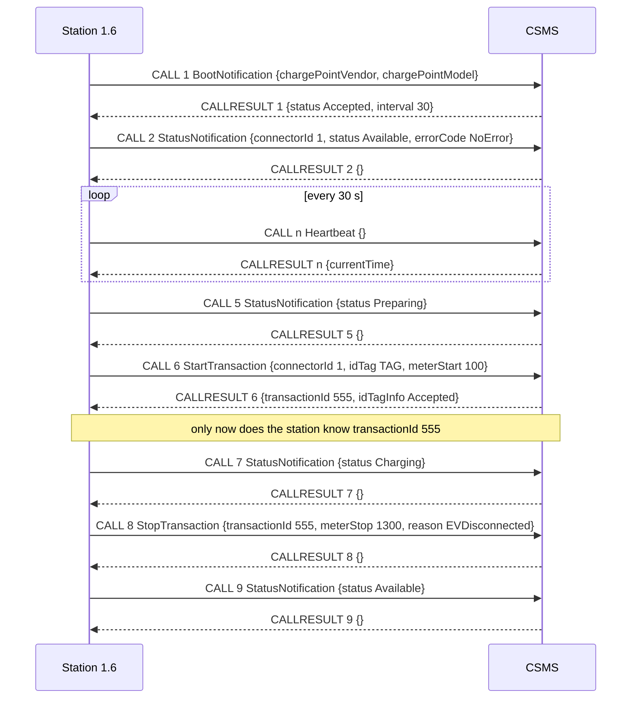
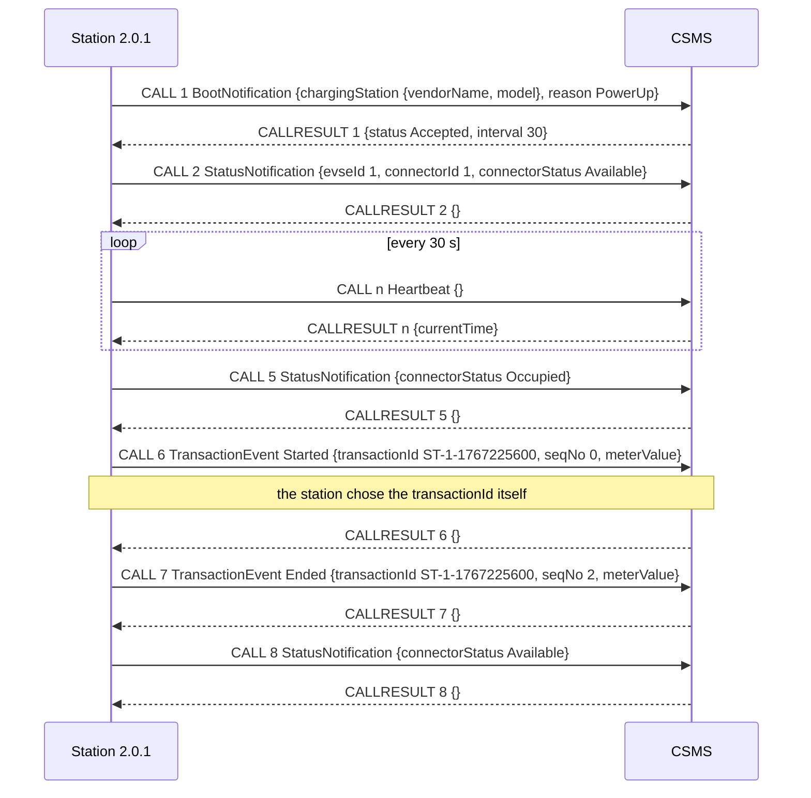
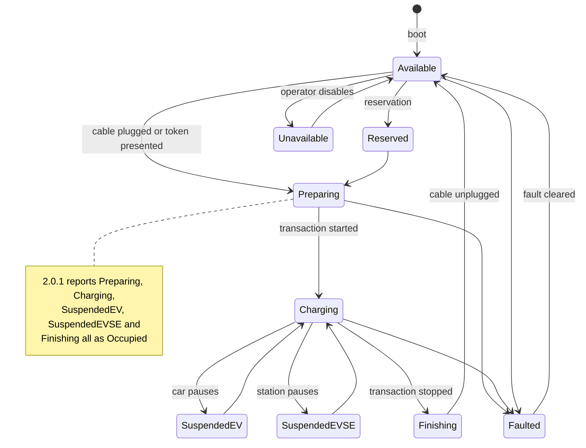
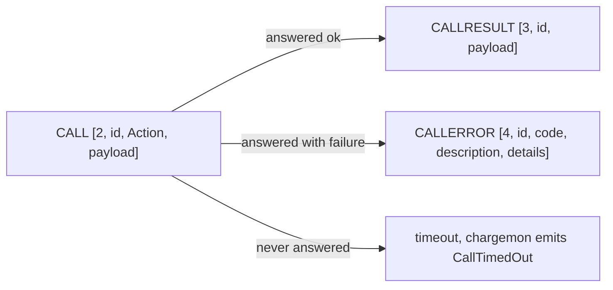

# 10. OCPP protocol primer

**Goal.** After this chapter you can read any OCPP-J frame that flows through chargemon and say
what it means: who sent it, whether it is a request, a response or an error, which action it
carries, and what a healthy or a broken station looks like on the wire. You will also know the
vocabulary of EV charging well enough to follow the rest of Track B without looking things up.

**Prerequisites.** None. If you want to run the exercises against the live stack, do
[chapter 01](01-getting-started.md) first. [Chapter 02](02-java-21-for-this-repo.md) is only
needed for the last exercise (reading one Java test fixture).

## Concepts (from scratch)

### The actors: who talks to whom

- **Charging station** (OCPP 2.0.1 name) or **charge point** (OCPP 1.6 name): the physical box on
  the wall or in the parking lot. It has a small computer, one or more cables, and a network
  connection. In this repo it is always called a *station* and identified by a `stationId` such as
  `ST-1`.
- **CSMS**: Charging Station Management System. This is the backend, the server the stations talk
  to. OCPP 1.6 calls it the *central system*. chargemon is not a CSMS; it sits next to one and
  watches the traffic.
- **EVSE**: Electric Vehicle Supply Equipment. In 2.0.1 a station is split into EVSEs, and each
  EVSE is one power outlet unit that can charge one car at a time. Numbered from 1.
- **Connector**: the actual socket or cable. In 1.6 connectors are numbered per station (1, 2, 3).
  In 2.0.1 they are numbered per EVSE (EVSE 1 connector 1, EVSE 2 connector 1). Connector `0` in
  1.6 means "the whole station".
- **Transaction** (also called a *session*): one charging session, from the moment a user is
  allowed to charge to the moment the cable is unplugged. It has a `transactionId`.
- **Meter values**: energy readings from the station's electricity meter. The unit that matters is
  **Wh** (watt-hours). A car that charged 10 kWh moved the meter by 10 000 Wh. The reading is a
  *register*: it only goes up, so "energy delivered" = meter at stop minus meter at start.
- **idTag** (1.6) or **idToken** (2.0.1): the identifier of the user, usually an RFID card or an
  app token. The station asks the CSMS "may this token charge?" before it starts.

### The transport: one WebSocket per station

OCPP-J is OCPP carried as JSON text over a **WebSocket**. A WebSocket is a long-lived two-way
connection that starts as an HTTP request and then stays open. The *station* opens it (the CSMS
never dials out to a station, because stations sit behind firewalls and mobile networks). Once the
socket is open, **both sides** can send messages at any time. That last point is why the codec in
[chapter 12](12-ocpp-codec-parsing-mapping-correlation.md) has to track direction carefully.

chargemon does not hold any WebSockets. Something upstream (the CSMS or a gateway) copies every
message it sends or receives to a Kafka topic, wrapped in a small JSON *envelope* that says which
station, which version, which direction, and when. Chapter 12 explains the envelope; this chapter
is about what is inside it.

### The framing: three shapes of JSON array

OCPP-J is a tiny RPC (remote procedure call) protocol. Every message is a JSON array whose first
element is a number that says which of three shapes it is.

| Shape | Array | Meaning |
|---|---|---|
| **CALL** | `[2, "<messageId>", "<Action>", {payload}]` | A request. "Please do `Action` with this payload." |
| **CALLRESULT** | `[3, "<messageId>", {payload}]` | The successful answer to a CALL. |
| **CALLERROR** | `[4, "<messageId>", "<ErrorCode>", "<description>", {details}]` | The failed answer to a CALL. |

The **message id** (spec name `MessageId`, this repo calls it `uniqueId`) is a string chosen by the
sender of the CALL. The answer carries the same id back. That is the only link between a request
and its response: a CALLRESULT does not repeat the action name. So if you see
`[3,"7",{"transactionId":555,"idTagInfo":{"status":"Accepted"}}]` on its own, you cannot know what it
answers unless you remember that `[2,"7","StartTransaction",…]` went out earlier. Joining the two
halves is called **correlation**, and it is the job of the `CallCorrelator` in chapter 12.

Two consequences worth remembering:

1. Message ids are unique **per sender**, not globally. The station may send CALL `"7"` while the
   CSMS also sends its own CALL `"7"`. They are different requests.
2. A CALL may go unanswered. The spec says the sender should wait and then give up. chargemon
   treats "no answer within the correlation timeout" as an event of its own (`CallTimedOut`).

### Direction: station-initiated vs CSMS-initiated

Most traffic is **station → CSMS** (OCPP 1.6 §4 "charge point initiated operations"): the station
reports that it booted, that a connector changed status, that a session started. The CSMS answers
each one with a CALLRESULT. The reverse direction, **CSMS → station** (1.6 §5 "central system
initiated operations"), carries commands such as `Reset`, `RemoteStartTransaction`, `ChangeConfiguration`.
chargemon decodes both directions but only has dedicated mappers for the station-initiated actions
that matter for monitoring; every other action still becomes a generic event (chapter 11).

### The actions this project understands

Each row: what the station is saying in plain English, then a payload example. Payloads are the
fourth element of a CALL. Where 1.6 and 2.0.1 differ, both are shown.

**BootNotification** — "I just powered up. Here is who I am." Sent once after start-up, before
anything else. The CSMS answers with a *registration status* and a heartbeat interval.

```json
// 1.6 CALL payload
{"chargePointVendor":"ACME","chargePointModel":"X1","firmwareVersion":"1.0.0"}
// 2.0.1 CALL payload
{"chargingStation":{"vendorName":"ACME","model":"X1","firmwareVersion":"1.0.0"},"reason":"PowerUp"}
// CALLRESULT payload, same shape in both versions
{"status":"Accepted","interval":30,"currentTime":"2026-01-01T00:00:00Z"}
```

**Heartbeat** — "I am still alive." Empty payload. The CSMS answers with its current time. The
interval comes from the boot response (30 s above). A station that stops sending heartbeats is
the classic "station offline" signal.

```json
[2,"42","Heartbeat",{}]
[3,"42",{"currentTime":"2026-01-01T00:00:30Z"}]
```

**StatusNotification** — "Connector N is now in state S." In 1.6 the payload also carries an
`errorCode` (`NoError`, `GroundFailure`, `OverCurrentFailure`, …). In 2.0.1 there is no error code;
faults are reported separately through `NotifyEvent`.

```json
// 1.6
{"connectorId":1,"status":"Faulted","errorCode":"GroundFailure","timestamp":"2026-01-01T00:00:00Z"}
// 2.0.1
{"evseId":1,"connectorId":1,"connectorStatus":"Occupied","timestamp":"2026-01-01T00:00:00Z"}
```

**StartTransaction (1.6 only)** — "User with idTag T plugged in at connector N; the meter reads
M Wh." Note what is *missing*: the transaction id. In 1.6 the **CSMS** assigns the id and returns
it in the CALLRESULT. Until that answer arrives the station does not know its own transaction id.

```json
[2,"10","StartTransaction",{"connectorId":1,"idTag":"TAG","meterStart":100,"timestamp":"2026-01-01T00:00:00Z"}]
[3,"10",{"transactionId":555,"idTagInfo":{"status":"Accepted"}}]
```

**StopTransaction (1.6 only)** — "Transaction 555 ended; the meter reads M Wh; reason R." May
carry `transactionData`, a list of meter readings taken during the session.

```json
{"transactionId":555,"meterStop":1300,"reason":"EVDisconnected","timestamp":"2026-01-01T00:02:00Z"}
```

**TransactionEvent (2.0.1 only)** — one message type for the whole session life, with
`eventType` = `Started`, `Updated` or `Ended`. The **station** picks the `transactionId` (a string)
and puts it in every event, so no correlation is needed to learn it. Meter readings ride along in
`meterValue`.

```json
{"eventType":"Started","seqNo":0,"timestamp":"2026-01-01T00:00:00Z","triggerReason":"Authorized",
 "transactionInfo":{"transactionId":"ST-1-1767225600"},"evse":{"id":1,"connectorId":1},
 "meterValue":[{"timestamp":"2026-01-01T00:00:00Z",
   "sampledValue":[{"value":100,"measurand":"Energy.Active.Import.Register","unitOfMeasure":{"unit":"Wh"}}]}]}
```

`Ended` looks the same with `"eventType":"Ended"`, a higher `seqNo`, a `stoppedReason` inside
`transactionInfo`, and the final meter reading.

**MeterValues** — "Here are periodic meter samples." In 1.6 keyed by `connectorId` and optionally
`transactionId`; in 2.0.1 keyed by `evseId`. The inner shape is nearly identical, except that 1.6
writes the value as a string with a flat `unit`, while 2.0.1 writes a number with a nested
`unitOfMeasure`.

```json
// 1.6
{"connectorId":1,"transactionId":555,"meterValue":[{"timestamp":"2026-01-01T00:01:00Z",
  "sampledValue":[{"value":"700","measurand":"Energy.Active.Import.Register","unit":"Wh"}]}]}
// 2.0.1
{"evseId":1,"meterValue":[{"timestamp":"2026-01-01T00:01:00Z",
  "sampledValue":[{"value":700,"measurand":"Energy.Active.Import.Register","unitOfMeasure":{"unit":"Wh"}}]}]}
```

A `sampledValue` without a `measurand` means `Energy.Active.Import.Register` by spec default.

**Authorize** — "May this token charge?" The CSMS answers Accepted, Blocked, Expired, Invalid, …

```json
// 1.6
[2,"3","Authorize",{"idTag":"TAG"}]          →  [3,"3",{"idTagInfo":{"status":"Accepted"}}]
// 2.0.1
[2,"3","Authorize",{"idToken":{"idToken":"TAG","type":"ISO14443"}}]  →  [3,"3",{"idTokenInfo":{"status":"Accepted"}}]
```

**NotifyEvent (2.0.1 only)** — "Something in my device model changed or went wrong." This is how
2.0.1 reports faults and monitored variable changes. Each entry names a *component* (for example
`ChargingStation` or an EVSE) and a *variable* (for example `Problem`).

```json
{"generatedAt":"2026-01-01T00:00:00Z","seqNo":0,"tbc":false,"eventData":[
  {"eventId":1,"timestamp":"2026-01-01T00:00:00Z","trigger":"Alerting","actualValue":"true",
   "eventNotificationType":"HardWiredNotification",
   "component":{"name":"ChargingStation","evse":{"id":1}},"variable":{"name":"Problem"},
   "techCode":"E42","techInfo":"ground fault","cleared":false}]}
```

**SecurityEventNotification (2.0.1 mapper only)** — "A security-relevant thing happened", for
example `FirmwareMismatch`, `InvalidFirmwareSignature`, `SettingSystemTime`.

```json
{"type":"FirmwareMismatch","timestamp":"2026-01-01T00:00:00Z","techInfo":"expected 1.0.1"}
```

### Connector status vocabulary: 1.6 vs 2.0.1

The two versions describe a connector's state with different word lists.

| OCPP 1.6 `ChargePointStatus` (§7) | OCPP 2.0.1 `ConnectorStatusEnumType` (Part 2 §E) |
|---|---|
| Available | Available |
| Preparing, Charging, SuspendedEVSE, SuspendedEV, Finishing | **Occupied** (one word for all five) |
| Reserved | Reserved |
| Unavailable | Unavailable |
| Faulted | Faulted |

2.0.1 collapsed the five "something is plugged in" states into `Occupied` and moved the finer
detail into `TransactionEvent.transactionInfo.chargingState`. chargemon keeps one enum,
`ConnectorStatus`, that is the **union** of both lists plus `UNKNOWN`. A rule that says
`event.status in [CHARGING, OCCUPIED]` therefore works for both fleets. The exact wire word is
still kept in `rawStatus` for rules that care.

### Registration status and heartbeat interval

The `BootNotification` answer has three possible `status` values:

- `Accepted`: the station may operate; start heartbeats every `interval` seconds.
- `Pending`: the CSMS wants to configure the station first; keep retrying the boot.
- `Rejected`: go away; retry after `interval` seconds.

A rejected boot is a monitoring signal in itself (wrong credentials, unknown station, blocked
firmware). chargemon adds `UNKNOWN` for values it cannot parse.

### Failure signatures this project monitors

The event generator ([chapter 20](20-deploy-generator-testing-extending.md)) has one profile per
signature so you can see each one on a fresh stack.

| Signature | What the wire shows | Generator profile |
|---|---|---|
| Heartbeat drop | heartbeats arrive every 30 s, then stop for good | `heartbeat-drop` (stops 90 s after boot) |
| Stuck Preparing | `StatusNotification Preparing` and then nothing, no transaction ever starts | `stuck-preparing` |
| Zero-energy session | a full session whose `meterStop - meterStart` is 0 Wh | `zero-energy` |
| Boot rejected | `BootNotification` answered with `"status":"Rejected"` | `boot-rejected` |
| Call errors | a CALL answered with CALLERROR, repeatedly | `call-error` (`NotifyChargingLimit` → `InternalError` every 60 s) |

## In this repo

Everything above is protocol knowledge, but a few pieces of code encode it directly and are worth
seeing once now. All paths are relative to `docs/`.

**Frame shapes** are the enum `MessageType`
([../ocpp-model/src/main/java/com/chargemon/ocpp/model/MessageType.java](../ocpp-model/src/main/java/com/chargemon/ocpp/model/MessageType.java)):

```java
public enum MessageType {
    CALL(2),
    CALLRESULT(3),
    CALLERROR(4);
```
(`MessageType.java:4`)

**Direction** is the enum `Direction` with a tolerant parser and the `opposite()` method that
correlation depends on
([../ocpp-model/src/main/java/com/chargemon/ocpp/model/Direction.java](../ocpp-model/src/main/java/com/chargemon/ocpp/model/Direction.java)).

**The status union** is `ConnectorStatus`
([../ocpp-model/src/main/java/com/chargemon/ocpp/model/ConnectorStatus.java](../ocpp-model/src/main/java/com/chargemon/ocpp/model/ConnectorStatus.java)):

```java
/** Union of OCPP 1.6 ChargePointStatus and 2.0.1 ConnectorStatusEnumType. */
public enum ConnectorStatus {
    AVAILABLE, PREPARING, CHARGING, SUSPENDED_EVSE, SUSPENDED_EV, FINISHING, RESERVED, UNAVAILABLE, FAULTED,
    OCCUPIED, UNKNOWN;
```
(`ConnectorStatus.java:5`)

**Registration status** is
[../ocpp-model/src/main/java/com/chargemon/ocpp/model/RegistrationStatus.java](../ocpp-model/src/main/java/com/chargemon/ocpp/model/RegistrationStatus.java)
(`ACCEPTED, PENDING, REJECTED, UNKNOWN`).

**Real frames as Java** live in the test fixture
[../ocpp-codec/src/testFixtures/java/com/chargemon/ocpp/codec/fixtures/Frames.java](../ocpp-codec/src/testFixtures/java/com/chargemon/ocpp/codec/fixtures/Frames.java).
Its three builders are exactly the three shapes:

```java
public static ArrayNode call(String uniqueId, String action, JsonNode payload) {
    ArrayNode a = JSON.createArrayNode();
    a.add(2).add(uniqueId).add(action).add(payload);
    return a;
}
```
(`Frames.java:22`)

with `callResult` adding `3, uniqueId, payload` and `callError` adding
`4, uniqueId, code, description, {}`.

**A healthy station's life** is scripted in
[../event-generator/src/main/java/com/chargemon/generator/scenario/NormalScenario.java](../event-generator/src/main/java/com/chargemon/generator/scenario/NormalScenario.java):
boot (BootNotification + result with `interval` 30, then StatusNotification `Available`), a
Heartbeat every 30 s, and every few minutes a session: `Preparing` → StartTransaction or
TransactionEvent `Started` → `Charging` → two minutes later StopTransaction or TransactionEvent
`Ended` → `Available`. The 2.0.1 branch translates the status words:

```java
static com.fasterxml.jackson.databind.node.ObjectNode status(StationSim s, String status, Instant at) {
    if (s.version() == OcppVersion.V16) {
        return Frames.status16(1, status, "NoError", at);
    }
    return Frames.status201(1, 1, status.equals("Charging") || status.equals("Preparing") ? "Occupied" : status, at);
}
```
(`NormalScenario.java:138`)

The fault profiles are small subclasses in
[../event-generator/src/main/java/com/chargemon/generator/scenario/Scenarios.java](../event-generator/src/main/java/com/chargemon/generator/scenario/Scenarios.java).
The generator emits **both** directions (station CALLs and CSMS CALLRESULTs) through
[Emit.java](../event-generator/src/main/java/com/chargemon/generator/scenario/Emit.java), which is
why the correlator gets to see complete exchanges even without a real CSMS.

## Diagrams

### An OCPP 1.6 station's day



### The same day for an OCPP 2.0.1 station



Compare the two: same skeleton, but 1.6 needs the CSMS's answer to learn the transaction id, and
2.0.1 says `Occupied` where 1.6 says `Preparing` or `Charging`.

### Connector status transitions



The "stuck Preparing" signature is a station that enters `Preparing` and never takes the
`Preparing → Charging` edge.

### The three frame shapes



## Hands-on exercises

### Exercise 1: hand-write a Heartbeat exchange, including a failure

**What to do.** In a scratch file, write by hand the three frames for this story: station `ST-1`
sends a Heartbeat with message id `"42"`; the CSMS answers with its current time. Then write a
second Heartbeat with id `"43"` and answer it with a CALLERROR whose code is `InternalError` and
whose description is `"clock unavailable"`. Finally wrap the first CALL in the envelope format used
on the `common-broker` topic:

```
key:   ST-1
value: {"ocppVersion":"2.0.1","direction":"STATION_TO_CSMS",
        "receivedAt":"2026-01-01T00:00:00Z","message":[2,"42","Heartbeat",{}]}
```

The station id is the Kafka record *key*, not a body field (chapter 04).

**What you should observe.** The CALLRESULT and CALLERROR carry no action name; only the id
`"42"` / `"43"` ties them to the request. The CALLERROR has five elements, the CALLRESULT three.
The envelope for the CSMS answer must say `"direction":"CSMS_TO_STATION"`, otherwise the correlator
looks the pending call up under the wrong key (chapter 12).

**Hint.** Check your shapes against `Frames.call`, `Frames.callResult` and `Frames.callError` in
[Frames.java](../ocpp-codec/src/testFixtures/java/com/chargemon/ocpp/codec/fixtures/Frames.java).
If you have the stack running, paste your envelope into Kafka UI (http://localhost:8090, topic
`common-broker`, "Produce message") and watch it appear in the Flink job's decode stage.

### Exercise 2: translate a 2.0.1 TransactionEvent(Started) into 1.6

**What to do.** Take the `TransactionEvent` `Started` example from the "actions" section above.
Write the OCPP 1.6 messages that carry the same information. There will be more than one 1.6
message, and one of them must come from the CSMS.

**What you should observe.** You need a `StartTransaction` CALL (`connectorId` from `evse.connectorId`,
`idTag` from `idToken.idToken`, `meterStart` from the energy sampled value, `timestamp`) **and** its
CALLRESULT to carry the transaction id, because in 1.6 the CSMS assigns it. The 2.0.1 string id
`"ST-1-1767225600"` cannot be used as-is: 1.6 transaction ids are integers. `triggerReason`,
`seqNo` and `offline` have no 1.6 equivalent and are lost. `chargingState` maps onto the 1.6
`StatusNotification` vocabulary (`Charging`, `SuspendedEV`, …) instead.

**Hint.** The 1.6 mappers in
[../ocpp-codec/src/main/java/com/chargemon/ocpp/codec/mapper/v16/](../ocpp-codec/src/main/java/com/chargemon/ocpp/codec/mapper/v16/)
list exactly which 1.6 fields chargemon reads; `StartTransactionMapper16.java` and
`SessionStartedMapper16.java` are the two halves.

### Exercise 3: label every fixture in Frames.java

**What to do.** Open
[Frames.java](../ocpp-codec/src/testFixtures/java/com/chargemon/ocpp/codec/fixtures/Frames.java)
and for each canned payload method (`heartbeat`, `boot16`, `boot201`, `bootResponse`, `status16`,
`status201`, `startTx16`, `startTxResponse16`, `stopTx16`, `sampledEnergy`, `txEvent201`,
`authorize16`, `authorizeResponse16`, `securityEvent201`) write down: which frame shape it belongs
in (CALL payload or CALLRESULT payload), which direction it travels, which OCPP version(s) it is
valid for, and which action it belongs to.

**What you should observe.** Three of them are CALLRESULT payloads (`bootResponse`,
`startTxResponse16`, `authorizeResponse16`) and therefore travel CSMS → station. `bootResponse` is
valid for both versions; every other method is version-specific. `sampledEnergy` is not a whole
payload but one element of a `meterValue` list (1.6 shape: value as string, flat `unit`).

**Hint.** The tests that use each fixture tell you the action:
[MapperRegistryTest.java](../ocpp-codec/src/test/java/com/chargemon/ocpp/codec/mapper/MapperRegistryTest.java)
and
[CallCorrelatorTest.java](../ocpp-codec/src/test/java/com/chargemon/ocpp/codec/correlate/CallCorrelatorTest.java).

## Self-check

1. A frame starts with `3`. What do you know about it, and what do you *not* know from the frame alone?
2. Why can the same message id `"7"` legitimately appear twice on one WebSocket?
3. In 1.6, where does the transaction id come from? In 2.0.1?
4. Which 1.6 connector states become `Occupied` in 2.0.1, and where did the lost detail go?
5. Name the five failure signatures and the generator profile that produces each.

<details><summary>Answers</summary>

1. It is a CALLRESULT: a successful answer to some earlier CALL with the same message id. You do
   not know which action it answers, nor which direction it travels, unless you remember the CALL
   (or read the envelope's `direction`).
2. Ids are unique per sender. The station numbers its own CALLs; the CSMS numbers its own. Both
   may pick `"7"`. That is why chargemon keys pending calls by `direction|uniqueId`.
3. 1.6: the CSMS assigns it and returns it in the StartTransaction CALLRESULT. 2.0.1: the station
   generates it and includes it in every TransactionEvent.
4. Preparing, Charging, SuspendedEVSE, SuspendedEV, Finishing. The detail moved to
   `TransactionEvent.transactionInfo.chargingState`.
5. Heartbeat drop (`heartbeat-drop`), stuck Preparing (`stuck-preparing`), zero-energy session
   (`zero-energy`), boot rejected (`boot-rejected`), call errors (`call-error`).

</details>

## Glossary terms

- [action](glossary.md#action)
- [Authorize](glossary.md#authorize)
- [BootNotification](glossary.md#bootnotification)
- [CALL](glossary.md#call)
- [CALLERROR](glossary.md#callerror)
- [CALLRESULT](glossary.md#callresult)
- [charge point](glossary.md#charge-point)
- [connector](glossary.md#connector)
- [connector status](glossary.md#connector-status)
- [CSMS](glossary.md#csms)
- [EVSE](glossary.md#evse)
- [Heartbeat](glossary.md#heartbeat)
- [idTag / idToken](glossary.md#idtag--idtoken)
- [measurand](glossary.md#measurand)
- [message id](glossary.md#message-id)
- [MeterValues](glossary.md#metervalues)
- [OCPP-J](glossary.md#ocpp-j)
- [registration status](glossary.md#registration-status)
- [StatusNotification](glossary.md#statusnotification)
- [transaction](glossary.md#transaction)
- [TransactionEvent](glossary.md#transactionevent)
- [envelope](glossary.md#envelope)
- [zero-energy session](glossary.md#zero-energy-session)

## Further reading

- OCPP specifications, free download from the Open Charge Alliance:
  <https://openchargealliance.org/protocols/open-charge-point-protocol/>
  - OCPP-J 1.6 §4 "RPC framework": the three frame shapes, message ids, error codes.
  - OCPP 1.6 §4 "Charge point initiated operations": BootNotification, Heartbeat,
    StatusNotification, StartTransaction, StopTransaction, MeterValues, Authorize.
  - OCPP 1.6 §7 "Types": `ChargePointStatus`, `ChargePointErrorCode`, `RegistrationStatus`,
    `Measurand`.
  - OCPP 2.0.1 Part 2 §E "Availability": StatusNotification and `ConnectorStatusEnumType`.
  - OCPP 2.0.1 Part 2 §G "Transactions": TransactionEvent, `TransactionEventEnumType`,
    `ChargingStateEnumType`.
  - OCPP 2.0.1 Part 4 §4 "JSON RPC framework": the 2.0.1 framing (same array shapes).
- Next: [chapter 11](11-canonical-ocpp-model.md) shows how chargemon flattens the 1.6/2.0.1
  differences into one event vocabulary.
