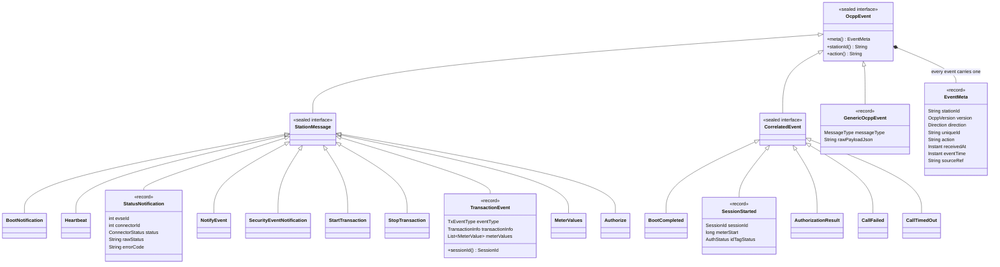
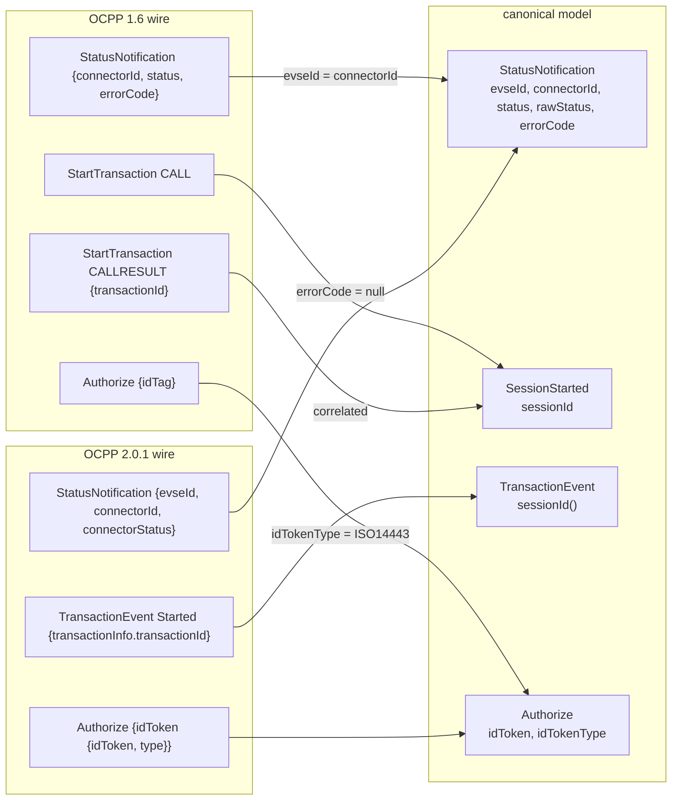
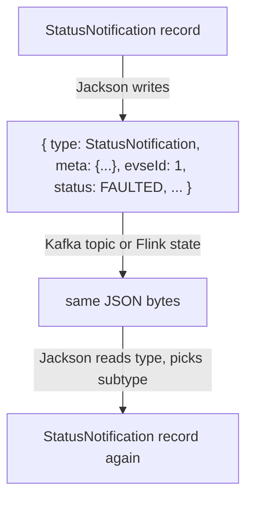

# 11. Canonical OCPP model

**Goal.** After this chapter you can open any file in the `ocpp-model` module and explain what it
is for: the sealed `OcppEvent` hierarchy, the `EventMeta` every event carries, the version-neutral
enums, the `SessionId`, the meter-value records and the station/group records. You will
understand *why* the model is shaped so that the rule engine never has to ask "is this 1.6 or
2.0.1?", and you will be able to add a new event type without breaking anything silently.

**Prerequisites.** [Chapter 10](10-ocpp-protocol-primer.md) for the OCPP vocabulary, and the
records / sealed interfaces / pattern-switch parts of [chapter 02](02-java-21-for-this-repo.md).

## Concepts (from scratch)

### The design goal: rules never see 1.6 vs 2.0.1

chargemon watches one fleet that speaks two dialects. A 1.6 station says `Faulted` with an
`errorCode`; a 2.0.1 station says `connectorStatus: Faulted` with an `evseId` and no error code.
A 1.6 session is `StartTransaction … StopTransaction`; a 2.0.1 session is `TransactionEvent`
`Started … Ended`. If every alert rule had to know both, every rule would be written twice and
the rule authors would need to be protocol experts.

So the model module defines a **canonical event vocabulary**: a fixed set of Java records that
mean the same thing regardless of wire version. The codec ([chapter 12](12-ocpp-codec-parsing-mapping-correlation.md))
translates wire payloads into these records; the rule engine
([chapter 14](14-rule-engine-conditions-and-definitions.md)) reads only these records. The word
*canonical* just means "the one agreed form".

Three techniques carry that goal:

1. **Union types.** Where the versions use different word lists, one enum contains both lists
   (`ConnectorStatus` has `PREPARING` *and* `OCCUPIED`).
2. **Lifting.** Where one version has structure the other lacks, the richer shape is used and
   the poorer version is lifted into it (1.6 `idTag` becomes `{idToken, idTokenType}`).
3. **Synthesis.** Where one version needs two messages to say what the other says in one, the
   correlator fuses the two halves into a synthetic event (`SessionStarted` for 1.6).

### Sealed interfaces and records, in one paragraph

A **record** is a Java class that is only data: `record Heartbeat(EventMeta meta)` gives you a
constructor, a `meta()` accessor, `equals`, `hashCode` and `toString` for free, and its fields can
never change after construction. A **sealed interface** lists, with `permits`, the *only* classes
allowed to implement it. The compiler then knows the complete set, so a `switch` over a sealed
type must handle every case or it will not compile. That property is what makes the model safe to
extend: forget a case and the build tells you.

### Two families of events plus a fallback

- A **StationMessage** is one CALL that is meaningful on its own. `Heartbeat`, `StatusNotification`,
  `TransactionEvent` are examples. The codec emits it the moment the CALL arrives.
- A **CorrelatedEvent** is synthesized from a CALL *and* its answer (or its absence).
  `BootCompleted` needs the CSMS's `status`; `SessionStarted` needs the CSMS's `transactionId`;
  `CallFailed` and `CallTimedOut` describe a CALL that was answered with an error or not at all.
- A **GenericOcppEvent** is the fallback for any action without a dedicated mapper. It keeps the
  payload as JSON text so rules can still reach into it with `event.payload.*`. No message is
  ever dropped for being unknown.

### Two timestamps on every event

Every event carries an `EventMeta` with two instants:

- `receivedAt`: when the upstream broker received the frame (from the envelope). Always present.
- `eventTime`: when the thing *happened* according to the station, if the payload has a
  timestamp (`StatusNotification.timestamp`, `TransactionEvent.timestamp`, …). If the payload
  has none, `eventTime` equals `receivedAt`.

Flink's event-time processing ([chapter 09](09-flink-event-time-connectors-and-delivery.md))
uses `eventTime`; correlation deadlines use `receivedAt`. Keeping both means a station with a wrong
clock cannot break the correlator, and a late-arriving frame is still ordered correctly for
windows.

### Why a session id needs a version prefix

A 1.6 transaction id is an integer chosen by the CSMS. A 2.0.1 transaction id is a string chosen
by the station. Neither is unique across a fleet on its own, and a station upgraded from 1.6 to
2.0.1 could easily reuse a number. The canonical `SessionId` is therefore
`(version, stationId, transactionId)` and prints as `"1.6:ST-1:555"` or `"2.0.1:ST-1:tx-9"`. Any
state keyed by session (the zero-energy tracker in [chapter 17](17-flink-job-ingest-pipeline.md))
can then never confuse two sessions, and the prefix tells a reader which end-of-session message to
expect (`StopTransaction` or `TransactionEvent Ended`).

### Surviving Kafka and Flink state hops

Events are written to Kafka topics and stored in Flink state as JSON. When Jackson (the JSON
library) reads an `OcppEvent` back, it must know *which* record to build. **Polymorphic type
handling** solves this: the root interface says "write a `type` property with a name, and use
that name to pick the subtype on the way back". Without it, a `Heartbeat` and a
`SecurityEventNotification` serialized to JSON would be indistinguishable to the reader.

## In this repo

All paths are relative to `docs/`. The module is `ocpp-model`; it depends only on `common`
([../ocpp-model/build.gradle.kts](../ocpp-model/build.gradle.kts)).

### The sealed root

[../ocpp-model/src/main/java/com/chargemon/ocpp/model/OcppEvent.java](../ocpp-model/src/main/java/com/chargemon/ocpp/model/OcppEvent.java)
is the root. It carries the Jackson annotations and two convenience accessors:

```java
@JsonTypeInfo(use = JsonTypeInfo.Id.NAME, property = "type")
@JsonSubTypes({
    @JsonSubTypes.Type(value = BootNotification.class, name = "BootNotification"),
    @JsonSubTypes.Type(value = Heartbeat.class, name = "Heartbeat"),
    ...
    @JsonSubTypes.Type(value = GenericOcppEvent.class, name = "Generic"),
})
public sealed interface OcppEvent permits StationMessage, CorrelatedEvent, GenericOcppEvent {

    EventMeta meta();

    default String stationId() {
        return meta().stationId();
    }
```
(`OcppEvent.java:13`)

Note the Jackson names: for every dedicated record the name equals the OCPP action (or the
synthetic action for correlated events), so a serialized event reads `"type":"StatusNotification"`.
The one exception is `GenericOcppEvent`, whose name is `"Generic"`; its real action is in
`meta.action`.

The two families are sealed too
([StationMessage.java](../ocpp-model/src/main/java/com/chargemon/ocpp/model/StationMessage.java),
[CorrelatedEvent.java](../ocpp-model/src/main/java/com/chargemon/ocpp/model/CorrelatedEvent.java)):

```java
/** A single OCPP CALL that maps 1:1 to a canonical event without needing the response. */
public sealed interface StationMessage extends OcppEvent
        permits BootNotification, Heartbeat, StatusNotification, NotifyEvent, SecurityEventNotification,
                StartTransaction, StopTransaction, TransactionEvent, MeterValues, Authorize {
}
```
(`StationMessage.java:3`)

```java
/** Events synthesized by joining a CALL with its CALLRESULT / CALLERROR, or by a timeout. */
public sealed interface CorrelatedEvent extends OcppEvent
        permits BootCompleted, SessionStarted, AuthorizationResult, CallFailed, CallTimedOut {
}
```
(`CorrelatedEvent.java:3`)

### The ten StationMessage records

Every record's first component is `EventMeta meta`. The "produced by" column says which mapper
package in `ocpp-codec` creates it; chapter 12 has the mapper-by-mapper detail.

| Record | Other components | Produced by | Unification notes |
|---|---|---|---|
| [BootNotification](../ocpp-model/src/main/java/com/chargemon/ocpp/model/BootNotification.java) | `vendor, model, serialNumber, firmwareVersion, reason` | 1.6, 2.0.1 | 1.6 has no `reason` (null). 2.0.1 fields come from the nested `chargingStation` object. |
| [Heartbeat](../ocpp-model/src/main/java/com/chargemon/ocpp/model/Heartbeat.java) | none | 1.6, 2.0.1 | Only `meta` matters; the absence rule reads `meta.receivedAt`. |
| [StatusNotification](../ocpp-model/src/main/java/com/chargemon/ocpp/model/StatusNotification.java) | `evseId, connectorId, status, rawStatus, errorCode, vendorErrorCode, timestamp` | 1.6, 2.0.1 | 1.6 copies `connectorId` into `evseId` too. 2.0.1 has no error codes (null). `status` is the union enum; `rawStatus` keeps the wire word. |
| [NotifyEvent](../ocpp-model/src/main/java/com/chargemon/ocpp/model/NotifyEvent.java) | `seqNo, generatedAt, tbc, eventData` (list of `EventDatum`) | 2.0.1 | Each `EventDatum` flattens `component.name`, `component.evse.id`, `variable.name`. |
| [SecurityEventNotification](../ocpp-model/src/main/java/com/chargemon/ocpp/model/SecurityEventNotification.java) | `type, timestamp, techInfo` | 2.0.1 | |
| [StartTransaction](../ocpp-model/src/main/java/com/chargemon/ocpp/model/StartTransaction.java) | `connectorId, idTag, meterStart, timestamp, reservationId` | 1.6 | No transaction id yet; see `SessionStarted`. |
| [StopTransaction](../ocpp-model/src/main/java/com/chargemon/ocpp/model/StopTransaction.java) | `transactionId, meterStop, timestamp, reason, idTag, transactionData` | 1.6 | `transactionData` is a `List<MeterValue>`. Has `sessionId()`. |
| [TransactionEvent](../ocpp-model/src/main/java/com/chargemon/ocpp/model/TransactionEvent.java) | `eventType, seqNo, triggerReason, timestamp, offline, transactionInfo, evse, idToken, meterValues` | 2.0.1 | `eventType` is `TxEventType.STARTED/UPDATED/ENDED`. Has `sessionId()`. |
| [MeterValues](../ocpp-model/src/main/java/com/chargemon/ocpp/model/MeterValues.java) | `evseOrConnectorId, transactionId, meterValues` | 1.6, 2.0.1 | The id field is named for what it is: a connector in 1.6, an EVSE in 2.0.1. 2.0.1 has no `transactionId` (null). |
| [Authorize](../ocpp-model/src/main/java/com/chargemon/ocpp/model/Authorize.java) | `idToken, idTokenType` | 1.6, 2.0.1 | 1.6 `idTag` is lifted into `idToken`; the 1.6 mapper hardcodes `idTokenType = "ISO14443"` (an RFID card). |

`StatusNotification`'s own comment says it best:

```java
/**
 * 1.6: connectorId/status/errorCode. 2.0.1: evseId/connectorId/connectorStatus.
 * {@code rawStatus} keeps the exact wire value for rules that care about the version-specific vocabulary.
 */
```
(`StatusNotification.java:5`)

### The five CorrelatedEvent records

| Record | Other components | Produced for | Why it exists |
|---|---|---|---|
| [BootCompleted](../ocpp-model/src/main/java/com/chargemon/ocpp/model/BootCompleted.java) | `status, intervalSec, csmsTime, vendor, model, firmwareVersion` | 1.6, 2.0.1 | Fuses the CALL (vendor, model, firmware) with the CALLRESULT (status, interval). A "boot rejected" rule needs both. |
| [SessionStarted](../ocpp-model/src/main/java/com/chargemon/ocpp/model/SessionStarted.java) | `sessionId, connectorId, idTag, meterStart, startedAt, idTagStatus` | 1.6 only | In 1.6 the `transactionId` arrives only in the StartTransaction CALLRESULT. 2.0.1 does not need it: `TransactionEvent Started` already has the id. |
| [AuthorizationResult](../ocpp-model/src/main/java/com/chargemon/ocpp/model/AuthorizationResult.java) | `idToken, status` | 1.6, 2.0.1 | The token from the CALL plus the verdict from the CALLRESULT. |
| [CallFailed](../ocpp-model/src/main/java/com/chargemon/ocpp/model/CallFailed.java) | `requestAction, errorCode, description, detailsJson, requestDirection` | any action | A CALL answered with CALLERROR. `requestAction` is null when the error arrived before its CALL. |
| [CallTimedOut](../ocpp-model/src/main/java/com/chargemon/ocpp/model/CallTimedOut.java) | `requestAction, sentAt, requestDirection` | any action | A CALL with no answer inside the correlation timeout. |

`SessionStarted`'s comment states the reason directly:

```java
/** 1.6 StartTransaction CALL joined with the CSMS response carrying the transactionId. */
public record SessionStarted(
        EventMeta meta,
        SessionId sessionId,
        int connectorId,
        String idTag,
        long meterStart,
        Instant startedAt,
        AuthStatus idTagStatus) implements CorrelatedEvent {
}
```
(`SessionStarted.java:6`)

### The fallback

[GenericOcppEvent.java](../ocpp-model/src/main/java/com/chargemon/ocpp/model/GenericOcppEvent.java)
has three components: `meta`, `messageType` (CALL / CALLRESULT / CALLERROR) and `rawPayloadJson`.
The rule engine exposes that JSON under `event.payload.*` (chapter 12), so a rule like
`event.action == "NotifyChargingLimit" and event.payload.evseId == 1` works with no mapper at all.
The generator's `call-error` profile relies on exactly this.

### EventMeta

[../ocpp-model/src/main/java/com/chargemon/ocpp/model/EventMeta.java](../ocpp-model/src/main/java/com/chargemon/ocpp/model/EventMeta.java):

```java
public record EventMeta(
        String stationId,
        OcppVersion version,
        Direction direction,
        String uniqueId,
        String action,
        Instant receivedAt,
        Instant eventTime,
        String sourceRef) {

    public EventMeta {
        Objects.requireNonNull(stationId, "stationId");
        Objects.requireNonNull(version, "version");
        Objects.requireNonNull(direction, "direction");
        Objects.requireNonNull(receivedAt, "receivedAt");
        if (eventTime == null) {
            eventTime = receivedAt;
        }
    }
```
(`EventMeta.java:13`)

The block after the components is a **compact constructor**: it runs on every construction and
can validate or default fields. Here it enforces the four non-null fields and applies the
"eventTime defaults to receivedAt" rule from the concepts section. Two helpers return modified
copies (records are immutable, so "change" means "make a new one"): `withAction` is used by the
correlator to relabel a synthesized event, and `withEventTime` is used by mappers when the payload
carries a timestamp. `sourceRef` is an opaque `topic-partition-offset` string for tracing a
canonical event back to the Kafka record it came from.

### Enums: lenient where the wire is messy, strict where it must be

| Enum | Values | Unknown input |
|---|---|---|
| [OcppVersion](../ocpp-model/src/main/java/com/chargemon/ocpp/model/OcppVersion.java) | `V16("1.6")`, `V201("2.0.1")` | throws. Accepts `1.6`, `ocpp1.6`, `OCPP2.0.1`, `V201`, `2.0`. |
| [Direction](../ocpp-model/src/main/java/com/chargemon/ocpp/model/Direction.java) | `STATION_TO_CSMS`, `CSMS_TO_STATION` | throws. Accepts `inbound`, `outbound`, `cp-to-cs`, `station`, `csms`, … |
| [MessageType](../ocpp-model/src/main/java/com/chargemon/ocpp/model/MessageType.java) | `CALL(2)`, `CALLRESULT(3)`, `CALLERROR(4)` | `fromId` throws. |
| [ConnectorStatus](../ocpp-model/src/main/java/com/chargemon/ocpp/model/ConnectorStatus.java) | union of both versions + `UNKNOWN` | returns `UNKNOWN`. |
| [RegistrationStatus](../ocpp-model/src/main/java/com/chargemon/ocpp/model/RegistrationStatus.java) | `ACCEPTED, PENDING, REJECTED, UNKNOWN` | returns `UNKNOWN`. |
| [AuthStatus](../ocpp-model/src/main/java/com/chargemon/ocpp/model/AuthStatus.java) | union of 1.6 `AuthorizationStatus` and 2.0.1 `AuthorizationStatusEnumType` + `UNKNOWN` | returns `UNKNOWN`. |

The split is deliberate. Version and direction come from the *envelope*, which our own upstream
produces; a bad value there is a configuration bug and should fail loudly. Statuses come from
*stations*, a million of them with varied firmware; a vendor-specific word must not stop the
pipeline, so it becomes `UNKNOWN` and can still be matched via `rawStatus`.

`Direction.opposite()` is small but load-bearing:

```java
public Direction opposite() {
    return this == STATION_TO_CSMS ? CSMS_TO_STATION : STATION_TO_CSMS;
}
```
(`Direction.java:21`)

A CALLRESULT travelling CSMS → station answers a CALL that travelled station → CSMS. The
correlator computes the pending call's key from the response by flipping the direction; get this
wrong and no response would ever match.

The leniency is pinned by
[../ocpp-model/src/test/java/com/chargemon/ocpp/model/EnumParsingTest.java](../ocpp-model/src/test/java/com/chargemon/ocpp/model/EnumParsingTest.java):

```java
assertThat(Direction.parse("inbound")).isEqualTo(Direction.STATION_TO_CSMS);
assertThat(Direction.parse("csms-to-station")).isEqualTo(Direction.CSMS_TO_STATION);
assertThat(ConnectorStatus.parse("SuspendedEV")).isEqualTo(ConnectorStatus.SUSPENDED_EV);
assertThat(ConnectorStatus.parse("weird")).isEqualTo(ConnectorStatus.UNKNOWN);
```
(`EnumParsingTest.java:18`)

### SessionId

[../ocpp-model/src/main/java/com/chargemon/ocpp/model/session/SessionId.java](../ocpp-model/src/main/java/com/chargemon/ocpp/model/session/SessionId.java):

```java
public record SessionId(OcppVersion version, String stationId, String transactionId) {
    ...
    public String canonical() {
        return version.wire() + ":" + stationId + ":" + transactionId;
    }
}
```
(`SessionId.java:7`)

`StopTransaction.sessionId()` and `TransactionEvent.sessionId()` build one from their own `meta`
and transaction id, and `SessionStarted` carries one directly. The tests in chapter 12 assert the
canonical strings `"1.6:ST-1:555"`, `"1.6:ST-1:77"` and `"2.0.1:ST-1:tx-9"`.

### Meter values

[MeterValue.java](../ocpp-model/src/main/java/com/chargemon/ocpp/model/MeterValue.java) is one
timestamped reading containing a list of `SampledValue(value, measurand, context, unit, location,
phase)`; `value` is a `BigDecimal` so 1.6 strings and 2.0.1 numbers land in the same type. Its
`find` method applies the spec default:

```java
/** First sampled value for the given measurand (defaults to energy register when measurand is absent, per spec). */
public Optional<SampledValue> find(String measurand) {
    if (sampledValues == null) {
        return Optional.empty();
    }
    return sampledValues.stream()
            .filter(sv -> measurand.equals(sv.measurand() == null ? ENERGY_ACTIVE_IMPORT_REGISTER : sv.measurand()))
            .findFirst();
}
```
(`MeterValue.java:15`)

The model does **not** convert units. A station may report `kWh`; the conversion to Wh happens
where energy is actually computed, in the Flink job's `SessionTracker`
([../flink-processor/src/main/java/com/chargemon/flink/energy/SessionTracker.java](../flink-processor/src/main/java/com/chargemon/flink/energy/SessionTracker.java),
line 133). The model records what the station said.

### Station and group records

The `station/` package holds master data that arrives on compacted Kafka topics
([chapter 04](04-kafka-and-cdc-basics.md)) and is joined onto events in the enrichment operator
([chapter 17](17-flink-job-ingest-pipeline.md)):

- [StationRecord](../ocpp-model/src/main/java/com/chargemon/ocpp/model/station/StationRecord.java)
  `(stationId, name, vendor, model, firmware, ocppVersion, attributes, groupIds, deleted)`.
- [GroupRecord](../ocpp-model/src/main/java/com/chargemon/ocpp/model/station/GroupRecord.java)
  `(groupId, parentId, name, level, attributes, deleted)`; `parentId` null for a root.
- [StationContext](../ocpp-model/src/main/java/com/chargemon/ocpp/model/station/StationContext.java)
  `(id, vendor, model, firmware, attributes, directGroupIds, allGroupIds, known)`.

`deleted` on the first two is **tombstone-aware**: a compacted topic signals "this row is gone"
with a record whose `deleted` is true, and the consumer must keep that fact rather than forget it.
`StationContext` is what rules see as `station.*`. `allGroupIds` is the transitive closure (the
group, its parent, its grandparent, …) precomputed once so no rule ever walks the hierarchy. The
`known` flag matters on a fresh start: an event may arrive before the station's master data has
been replayed, and then the context is `StationContext.unknown(id)` with `known = false` and
empty everything. Rules can test `station.known` explicitly.

```java
public static StationContext unknown(String id) {
    return new StationContext(id, null, null, null, Map.of(), Set.of(), Set.of(), false);
}
```
(`StationContext.java:26`)

All three compact constructors defensively copy their maps and sets (`Map.copyOf`, `Set.copyOf`),
so a record can be shared across Flink operators without anyone mutating it.

## Diagrams

### The full sealed hierarchy



### From two dialects to one vocabulary



### What a serialized event looks like



## Hands-on exercises

### Exercise 1: an exhaustive switch over OcppEvent

**What to do.** In any test class inside `ocpp-codec` (it already depends on `ocpp-model`), write
a method `static String label(OcppEvent e)` that uses a pattern `switch` with **no `default`
branch** and returns a short label per case, for example `"hb"` for `Heartbeat`, `"status:" +
s.status()` for `StatusNotification`, `"generic:" + g.action()` for `GenericOcppEvent`. Start with
only three cases and compile.

**What you should observe.** The compiler refuses with "the switch expression does not cover all
possible input values" and the build stops. Add cases until it compiles: you need all sixteen
concrete records, or you can use the two sealed sub-interfaces as coarse cases
(`case StationMessage m -> …`, `case CorrelatedEvent c -> …`, `case GenericOcppEvent g -> …`).
Either way, every event type is accounted for and there is no silent "else".

**Hint.** The syntax is `case StatusNotification s -> "status:" + s.status();`. The full list of
cases is the union of the two `permits` lists plus `GenericOcppEvent`.

### Exercise 2: add a new StationMessage and follow the compiler

**What to do.** Add a record `FirmwareStatusNotification(EventMeta meta, String status)` in
`ocpp-model` that `implements StationMessage`. Do *not* touch anything else yet. Run
`./gradlew :ocpp-model:compileJava`, read the error, fix it, and repeat until the whole build
(`./gradlew build`) passes. Then revert your change (or keep it and add a mapper in
[chapter 12](12-ocpp-codec-parsing-mapping-correlation.md), exercise 1).

**What you should observe.** Expect this sequence of errors:

1. `ocpp-model`: "class is not allowed to extend sealed class: StationMessage" until you add
   `FirmwareStatusNotification` to the `permits` list in `StationMessage.java`.
2. No compile error for Jackson, but a *runtime* failure would follow: without a
   `@JsonSubTypes.Type(value = FirmwareStatusNotification.class, name = "FirmwareStatusNotification")`
   entry in `OcppEvent.java`, serializing the new record throws because Jackson has no type name
   for it. Add the entry.
3. Any exhaustive `switch` over `OcppEvent` or `StationMessage` without a `default` (yours from
   exercise 1, and any in `flink-processor` or `rule-engine`) now fails with "does not cover all
   possible input values". Each one is a place that must decide what the new event means.

**Hint.** `grep -rn "case StatusNotification" --include=*.java` finds the switches that will
need a new arm.

### Exercise 3: explain the SessionId prefix with a concrete collision

**What to do.** Write down two real-looking sessions that would collide if `SessionId` were only
`(stationId, transactionId)`. Then check what
[CallCorrelatorTest.java](../ocpp-codec/src/test/java/com/chargemon/ocpp/codec/correlate/CallCorrelatorTest.java)
and
[MapperRegistryTest.java](../ocpp-codec/src/test/java/com/chargemon/ocpp/codec/mapper/MapperRegistryTest.java)
assert about `canonical()`.

**What you should observe.** Station `ST-1` on 1.6 gets CSMS-assigned id `1` for its first
session. After a firmware upgrade to 2.0.1 the station generates its own ids and could easily
start at `"1"`. Both would be `ST-1:1`. With the version prefix they are `1.6:ST-1:1` and
`2.0.1:ST-1:1`. The tests assert `"1.6:ST-1:555"`, `"1.6:ST-1:77"` and `"2.0.1:ST-1:tx-9"`.

**Hint.** Also consider that a 1.6 id is unique per *CSMS* while a 2.0.1 id is unique per
*station*; that is why `stationId` is in the key as well.

## Self-check

1. Name the three sub-branches of `OcppEvent` and give one record from each.
2. Which record only exists because of a 1.6 quirk, and what is the quirk?
3. A 2.0.1 `StatusNotification` is parsed. What are `errorCode` and `evseId`? And for a 1.6 one?
4. `ConnectorStatus.parse("Weird")` and `Direction.parse("weird")` behave differently. How, and why?
5. What does `EventMeta`'s compact constructor do with a null `eventTime`?

<details><summary>Answers</summary>

1. `StationMessage` (e.g. `Heartbeat`), `CorrelatedEvent` (e.g. `BootCompleted`),
   `GenericOcppEvent` (the fallback itself).
2. `SessionStarted`. In 1.6 the CSMS assigns the transaction id and returns it in the
   StartTransaction CALLRESULT, so the CALL alone cannot identify the session.
3. 2.0.1: `errorCode` is null, `evseId` comes from the payload. 1.6: `errorCode` comes from the
   payload, `evseId` is a copy of `connectorId`.
4. `ConnectorStatus.parse` returns `UNKNOWN`; `Direction.parse` throws `IllegalArgumentException`.
   Status words come from stations and must never stop the pipeline; direction comes from our own
   envelope and a bad value is a bug worth failing on.
5. It sets `eventTime = receivedAt`, so every event has an event time even when the payload
   carries no timestamp.

</details>

## Glossary terms

- [canonical event](glossary.md#canonical-event)
- [GenericOcppEvent](glossary.md#genericocppevent)
- [record](glossary.md#record)
- [sealed interface](glossary.md#sealed-interface)
- [pattern matching](glossary.md#pattern-matching)
- [connector status](glossary.md#connector-status)
- [registration status](glossary.md#registration-status)
- [transaction](glossary.md#transaction)
- [TransactionEvent](glossary.md#transactionevent)
- [measurand](glossary.md#measurand)
- [idTag / idToken](glossary.md#idtag--idtoken)
- [tombstone](glossary.md#tombstone)
- [compacted topic](glossary.md#compacted-topic)
- [correlation](glossary.md#correlation)
- [event time](glossary.md#event-time)

## Further reading

- OCPP specifications: <https://openchargealliance.org/protocols/open-charge-point-protocol/>
  - OCPP 1.6 §7 "Types": `ChargePointStatus`, `RegistrationStatus`, `AuthorizationStatus`,
    `MeterValue`, `SampledValue`, `Measurand`.
  - OCPP 2.0.1 Part 2 §E (StatusNotification, `ConnectorStatusEnumType`) and §G
    (`TransactionEventRequest`, `TransactionType`, `IdTokenType`).
- Jackson polymorphic type handling (`@JsonTypeInfo`, `@JsonSubTypes`):
  <https://github.com/FasterXML/jackson-docs>
- Java language: sealed classes (JEP 409) and pattern matching for switch (JEP 441), both linked
  from the Java 21 documentation index: <https://docs.oracle.com/en/java/javase/21/>
- Next: [chapter 12](12-ocpp-codec-parsing-mapping-correlation.md) builds these records from
  wire frames.
