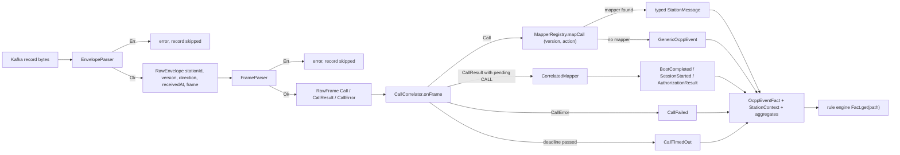
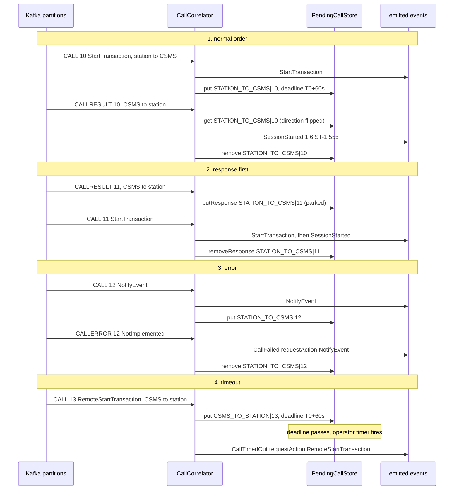
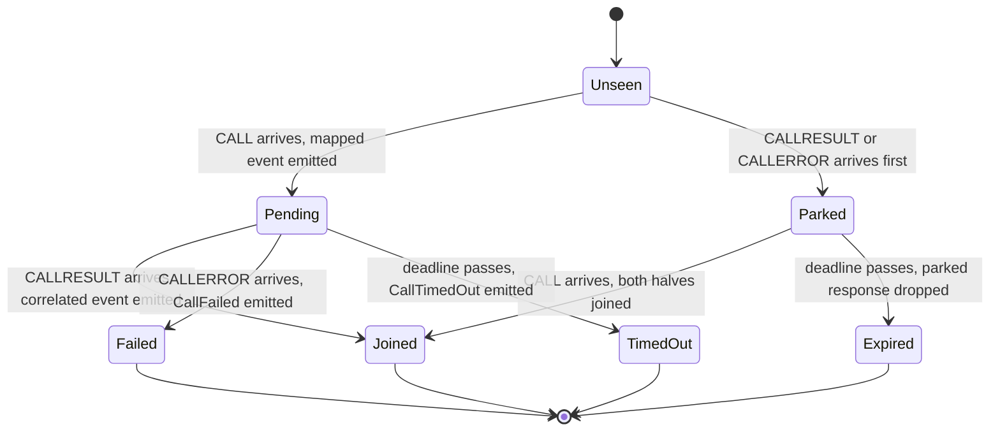

# 12. OCPP codec: parsing, mapping, correlation

**Goal.** After this chapter you can follow one Kafka record from raw bytes to a typed canonical
event: envelope parsing, frame parsing, the `(version, action)` mapper registry that
`ServiceLoader` fills, the correlator that joins CALLs with their answers (or their errors, or
their absence), and the `OcppEventFact` bridge that lets the rule engine read events by dotted
path. You will be able to add a mapper for a new action and write a correlator test.

**Prerequisites.** [Chapter 11](11-canonical-ocpp-model.md) for the target records,
[chapter 10](10-ocpp-protocol-primer.md) for frames, and [chapter 04](04-kafka-and-cdc-basics.md)
for why two halves of one exchange can arrive out of order (different partitions). The
`ServiceLoader` section of [chapter 02](02-java-21-for-this-repo.md) helps.

## Concepts (from scratch)

### Decoding is a pipeline of small, total steps

"Decoding" here means turning bytes into a Java object the rest of the system trusts. It is
done in stages, each with one job, each returning a value that says *either* "here is the
result" *or* "here is why not". No stage throws for bad input, because a million stations will
send every malformed thing imaginable and one bad record must not restart a Flink job. The
`Result<T, E>` type from `common` (`Ok(value)` or `Err(error)`, see [chapter 02](02-java-21-for-this-repo.md))
is the shape of every parser's answer.

1. **Envelope parsing**: the outer JSON object from the `common-broker` topic → `RawEnvelope`
   (who, which version, which direction, when, plus the untouched frame).
2. **Frame parsing**: the JSON array → `RawFrame.Call`, `RawFrame.CallResult` or
   `RawFrame.CallError`.
3. **Mapping**: `(version, action)` + payload → one canonical `OcppEvent`.
4. **Correlation**: remember CALLs, match answers to them, synthesize `CorrelatedEvent`s,
   and handle answers that arrive early, errors, and timeouts.
5. **Fact bridging**: wrap the event, the station context and the aggregates into a `Fact` the
   rule engine can query by path.

### Registries and ServiceLoader

A **registry** is a lookup table from a key to a handler. Here the key is `(OcppVersion, action)`
and the handler is a *mapper*. Instead of a hand-written list of `new XMapper()` calls, the table
is filled by Java's **`ServiceLoader`**: you put the fully qualified class names of your
implementations in a text file named after the interface under `META-INF/services/`, and
`ServiceLoader.load(Interface.class)` instantiates every class listed in every such file on the
classpath. Adding a mapper is then "one class + one line", with no central file to edit.

### Why correlation is hard

Chapter 10 showed that a CALLRESULT carries only the message id. To turn
`[3,"10",{"transactionId":555,…}]` into a `SessionStarted` we must remember that `"10"` was a
`StartTransaction` from station `ST-1`, and what its payload said. Three things make it more than
a hash map:

- **Both directions reuse ids.** The station's CALL `"7"` and the CSMS's CALL `"7"` are
  different requests, so the memory must be keyed by *direction and id*.
- **Answers can arrive first.** Station → CSMS and CSMS → station traffic may sit on different
  Kafka partitions and be read at different speeds. A response with no known CALL is *parked*
  until the CALL shows up or a deadline passes.
- **Answers can never arrive.** A pending CALL must expire. The expiry is itself an event
  (`CallTimedOut`), because "the CSMS never answered" is exactly the kind of thing an operator
  wants to know.

The correlator in this repo is a **pure** component: it does not own a clock, a timer or a map. It
receives a frame and a storage *port* (an interface), decides what should happen, and returns that
decision as a value (`CorrelationOutcome`). The caller (a unit test, or the Flink operator in
[chapter 17](17-flink-job-ingest-pipeline.md)) applies the decision to real storage and real
timers. This is the hexagonal "ports and adapters" idea from
[chapter 13](13-architecture-overview.md).

### Facts and field paths

The rule engine ([chapter 14](14-rule-engine-conditions-and-definitions.md)) never imports
`ocpp-model`. It evaluates conditions against a **`Fact`**: an interface with one method,
`Optional<Object> get(String path)`. A **field path** is a dotted string such as
`event.status`, `station.attributes.tier` or `event.meterValues[0].sampledValues[0].value`. The
codec provides the adapter `OcppEventFact` that answers those paths by serializing the event to a
JSON tree once and walking it.

## In this repo

All paths are relative to `docs/`. The module is `ocpp-codec`; it depends on `ocpp-model` and
`rule-engine` and publishes test fixtures for other modules
([../ocpp-codec/build.gradle.kts](../ocpp-codec/build.gradle.kts)).

### Step 1: EnvelopeParser → RawEnvelope

[../ocpp-codec/src/main/java/com/chargemon/ocpp/codec/envelope/EnvelopeParser.java](../ocpp-codec/src/main/java/com/chargemon/ocpp/codec/envelope/EnvelopeParser.java)
takes the station id as a parameter (the caller hands it the Kafka record key; the body has no
station field) and is tolerant about body field names so that an upstream producer change is a
one-line edit here:

```java
public Result<RawEnvelope, String> parse(String stationId, byte[] bytes, String sourceRef)
```
(`EnvelopeParser.java:40`)

```java
private static final List<String> VERSION_KEYS = List.of("ocppVersion", "protocol", "version");
private static final List<String> DIRECTION_KEYS = List.of("direction", "dir");
private static final List<String> TIME_KEYS = List.of("receivedAt", "timestamp", "ts");
private static final List<String> FRAME_KEYS = List.of("message", "frame", "payload", "ocppMessage");
```
(`EnvelopeParser.java:24`)

Behaviour worth knowing: a blank or `null` station id (a keyless Kafka record) is
`Err("record key missing stationId")` before the body is even read; the frame may be a JSON array
*or a string containing one* (some gateways double-encode); `direction` defaults to
`STATION_TO_CSMS` when absent; `receivedAt` accepts ISO-8601 text or epoch milliseconds and
defaults to `Instant.now()`; a missing frame is an `Err`, never an exception. The result is
[RawEnvelope](../ocpp-codec/src/main/java/com/chargemon/ocpp/codec/envelope/RawEnvelope.java)
`(stationId, ocppVersion, direction, receivedAt, frame, sourceRef)`, with `stationId` copied from
the key.
[EnvelopeAndFrameParserTest.java](../ocpp-codec/src/test/java/com/chargemon/ocpp/codec/envelope/EnvelopeAndFrameParserTest.java)
feeds it key `CP-9` and body
`{"protocol":"ocpp1.6","dir":"inbound","timestamp":1735689600000,"frame":"[3,\"7\",{…}]"}`
and expects success.

### Step 2: FrameParser → RawFrame

[FrameParser.java](../ocpp-codec/src/main/java/com/chargemon/ocpp/codec/frame/FrameParser.java)
validates the array shape: at least three elements, an integer message type in `[0]`, a non-blank
id in `[1]`, four elements with a textual action for CALL, at least four for CALLERROR. A missing
payload becomes `{}`; missing CALLERROR details become `{}`.
[RawFrame.java](../ocpp-codec/src/main/java/com/chargemon/ocpp/codec/frame/RawFrame.java) is a
sealed interface with three records:

```java
public sealed interface RawFrame permits RawFrame.Call, RawFrame.CallResult, RawFrame.CallError {

    String uniqueId();

    @JsonIgnore
    MessageType type();

    record Call(String uniqueId, String action, JsonNode payload) implements RawFrame {
```
(`RawFrame.java:16`)

Payloads stay as `JsonNode` (Jackson's generic tree) until a mapper claims them.

### Step 3: MapperRegistry → OcppEvent

Two mapper interfaces live in `mapper/`:

- [OcppActionMapper](../ocpp-codec/src/main/java/com/chargemon/ocpp/codec/mapper/OcppActionMapper.java)
  `<E extends OcppEvent>`: `key()` returns a `MapperKey(version, action)`; `map(meta, payload)`
  returns the event. Used for CALLs.
- [CorrelatedMapper](../ocpp-codec/src/main/java/com/chargemon/ocpp/codec/mapper/CorrelatedMapper.java)
  `<E extends CorrelatedEvent>`: keyed by the **request's** `(version, action)`;
  `producedAction()` names the synthetic event; `map(callMeta, callPayload, resultPayload,
  resultReceivedAt)` fuses the halves. Its default `correlatedMeta` sets *both* `receivedAt` and
  `eventTime` of the synthesized event to the response arrival time.

[MapperRegistry.java](../ocpp-codec/src/main/java/com/chargemon/ocpp/codec/mapper/MapperRegistry.java)
loads both kinds, refuses duplicates, and falls back to the generic mapper:

```java
public static MapperRegistry fromServiceLoader() {
    List<OcppActionMapper<?>> calls = new ArrayList<>();
    ServiceLoader.load(OcppActionMapper.class).forEach(calls::add);
    List<CorrelatedMapper<?>> correlated = new ArrayList<>();
    ServiceLoader.load(CorrelatedMapper.class).forEach(correlated::add);
    return of(calls, correlated);
}
```
(`MapperRegistry.java:34`)

```java
public OcppEvent mapCall(EventMeta meta, JsonNode payload) {
    OcppActionMapper<?> m = callMappers.get(new MapperKey(meta.version(), meta.action()));
    if (m == null) {
        return generic.map(meta, MessageType.CALL, payload);
    }
    return m.map(meta, payload);
}
```
(`MapperRegistry.java:59`)

`mapResult` returns `Optional.empty()` when no correlated mapper exists for the request; a plain
Heartbeat CALLRESULT therefore produces nothing, which is correct.

The service files are
[META-INF/services/com.chargemon.ocpp.codec.mapper.OcppActionMapper](../ocpp-codec/src/main/resources/META-INF/services/com.chargemon.ocpp.codec.mapper.OcppActionMapper)
(15 lines) and
[META-INF/services/com.chargemon.ocpp.codec.mapper.CorrelatedMapper](../ocpp-codec/src/main/resources/META-INF/services/com.chargemon.ocpp.codec.mapper.CorrelatedMapper)
(5 lines). [MapperRegistryTest.java](../ocpp-codec/src/test/java/com/chargemon/ocpp/codec/mapper/MapperRegistryTest.java)
pins those counts: `callKeys()` has size 15, `correlatedKeys()` has size 5.

#### The mapper table

Packages: [mapper/v16/](../ocpp-codec/src/main/java/com/chargemon/ocpp/codec/mapper/v16/) and
[mapper/v201/](../ocpp-codec/src/main/java/com/chargemon/ocpp/codec/mapper/v201/). Each mapper
uses the null-safe helpers in [Json.java](../ocpp-codec/src/main/java/com/chargemon/ocpp/codec/mapper/Json.java)
(`text`, `requireText`, `intOr`, `requireLong`, `decimal`, `instant`, `obj`); `require*` throws
`MappingException` for a missing field.

| Action | 1.6 mapper → event | 2.0.1 mapper → event | Quirks |
|---|---|---|---|
| BootNotification | `BootNotificationMapper16` → `BootNotification` | `BootNotificationMapper201` → `BootNotification` | 2.0.1 reads nested `chargingStation.*` plus top-level `reason`; 1.6 `reason` is null. |
| Heartbeat | `HeartbeatMapper16` → `Heartbeat` | `HeartbeatMapper201` → `Heartbeat` | Payload ignored. |
| StatusNotification | `StatusNotificationMapper16` → `StatusNotification` | `StatusNotificationMapper201` → `StatusNotification` | 1.6 copies `connectorId` into both `evseId` and `connectorId`; 2.0.1 reads `connectorStatus`, sets no error codes. Both set `eventTime` from `timestamp`. |
| StartTransaction | `StartTransactionMapper16` → `StartTransaction` | — | `idTag` and `meterStart` required. |
| StopTransaction | `StopTransactionMapper16` → `StopTransaction` | — | `transactionData` parsed as `List<MeterValue>`. |
| TransactionEvent | — | `TransactionEventMapper201` → `TransactionEvent` | Throws `MappingException` if `transactionInfo.transactionId` is missing or `eventType` is unknown. |
| MeterValues | `MeterValuesMapper16` → `MeterValues` | `MeterValuesMapper201` → `MeterValues` | 1.6: `connectorId` + optional `transactionId`; 2.0.1: `evseId`, `transactionId` null. |
| Authorize | `AuthorizeMapper16` → `Authorize` | `AuthorizeMapper201` → `Authorize` | 1.6 hardcodes `idTokenType = "ISO14443"`. |
| NotifyEvent | — | `NotifyEventMapper201` → `NotifyEvent` | Flattens `component`/`variable`/`evse` per datum; `eventTime` from `generatedAt`. |
| SecurityEventNotification | — | `SecurityEventNotificationMapper201` → `SecurityEventNotification` | `type` required. |
| *(any other)* | `GenericEventMapper` → `GenericOcppEvent` | same | Payload kept as JSON text. |

Correlated mappers, keyed by the request action:

| Request `(version, action)` | Mapper | Produces | Notes |
|---|---|---|---|
| (1.6, BootNotification) | `BootCompletedMapper16` | `BootCompleted` | vendor/model/firmware from CALL, status/interval/currentTime from RESULT. |
| (2.0.1, BootNotification) | `BootCompletedMapper201` | `BootCompleted` | same, reading `chargingStation.*`. |
| (1.6, StartTransaction) | `SessionStartedMapper16` | `SessionStarted` | `transactionId` **required** from the RESULT; `startedAt` falls back to the CALL's `receivedAt`. |
| (1.6, Authorize) | `AuthorizationResultMapper16` | `AuthorizationResult` | status from `idTagInfo.status`. |
| (2.0.1, Authorize) | `AuthorizationResultMapper201` | `AuthorizationResult` | status from `idTokenInfo.status`. |

The 1.6 status mapper shows the typical shape of a mapper:

```java
public StatusNotification map(EventMeta meta, JsonNode p) {
    Instant ts = Json.instant(p, "timestamp");
    String raw = Json.requireText(p, "status");
    int connectorId = Json.intOr(p, "connectorId", 0);
    return new StatusNotification(ts == null ? meta : meta.withEventTime(ts),
            connectorId, connectorId, ConnectorStatus.parse(raw), raw,
            Json.text(p, "errorCode"), Json.text(p, "vendorErrorCode"), ts);
}
```
(`StatusNotificationMapper16.java:20`)

#### MeterValueParser

[MeterValueParser.java](../ocpp-codec/src/main/java/com/chargemon/ocpp/codec/mapper/MeterValueParser.java)
is shared by both versions because the `meterValue[].sampledValue[]` shape is nearly identical.
It reads `value` (string or number → `BigDecimal`), `measurand`, `context`, `location`, `phase`,
and resolves the unit from either place:

```java
private static String unit(JsonNode s) {
    JsonNode u = s.get("unitOfMeasure");           // 2.0.1: {"unit":"kWh","multiplier":0}
    if (u != null && u.isObject()) {
        return Json.text(u, "unit");
    }
    return Json.text(s, "unit");                    // 1.6
}
```
(`MeterValueParser.java:42`)

No unit conversion happens here; `kWh → Wh` is done in `SessionTracker`
([chapter 17](17-flink-job-ingest-pipeline.md)).

### Step 4: CallCorrelator

The correlator's own class comment is the best summary
([../ocpp-codec/src/main/java/com/chargemon/ocpp/codec/correlate/CallCorrelator.java](../ocpp-codec/src/main/java/com/chargemon/ocpp/codec/correlate/CallCorrelator.java)):

```java
 * <ul>
 *   <li>CALL: emit the mapped event immediately, register as pending. If the response already
 *       arrived (parked), join right away.</li>
 *   <li>CALLRESULT: join with the pending CALL (opposite direction, same uniqueId) via a correlated
 *       mapper; if the CALL has not been seen yet, park the response.</li>
 *   <li>CALLERROR: emit {@link CallFailed} (parked likewise when the CALL is unknown).</li>
 *   <li>timeout: emit {@link CallTimedOut}.</li>
 * </ul>
```
(`CallCorrelator.java:27`)

**The storage port.**
[PendingCallStore.java](../ocpp-codec/src/main/java/com/chargemon/ocpp/codec/correlate/PendingCallStore.java)
has six methods: `get / put / remove` for pending CALLs and `getResponse / putResponse /
removeResponse` for parked responses. The test double is
[InMemoryPendingCallStore.java](../ocpp-codec/src/testFixtures/java/com/chargemon/ocpp/codec/fixtures/InMemoryPendingCallStore.java)
(two `HashMap`s plus `size()` and `parked()` for assertions). The production adapter is the
private record `MapStateStore` inside
[../flink-processor/src/main/java/com/chargemon/flink/correlate/CallCorrelationOperator.java](../flink-processor/src/main/java/com/chargemon/flink/correlate/CallCorrelationOperator.java),
which wraps two Flink `MapState`s (`pendingCalls`, `parkedResponses`); chapter 17 covers it.

**What is stored.**
[PendingCall.java](../ocpp-codec/src/main/java/com/chargemon/ocpp/codec/correlate/PendingCall.java)
keeps `(stationId, version, direction, uniqueId, action, payloadJson, sentAt, sourceRef)`. The
payload is kept as JSON **text**, not a `JsonNode`, so that Flink state serialization is trivial
(a string) and needs no custom serializer. The key:

```java
/** State key: direction + uniqueId, since both sides may reuse ids independently. */
public static String key(Direction direction, String uniqueId) {
    return direction.name() + "|" + uniqueId;
}
```
(`PendingCall.java:21`)

[PendingResponse.java](../ocpp-codec/src/main/java/com/chargemon/ocpp/codec/correlate/PendingResponse.java)
holds either a result payload or the three CALLERROR fields; `isError()` is "errorCode != null",
and `callKey()` flips the direction with `Direction.opposite()` so that a CSMS → station answer
is looked up under the station → CSMS CALL's key.

**The decision value.**
[CorrelationOutcome.java](../ocpp-codec/src/main/java/com/chargemon/ocpp/codec/correlate/CorrelationOutcome.java)
is a record with six optional parts: `events` to emit, `registered` (a pending call plus its
`deadline`), `releasedKey` (a pending call to remove), `earlyResponse` (a response to park plus
its deadline), `releasedResponseKey` (a parked response to remove) and `drop` (currently only
`MAPPING_FAILED`). The caller applies each part that is present. The test's `feed` helper shows
the whole contract in five lines:

```java
CorrelationOutcome out = correlator.onFrame(env, f, store);
out.registered().ifPresent(r -> store.put(r.key(), r.call()));
out.releasedKey().ifPresent(store::remove);
out.earlyResponse().ifPresent(e -> store.putResponse(e.callKey(), e.response()));
out.releasedResponseKey().ifPresent(store::removeResponse);
```
(`CallCorrelatorTest.java:33`)

**The full behaviour of `onFrame`**, case by case (read `onCall`, `onResponse` and `join` in the
source alongside):

| Incoming | Store state | Outcome |
|---|---|---|
| CALL, mapping succeeds | no parked response | `events = [mapped event]`, `registered` with `deadline = receivedAt + timeout`. |
| CALL, mapping succeeds | parked response exists | `events = [mapped event] + join(...)`, `releasedResponseKey` set, **not** registered (already answered). |
| CALL, mapping throws `MappingException` | any | `drop = MAPPING_FAILED`, nothing emitted, nothing registered. |
| CALLRESULT | pending CALL found | `events = [correlated event]` if a `CorrelatedMapper` exists for the request, else `[]`; `releasedKey` set. |
| CALLRESULT | no pending CALL | `events = []`, `earlyResponse` parked with `deadline = receivedAt + timeout`. |
| CALLERROR | pending CALL found | `events = [CallFailed(requestAction = call.action)]`, `releasedKey` set. |
| CALLERROR | no pending CALL | `events = [CallFailed(requestAction = null)]` **and** `earlyResponse` parked, so a late CALL can still enrich it. |
| timeout (`onTimeout(pending, now)`) | called by the operator's timer | returns `CallTimedOut(requestAction, sentAt, requestDirection)`. |

`CallFailed.requestDirection` and `CallTimedOut.requestDirection` say who issued the failing
CALL; for a CALLERROR that is `response.direction().opposite()`.

[CallCorrelatorTest.java](../ocpp-codec/src/test/java/com/chargemon/ocpp/codec/correlate/CallCorrelatorTest.java)
covers each row with real fixtures, for example the parked-response case:

```java
CorrelationOutcome b = feed(Frames.fromCsms("ST-1", OcppVersion.V16, Frames.T0,
        Frames.callResult("10", Frames.startTxResponse16(555, "Accepted"))));
assertThat(b.events()).isEmpty();
assertThat(b.earlyResponse()).isPresent();
assertThat(store.parked()).isEqualTo(1);

CorrelationOutcome a = feed(Frames.fromStation("ST-1", OcppVersion.V16, Frames.T0.plusSeconds(1),
        Frames.call("10", "StartTransaction", Frames.startTx16(1, "TAG", 100, Frames.T0))));
assertThat(a.events()).hasSize(2);
assertThat(a.events().get(0)).isInstanceOf(StartTransaction.class);
assertThat(a.events().get(1)).isInstanceOf(SessionStarted.class);
assertThat(a.registered()).isEmpty();
```
(`CallCorrelatorTest.java:85`)

and the id-collision case `sameUniqueIdInBothDirectionsDoesNotCollide`, where a station Heartbeat
`"7"` and a CSMS `Reset` `"7"` both sit in the store (size 2) and a station → CSMS CALLRESULT
`"7"` releases only `CSMS_TO_STATION|7`.

### Step 5: OcppEventFact and FieldPathResolver

[OcppEventFact.java](../ocpp-codec/src/main/java/com/chargemon/ocpp/codec/fact/OcppEventFact.java)
implements the rule engine's
[Fact](../rule-engine/src/main/java/com/chargemon/rules/condition/Fact.java). Its constructor
takes `(event, station, aggregates, now)`; `event` may be null for aggregate-only evaluation and
`station` null means `StationContext.unknown(...)`. The namespaces:

```java
return switch (ns) {
    case EVENT -> event == null ? Optional.empty()
            : rest.isEmpty() ? Optional.of(event) : FieldPathResolver.resolve(eventTree(), rest);
    case STATION -> rest.isEmpty() ? Optional.of(station) : FieldPathResolver.resolve(stationTree(), rest);
    case AGG -> Optional.ofNullable(aggregates.get(rest));
    case NOW -> Optional.ofNullable(now);
    default -> Optional.empty();
};
```
(`OcppEventFact.java:64`)

`eventTree()` serializes the event with Jackson once, sets `payload` to the parsed
`rawPayloadJson` for a `GenericOcppEvent`, and copies every `meta.*` field one level up
(`putIfAbsent`, so a record's own field wins) so `event.stationId`, `event.action`,
`event.receivedAt` work without writing `event.meta.`. `event.type` is the Jackson type name,
which equals the action for every dedicated record and `Generic` for the fallback; use
`event.action` when you need the wire action of an unmapped message.

[FieldPathResolver.java](../ocpp-codec/src/main/java/com/chargemon/ocpp/codec/fact/FieldPathResolver.java)
walks dotted segments with optional `[index]` parts and converts leaves:

| JSON leaf | Java value returned |
|---|---|
| text | `String` (enums serialize as their name: `"FAULTED"`, `"V16"`) |
| true/false | `Boolean` |
| integer | `Long` |
| other number | `BigDecimal` |
| array | `List<Object>` (recursively converted) |
| object | the `JsonNode` itself (use `exists`) |

Worked examples, all from
[OcppEventFactTest.java](../ocpp-codec/src/test/java/com/chargemon/ocpp/codec/fact/OcppEventFactTest.java):

| Path | Event | Result |
|---|---|---|
| `event.type` | 1.6 StatusNotification | `"StatusNotification"` |
| `event.status` | same | `"FAULTED"` |
| `event.connectorId` | same, connector 2 | `2L` |
| `event.version` | same | `"V16"` |
| `station.attributes.tier` | context with `tier=gold` | `"gold"` |
| `agg.zeroEnergy.rolling7d` | aggregates `{"zeroEnergy.rolling7d": 3}` | `3` |
| `event.payload.chargingLimit.isGridCritical` | generic `NotifyChargingLimit` | `true` |
| `station.known` | no context given | `false` |
| `event.meterValues[0].sampledValues[0].value` | 2.0.1 TransactionEvent with 42 Wh | `BigDecimal("42")` |
| `event.nope` | anything | empty |

### Adding a mapper (the README "Extending" row)

The root [README](../README.md#extending) says: "Add an `OcppActionMapper` (or
`CorrelatedMapper`) in `ocpp-codec` + one line in `META-INF/services`. Until then the action is
still rule-evaluable as `GenericOcppEvent` via `event.payload.*`." Exercise 1 walks through it.

## Diagrams

### The decode pipeline



### Correlation: normal, early, error and timeout



### Life of a pending call



## Hands-on exercises

### Exercise 1: add a 1.6 `DiagnosticsStatusNotification` mapper

**What to do.** OCPP 1.6 has a `DiagnosticsStatusNotification` CALL with payload
`{"status":"Uploaded"}` (`Idle`, `Uploaded`, `UploadFailed`, `Uploading`). Give it a dedicated
event. Steps and expected files:

1. `ocpp-model/src/main/java/com/chargemon/ocpp/model/DiagnosticsStatusNotification.java`:
   `record DiagnosticsStatusNotification(EventMeta meta, String status) implements StationMessage`.
2. `StationMessage.java`: add it to `permits`.
3. `OcppEvent.java`: add `@JsonSubTypes.Type(value = DiagnosticsStatusNotification.class, name = "DiagnosticsStatusNotification")`.
4. `ocpp-codec/src/main/java/com/chargemon/ocpp/codec/mapper/v16/DiagnosticsStatusNotificationMapper16.java`:
   `implements OcppActionMapper<DiagnosticsStatusNotification>`, `key()` returns
   `V16.key("DiagnosticsStatusNotification")`, `map` returns
   `new DiagnosticsStatusNotification(meta, Json.requireText(p, "status"))`.
5. Append the class name to
   `ocpp-codec/src/main/resources/META-INF/services/com.chargemon.ocpp.codec.mapper.OcppActionMapper`.
6. In `MapperRegistryTest`, change the expected `callKeys()` size from 15 to 16 and add a test
   that maps `meta(OcppVersion.V16, "DiagnosticsStatusNotification")` with
   `Frames.obj("status", "Uploaded")` and asserts the record type and `status()`.
7. Run `./gradlew :ocpp-codec:test` and fix any exhaustive switch elsewhere that now fails
   (see chapter 11, exercise 2).

**What you should observe.** Before step 5 the new test fails: the registry returns a
`GenericOcppEvent` because `ServiceLoader` never saw the class. After step 5 it passes, and
`serviceLoaderFindsAllMvpMappers` fails until you update the count. The action was already
rule-evaluable before your change as `event.action == "DiagnosticsStatusNotification"` with
`event.payload.status`; afterwards rules can use `event.status`.

**Hint.** Copy `HeartbeatMapper16.java` as a starting point; it is the smallest mapper.

### Exercise 2: a CallCorrelatorTest for CALLERROR before CALL

**What to do.** Add a test to
[CallCorrelatorTest.java](../ocpp-codec/src/test/java/com/chargemon/ocpp/codec/correlate/CallCorrelatorTest.java)
that feeds `Frames.fromCsms("ST-1", V201, T0, Frames.callError("9", "NotImplemented", "simulated failure"))`
*first*, and only then `Frames.fromStation("ST-1", V201, T0.plusSeconds(1), Frames.call("9", "NotifyChargingLimit", Frames.obj("evseId", 1)))`.
Assert on both outcomes and on `store.size()` / `store.parked()` after each.

**What you should observe.** After the error: `events()` has one `CallFailed` whose
`requestAction()` is null and whose `errorCode()` is `NotImplemented`; `earlyResponse()` is
present; `store.parked()` is 1. After the CALL: `events()` has two entries, a `GenericOcppEvent`
(no mapper for `NotifyChargingLimit`) followed by a second `CallFailed` whose `requestAction()` is
now `"NotifyChargingLimit"`; `registered()` is empty; `store.parked()` and `store.size()` are 0.
Read `onResponse` and `onCall` in the source to see why the error surfaces twice.

**Hint.** Reuse the class's `feed` helper; it applies the outcome to the in-memory store for you.

### Exercise 3: resolve `event.payload.foo.bar` against a generic event

**What to do.** In
[OcppEventFactTest.java](../ocpp-codec/src/test/java/com/chargemon/ocpp/codec/fact/OcppEventFactTest.java),
build a generic event with `registry.mapCall(meta(OcppVersion.V16, "DataTransfer"),
Frames.obj("vendorId", "acme", "foo", Frames.obj("bar", 7, "baz", "x")))` and a fact with no
station context. Assert `fact.get("event.payload.foo.bar")`, `fact.get("event.payload.foo.baz")`,
`fact.get("event.payload.foo")`, `fact.get("event.action")`, `fact.get("event.type")` and
`fact.get("event.payload.missing")`.

**What you should observe.** `foo.bar` is `7L` (a `Long`, because the JSON integer is
integral), `foo.baz` is `"x"`, `foo` is a `JsonNode` object (only `exists` makes sense on it),
`event.action` is `"DataTransfer"`, `event.type` is `"Generic"`, and `missing` is empty. This
is the exact mechanism the generator's `call-error` profile relies on.

**Hint.** `FieldPathResolver.toJava` decides the Java type; read its `if` chain top to bottom.

## Self-check

1. Which of the five decode steps can *throw* for bad input, and which return `Result`?
2. Why is the pending-call key `direction|uniqueId` and not just `uniqueId`?
3. What happens when a CALLRESULT arrives for a CALL the correlator has never seen? What if it is a CALLERROR instead?
4. A `Heartbeat` CALLRESULT arrives and the matching CALL is pending. How many events are emitted?
5. A rule wants the transaction id of a 2.0.1 session. Which fact path does it use, and what Java type comes back?

<details><summary>Answers</summary>

1. `EnvelopeParser` and `FrameParser` return `Result` and never throw. Mappers throw
   `MappingException` for missing required fields, but the correlator catches it and turns it
   into `Drop.MAPPING_FAILED`. `Direction.parse` / `OcppVersion.parse` throw, and the envelope
   parser catches those into `Err`.
2. The station and the CSMS number their CALLs independently, so both may use `"7"` at the same
   time. `sameUniqueIdInBothDirectionsDoesNotCollide` proves the two entries coexist.
3. The result is parked under the CALL's key with a deadline; nothing is emitted. A CALLERROR is
   also parked, but a `CallFailed` with `requestAction = null` is emitted right away.
4. Zero. There is no `CorrelatedMapper` for `(version, Heartbeat)`, so `mapResult` returns
   empty; the pending call is still released.
5. `event.transactionInfo.transactionId`, which returns a `String` (the 2.0.1 id is text).

</details>

## Glossary terms

- [envelope](glossary.md#envelope)
- [frame](glossary.md#frame)
- [mapper](glossary.md#mapper)
- [correlation](glossary.md#correlation)
- [parked response](glossary.md#parked-response)
- [Fact](glossary.md#fact)
- [field path](glossary.md#field-path)
- [GenericOcppEvent](glossary.md#genericocppevent)
- [canonical event](glossary.md#canonical-event)
- [ServiceLoader](glossary.md#serviceloader)
- [Result](glossary.md#result)
- [testFixtures](glossary.md#testfixtures)
- [message id](glossary.md#message-id)
- [CALL](glossary.md#call) / [CALLRESULT](glossary.md#callresult) / [CALLERROR](glossary.md#callerror)
- [partition](glossary.md#partition)

## Further reading

- OCPP-J 1.6 §4 and OCPP 2.0.1 Part 4 §4 (JSON RPC framework: message ids, error codes such as
  `NotImplemented`, `InternalError`, `FormationViolation`):
  <https://openchargealliance.org/protocols/open-charge-point-protocol/>
- OCPP 1.6 §4 and OCPP 2.0.1 Part 2 §E / §G for the payload fields each mapper reads.
- `java.util.ServiceLoader` API:
  <https://docs.oracle.com/en/java/javase/21/docs/api/java.base/java/util/ServiceLoader.html>
- Jackson tree model (`JsonNode`) and polymorphic type handling:
  <https://github.com/FasterXML/jackson-docs>
- Next: [chapter 17](17-flink-job-ingest-pipeline.md) shows the Flink operators that call these
  classes, including the `MapState` adapter and the timeout timers.
