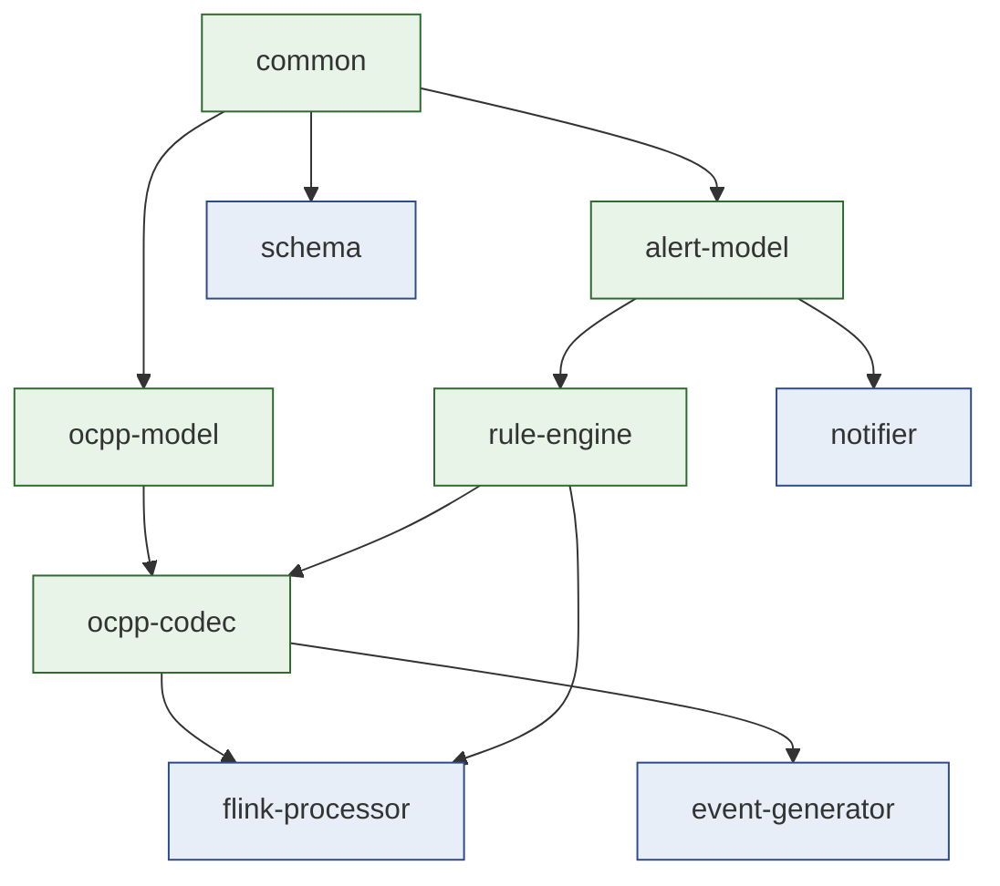
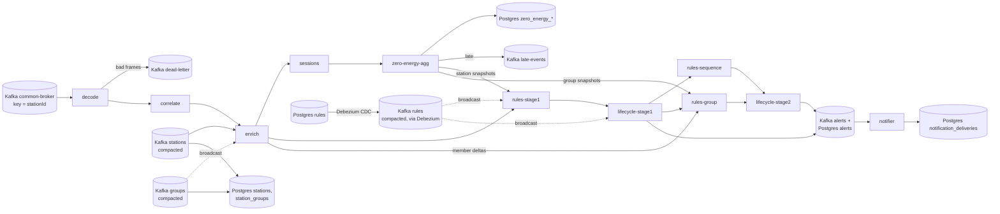
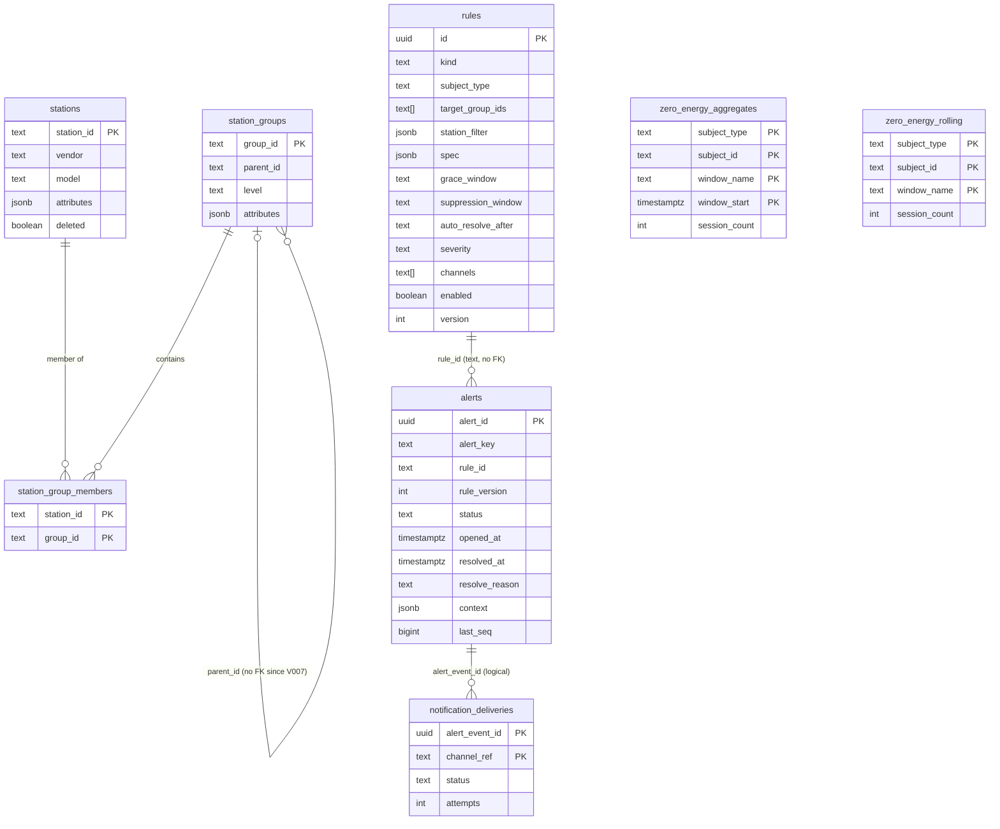

# 13. Architecture overview

**Goal.** After this chapter you can draw chargemon on a whiteboard from memory: which module
depends on which, where an OCPP frame enters and where an alert leaves, which Kafka topics and
Postgres tables sit in between, and which class to open when you want to change something. This
is the map for the rest of Track C; chapters 14 to 20 each zoom into one region of it.

**Prerequisites.** [Chapter 01](01-getting-started.md) (you have run the stack once),
[chapter 03](03-gradle-multi-module-build.md) (you know what a Gradle module is) and
[chapter 04](04-kafka-and-cdc-basics.md) (topics, keys, compaction, Debezium).

## Concepts (from scratch)

### A pipeline is a chain of small transformations

A *stream processor* is a program that never finishes. It reads records from a queue (here:
Kafka), transforms them one at a time, and writes results somewhere else. Each transformation
step is called an *operator*. Operators are wired into a directed graph; a record flows from the
source through the operators to one or more *sinks* (outputs). Chapter 05 explains the theory;
here you only need the picture: **source → operator → operator → sink**.

### The dependency rule

A *module* is a folder with its own `build.gradle.kts` that compiles to its own jar. Modules
depend on each other. The **dependency rule** says: dependencies point *inwards*, from the
technology-specific outside (Flink, Kafka, Spring, Postgres) to the technology-free core (plain
Java records and interfaces). The core never imports anything from the outside. The benefit is
that the core can be unit-tested in milliseconds with no broker, no database and no cluster.

In chargemon the innermost module is `common`, then `alert-model` and `ocpp-model`, then
`rule-engine` and `ocpp-codec`. Everything Flink-specific lives in `flink-processor`. The rule
engine does not know that OCPP exists: it evaluates a [`Fact`](glossary.md#fact), which is just
"give me the value at path X".

### Ports and adapters

When the core needs something from the outside (persistent state, a clock, a timer, a place to
emit results) it declares a small Java `interface`. That interface is called a **port**. A class
that implements the port for a specific technology is an **adapter**. The same port usually has
at least two adapters: a production one (Flink keyed state, Kafka) and a test one (a `HashMap`,
an `ArrayList`). This style is also called *hexagonal architecture*; the link is in Further
reading.

### Control plane and data plane

The **data plane** is the high-volume flow: OCPP frames in, alerts out. The **control plane** is
the low-volume configuration that shapes the data plane: which rules exist, which stations
exist, and which group each station belongs to. Control-plane data arrives on *compacted* Kafka
topics (chapter 04) so a freshly started job can replay the current picture.

### Stage 1 and stage 2

Some rules look at raw station events ("connector FAULTED"). Others look at *alerts produced by
other rules* ("two specific alerts open on the same station", or "10 percent of a region is
offline"). chargemon calls the first group **stage 1** and the second **stage 2**. Stage 2
consumes only stage-1 alerts, so there is exactly one level of nesting.

### Subjects

An alert is *about* something: one **station** or one **group** of stations. That thing is the
alert's **subject**. A station subject is written `STATION|ST-42`, a group subject
`GROUP|region:eu`.

## In this repo

### Modules and their dependency direction

Verified from each module's `build.gradle.kts`:

| Module | Depends on (project) | Role |
|---|---|---|
| [`common`](../common/build.gradle.kts) | nothing | Jackson factory, ISO-8601 durations, UUIDv7 ids, `Result`, `Env` |
| [`ocpp-model`](../ocpp-model/build.gradle.kts) | common | canonical `OcppEvent` records, `StationRecord`, `GroupRecord` |
| [`alert-model`](../alert-model/build.gradle.kts) | common | `AlertEvent`, `ConditionSignal`, `ChannelRef`, `RuleTiming`, `SubjectRef` |
| [`rule-engine`](../rule-engine/build.gradle.kts) | alert-model | condition AST, rule definitions, evaluators, lifecycle, windows. **No Flink, no OCPP** |
| [`ocpp-codec`](../ocpp-codec/build.gradle.kts) | ocpp-model, rule-engine | frame parsing, mappers, correlation, the `Fact` bridge (`OcppEventFact`) |
| [`schema`](../schema/build.gradle.kts) | common | Flyway migrations V001..V007 |
| [`flink-processor`](../flink-processor/build.gradle.kts) | common, ocpp-model, ocpp-codec, alert-model, rule-engine | the Flink 1.20 job |
| [`notifier`](../notifier/build.gradle.kts) | common, alert-model | Spring Boot consumer of `alerts` |
| [`event-generator`](../event-generator/build.gradle.kts) | common, ocpp-model, ocpp-codec | CLI that produces OCPP traffic |

The chain in one line, as the root README states it:
`common ← ocpp-model ← ocpp-codec` and `common ← alert-model ← rule-engine ← ocpp-codec`.
Note that `ocpp-codec` depends on `rule-engine` (it implements `Fact`), never the other way round.



Green boxes are pure Java. Blue boxes touch a technology (Flink, Spring, Kafka client, Flyway).

### Ports and their adapters

Every port below is an interface. Open the file, count the methods, and notice how small each
one is.

| Port (interface) | What the core needs | Production adapter | Test adapter |
|---|---|---|---|
| [`Fact`](../rule-engine/src/main/java/com/chargemon/rules/condition/Fact.java) | read a value by dotted path | [`OcppEventFact`](../ocpp-codec/src/main/java/com/chargemon/ocpp/codec/fact/OcppEventFact.java) | [`MapFact`](../rule-engine/src/testFixtures/java/com/chargemon/rules/fixtures/MapFact.java) |
| [`RuleContext`](../rule-engine/src/main/java/com/chargemon/rules/eval/RuleContext.java) | subject, group ids, state, timers, emit, clock | [`FlinkRuleContext`](../flink-processor/src/main/java/com/chargemon/flink/rules/FlinkRuleContext.java) | [`FakeRuleContext`](../rule-engine/src/testFixtures/java/com/chargemon/rules/fixtures/FakeRuleContext.java) |
| [`RuleStateStore`](../rule-engine/src/main/java/com/chargemon/rules/eval/RuleStateStore.java) | get/put/remove/clear per (rule, scope) | inner class of `FlinkRuleContext` over `MapState<String, byte[]>` | anonymous class over a `HashMap` in `FakeRuleContext` |
| [`RuleTimers`](../rule-engine/src/main/java/com/chargemon/rules/eval/RuleTimers.java) | schedule/cancel by [`TimerRef`](../rule-engine/src/main/java/com/chargemon/rules/eval/TimerRef.java) | inner class of `FlinkRuleContext` over Flink `TimerService` | `TreeMap<String, Instant>` in `FakeRuleContext` |
| [`Sources`](../flink-processor/src/main/java/com/chargemon/flink/source/Sources.java) | the four input streams plus a rule snapshot | [`KafkaSources`](../flink-processor/src/main/java/com/chargemon/flink/source/KafkaSources.java) | [`ListSources`](../flink-processor/src/test/java/com/chargemon/flink/topology/ListSources.java) |
| [`Sinks`](../flink-processor/src/main/java/com/chargemon/flink/sink/Sinks.java) | six output streams | [`ProductionSinks`](../flink-processor/src/main/java/com/chargemon/flink/sink/ProductionSinks.java) (Kafka + JDBC) | [`CollectingSinks`](../flink-processor/src/test/java/com/chargemon/flink/topology/CollectingSinks.java) |
| [`RuleLoader`](../flink-processor/src/main/java/com/chargemon/flink/control/RuleLoader.java) | initial rule snapshot at operator start | [`KafkaRuleLoader`](../flink-processor/src/main/java/com/chargemon/flink/control/KafkaRuleLoader.java) | `RuleLoader.of(list)` / `RuleLoader.none()` |
| [`PendingCallStore`](../ocpp-codec/src/main/java/com/chargemon/ocpp/codec/correlate/PendingCallStore.java) | park CALLs waiting for their result | `MapState` adapter inside [`CallCorrelationOperator`](../flink-processor/src/main/java/com/chargemon/flink/correlate/CallCorrelationOperator.java) | [`InMemoryPendingCallStore`](../ocpp-codec/src/testFixtures/java/com/chargemon/ocpp/codec/fixtures/InMemoryPendingCallStore.java) |

The `RuleContext` port is worth reading in full; it is the whole surface an evaluator can touch:

```java
public interface RuleContext {
    SubjectRef subject();
    Set<String> groupIds();
    RuleStateStore state();
    RuleTimers timers();
    void emit(ConditionSignal signal);
    Instant now();
}
```
(`rule-engine/src/main/java/com/chargemon/rules/eval/RuleContext.java:9`)

### Data flow, operator by operator

[`TopologyBuilder.build`](../flink-processor/src/main/java/com/chargemon/flink/topology/TopologyBuilder.java)
wires the graph. Each `.uid("...")` in that file is one operator. Read top to bottom:

| uid | Keyed by | Input type | Output type | Side output |
|---|---|---|---|---|
| `decode` | (not keyed, chained to source) | `KafkaRecord` | `DecodedFrame` | `DEAD_LETTER` |
| `correlate` | station id | `DecodedFrame` | `OcppEvent` | |
| `enrich` | station id + broadcast `groups` | `StationStreamElement` | `EnrichedEvent` | `MEMBER_DELTAS` |
| `sessions` | station id | `EnrichedEvent` | `SessionEnergy` | |
| `zero-energy-agg` | `SubjectKey` (station or group) | `SubjectSession` | `AggregateSnapshot` | `LATE` |
| `rules-stage1` | station id + broadcast `rules` | `RuleInput` | `ConditionSignal` | |
| `lifecycle-stage1` | `AlertKey` + broadcast `rules` | `ConditionSignal` | `AlertEvent` | |
| `rules-sequence` | station id (subject id) + broadcast `rules` | `AlertEvent` | `ConditionSignal` | |
| `rules-group` | group id + broadcast `rules` | `GroupInput` | `ConditionSignal` | |
| `lifecycle-stage2` | `AlertKey` + broadcast `rules` | `ConditionSignal` | `AlertEvent` | |

Stage 1 is `rules-stage1 → lifecycle-stage1`. Stage 2 is `rules-sequence` and `rules-group`
(fed by stage-1 `AlertEvent`s) followed by `lifecycle-stage2`. Both lifecycle operators are the
same class, [`AlertLifecycleOperator`](../flink-processor/src/main/java/com/chargemon/flink/lifecycle/AlertLifecycleOperator.java),
and both feed the same `sinks.alerts(...)` call:

```java
sinks.alerts(alerts.union(stage2Alerts));
```
(`flink-processor/src/main/java/com/chargemon/flink/topology/TopologyBuilder.java:163`)



Dotted arrows are *broadcast* streams: every parallel instance of the operator receives every
record (chapter 08). Solid arrows into a keyed operator are partitioned by the key in the table
above.

### Control plane: rules, stations, groups

- **Rules** are rows in the Postgres table `rules`. Debezium (chapter 04) watches the table and
  writes each change to the compacted Kafka topic `rules`, keyed by the row's `id`
  ([`deploy/debezium/rules-connector.json`](../deploy/debezium/rules-connector.json), transforms
  `unwrap,key,route`). The job broadcasts that topic to every rule and lifecycle operator, so an
  `UPDATE rules SET ...` takes effect within seconds and no restart is needed. On operator start
  [`RuleLoader`](../flink-processor/src/main/java/com/chargemon/flink/control/RuleLoader.java)
  first reads a full snapshot of the compacted topic, so no event is ever evaluated with an
  empty rule set.
- **Stations** and **groups** arrive on the compacted topics `stations` and `groups`. The
  `enrich` operator keeps the latest station record in keyed state and the whole group tree in
  broadcast state, and stamps every event with the station's vendor, model, attributes and the
  transitive list of group ids. The same two streams are mirrored into Postgres by JDBC sinks
  that call `upsert_station(jsonb)` and `upsert_group(jsonb)`.

### Subjects and the alert key

[`SubjectRef`](../alert-model/src/main/java/com/chargemon/alert/SubjectRef.java) is a record of
`(SubjectType type, String id)` whose `key()` is `type|id`, for example `STATION|ST-42`.
[`SubjectType`](../alert-model/src/main/java/com/chargemon/alert/SubjectType.java) has exactly two
values, `STATION` and `GROUP`. Stage-1 rules and `SEQUENCE` rules have station subjects;
`GROUP_AGGREGATE` rules have group subjects.

The lifecycle operator is keyed by
[`AlertKey`](../flink-processor/src/main/java/com/chargemon/flink/model/AlertKey.java)
`(ruleId, subjectType, subjectId)`. One key means one state machine, so one station can have
at most one open alert per rule. In the `alerts` table and topic the same identity appears as
the text `ruleId|subjectType|subjectId` (`alert_key` column, Kafka message key).

### Kafka topics and their keys

From [`deploy/docker-compose.yml`](../deploy/docker-compose.yml) (topic creation) and
[`JobConfig`](../flink-processor/src/main/java/com/chargemon/flink/config/JobConfig.java) (names):

| Topic (env var) | Key | Cleanup | Written by | Read by |
|---|---|---|---|---|
| `common-broker` (`TOPIC_EVENTS`) | station id | delete | upstream CSMS / event-generator | `decode` |
| `stations` (`TOPIC_STATIONS`) | station id | compact | registry / generator `--seed-master` | `enrich`, station mirror sink |
| `groups` (`TOPIC_GROUPS`) | group id | compact | registry / generator | `enrich` (broadcast), group mirror sink |
| `rules` (`TOPIC_RULES`) | rule id (uuid) | compact | Debezium from Postgres | broadcast to all rule + lifecycle operators |
| `alerts` (`TOPIC_ALERTS`) | alert key | delete | Kafka alerts sink | notifier |
| `dead-letter` (`TOPIC_DEAD_LETTER`) | source ref | delete | `decode` side output | humans / tooling |
| `late-events` (`TOPIC_LATE_EVENTS`) | (see chapter 17) | delete | `zero-energy-agg` side output | humans / tooling |
| `alerts-dlq` | | delete | notifier after retries are exhausted | humans / tooling |

The `alerts` key is set in `ProductionSinks.alerts` with `AlertEvent::alertKey`, so OPENED and
RESOLVED for the same alert land on the same partition, in order.

### Postgres tables and who writes them

Migrations live in [`schema/src/main/resources/db/migration/`](../schema/src/main/resources/db/migration/)
and run through Flyway (chapter 03 shows how `SchemaMigrator` is invoked).

| Migration | Table(s) | Written by | Read by |
|---|---|---|---|
| [V001](../schema/src/main/resources/db/migration/V001__stations.sql) | `stations` | Flink JDBC mirror via `upsert_station` | humans, dashboards |
| [V002](../schema/src/main/resources/db/migration/V002__station_groups.sql) | `station_groups`, `station_group_members`, procedures `upsert_station`, `upsert_group` | Flink JDBC mirror | humans, dashboards |
| [V003](../schema/src/main/resources/db/migration/V003__rules.sql) | `rules` (+ `rules_bump_version` trigger, `REPLICA IDENTITY FULL`) | humans / admin SQL | Debezium |
| [V004](../schema/src/main/resources/db/migration/V004__alerts.sql) | `alerts` | Flink JDBC sink (`ON CONFLICT ... WHERE alerts.last_seq < EXCLUDED.last_seq`); humans set `acked_*` | dashboards |
| [V005](../schema/src/main/resources/db/migration/V005__zero_energy.sql) | `zero_energy_aggregates`, `zero_energy_rolling` | Flink JDBC sink | dashboards |
| [V006](../schema/src/main/resources/db/migration/V006__notification_deliveries.sql) | `notification_deliveries` | notifier ([`JdbcDeliveryLedger`](../notifier/src/main/java/com/chargemon/notifier/ledger/JdbcDeliveryLedger.java)) | notifier |
| [V007](../schema/src/main/resources/db/migration/V007__group_parent_no_fk.sql) | drops the `parent_id` foreign key on `station_groups` | | |

Two details matter for later chapters. The `rules` trigger bumps `version` on every `UPDATE`,
which is how the job knows a rule changed. Durations in `rules` are ISO-8601 *text* (`PT10M`)
so Debezium ships them unchanged.



### Configuration surface

All job tunables are read once in
[`JobConfig.fromEnv`](../flink-processor/src/main/java/com/chargemon/flink/config/JobConfig.java)
and shipped to every operator as a serializable record. Defaults, verbatim from that file:

| Env var | Default | Used by |
|---|---|---|
| `KAFKA_BOOTSTRAP` | `localhost:9092` | all Kafka sources and sinks |
| `KAFKA_GROUP` | `chargemon-processor` | event source consumer group |
| `TOPIC_EVENTS` | `common-broker` | `decode` source |
| `TOPIC_STATIONS` | `stations` | `enrich`, mirror sink |
| `TOPIC_GROUPS` | `groups` | `enrich`, mirror sink |
| `TOPIC_RULES` | `rules` | rule broadcast, `RuleLoader` |
| `TOPIC_ALERTS` | `alerts` | alerts Kafka sink |
| `TOPIC_DEAD_LETTER` | `dead-letter` | decode side output sink |
| `TOPIC_LATE_EVENTS` | `late-events` | late sessions sink |
| `CORRELATION_TIMEOUT` | `PT60S` | `correlate` (CALL waits this long for its result) |
| `MAX_OUT_OF_ORDERNESS` | `PT5M` | watermark strategy (chapter 09) |
| `SOURCE_IDLENESS` | `PT1M` | watermark strategy |
| `PENDING_CALL_TTL` | `PT5M` | `correlate` state TTL |
| `STATION_STATE_TTL` | `P30D` | rule operators' keyed state TTL |
| `SESSION_TRACK_TTL` | `PT48H` | `sessions` state TTL |
| `CHECKPOINT_INTERVAL` | `PT30S` | `JobMain` |
| `PARALLELISM` | `0` (= cluster default) | `JobMain` |
| `DB_URL` | `jdbc:postgresql://localhost:5432/chargemon` | JDBC sinks |
| `DB_USER` | `chargemon` | JDBC sinks |
| `DB_PASSWORD` | `chargemon` | JDBC sinks |
| `ZERO_ENERGY_WINDOWS` | `hourly=TUMBLING_HOUR,daily=TUMBLING_DAY,rolling7d=ROLLING:P7D,rolling30d=ROLLING:P30D` | `zero-energy-agg`, aggregates sink |

The notifier is configured by Spring's
[`application.yml`](../notifier/src/main/resources/application.yml): `KAFKA_BOOTSTRAP`,
`DB_URL`/`DB_USER`/`DB_PASSWORD`, `TOPIC_ALERTS`, `NOTIFIER_CONCURRENCY`, `SMTP_HOST`/`SMTP_PORT`,
fallback channels per severity, and per-channel secrets. Chapter 19 covers it.

### Known limitations and where they live

| Limitation (root README) | Where in code |
|---|---|
| Fresh start: events before the `stations` replay are enriched as "unknown station" | [`StationEnrichmentOperator`](../flink-processor/src/main/java/com/chargemon/flink/enrich/StationEnrichmentOperator.java) increments the `unknownStationEvents` counter; `OcppEventFact` substitutes `StationContext.unknown(...)` |
| Group member counters converge on the station's next event | `enrich` emits `MEMBER_DELTAS` per station; [`GroupAggregateOperator`](../flink-processor/src/main/java/com/chargemon/flink/stage2/GroupAggregateOperator.java) keeps the count |
| Stage 2 consumes stage-1 alerts only | `TopologyBuilder` feeds `alerts` (not `stage2Alerts`) into `rules-sequence`/`rules-group`; [`RuleValidator.validateReferences`](../rule-engine/src/main/java/com/chargemon/rules/definition/RuleValidator.java) rejects stage-2 → stage-2 references |
| Editing a rule's condition does not reset evaluator state | `StationRuleEvaluatorOperator.processBroadcastElement` only updates the broadcast cache; per-station state is left to expire via TTL |

### Reading order for the rest of Track C

1. [Chapter 14](14-rule-engine-conditions-and-definitions.md): how a `rules` row becomes a `RuleDefinition`.
2. [Chapter 15](15-rule-engine-evaluators-and-windows.md): how a definition plus events becomes `ConditionSignal`s.
3. [Chapter 16](16-alert-lifecycle-and-alert-model.md): how signals become `AlertEvent`s.
4. [Chapter 17](17-flink-job-ingest-pipeline.md) and [chapter 18](18-flink-job-rules-lifecycle-sinks.md): the Flink adapters around all of the above.
5. [Chapter 19](19-notifier-spring-boot.md): what happens after the `alerts` topic.
6. [Chapter 20](20-deploy-generator-testing-extending.md): running and extending it.

## Diagrams

The three diagrams above (module graph, end-to-end flow, table relationships) are the ones to
redraw from memory. If you can reproduce the flowchart with its topic and table names, you have
the map.

## Hands-on exercises

### 1. Fill the operator table yourself

**What to do.** Close this chapter. Open
[`TopologyBuilder.java`](../flink-processor/src/main/java/com/chargemon/flink/topology/TopologyBuilder.java)
and, for every `.uid(...)`, write down: the key (look at the preceding `keyBy`), the input type,
the state it keeps (open the operator class and look for `ValueState`/`MapState` descriptors),
and the output type (the `.returns(...)` or the process function's generic parameters). Then
compare with the table in this chapter.

**What you should observe.** Ten operators; four of them are `connect`ed to the rules broadcast;
two share the class `AlertLifecycleOperator`; the only operator without a `keyBy` is `decode`.

**Hint.** `Types.POJO(AlertKey.class)` after a `keyBy` tells you the key type when the lambda is
not obvious.

### 2. List every environment variable and its default

**What to do.** Without looking at the table above, run
`grep -n 'env\.get' flink-processor/src/main/java/com/chargemon/flink/config/JobConfig.java`
and turn the output into a two-column list. Then do the same for
`notifier/src/main/resources/application.yml` (look for `${NAME:default}`).

**What you should observe.** 21 variables in `JobConfig`, all with defaults that match the local
docker-compose stack (`localhost:9092`, `chargemon`/`chargemon`). The notifier reuses the same
`KAFKA_BOOTSTRAP`, `DB_*` and `TOPIC_ALERTS` names, so one `.env` file can drive both.

**Hint.** `Env.getDuration` parses ISO-8601, so `CORRELATION_TIMEOUT=PT90S` is valid and
`CORRELATION_TIMEOUT=90` is not.

### 3. Trace two feature requests through the modules

**What to do.** For each request, list the modules and files you would touch, in dependency
order (innermost first). Use the "Extending" table in the root README as a starting point.

- (a) A new notification channel `sms:+4915…`.
- (b) A new OCPP action `FirmwareStatusNotification` that rules should match as
  `event.type == "FirmwareStatus"` with a typed `event.status` field.

**What you should observe.** (a) touches only `notifier` (a new `NotificationChannel` bean under
`notifier/.../channel/`, plus configuration in `application.yml`). `ChannelRef` already accepts any
lower-cased type prefix, so `alert-model`, `rule-engine` and the Flink job are untouched. (b)
touches `ocpp-model` (a new sealed record), `ocpp-codec` (a mapper per OCPP version plus a
`META-INF/services` line), and optionally `event-generator` (a scenario that emits it). The
rule engine is untouched because it only sees `Fact` paths, and until the mapper exists the
action is already matchable as a `GenericOcppEvent` via `event.payload.*`.

**Hint.** Ask "which module *imports* the type I am adding?" and stop at the first module that
does not need to.

## Self-check

1. Which module may import `org.apache.flink.*`, and which two modules must never import OCPP types?
2. A rule row is updated in Postgres. Name every hop until an evaluator sees the new version.
3. Why are `stations`, `groups` and `rules` compacted topics but `common-broker` is not?
4. What is the difference between `AlertKey` and `alertKey` (the string)?
5. Two `AlertEvent`s with the same `alert_id` arrive at the JDBC sink out of order. What prevents the older one from overwriting the newer?

<details><summary>Answers</summary>

1. Only `flink-processor` imports Flink. `alert-model` and `rule-engine` never see OCPP types; `rule-engine` sees only `Fact`.
2. Postgres `UPDATE` fires `rules_bump_version_trg` (version + 1) → Debezium reads the WAL via `pgoutput` → SMTs unwrap, key by `id`, route to topic `rules` → Flink broadcast source → `RuleBroadcast.apply` parses and validates → every rule and lifecycle operator's broadcast state.
3. Compacted topics keep the *latest* record per key forever, so a restarting job can replay the current set of stations, groups and rules. `common-broker` is an event log; old events are not needed to reconstruct anything, so it uses normal retention.
4. `AlertKey` is the Flink record `(ruleId, subjectType, subjectId)` used as the key of the lifecycle operator. `alertKey` is the same identity as one text string `ruleId|subjectType|subjectId`, used as the `alert_key` column and the Kafka message key.
5. The upsert in `JdbcSinks` ends with `WHERE alerts.last_seq < EXCLUDED.last_seq`; `seq` increases monotonically per alert key, so an older event is a no-op.

</details>

## Glossary terms

- [stage 1 / stage 2](glossary.md#stage-1--stage-2)
- [subject](glossary.md#subject)
- [alert key](glossary.md#alert-key)
- [compacted topic](glossary.md#compacted-topic)
- [Debezium](glossary.md#debezium)
- [CDC](glossary.md#cdc)
- [broadcast state](glossary.md#broadcast-state)
- [keyBy](glossary.md#keyby)
- [dead-letter topic](glossary.md#dead-letter-topic)
- [message key](glossary.md#message-key)
- [Fact](glossary.md#fact)
- [Flyway](glossary.md#flyway)
- [testFixtures](glossary.md#testfixtures)
- [delivery ledger](glossary.md#delivery-ledger)

## Further reading

- Alistair Cockburn, *Hexagonal architecture* (ports and adapters): <https://alistair.cockburn.us/hexagonal-architecture/>
- Flyway documentation: <https://documentation.red-gate.com/flyway>
- Debezium Postgres connector: <https://debezium.io/documentation/reference/stable/connectors/postgresql.html>
- Kafka log compaction: <https://kafka.apache.org/documentation/#compaction>
- Flink 1.20 DataStream overview: <https://nightlies.apache.org/flink/flink-docs-release-1.20/docs/dev/datastream/overview/>
- PostgreSQL `jsonb` type: <https://www.postgresql.org/docs/current/datatype-json.html>
