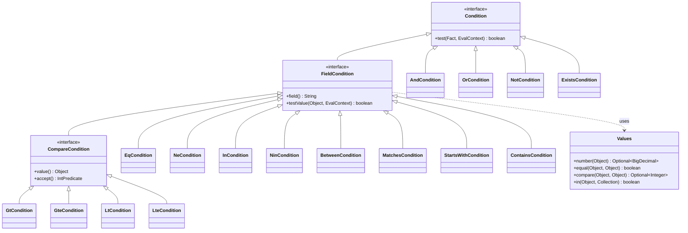
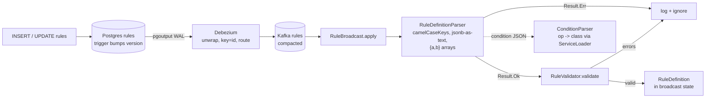

# 14. Rule engine: conditions and definitions

**Goal.** After this chapter you can read any row in the `rules` table and say exactly what it
means, write a new rule as SQL without guessing the JSON shape, and add a new condition operator
without touching any existing class. You will understand the two parsers (`ConditionParser`,
`RuleDefinitionParser`), the validator, and the small `Fact` interface that keeps the rule engine
independent of OCPP.

**Prerequisites.** [Chapter 12](12-ocpp-codec-parsing-mapping-correlation.md) (the `Fact` bridge
from OCPP events) and [chapter 13](13-architecture-overview.md) (where `rule-engine` sits).
[Chapter 02](02-java-21-for-this-repo.md) helps for records, sealed interfaces and Jackson.

## Concepts (from scratch)

### A predicate

A *predicate* is a yes/no question about some data: "is the status FAULTED?", "is the vendor
name starting with ACME?". In Java a predicate is a method that returns `boolean`.

### An abstract syntax tree (AST)

If rules were written in a programming language we would parse them into a tree: the top node
is `and`, its children are `eq` and `gt`, and so on. That tree is an **abstract syntax tree**.
chargemon skips the programming language and lets rule authors write the tree directly as JSON.
Every node is an object with an `"op"` property that names the operator; the other properties
are the operator's arguments. Leaf operators (`eq`, `gt`, ...) look at one field; branch
operators (`and`, `or`, `not`) combine other nodes.

### Polymorphic deserialization

Turning JSON into Java objects is called *deserialization*; Jackson is the library that does it.
When one JSON shape can become *several different* Java classes depending on a discriminator
property, that is **polymorphic deserialization**. Here the discriminator is `"op"`. Jackson
needs a table from `"op"` value to Java class; the rule engine builds that table at start-up.

### Type coercion

Rule authors type `"value": 2`, but the event may carry the connector id as the string `"2"`
or as a `long`. **Coercion** means converting both sides to a common type before comparing.
chargemon's rule is simple: if both sides parse as numbers, compare numerically; otherwise
compare as strings.

### ServiceLoader

Java's `ServiceLoader` is a built-in plugin mechanism. A jar declares "I provide an
implementation of interface X" in a text file under `META-INF/services/`, and at run time
`ServiceLoader.load(X.class)` finds every such declaration on the classpath. This is how new
operators and new rule kinds can be added from a separate jar without editing the core.

### Sealed interface

A `sealed interface` lists the only classes allowed to implement it. The compiler then knows
the complete set, so a `switch` over it must cover every case or it does not compile. The rule
engine uses this for `RuleSpec`: one record per rule kind, and nothing else can pretend to be a
spec.

## In this repo

### Fact, EvalContext and Values

[`Fact`](../rule-engine/src/main/java/com/chargemon/rules/condition/Fact.java) is one method:

```java
@FunctionalInterface
public interface Fact {
    Optional<Object> get(String path);
    static Fact empty() { return path -> Optional.empty(); }
}
```
(`rule-engine/src/main/java/com/chargemon/rules/condition/Fact.java:10`)

A path is a dotted string such as `event.status`, `station.vendor` or
`agg.zeroEnergy.daily`. `Optional.empty()` means "no such field". The production `Fact` is
`OcppEventFact` in `ocpp-codec` (chapter 12); tests use
[`MapFact`](../rule-engine/src/testFixtures/java/com/chargemon/rules/fixtures/MapFact.java), a
flat map from path to value.

[`EvalContext`](../rule-engine/src/main/java/com/chargemon/rules/condition/EvalContext.java) is a
record with one field, `Instant now`. It exists so that conditions stay *pure*: they never read
the system clock themselves.

[`Values`](../rule-engine/src/main/java/com/chargemon/rules/condition/Values.java) holds the
coercion rules that every field operator shares:

- `number(Object)` returns a `BigDecimal` for any `Number` or numeric-looking `String`.
- `equal(a, b)`: if either side is a `Boolean`, compare string forms; else if both are numeric,
  compare numerically (so `2`, `2.0` and `"2"` are equal); else compare strings, case-sensitive.
- `compare(a, b)`: numeric when both numeric, else string order; empty when not comparable.
- `in(actual, values)`: `actual` may itself be a collection (`station.allGroupIds`), in which
  case any element matching counts.

### The Condition interface

```java
@JsonTypeInfo(use = JsonTypeInfo.Id.NAME, property = "op")
public interface Condition {
    boolean test(Fact fact, EvalContext ctx);
}
```
(`rule-engine/src/main/java/com/chargemon/rules/condition/Condition.java:10`)

The `@JsonTypeInfo` annotation tells Jackson that the `op` property picks the concrete class.
Most operators extend
[`FieldCondition`](../rule-engine/src/main/java/com/chargemon/rules/condition/ops/FieldCondition.java),
which resolves `field()` once and returns `false` when the field is missing:

```java
default boolean test(Fact fact, EvalContext ctx) {
    Optional<Object> v = fact.get(field());
    return v.isPresent() && testValue(v.get(), ctx);
}
```
(`rule-engine/src/main/java/com/chargemon/rules/condition/ops/FieldCondition.java:16`)

That "missing means false" rule is important: `{"op":"ne","field":"event.x","value":1}` is
false when `event.x` does not exist. `not` is different: it wraps the whole inner result, so
`{"op":"not","arg":{"op":"eq","field":"event.x","value":1}}` is **true** for a missing field.
Use `exists` when you care about the difference.

### The 16 built-in operators

All live in [`condition/ops/`](../rule-engine/src/main/java/com/chargemon/rules/condition/ops/) and
are registered in [`BuiltinOperators`](../rule-engine/src/main/java/com/chargemon/rules/condition/ops/BuiltinOperators.java).

| `op` | Arguments | Semantics | Example |
|---|---|---|---|
| `and` | `args: [...]` | all children true; empty list is true | `{"op":"and","args":[A,B]}` |
| `or` | `args: [...]` | any child true; empty list is false | `{"op":"or","args":[A,B]}` |
| `not` | `arg: {...}` | negates the child; null child is true | `{"op":"not","arg":A}` |
| `eq` | `field, value` | `Values.equal` | `{"op":"eq","field":"event.status","value":"FAULTED"}` |
| `ne` | `field, value` | not `Values.equal` (field must exist) | `{"op":"ne","field":"event.status","value":"PREPARING"}` |
| `gt` | `field, value` | `Values.compare > 0` | `{"op":"gt","field":"event.value","value":12}` |
| `gte` | `field, value` | `compare >= 0` | `{"op":"gte","field":"agg.zeroEnergy.daily","value":3}` |
| `lt` | `field, value` | `compare < 0` | `{"op":"lt","field":"event.value","value":12}` |
| `lte` | `field, value` | `compare <= 0` | `{"op":"lte","field":"event.connectorId","value":2}` |
| `in` | `field, values: [...]` | `Values.in` | `{"op":"in","field":"event.errorCode","values":["InternalError","SecurityError"]}` |
| `nin` | `field, values: [...]` | not `Values.in` (field must exist) | `{"op":"nin","field":"event.status","values":["AVAILABLE"]}` |
| `between` | `field, min, max` | inclusive range | `{"op":"between","field":"event.value","min":10,"max":13}` |
| `matches` | `field, pattern` | regex `find()` on string form; pattern compiled at parse time | `{"op":"matches","field":"station.vendor","pattern":"^ACME"}` |
| `exists` | `field` | field present | `{"op":"exists","field":"event.status"}` |
| `startsWith` | `field, value` | string prefix | `{"op":"startsWith","field":"station.vendor","value":"ACME"}` |
| `contains` | `field, value` | substring for strings, membership for collections | `{"op":"contains","field":"station.allGroupIds","value":"site:1"}` |

Two implementation notes. `gt/gte/lt/lte` share
[`CompareCondition`](../rule-engine/src/main/java/com/chargemon/rules/condition/ops/CompareCondition.java),
which turns `Values.compare` into a boolean through an `IntPredicate`.
[`MatchesCondition`](../rule-engine/src/main/java/com/chargemon/rules/condition/ops/MatchesCondition.java)
compiles the regex in its constructor and throws `IllegalArgumentException` on a bad pattern, so
an invalid regex is rejected when the rule is parsed, not when the first event arrives.

The complete list of accepted inputs is exercised in
[`ConditionParserTest`](../rule-engine/src/test/java/com/chargemon/rules/condition/ConditionParserTest.java),
one JSON string per operator; that test is the fastest way to check a JSON shape.



### ConditionParser, BuiltinOperators and ServiceLoader

[`ConditionOperatorProvider`](../rule-engine/src/main/java/com/chargemon/rules/condition/ConditionOperatorProvider.java)
is the extension port: one method returning `Map<String, Class<? extends Condition>>`.
[`ConditionParser.fromServiceLoader()`](../rule-engine/src/main/java/com/chargemon/rules/condition/ConditionParser.java)
collects every provider and registers each `(op, class)` pair with Jackson:

```java
public static ConditionParser of(Collection<? extends ConditionOperatorProvider> providers) {
    ObjectMapper m = JsonMapperFactory.standard().copy();
    for (ConditionOperatorProvider p : providers) {
        p.operators().forEach((op, type) -> m.registerSubtypes(new NamedType(type, op)));
    }
    return new ConditionParser(m);
}
```
(`rule-engine/src/main/java/com/chargemon/rules/condition/ConditionParser.java:27`)

The one built-in provider is declared in
[`META-INF/services/com.chargemon.rules.condition.ConditionOperatorProvider`](../rule-engine/src/main/resources/META-INF/services/com.chargemon.rules.condition.ConditionOperatorProvider),
a single line naming `BuiltinOperators`. Any jar on the classpath can add another line in its
own copy of that file. Parse failures (unknown `op`, bad regex, malformed JSON) surface as
`ConditionParser.ConditionParseException`.

### RuleDefinition and RuleTiming

[`RuleDefinition`](../rule-engine/src/main/java/com/chargemon/rules/definition/RuleDefinition.java)
is the parsed, immutable form of one `rules` row:

| Field | Type | Meaning |
|---|---|---|
| `id` | `String` | the row's uuid, used as the rule id everywhere downstream |
| `name` | `String` | human label, copied onto every alert |
| `kind` | [`RuleKind`](../rule-engine/src/main/java/com/chargemon/rules/definition/RuleKind.java) | `EVENT`, `ABSENCE`, `STATE_DURATION` (stage 1), `SEQUENCE`, `GROUP_AGGREGATE` (stage 2) |
| `subjectType` | `SubjectType` | `STATION` or `GROUP`; defaults to `GROUP` for `GROUP_AGGREGATE`, else `STATION` |
| `targetGroupIds` | `Set<String>` | empty = everywhere; otherwise the station's transitive groups must intersect it |
| `stationFilter` | `Condition` or null | extra condition on `station.*` |
| `spec` | [`RuleSpec`](../rule-engine/src/main/java/com/chargemon/rules/definition/RuleSpec.java) | kind-specific parameters |
| `timing` | [`RuleTiming`](../alert-model/src/main/java/com/chargemon/alert/RuleTiming.java) | `graceWindow`, `suppressionWindow`, `autoResolveAfter` |
| `severity` | `Severity` | `CRITICAL`, `HIGH`, `MEDIUM`, `LOW`, `INFO` |
| `channels` | `List<ChannelRef>` | `type:target` strings, e.g. `slack:#ops` |
| `enabled` | `boolean` | disabled rules are treated as removed (chapter 16, `RULE_DISABLED`) |
| `version` | `int` | bumped by the Postgres trigger on every update |

`RuleTiming` normalises nulls to `Duration.ZERO` for grace and suppression and rejects negative
durations. `autoResolveAfter` stays `null` when absent, meaning "never".

`RuleKind` carries its stage number: `EVENT(1), ABSENCE(1), STATE_DURATION(1), SEQUENCE(2),
GROUP_AGGREGATE(2)`. The validator uses `stage()` to forbid stage-2 rules referencing other
stage-2 rules.

### RuleSpec: one record per kind

`RuleSpec` is sealed with exactly five permitted records. The JSON shape of each `spec` column
value, as documented in the root README:

```jsonc
EVENT           {"trigger":{"actions":["StatusNotification"]} | {"aggregate":"zeroEnergy"}, "condition":AST, "clear":AST|null}
ABSENCE         {"expectedAction":"Heartbeat","within":"PT10M","onlyIf":AST|null}          // "*" = any action
STATE_DURATION  {"enter":AST,"exit":AST,"maxDuration":"PT30M","scopeField":"event.connectorId"}
SEQUENCE        {"allOf":["ruleA","ruleB"],"within":"PT15M"}                                // stage-1 rule ids, same station
GROUP_AGGREGATE {"source":{"type":"alerts","ruleId":"…"} | {"type":"zeroEnergy","window":"rolling7d"},
                 "window":"PT1H","threshold":{"count":10} | {"percent":20}}                // subjectType GROUP
```

Mapping to Java records:

| Kind | Record | Components |
|---|---|---|
| `EVENT` | `EventSpec` | `Trigger trigger` (`Set<String> actions`, `String aggregate`), `Condition condition`, `Condition clear` |
| `ABSENCE` | `AbsenceSpec` | `String expectedAction`, `Duration within`, `Condition onlyIf` |
| `STATE_DURATION` | `StateDurationSpec` | `Condition enter`, `Condition exit`, `Duration maxDuration`, `String scopeField` |
| `SEQUENCE` | `SequenceSpec` | `List<String> allOf`, `Duration within` |
| `GROUP_AGGREGATE` | `GroupAggregateSpec` | `AggregateSource source` (`type`, `ruleId`, `window`), `Duration window`, `Threshold threshold` (`Integer count`, `Double percent`) |

`Trigger.matchesAction` treats `"*"` as "any action". The `trigger` property also accepts a bare
string (`"trigger":"Heartbeat"`) as shorthand for one action.

### RuleDefinitionParser: from Debezium row to record

[`RuleDefinitionParser.parse(JsonNode)`](../rule-engine/src/main/java/com/chargemon/rules/definition/RuleDefinitionParser.java)
accepts either a hand-written JSON document or the row shape Debezium produces. It returns a
`Result<RuleDefinition, String>`: `Ok` with the definition or `Err` with a message, never an
exception. Three quirks of Debezium rows are handled explicitly:

1. **Column names are snake_case.** `camelCaseKeys` rewrites `grace_window` to `graceWindow`,
   `target_group_ids` to `targetGroupIds`, and so on, before anything else looks at the row.
2. **`jsonb` may arrive as a string.** `specNode` and `condition` check `isTextual()` and parse
   the text again:

```java
if (spec.isTextual()) {       // Debezium may deliver jsonb as a string
    try {
        return json.readTree(spec.asText());
    } catch (IOException e) {
        throw new IllegalArgumentException("spec is not JSON: " + e.getMessage());
    }
}
```
(`rule-engine/src/main/java/com/chargemon/rules/definition/RuleDefinitionParser.java:121`)

3. **`text[]` may arrive as `{a,b}`.** `strings()` strips the braces, splits on commas and
   removes quotes; it also accepts a JSON array or a JSON-array-as-string.

Durations go through `Durations.parse`, a thin wrapper over `java.time.Duration.parse`, so
`PT2M`, `PT30S`, `P7D` and `PT1H30M` are all valid; `120` is not. The per-kind switch in
`parseSpec` is deliberately explicit so that adding a kind is a compile error until the new
case exists.

[`RuleDefinitionParserTest.acceptsDebeziumStyleTextColumns`](../rule-engine/src/test/java/com/chargemon/rules/definition/RuleDefinitionParserTest.java)
feeds a row with `"target_group_ids":"{site:1,site:2}"` and a `spec` given as an escaped
string, and asserts the parsed set and channel count.

### RuleValidator: what a well-formed rule must satisfy

[`RuleValidator.validate`](../rule-engine/src/main/java/com/chargemon/rules/definition/RuleValidator.java)
returns a list of error strings; empty means valid. The checks, verbatim from the file:

| Applies to | Check | Error text |
|---|---|---|
| all | name not blank | `name is blank` |
| `GROUP_AGGREGATE` | subject type is `GROUP` | `GROUP_AGGREGATE rules must have subjectType GROUP` |
| every other kind | subject type is `STATION` | `<KIND> rules must have subjectType STATION` |
| all | `spec.kind() == kind` | `spec kind X does not match rule kind Y` |
| `EVENT` | `condition` present | `EVENT.condition is required` |
| `EVENT` | trigger has actions or an aggregate | `EVENT.trigger needs actions or aggregate` |
| `ABSENCE` | `within` positive | `ABSENCE.within must be a positive duration` |
| `STATE_DURATION` | `enter` present | `STATE_DURATION.enter is required` |
| `STATE_DURATION` | `exit` present | `STATE_DURATION.exit is required` |
| `STATE_DURATION` | `maxDuration` positive | `STATE_DURATION.maxDuration must be a positive duration` |
| `SEQUENCE` | at least two ids in `allOf` | `SEQUENCE.allOf needs at least two rule ids` |
| `SEQUENCE` | `within` positive | `SEQUENCE.within must be a positive duration` |
| `GROUP_AGGREGATE` | `source.type` present | `GROUP_AGGREGATE.source.type is required` |
| `GROUP_AGGREGATE` | `alerts` source has `ruleId` | `GROUP_AGGREGATE.source.ruleId is required for alerts source` |
| `GROUP_AGGREGATE` | `zeroEnergy` source has `window` | `GROUP_AGGREGATE.source.window is required for zeroEnergy source` |
| `GROUP_AGGREGATE` | exactly one of `count` / `percent` | `GROUP_AGGREGATE.threshold needs exactly one of count / percent` |
| `GROUP_AGGREGATE` | `percent` only with `alerts` source | `GROUP_AGGREGATE.threshold.percent is only valid for the alerts source` |
| `GROUP_AGGREGATE` | `alerts` source has positive `window` | `GROUP_AGGREGATE.window must be a positive duration for alerts source` |

`validateReferences(rule, known)` is the cross-rule check for stage 2: every referenced id
(`allOf`, or `source.ruleId`) must not be a known stage-2 rule and must not be the rule itself.
A reference to an *unknown* id is tolerated because the referenced rule may simply arrive later
on the topic.

In production both are called from
[`RuleBroadcast`](../flink-processor/src/main/java/com/chargemon/flink/control/RuleBroadcast.java)
(`parser.parse` then `validator.validate`); a rule that fails is logged and ignored, and the
previous version stays active.



### The six sample rules, column by column

[`deploy/local/sample-rules.sql`](../deploy/local/sample-rules.sql) inserts six rows with the
columns `(id, name, kind, subject_type, spec, grace_window, suppression_window, severity,
channels)`. Everything not listed takes its column default (`target_group_ids = '{}'`,
`station_filter = NULL`, `auto_resolve_after = NULL`, `enabled = TRUE`, `version = 1`).

| # | name | kind | spec (what it says) | grace | suppression | severity | channels |
|---|---|---|---|---|---|---|---|
| 1 | Connector faulted | `EVENT` | on `StatusNotification`, `event.status eq FAULTED`; no `clear`, so a later non-FAULTED status clears | `PT0S` | `PT10M` | `HIGH` | `{email:ops@example.test}` |
| 2 | No heartbeat 2 min | `ABSENCE` | expect `Heartbeat` within `PT2M` | `PT30S` | `PT15M` | `CRITICAL` | `{email:oncall@example.test}` |
| 3 | Stuck preparing | `STATE_DURATION` | enter `status eq PREPARING`, exit `status ne PREPARING`, `maxDuration PT3M`, one timer per `event.connectorId` | `PT0S` | `PT30M` | `MEDIUM` | `{}` |
| 4 | Boot rejected | `EVENT` | on `BootCompleted`, `event.status eq REJECTED` | `PT0S` | `PT1H` | `HIGH` | `{}` |
| 5 | Zero-energy sessions today | `EVENT` | trigger is the aggregate `zeroEnergy`; `agg.zeroEnergy.daily gte 3` | `PT0S` | `PT6H` | `LOW` | `{}` |
| 6 | CSMS call errors | `EVENT` | on `CallFailed`, `event.errorCode in [InternalError, SecurityError]` | `PT0S` | `PT5M` | `MEDIUM` | `{}` |

Read rule 2 against the lifecycle (chapter 16): the evaluator raises TRIGGERED two minutes after
the last heartbeat; the alert opens 30 seconds later if no heartbeat has arrived in between;
once resolved, a new alert for the same station is muted for 15 minutes. Rules with empty
`channels` are still written to Kafka and Postgres; the notifier then uses its severity-based
fallback channels (chapter 19).

`subject_type` is `STATION` for all six; none is a stage-2 rule. The `RuleFixtures` class in
[`rule-engine/src/testFixtures/`](../rule-engine/src/testFixtures/java/com/chargemon/rules/fixtures/RuleFixtures.java)
has JSON equivalents of these plus a `SEQUENCE` and a `GROUP_AGGREGATE` example.

## Diagrams

See the class diagram of `Condition` and the operators, and the row-to-definition flowchart,
above.

## Hands-on exercises

### 1. Write a rule as SQL

**What to do.** Write an `INSERT INTO rules` for: "a `StatusNotification` with status `Faulted`
on any station whose vendor is `ACME`, alert `HIGH` after it has stayed true for 5 minutes,
mute repeats for 30 minutes, notify `slack:#ops`". Use `station_filter` for the vendor. Apply it
with `docker compose -f deploy/docker-compose.yml exec -T postgres psql -U chargemon -d chargemon`
and check the `rules` Kafka topic in Kafka UI (http://localhost:8090).

**What you should observe.** A new record on the `rules` topic keyed by the uuid, with
`grace_window` as the text `PT5M` and `spec`/`station_filter` as JSON. Note that
`event.status` values are the canonical enum names (`FAULTED`, upper case), so an `eq` on
`"Faulted"` never matches; `Values.equal` is case-sensitive.

**Hint.**

```sql
INSERT INTO rules (name, kind, subject_type, station_filter, spec, grace_window, suppression_window, severity, channels)
VALUES ('ACME faulted 5 min', 'EVENT', 'STATION',
        '{"op":"eq","field":"station.vendor","value":"ACME"}',
        '{"trigger":{"actions":["StatusNotification"]},"condition":{"op":"eq","field":"event.status","value":"FAULTED"}}',
        'PT5M', 'PT30M', 'HIGH', '{slack:#ops}');
```

### 2. Add an `endsWith` operator without editing BuiltinOperators

**What to do.** Create, in `rule-engine`:

1. `src/main/java/com/chargemon/rules/condition/ops/EndsWithCondition.java`: a record
   `(String field, String value)` implementing `FieldCondition` with `OP = "endsWith"`, modelled
   on `StartsWithCondition`.
2. `src/main/java/com/chargemon/rules/condition/ops/ExtraOperators.java` implementing
   `ConditionOperatorProvider` and returning `Map.of("endsWith", EndsWithCondition.class)`.
3. A second line in
   `src/main/resources/META-INF/services/com.chargemon.rules.condition.ConditionOperatorProvider`
   naming `ExtraOperators`.
4. A new `@CsvSource` row in `ConditionParserTest`:
   `{"op":"endsWith","field":"station.vendor","value":"Corp"}|true`.

Run `./gradlew :rule-engine:test --tests '*ConditionParserTest*'`.

**What you should observe.** The test passes without any change to `BuiltinOperators` or
`ConditionParser`; `ServiceLoader` found the second provider. Remove the services line and the
same test fails with `ConditionParseException` for the unknown `op`.

**Hint.** `roundTripsToJson` will also cover your operator if you add it to that JSON string;
records get Jackson serialisation for free, which is why the built-in operators are records.

### 3. Reject sub-second `within` in the validator

**What to do.** In `RuleValidator.validate`, for `AbsenceSpec` and `SequenceSpec`, add an error
`"... within must be at least PT1S"` when `within` is shorter than one second. Add a test in
`RuleDefinitionParserTest` that parses `RuleFixtures.heartbeatAbsenceRule("a", "PT0.5S")` and
asserts the error text is present.

**What you should observe.** The existing `parsesEveryKindAndDefaultsSubjectType` test still
passes (its `within` values are minutes), and your new test sees exactly one error.

**Hint.** `Duration.compareTo(Duration.ofSeconds(1)) < 0`. Keep the existing "positive" check
first so a null `within` reports one clear error and not two.

## Self-check

1. `{"op":"ne","field":"event.vendorErrorCode","value":"none"}` is evaluated on an event that has no `vendorErrorCode`. True or false, and why?
2. Does `{"op":"eq","field":"event.connectorId","value":"2"}` match a connector id stored as the number `2`?
3. Where does the rule engine learn that `"op":"matches"` means `MatchesCondition`?
4. A Debezium row arrives with `"channels":"{slack:#a,email:ops@x.io}"`. Which method turns it into two `ChannelRef`s?
5. Rule Q is a `SEQUENCE` over rules A and B. B is not yet on the topic. Is Q rejected?

<details><summary>Answers</summary>

1. False. `FieldCondition.test` returns `false` whenever the field is absent, regardless of operator. Use `{"op":"not","arg":{"op":"eq",...}}` or `exists` if "missing" should count as "not equal".
2. Yes. `Values.equal` parses both sides with `BigDecimal` when possible, so the string `"2"` and the number `2` compare equal.
3. From `BuiltinOperators.operators()`, discovered through `ServiceLoader` by `ConditionParser.fromServiceLoader()` and registered with Jackson as a `NamedType("matches")` for the `@JsonTypeInfo(property = "op")` on `Condition`.
4. `RuleDefinitionParser.strings(JsonNode)` strips the `{}` and splits on commas; the parser then calls `ChannelRef.parse` on each piece.
5. No. `validateReferences` only errors when a referenced id is *known* and is not stage 1, or when a rule references itself. Unknown ids are tolerated; Q simply cannot trigger until B's alerts appear.

</details>

## Glossary terms

- [condition AST](glossary.md#condition-ast)
- [Fact](glossary.md#fact)
- [field path](glossary.md#field-path)
- [rule kind](glossary.md#rule-kind)
- [station filter](glossary.md#station-filter)
- [target groups](glossary.md#target-groups)
- [ServiceLoader](glossary.md#serviceloader)
- [sealed interface](glossary.md#sealed-interface)
- [record](glossary.md#record)
- [Result](glossary.md#result)
- [Debezium](glossary.md#debezium)
- [ChannelRef](glossary.md#channelref)
- [grace window](glossary.md#grace-window)
- [suppression window](glossary.md#suppression-window)

## Further reading

- Jackson polymorphic deserialization (`@JsonTypeInfo`, `registerSubtypes`): <https://github.com/FasterXML/jackson-docs/wiki/JacksonPolymorphicDeserialization>
- `java.util.ServiceLoader` javadoc: <https://docs.oracle.com/en/java/javase/21/docs/api/java.base/java/util/ServiceLoader.html>
- JEP 409, sealed classes: <https://openjdk.org/jeps/409>
- `java.time.Duration.parse` (ISO-8601 durations): <https://docs.oracle.com/en/java/javase/21/docs/api/java.base/java/time/Duration.html#parse(java.lang.CharSequence)>
- PostgreSQL `jsonb` operators: <https://www.postgresql.org/docs/current/functions-json.html>
- Debezium `ExtractNewRecordState` transformation: <https://debezium.io/documentation/reference/stable/transformations/event-flattening.html>
