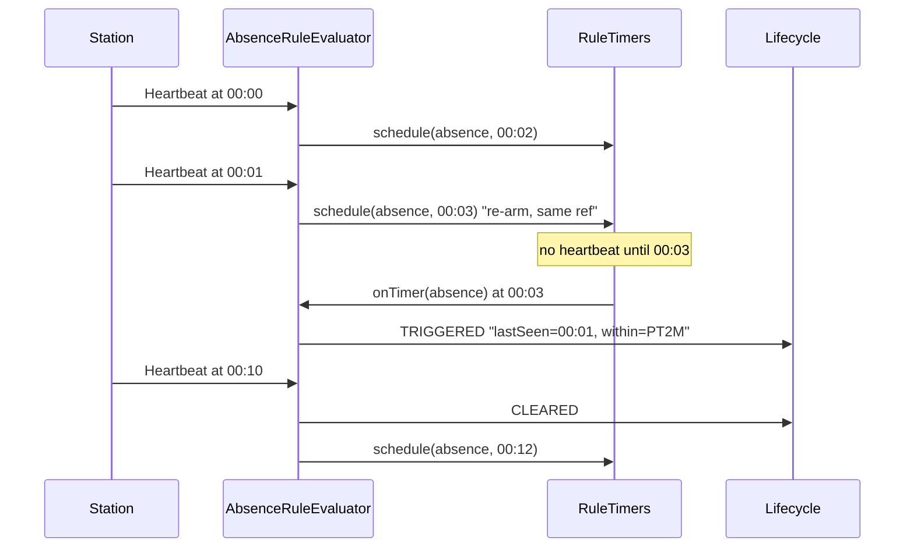
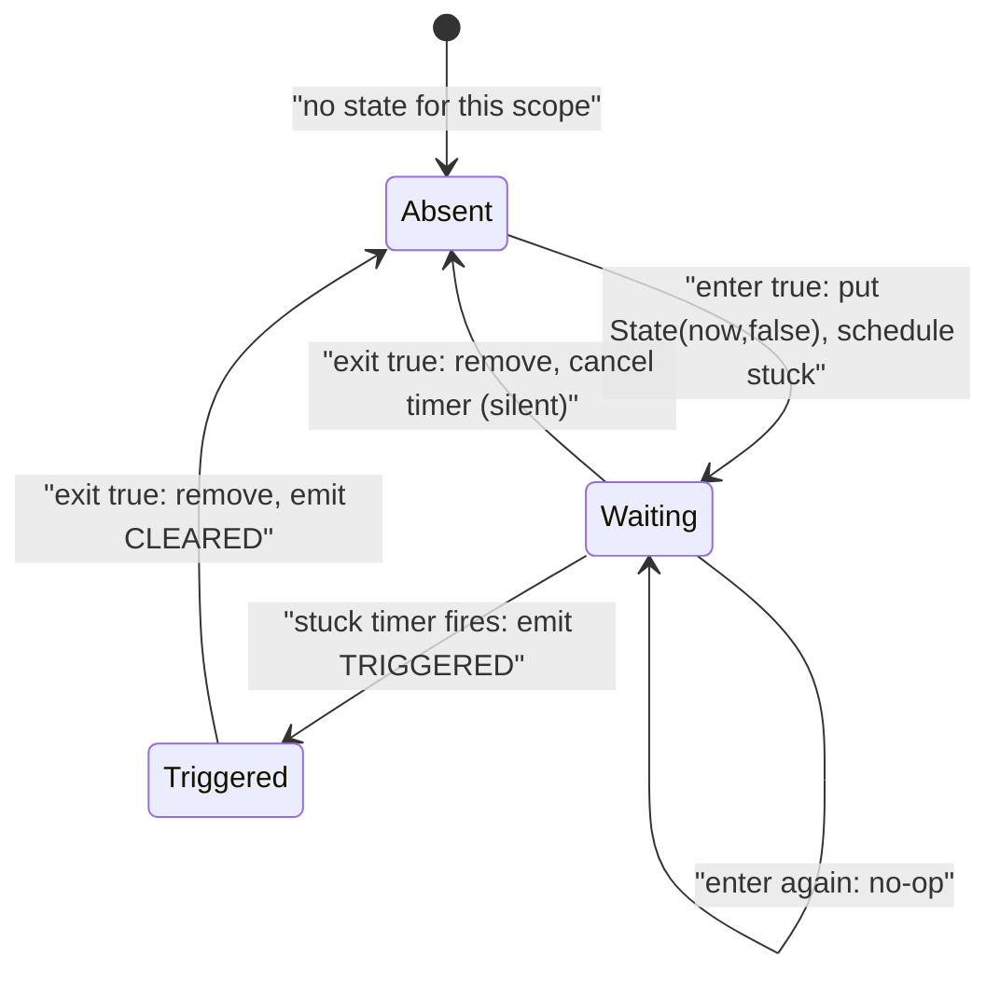
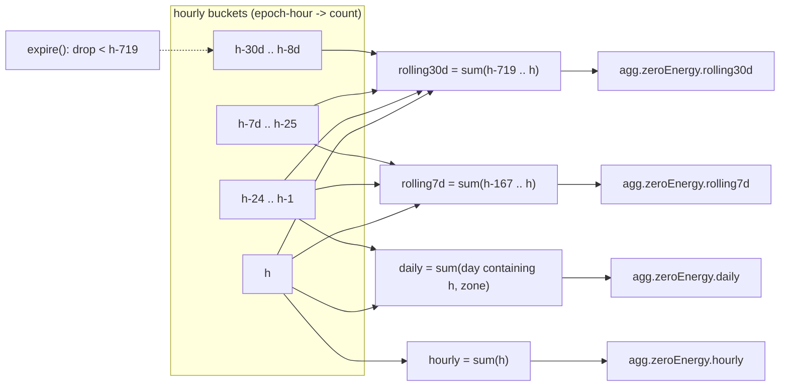

# 15. Rule engine: evaluators and windows

**Goal.** After this chapter you can explain, for each of the five rule kinds, exactly which
inputs it reacts to, what it stores between inputs, when it sets a timer, and when it emits a
`TRIGGERED` or `CLEARED` signal. You can also explain how zero-energy sessions are counted per
hour and rolled up into the `agg.zeroEnergy.*` values that rules read, and you can write a unit
test for an evaluator using the in-memory fakes.

**Prerequisites.** [Chapter 14](14-rule-engine-conditions-and-definitions.md) (`RuleDefinition`,
`RuleSpec`, conditions) and [chapter 05](05-stream-processing-concepts.md) (state, timers,
processing time versus event time).

## Concepts (from scratch)

### Edge-triggered versus level-triggered

A *level-triggered* system reports "the condition is true" on every event while it holds. An
*edge-triggered* system reports only the two transitions: false-to-true and true-to-false.
chargemon evaluators are edge-triggered. They emit `TRIGGERED` once when the condition becomes
true and `CLEARED` once when it becomes false, and stay silent in between. That is why every
evaluator must remember at least one bit of state: "am I currently triggered?"

### State and scope

*State* is whatever the evaluator needs to remember between two inputs for the same station.
State is addressed by `(ruleId, scope)`. The *scope* is a sub-key within one station: for most
kinds it is the empty string; for `STATE_DURATION` it is the connector id, so that connector 1
and connector 2 of the same station have independent timers.

### Timers

A *timer* is a request: "call me back at time T". The rule engine only asks for timers through
the `RuleTimers` port; the Flink adapter registers them as processing-time timers (chapter 07).
A timer has an identity, [`TimerRef`](../rule-engine/src/main/java/com/chargemon/rules/eval/TimerRef.java)
`(ruleId, scope, tag)`, and scheduling the same ref again *replaces* the earlier deadline. That
is how "re-arm" works for absence rules.

### Processing time

Evaluators read the clock through `ctx.now()`, which is *processing time*: the wall clock of
the machine running the operator, not the timestamp inside the event. Absence and duration
rules therefore measure "no heartbeat for 2 minutes of real time", which is what an operator
watching a dashboard expects.

### Tumbling and rolling windows

A *window* is a time range over which values are summed. A **tumbling** window has fixed
boundaries that do not overlap: "this hour", "today". A **rolling** window slides with time:
"the last 7 days, ending now". Chapter 05 covers Flink's own window operators; chargemon does
not use them for zero-energy counts (see why below).

## In this repo

### The ports an evaluator can use

Everything an evaluator may touch is the [`RuleContext`](../rule-engine/src/main/java/com/chargemon/rules/eval/RuleContext.java)
port shown in chapter 13: `subject()`, `groupIds()`, `state()`, `timers()`, `emit(...)`,
`now()`. Two sub-ports:

- [`RuleStateStore`](../rule-engine/src/main/java/com/chargemon/rules/eval/RuleStateStore.java):
  `get(ruleId, scope, Class<T>)`, `put`, `remove`, `clear(ruleId)`. Values must be
  JSON-serializable; each evaluator declares a small `record State(...)`.
- [`RuleTimers`](../rule-engine/src/main/java/com/chargemon/rules/eval/RuleTimers.java):
  `schedule(TimerRef, Instant)`, `cancel(TimerRef)`, `cancelAll(ruleId)`.

Inputs are wrapped in [`StationInput`](../rule-engine/src/main/java/com/chargemon/rules/eval/StationInput.java):
`kind` (`EVENT` or `AGGREGATE`), `name` (the action, or the aggregate source such as
`zeroEnergy`), the `Fact`, the event time, and the station's group ids (copied onto signals).

### The stage-1 contract

```java
public interface StationRuleKindEvaluator<S extends RuleSpec> {
    RuleKind kind();
    Class<S> specType();
    void onInput(RuleDefinition rule, S spec, StationInput input, RuleContext ctx);
    void onTimer(RuleDefinition rule, S spec, TimerRef ref, RuleContext ctx);
    default void onRuleRemoved(RuleDefinition rule, RuleContext ctx) {
        ctx.state().clear(rule.id());
        ctx.timers().cancelAll(rule.id());
    }
    ...
}
```
(`rule-engine/src/main/java/com/chargemon/rules/eval/StationRuleKindEvaluator.java:11`)

Implementations are stateless objects; all per-station memory goes through `ctx.state()`. The
`dispatchInput`/`dispatchTimer` default methods cast `rule.spec()` to the evaluator's spec type
so the Flink operator does not need to know about the generic.

[`EvaluatorRegistry.fromServiceLoader()`](../rule-engine/src/main/java/com/chargemon/rules/eval/EvaluatorRegistry.java)
finds the three implementations listed in
[`META-INF/services/com.chargemon.rules.eval.StationRuleKindEvaluator`](../rule-engine/src/main/resources/META-INF/services/com.chargemon.rules.eval.StationRuleKindEvaluator)
and indexes them by `RuleKind`; two evaluators for the same kind is an `IllegalStateException`.

[`EvaluatorSupport`](../rule-engine/src/main/java/com/chargemon/rules/eval/kinds/EvaluatorSupport.java)
builds the output for all three: `triggered(rule, ctx, input, context)` emits
`ConditionSignal.triggered(rule.id(), rule.version(), ctx.subject(), ctx.now(), context, groups)`
where `groups` comes from the input if there is one, else from `ctx.groupIds()` (timer-driven
signals have no input). `cleared(rule, ctx)` emits the matching `CLEARED`.

### EVENT: a predicate with one bit of memory

[`EventRuleEvaluator`](../rule-engine/src/main/java/com/chargemon/rules/eval/kinds/EventRuleEvaluator.java),
state `record State(boolean triggered)`, scope `""`, no timers.

1. Ignore the input unless `trigger.matchesAction(name)` (events) or
   `trigger.matchesAggregate(name)` (aggregates).
2. `matches = condition.test(fact)`. If it matches and we were not triggered: store
   `State(true)`, emit `TRIGGERED` with a context map of `input`, `event.type`, `event.status`,
   `event.errorCode`, `event.connectorId` (whichever exist).
3. Otherwise compute `clears`: if `clear` is null, `clears = !matches`; else
   `clears = clear.test(fact)`. If we were triggered and it clears: remove state, emit `CLEARED`.

```java
boolean clears = spec.clear() == null ? !matches : spec.clear().test(input.fact(), ec);
if (was && clears && !(matches && spec.clear() == null)) {
    ctx.state().remove(rule.id(), SCOPE);
    EvaluatorSupport.cleared(rule, ctx);
}
```
(`rule-engine/src/main/java/com/chargemon/rules/eval/kinds/EventRuleEvaluator.java:49`)

The test `eventRuleEmitsOnlyOnTransitions` sends FAULTED, FAULTED, Heartbeat, AVAILABLE,
AVAILABLE and expects exactly `[TRIGGERED, CLEARED]`: the second FAULTED is absorbed, the
Heartbeat is not a matching action, the second AVAILABLE finds no state to clear.

### ABSENCE: re-arm a timer on every matching event

[`AbsenceRuleEvaluator`](../rule-engine/src/main/java/com/chargemon/rules/eval/kinds/AbsenceRuleEvaluator.java),
state `record State(Instant lastSeen, boolean triggered)`, scope `""`, one timer tagged
`absence`.

- `onInput`: only `EVENT` inputs whose action equals `expectedAction` (or `"*"`), and only if
  `onlyIf` is null or true. If the previous state was triggered, emit `CLEARED` first. Then
  store `State(now, false)` and `schedule(TimerRef(rule, "", "absence"), now + within)`.
  Because the ref is the same, this replaces the old deadline: the timer is *re-armed*.
- `onTimer`: if there is state and it is not yet triggered, store `State(lastSeen, true)` and
  emit `TRIGGERED` with context `expectedAction`, `lastSeen`, `within`.



The test `absenceRuleTriggersOnTimerAndClearsOnReturn` checks the re-arm arithmetic: two
heartbeats five minutes apart with `within = PT10M`; eleven minutes after the first there is
still no due timer, because the second heartbeat moved the deadline.

### STATE_DURATION: one timer per scope

[`StateDurationRuleEvaluator`](../rule-engine/src/main/java/com/chargemon/rules/eval/kinds/StateDurationRuleEvaluator.java),
state `record State(Instant enteredAt, boolean triggered)`, scope = the value of `scopeField`
(for example the connector id), timer tag `stuck`.

- `onInput` (events only): `exit = exit.test(fact)`, `enter = !exit && enter.test(fact)`.
  - `enter` and no state: store `State(now, false)`, schedule `stuck` at `now + maxDuration`.
  - `exit` and state exists: remove state, cancel the timer, and if it was triggered emit
    `CLEARED`.
  - Everything else (re-entering while already in, exit with no state) is a no-op.
- `onTimer`: if state exists and is not triggered, mark triggered and emit `TRIGGERED` with
  context `scope`, `enteredAt`, `maxDuration`.

Note that `exit` wins over `enter` when both are true, and that an `exit` evaluated on an event
with a *different* scope value touches only that scope's state.



`stateDurationTracksPerConnectorScope` starts connectors 1 and 2 in PREPARING, moves connector 2
to CHARGING after 10 minutes, advances past 30 minutes and expects one `TRIGGERED` whose context
has `scope = "1"`.

### Stage 2: evaluators over alerts

Stage-2 evaluators do not implement `StationRuleKindEvaluator`; they have their own ports:

- [`AlertRuleKindEvaluator<S>`](../rule-engine/src/main/java/com/chargemon/rules/eval/stage2/AlertRuleKindEvaluator.java):
  `onAlert(rule, spec, AlertEvent, ctx)` and `onTimer`, subject = one station.
- [`GroupRuleKindEvaluator<S>`](../rule-engine/src/main/java/com/chargemon/rules/eval/stage2/GroupRuleKindEvaluator.java):
  `onAlert(..., int memberCount, ctx)`, `onMemberCount(...)`, `onAggregate(rule, spec, source,
  Map<String, Long> windows, memberCount, ctx)`, `onTimer(..., memberCount, ctx)`, subject = one
  group.

Both are instantiated directly by their Flink operators (`StationSequenceOperator`,
`GroupAggregateOperator`), not via `ServiceLoader`.

#### SEQUENCE

[`SequenceEvaluator`](../rule-engine/src/main/java/com/chargemon/rules/eval/stage2/SequenceEvaluator.java),
state `State(Map<String, Instant> open, boolean triggered, Set<String> groupIds)`.

On each stage-1 `AlertEvent` whose `ruleId` is in `allOf`: put `(ruleId → openedAt)` for
`OPENED`, remove it for `RESOLVED`. Then `satisfied` is true when every required id is present
and the spread between the earliest and latest `openedAt` is at most `within`:

```java
return min != null && !java.time.Duration.between(min, max).minus(spec.within()).isPositive();
```
(`rule-engine/src/main/java/com/chargemon/rules/eval/stage2/SequenceEvaluator.java:77`)

Emit `TRIGGERED` on the false-to-true edge with a context of `alert.<id>.openedAt` entries, and
`CLEARED` on true-to-false (some source alert resolved). When the map becomes empty the state is
removed. No timers: sequences react only to alert edges.

#### GROUP_AGGREGATE

[`GroupAggregateEvaluator`](../rule-engine/src/main/java/com/chargemon/rules/eval/stage2/GroupAggregateEvaluator.java),
state `State(Map<String, Instant> open, Long aggregate, boolean triggered)`, timer tag
`age-out`. Two sources:

- `alerts` source: `open` maps station id → `openedAt` of the source rule's current alert.
  `count` = number of entries whose `openedAt` is not older than `now - window`.
- `zeroEnergy` source: `count` = the group's last snapshot value for the configured window name
  (`windows.get(spec.source().window())`), delivered through `onAggregate`.

Threshold, from `crosses`:

```java
static boolean crosses(Threshold t, long count, int members) {
    if (t.count() != null) {
        return count >= t.count();
    }
    if (members <= 0) {
        return false;
    }
    return count * 100.0 / members >= t.percent();
}
```
(`rule-engine/src/main/java/com/chargemon/rules/eval/stage2/GroupAggregateEvaluator.java:123`)

`members` is the group's current member count, maintained by the Flink operator from
[member deltas](glossary.md#member-delta). `onMemberCount` re-evaluates only for `percent`
thresholds, because a bigger group can push the percentage *below* the threshold with no alert
change at all (`groupPercentThresholdUsesMemberCount` shows 2 of 10 triggering and 2 of 20
clearing).

The **age-out timer** is what makes a time window work without new input. After every
evaluation the timer is scheduled at `oldestCounted + window + 1 ms`, or cancelled if nothing
is counted. When it fires, `evaluate` runs again with the same state, the aged-out alert drops
out of the count, and the signal clears if the threshold is no longer crossed.
`groupCountThresholdWithAgeOutTimer` opens S1 at 00:00 and S2 at 00:30 with a 1-hour window and
count 2, then advances 31 minutes: the timer fires at 01:00:00.001 and emits `CLEARED`.

### ConditionSignal: the only output

Every evaluator ends by calling `ctx.emit(ConditionSignal)`.
[`ConditionSignal`](../alert-model/src/main/java/com/chargemon/alert/ConditionSignal.java) carries
`ruleId`, `ruleVersion`, `subject`, `kind` (`TRIGGERED` or `CLEARED`), `at`, a `context` map of
strings (shown to humans in the alert) and `groupIds`. Its `alertKey()` is `ruleId|subject.key()`.
The lifecycle in chapter 16 takes over from here; evaluators never decide whether an alert
opens.

### Windows: WindowSpec and HourlyBucketAggregator

The `agg.zeroEnergy.<window>` paths that `EVENT` rules and `GROUP_AGGREGATE` rules read are
produced from a per-subject map of **hourly buckets**: `SortedMap<Long, Integer>` from
epoch-hour (hours since 1970-01-01T00:00Z) to the number of zero-energy sessions that ended in
that hour.

Why buckets instead of Flink sliding windows? A sliding window of 7 days with a 1-hour slide
would keep 168 overlapping panes per subject, each holding its own copy of every element. One
map of at most `retentionHours` integers is far smaller, and hourly, daily, rolling-7d and
rolling-30d can all be derived from the same map.

[`WindowSpec`](../rule-engine/src/main/java/com/chargemon/rules/window/WindowSpec.java) is
`(name, Kind, Duration length, ZoneId zone)` with `Kind` in `TUMBLING_HOUR`, `TUMBLING_DAY`,
`ROLLING`. `parseList` reads the `ZERO_ENERGY_WINDOWS` syntax
`hourly=TUMBLING_HOUR,daily=TUMBLING_DAY,rolling7d=ROLLING:P7D`. For a given current hour `h`:

| Kind | `windowStartHour(h)` | `windowEndHour(h)` (exclusive) |
|---|---|---|
| `TUMBLING_HOUR` | `h` | `h + 1` |
| `TUMBLING_DAY` | start of the calendar day containing `h` in `zone` | start of the next day |
| `ROLLING` | `h - lengthHours + 1` | `h + 1` |

[`HourlyBucketAggregator`](../rule-engine/src/main/java/com/chargemon/rules/window/HourlyBucketAggregator.java)
takes the list of specs and offers four operations, all in epoch-hours:

- `values(buckets, nowHour)`: for every window, sum `buckets.subMap(start, end)`. Returns
  `Map<String, Long>` keyed by window name; this map becomes the `agg.zeroEnergy.*` fact values
  and the group `windows` map in `onAggregate`.
- `expire(buckets, nowHour)`: drop buckets older than `nowHour - maxHours + 1`, where `maxHours`
  is the longest window (a `TUMBLING_DAY` counts as 25 hours to survive daylight-saving days).
- `accepts(eventHour, nowHour)`: reject a late session whose hour can no longer affect any
  window (`eventHour > nowHour - maxHours`). Rejected sessions go to the `late-events` topic.
- `nextChangeHour(buckets, nowHour)`: the next hour at which some value changes *without* new
  input: the end of a tumbling window, or `firstKey + lengthHours` for a rolling window. The
  Flink operator sets a timer there so `agg.zeroEnergy.daily` really drops to 0 at midnight.



[`HourlyBucketAggregatorTest.matchesBruteForceReference`](../rule-engine/src/test/java/com/chargemon/rules/window/HourlyBucketAggregatorTest.java)
compares `values()` against a naive per-bucket loop for 200 random maps; that test is the
specification of the window semantics in executable form.

### Testing with the fakes: one worked example

The test fixtures in
[`rule-engine/src/testFixtures/`](../rule-engine/src/testFixtures/java/com/chargemon/rules/fixtures/)
are the test adapters of the ports:

- `FakeRuleContext(subject, now)`: `advance(Duration)` moves the clock; `timers` is a
  `TreeMap<String, Instant>`; `dueTimers()` returns and removes refs due at or before `now`;
  `emitted` collects signals.
- `MapFact.of("event.status", "FAULTED", ...)`: a `Fact` over a flat map.
- `RuleFixtures.parse(json)` and canned JSON builders such as `heartbeatAbsenceRule(id, within)`.

Walk through `absenceRuleTriggersOnTimerAndClearsOnReturn` in
[`StationEvaluatorsTest`](../rule-engine/src/test/java/com/chargemon/rules/eval/StationEvaluatorsTest.java):

```java
ev.dispatchInput(r, hb, ctx);
ctx.advance(Duration.ofMinutes(5));
ev.dispatchInput(r, hb, ctx);                       // re-arms
ctx.advance(Duration.ofMinutes(6));
assertThat(ctx.dueTimers()).isEmpty();              // 11 min after first, 6 after second: not yet
ctx.advance(Duration.ofMinutes(5));
for (TimerRef t : ctx.dueTimers()) {
    ev.dispatchTimer(r, t, ctx);
}
assertThat(ctx.emitted).extracting(ConditionSignal::kind).containsExactly(ConditionSignal.Kind.TRIGGERED);
```
(`rule-engine/src/test/java/com/chargemon/rules/eval/StationEvaluatorsTest.java:68`)

Line by line: the first heartbeat at T0 schedules `h||absence` at T0+10m. At T0+5m the second
heartbeat replaces it with T0+15m. At T0+11m nothing is due. At T0+16m the timer is due; the
test *plays the role of Flink* by fetching due timers and calling `dispatchTimer`. The evaluator
emits one `TRIGGERED`. A later heartbeat emits `CLEARED` and schedules a fresh timer, so
`ctx.timers` has size 1 again. No Flink, no Kafka, sub-millisecond.

## Diagrams

See the ABSENCE sequence diagram, the STATE_DURATION state diagram and the bucket-to-window
flowchart above.

## Hands-on exercises

### 1. STATE_DURATION exit before maxDuration

**What to do.** Add a test to `StationEvaluatorsTest`: parse `stuckPreparingRule("p", "PT30M")`,
send `status("PREPARING", 1, T0)`, advance 5 minutes, send `status("AVAILABLE", 1, T0)`,
advance 40 minutes, dispatch any due timers.

**What you should observe.** `ctx.emitted` is empty and `ctx.timers` is empty after the
AVAILABLE event: the exit removed the state and cancelled `p|1|stuck` before it could fire.

**Hint.** Assert `ctx.timers` right after the exit event, before advancing, to see the cancel.

### 2. A new stage-1 kind end to end: COUNT_THRESHOLD

**What to do.** Design "N matching events within D" as a new stage-1 kind and list every file
you would create or edit, in dependency order. Then implement the rule-engine part and a test.

**What you should observe.** The checklist, innermost first:

1. `RuleKind`: add `COUNT_THRESHOLD(1)`.
2. `RuleSpec`: add `record CountThresholdSpec(Trigger trigger, Condition condition, int count, Duration within)` to the `permits` list.
3. `RuleDefinitionParser.parseSpec`: new `case COUNT_THRESHOLD` (the switch will not compile until you add it).
4. `RuleValidator.validate`: new `case` (count >= 1, within positive).
5. `eval/kinds/CountThresholdRuleEvaluator`: state `record State(List<Instant> hits, boolean triggered)`; on a matching input append `now`, drop hits older than `now - within`, trigger when `hits.size() >= count`; schedule a timer at `oldest + within + 1ms` to clear when the oldest hit ages out (same trick as `GroupAggregateEvaluator`).
6. `META-INF/services/com.chargemon.rules.eval.StationRuleKindEvaluator`: one new line.
7. `schema`: a new migration `V008__rules_kind_count_threshold.sql` that replaces `rules_kind_chk` to allow the new kind.
8. `StationEvaluatorsTest`: a test with `FakeRuleContext` that sends `count` events inside `within`, expects `TRIGGERED`, then advances past `within` and expects `CLEARED`.

Nothing in `flink-processor` changes: `StationRuleEvaluatorOperator` dispatches by
`EvaluatorRegistry`, which already discovers the new evaluator.

**Hint.** Copy `GroupAggregateEvaluator.evaluate` for the age-out timer pattern.

### 3. Add a `rolling24h` window and test it

**What to do.** In `HourlyBucketAggregatorTest`, extend `SPECS` with `rolling24h=ROLLING:PT24H`
and add assertions to `computesWindowsAndRollsOver` for `rolling24h` at `h0` and `h1`. Then set
`ZERO_ENERGY_WINDOWS` in your shell to the extended string and note which rule would read it.

**What you should observe.** At `h0` (23:00) `rolling24h` sums `h0` and `h0 - 1` = 3 and
differs from `daily` only when buckets from the previous calendar day exist; at `h1` (00:00
next day) `daily` is 0 but `rolling24h` is still 3. `retentionHours()` stays 720 because
`rolling30d` dominates. A rule would read `agg.zeroEnergy.rolling24h`; `RuleFixtures.zeroEnergyRule`
already uses that name in `aggregateTriggeredEventRule`.

**Hint.** `matchesBruteForceReference` iterates over `SPECS`, so it validates your new window
automatically.

## Self-check

1. Why does `AbsenceRuleEvaluator` emit `CLEARED` inside `onInput` and not inside `onTimer`?
2. A `STATE_DURATION` rule has `scopeField = "event.connectorId"`. Two connectors enter PREPARING at the same time. How many timers exist, and what are their `TimerRef` keys for rule id `p`?
3. In `GroupAggregateEvaluator`, when is the `age-out` timer cancelled rather than scheduled?
4. Why does `HourlyBucketAggregator` count a `TUMBLING_DAY` window as 25 hours when computing retention?
5. Which method would a Flink operator call to decide whether a session that ended 40 days ago should still be counted?

<details><summary>Answers</summary>

1. The timer firing is what makes the condition *true* ("nothing seen for `within`"). The condition becomes *false* again only when the expected action arrives, and that arrives through `onInput`.
2. Two timers, `p|1|stuck` and `p|2|stuck` (the `TimerRef.key()` format is `ruleId|scope|tag`). Each connector's exit cancels only its own.
3. When `oldestCounted` is null, that is, when no open source alert falls inside the window (including the `zeroEnergy` source, which never counts alerts). Otherwise it is (re)scheduled at `oldestCounted + window + 1 ms`.
4. On the day daylight-saving time ends, a calendar day in the configured zone lasts 25 hours; retaining only 24 buckets could drop the first hour of such a day while it is still inside the `daily` window.
5. `accepts(eventHour, nowHour)`; with the default windows `maxHours` is 720 (30 days), so 40 days ago returns `false` and the session is routed to `late-events` instead.

</details>

## Glossary terms

- [ConditionSignal](glossary.md#conditionsignal)
- [timer](glossary.md#timer)
- [processing time](glossary.md#processing-time)
- [keyed state](glossary.md#keyed-state)
- [hourly bucket](glossary.md#hourly-bucket)
- [aggregate snapshot](glossary.md#aggregate-snapshot)
- [member delta](glossary.md#member-delta)
- [zero-energy session](glossary.md#zero-energy-session)
- [window](glossary.md#window)
- [stage 1 / stage 2](glossary.md#stage-1--stage-2)
- [ServiceLoader](glossary.md#serviceloader)
- [testFixtures](glossary.md#testfixtures)

## Further reading

- Flink 1.20, process functions and timers: <https://nightlies.apache.org/flink/flink-docs-release-1.20/docs/dev/datastream/operators/process_function/>
- Flink 1.20, windows (for contrast with the bucket approach): <https://nightlies.apache.org/flink/flink-docs-release-1.20/docs/dev/datastream/operators/windows/>
- `java.util.ServiceLoader` javadoc: <https://docs.oracle.com/en/java/javase/21/docs/api/java.base/java/util/ServiceLoader.html>
- `java.util.SortedMap.subMap` and `headMap`: <https://docs.oracle.com/en/java/javase/21/docs/api/java.base/java/util/SortedMap.html>
- Alistair Cockburn, *Hexagonal architecture*: <https://alistair.cockburn.us/hexagonal-architecture/>
- Gradle `java-test-fixtures` plugin: <https://docs.gradle.org/current/userguide/java_testing.html#sec:java_test_fixtures>
