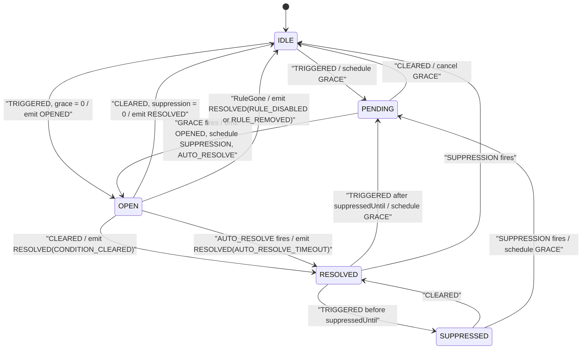
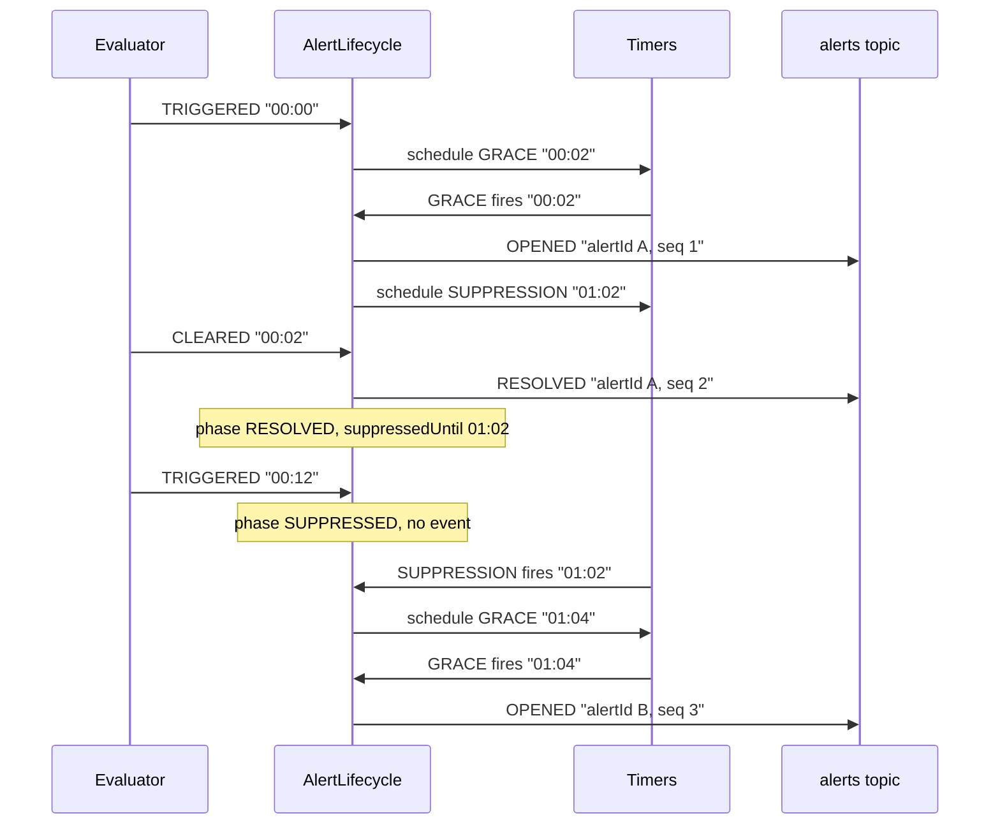

# 16. Alert lifecycle and alert model

**Goal.** After this chapter you can predict, for any sequence of `TRIGGERED`/`CLEARED` signals
and any grace/suppression/auto-resolve settings, exactly which `OPENED` and `RESOLVED` events
come out and when. You know every field of `AlertEvent` (the contract with Kafka, Postgres and
the notifier), you can read `AlertLifecycle` as a pure function, and you can explain what the
jqwik property test proves that the example tests cannot.

**Prerequisites.** [Chapter 14](14-rule-engine-conditions-and-definitions.md) (`RuleTiming`,
`RuleDefinition`) and [chapter 15](15-rule-engine-evaluators-and-windows.md) (`ConditionSignal`,
timers). [Chapter 02](02-java-21-for-this-repo.md) for records, sealed interfaces and pattern
`switch`.

## Concepts (from scratch)

### A state machine

A *state machine* is a thing that is always in exactly one of a small set of named *states*,
receives *inputs*, and on each input may move to another state and produce *outputs*. Drawing
it as boxes and arrows is enough to reason about it; that is the centrepiece diagram of this
chapter.

### A pure function

A *pure* function's result depends only on its arguments; it reads no clock, no database, no
random source, and changes nothing outside itself. `AlertLifecycle.on(state, input, rule,
subject, now)` is pure: it returns a `Decision` (the next state, the events to emit, the timers
to schedule or cancel) and *does* nothing. Someone else, the Flink operator in chapter 18 or a
test harness, applies the decision. Purity is what makes the state machine testable with
thousands of generated inputs in a fraction of a second.

### Grace, suppression, auto-resolve

Three durations shape every alert:

- **Grace window**: the condition must stay true this long before an alert opens. It filters
  flapping (a connector that reports FAULTED for two seconds and recovers).
- **Suppression window**: after an alert opens, re-triggers on the same subject are muted this
  long. It filters repetition (one page per incident, not one per heartbeat gap).
- **Auto-resolve**: optionally force an open alert closed after this long, so alerts for
  stations that never report again do not stay open forever.

### Idempotency and ordering

Downstream systems may see an event twice (chapter 09, at-least-once) or out of order. Two
fields make that safe: a unique `alertEventId` (so the notifier can say "already sent") and a
per-key sequence number `seq` (so the database can say "already newer").

### Property-based testing

An *example test* says: with these exact inputs, expect this exact output. A *property test*
says: for *any* inputs drawn from this space, this statement must hold. The library (here
jqwik) generates hundreds of random inputs, and when one fails it *shrinks* it to the smallest
failing case. Properties are the right tool for state machines, where the interesting bugs live
in interleavings nobody thought to write down.

## In this repo

### The alert-model contract

[`alert-model`](../alert-model/src/main/java/com/chargemon/alert/) depends only on `common`. Its
records are what leave the Flink job and what the notifier reads.

[`AlertEvent`](../alert-model/src/main/java/com/chargemon/alert/AlertEvent.java):

| Field | Type | Meaning |
|---|---|---|
| `alertEventId` | `String` | unique per emitted event; the notifier's idempotency key |
| `alertId` | `String` | identity of one alert instance; shared by its `OPENED` and its `RESOLVED` |
| `alertKey` | `String` | `ruleId\|subjectType\|subjectId`; one open alert at a time per key |
| `seq` | `long` | increases per `alertKey`; guards out-of-order DB writes |
| `type` | [`AlertEventType`](../alert-model/src/main/java/com/chargemon/alert/AlertEventType.java) | `OPENED` or `RESOLVED` |
| `ruleId`, `ruleVersion`, `ruleName`, `kind` | | copied from the rule at emit time |
| `severity` | [`Severity`](../alert-model/src/main/java/com/chargemon/alert/Severity.java) | `CRITICAL`, `HIGH`, `MEDIUM`, `LOW`, `INFO` |
| `channels` | `List<ChannelRef>` | where to notify |
| `subjectType`, `subjectId` | | the subject; `subject()` rebuilds a `SubjectRef` |
| `groupIds` | `Set<String>` | the subject's groups at trigger time; stage 2 fans out on these |
| `triggeredAt` | `Instant` | when the condition first became true (start of grace) |
| `openedAt` | `Instant` | when the alert opened (end of grace) |
| `resolvedAt` | `Instant` or null | set on `RESOLVED` only |
| `resolveReason` | [`ResolveReason`](../alert-model/src/main/java/com/chargemon/alert/ResolveReason.java) or null | `CONDITION_CLEARED`, `AUTO_RESOLVE_TIMEOUT`, `RULE_DISABLED`, `RULE_REMOVED` |
| `context` | `Map<String, String>` | the evaluator's context (status, connector, lastSeen ...) |
| `emittedAt` | `Instant` | processing time of emission |
| `schemaVersion` | `int` | `CURRENT_SCHEMA_VERSION = 1`; additive changes only |

[`ChannelRef`](../alert-model/src/main/java/com/chargemon/alert/ChannelRef.java) parses
`type:target` at the *first* colon and lower-cases the type, so `Slack:#ops` becomes
`slack:#ops` and `webhook:https://x/y` keeps its full URL. [`RuleTiming`](../alert-model/src/main/java/com/chargemon/alert/RuleTiming.java)
is `(graceWindow, suppressionWindow, autoResolveAfter)`, nulls become `Duration.ZERO` for the
first two, and negatives are rejected.

### Phase, TimerKind, LifecycleState, LifecycleInput

[`Phase`](../rule-engine/src/main/java/com/chargemon/rules/lifecycle/Phase.java):

| Phase | Meaning (from the javadoc) |
|---|---|
| `IDLE` | no condition, no alert |
| `PENDING` | condition true, waiting out the grace window |
| `OPEN` | alert raised and still active |
| `RESOLVED` | alert resolved; suppression window may still be running |
| `SUPPRESSED` | condition re-triggered inside the suppression window; no new alert |

[`TimerKind`](../rule-engine/src/main/java/com/chargemon/rules/lifecycle/TimerKind.java) is
`GRACE`, `SUPPRESSION`, `AUTO_RESOLVE`. A
[`TimerRequest`](../rule-engine/src/main/java/com/chargemon/rules/lifecycle/TimerRequest.java)
is `(kind, at)`; `at == null` means cancel.

[`LifecycleState`](../rule-engine/src/main/java/com/chargemon/rules/lifecycle/LifecycleState.java)
is the persisted record per alert key: `phase`, `alertId`, `seq`, `triggeredAt`, `openedAt`,
`graceDeadline`, `suppressedUntil`, `autoResolveAt`, `context`, `groupIds`. The three deadline
fields are "the source of truth for timers": a timer that fires with a different timestamp is
stale.

[`LifecycleInput`](../rule-engine/src/main/java/com/chargemon/rules/lifecycle/LifecycleInput.java)
is sealed with three cases: `Signal(ConditionSignal)`, `TimerFired(TimerKind, Instant at)`,
`RuleGone(ResolveReason)`.

### AlertLifecycle.on: the pure function

```java
public Decision on(LifecycleState cur, LifecycleInput in, RuleDefinition rule, SubjectRef subject, Instant now) {
    return switch (in) {
        case LifecycleInput.Signal s -> onSignal(cur, s.signal(), rule, subject, now);
        case LifecycleInput.TimerFired t -> onTimer(cur, t, rule, subject, now);
        case LifecycleInput.RuleGone g -> onRuleGone(cur, g.reason(), rule, subject, now);
    };
}
```
(`rule-engine/src/main/java/com/chargemon/rules/lifecycle/AlertLifecycle.java:43`)

`Decision` is `(LifecycleState next, List<AlertEvent> emits, List<TimerRequest> timers)`. The
only non-argument the class uses is a `Supplier<String> ids` for new identifiers, defaulting to
`Ids::uuidV7String`; tests inject a counter so ids are predictable.

### Every transition

Read `onTriggered`, `onCleared`, `onTimer` and `onRuleGone` in
[`AlertLifecycle.java`](../rule-engine/src/main/java/com/chargemon/rules/lifecycle/AlertLifecycle.java)
alongside this table. "Absorbed" means the state keeps its phase (context and group ids are
refreshed from the signal) and nothing is emitted.

| Phase | Input | Next phase | Emits | Timers |
|---|---|---|---|---|
| `IDLE` | `TRIGGERED` | `PENDING` (or `OPEN` if grace is zero) | none (or `OPENED`) | schedule `GRACE` at `now + grace` (or suppression/auto-resolve timers) |
| `PENDING` | `TRIGGERED` | `PENDING` | absorbed | |
| `PENDING` | `CLEARED` | `IDLE`, or `RESOLVED` if a suppression window is still running | none | cancel `GRACE` |
| `PENDING` | `GRACE` fires (at == `graceDeadline`) | `OPEN` | `OPENED` | schedule `SUPPRESSION` (if > 0) and `AUTO_RESOLVE` (if set) |
| `OPEN` | `TRIGGERED` | `OPEN` | absorbed | |
| `OPEN` | `CLEARED` | `RESOLVED` (or `IDLE` if no suppression) | `RESOLVED` `CONDITION_CLEARED` | cancel `AUTO_RESOLVE` |
| `OPEN` | `AUTO_RESOLVE` fires | `RESOLVED` (or `IDLE`) | `RESOLVED` `AUTO_RESOLVE_TIMEOUT` | cancel `AUTO_RESOLVE` |
| `OPEN` | `SUPPRESSION` fires | `OPEN` (suppressedUntil cleared) | none | |
| `RESOLVED` | `TRIGGERED` inside suppression | `SUPPRESSED` | none | |
| `RESOLVED` | `TRIGGERED` after suppression | `PENDING` | none | schedule `GRACE` |
| `RESOLVED` | `CLEARED` | `RESOLVED` | none | |
| `RESOLVED` | `SUPPRESSION` fires | `IDLE` (seq kept) | none | |
| `SUPPRESSED` | `TRIGGERED` | `SUPPRESSED` | absorbed | |
| `SUPPRESSED` | `CLEARED` | `RESOLVED` | none | |
| `SUPPRESSED` | `SUPPRESSION` fires | `PENDING` (fresh grace; or `OPEN` if grace is zero) | none (or `OPENED`) | schedule `GRACE` |
| any | `RuleGone` | `IDLE` (seq kept) | `RESOLVED` with the given reason, only if it was `OPEN` | cancel all three |
| any | timer with `at` ≠ stored deadline | unchanged | none | |

Three details deserve a closer look.

**Opening.** `open()` mints a new `alertId`, increments `seq`, records `openedAt = now`, keeps
`triggeredAt` from the pending state, computes `suppressedUntil` and `autoResolveAt`, and emits
one `OPENED`:

```java
LifecycleState next = new LifecycleState(Phase.OPEN, ids.get(), cur.seq() + 1, cur.triggeredAt(), now, null,
        suppressedUntil, autoResolveAt, cur.context(), cur.groupIds());
```
(`rule-engine/src/main/java/com/chargemon/rules/lifecycle/AlertLifecycle.java:144`)

**Resolving.** `resolve()` keeps the same `alertId`, increments `seq` again, emits `RESOLVED`
with `resolvedAt = now`, then calls `afterSuppression`: if `suppressedUntil` is null or already
past, the state collapses to `IDLE`; otherwise it stays `RESOLVED` until the `SUPPRESSION` timer
fires.

**Deadlines are millisecond-truncated.** `deadline(now, d)` truncates to milliseconds because
Flink's timer service works in epoch millis; a deadline that did not round-trip exactly would
make every timer look stale.



### A timeline with numbers

Rule: grace `PT2M`, suppression `PT1H`, no auto-resolve (this is
`reTriggerInsideSuppressionIsMuted_thenNewGraceAfterwards` in
[`AlertLifecycleTest`](../rule-engine/src/test/java/com/chargemon/rules/lifecycle/AlertLifecycleTest.java)).

| Time | Input | Phase after | Output |
|---|---|---|---|
| 00:00 | `TRIGGERED` | `PENDING` | `GRACE` timer at 00:02 |
| 00:02 | `GRACE` fires | `OPEN` | `OPENED` (alertId A, seq 1); `SUPPRESSION` timer at 01:02 |
| 00:02 | `CLEARED` | `RESOLVED` | `RESOLVED` (alertId A, seq 2, `CONDITION_CLEARED`) |
| 00:12 | `TRIGGERED` | `SUPPRESSED` | nothing: inside suppression |
| 00:22 | (nothing) | `SUPPRESSED` | still nothing |
| 01:02 | `SUPPRESSION` fires | `PENDING` | fresh `GRACE` timer at 01:04 |
| 01:04 | `GRACE` fires | `OPEN` | `OPENED` (alertId B, seq 3) |

The test asserts exactly this: the third event has a different `alertId` and `openedAt` equal to
`T0 + 2 + 60 + 2` minutes.



### alertId and seq

- `alertKey` = `rule.id() + "|" + subject.key()`, for example
  `1111...|STATION|ST-1`. One lifecycle state, one open alert at a time.
- `alertId` is a fresh UUIDv7 per *opening*. The matching `RESOLVED` reuses it, which is how
  the `alerts` table (primary key `alert_id`) gets one row per incident, updated in place.
- `seq` starts at 0 in `LifecycleState.idle()` and is incremented on every open and every
  resolve. It survives `IDLE` (`idle().withSeq(cur.seq())`), so it never restarts for a key.
  The JDBC sink's `WHERE alerts.last_seq < EXCLUDED.last_seq` relies on this.
- `alertEventId` is another UUIDv7, unique per emitted event; the notifier's ledger key is
  `(alertEventId, channelRef)`.

### The stale-timer guard

Every timer branch first checks `t.at().equals(cur.<deadline>)`:

```java
case GRACE -> {
    if (cur.phase() != Phase.PENDING || !t.at().equals(cur.graceDeadline())) {
        yield noop(cur);
    }
    yield open(cur, rule, subject, now);
}
```
(`rule-engine/src/main/java/com/chargemon/rules/lifecycle/AlertLifecycle.java:88`)

Why? A Flink processing-time timer cannot be "replaced"; if the deadline moves, the old timer
still fires. Storing the current deadline in state and ignoring any firing with a different
timestamp makes the adapter trivial: register, never delete, let stale ones bounce.
`staleTimerIsIgnored` fires a `GRACE` at `T0 + 1s` when the real deadline is `T0 + 2m` and
asserts the phase is still `PENDING` with no events.

### Property-based testing with jqwik

[`AlertLifecycleProperties`](../rule-engine/src/test/java/com/chargemon/rules/lifecycle/AlertLifecycleProperties.java)
defines a small step language, `Trigger`, `Clear`, `Wait(1..600 s)`, and a generator for lists
of 1 to 60 steps. The single property is run 300 times with grace in `{0, 30, 120}` seconds and
suppression in `{0, 60, 900}`:

```java
@Property(tries = 300)
void openedAndResolvedAlternate_noOpenWhileSuppressed_noOpenBeforeGrace(
        @ForAll("steps") List<Step> steps,
        @ForAll("grace") int graceSec,
        @ForAll("suppression") int suppressionSec) {
```
(`rule-engine/src/test/java/com/chargemon/rules/lifecycle/AlertLifecycleProperties.java:48`)

The harness replays the steps, firing due timers in time order during each `Wait`, and checks
five invariants:

| Invariant | Where checked | Why it matters downstream |
|---|---|---|
| Events strictly alternate `OPENED, RESOLVED, OPENED, ...` | final loop, `i % 2` | the `alerts` table never has two opens for one key without a resolve |
| `seq` strictly increases | `events.get(i).seq() > events.get(i-1).seq()` | the `last_seq` guard is sound |
| Each `RESOLVED` shares `alertId` with the preceding `OPENED` | `i % 2 == 1` branch | one row per incident |
| No re-open sooner than `suppressionSec` after the previous open | inside the step loop | the suppression window promise |
| No open sooner than `graceSec` after the trigger that started it | inside the step loop | the grace window promise |

The last two are recorded as `lastOpen` and `lastTrigger` while stepping; `lastTrigger` is only
updated when the trigger arrives in `IDLE` or `RESOLVED`, that is, when it actually starts a
grace window. The example tests in `AlertLifecycleTest` remain useful for reading; the property
is what gives confidence that no interleaving of clears and timers breaks the promises.

### Why pure: the thin Flink adapter

[`AlertLifecycleOperator`](../flink-processor/src/main/java/com/chargemon/flink/lifecycle/AlertLifecycleOperator.java)
keeps one `ValueState<LifecycleState>` per `AlertKey`, calls `lifecycle.on(...)`, writes back
`d.next()`, collects `d.emits()`, and for each `TimerRequest` calls
`registerProcessingTimeTimer(t.at().toEpochMilli())`. When a rule disappears from the broadcast
it iterates the keyed states with `applyToKeyedState` and feeds each one a `RuleGone`. That is
the entire adapter; every semantic decision lives in this chapter's pure class. Chapter 18 reads
the operator line by line.

## Diagrams

See the lifecycle state diagram and the re-trigger-during-suppression sequence diagram above.

## Hands-on exercises

### 1. A table-driven lifecycle test

**What to do.** Add a JUnit `@ParameterizedTest` to `AlertLifecycleTest` that takes a script
string such as `"T,W60,C,W10,T"` and an expected phase list, splits the script into steps
(`T` = trigger, `C` = clear, `Wn` = advance n seconds), drives the existing `Harness`, and
records `h.state.phase()` after each step. Cover at least: grace zero / suppression zero;
grace 120 / suppression 60 with a clear inside grace; and a re-trigger inside suppression.

**What you should observe.** For grace `PT2M`, suppression `PT1M` and script `T,W60,C,W120,T`
the phases are `PENDING, PENDING, IDLE, IDLE, PENDING`: the clear inside grace cancels silently,
and because nothing ever opened there is no suppression window, so the second trigger starts a
fresh grace.

**Hint.** Use `Arguments.of(script, List.of(Phase...))` with `@MethodSource`; `Harness.advance`
already fires timers in order.

### 2. A new jqwik property

**What to do.** In `AlertLifecycleProperties`, add a second `@Property`: for every generated
step list, after the final step *and after waiting one more hour*, the set of live timers is
empty whenever the phase is `IDLE`, and non-empty whenever the phase is `PENDING` or
`SUPPRESSED`. Reuse `steps()`, `grace()`, `suppression()` and the private `apply` helper.

**What you should observe.** 300 passing tries. If you deliberately break `onCleared` for
`PENDING` (remove the `TimerRequest.cancel(TimerKind.GRACE)`), jqwik reports a shrunk failing
sample, typically two or three steps long.

**Hint.** `SUPPRESSED` always has a `SUPPRESSION` timer pending; `PENDING` always has a `GRACE`
timer pending; `IDLE` should have none.

### 3. RESOLVED goes straight to IDLE with zero suppression

**What to do.** Write an example test: rule with grace `PT0S`, suppression `PT0S`, no
auto-resolve. `trigger()`, then `clear()`. Assert the phase is `IDLE`, that `h.timers` is
empty, and that the `Decision` returned for the clear contains no `TimerRequest` with a non-null
`at` (only cancels). You will need to call `lifecycle.on` directly for the last assertion.

**What you should observe.** `afterSuppression` sees `suppressedUntil == null` and returns
`idle().withSeq(2)`; the only timer request is `cancel(AUTO_RESOLVE)`, which the harness turns
into a harmless `timers.remove`.

**Hint.** `d.timers().stream().noneMatch(t -> !t.isCancel())`.

## Self-check

1. A `CLEARED` arrives while the phase is `PENDING`. Is anything written to the `alerts` topic?
2. Grace is `PT0S`. Which phase does a `TRIGGERED` from `IDLE` land in, and which timers are requested?
3. Two `OPENED` events for the same `alertKey` arrive at the notifier. What must be true about their `alertId`s and their `seq`s?
4. Why does `RuleGone` set the next state to `IDLE` but keep `seq`?
5. What does the jqwik property prove that `reTriggerInsideSuppressionIsMuted_thenNewGraceAfterwards` does not?

<details><summary>Answers</summary>

1. No. `onCleared` in `PENDING` returns no emits; it only cancels the `GRACE` timer and collapses to `IDLE` (or `RESOLVED` if an earlier suppression window is still running).
2. `startGrace` builds a `PENDING` state and, because `grace.isZero()`, immediately calls `open`, so the phase is `OPEN`, one `OPENED` is emitted, and `SUPPRESSION` (if > 0) and `AUTO_RESOLVE` (if set) timers are requested. No `GRACE` timer.
3. Different `alertId`s (each opening mints one) and strictly increasing `seq` with a `RESOLVED` carrying an intermediate `seq` between them; the property test enforces the alternation.
4. `seq` must stay monotonic per key forever so the `last_seq` guard in Postgres keeps working after the rule is re-enabled; `IDLE` is the correct phase because there is no rule left to run a suppression window for.
5. That the five invariants hold for *every* interleaving of triggers, clears and waits across the sampled grace and suppression values, not just the one scripted path; in particular that no sequence of timer firings and signals can produce two `OPENED`s without a `RESOLVED` in between.

</details>

## Glossary terms

- [lifecycle phase](glossary.md#lifecycle-phase)
- [grace window](glossary.md#grace-window)
- [suppression window](glossary.md#suppression-window)
- [auto-resolve](glossary.md#auto-resolve)
- [alert key](glossary.md#alert-key)
- [ConditionSignal](glossary.md#conditionsignal)
- [ChannelRef](glossary.md#channelref)
- [timer](glossary.md#timer)
- [processing time](glossary.md#processing-time)
- [at-least-once](glossary.md#at-least-once)
- [delivery ledger](glossary.md#delivery-ledger)
- [sealed interface](glossary.md#sealed-interface)
- [pattern matching](glossary.md#pattern-matching)

## Further reading

- jqwik user guide: <https://jqwik.net/docs/current/user-guide.html>
- Alistair Cockburn, *Hexagonal architecture*: <https://alistair.cockburn.us/hexagonal-architecture/>
- Flink 1.20, process function timers: <https://nightlies.apache.org/flink/flink-docs-release-1.20/docs/dev/datastream/operators/process_function/#timers>
- RFC 9562, UUID version 7 (time-ordered ids): <https://www.rfc-editor.org/rfc/rfc9562.html#name-uuid-version-7>
- JEP 441, pattern matching for switch: <https://openjdk.org/jeps/441>
- PostgreSQL `INSERT ... ON CONFLICT DO UPDATE ... WHERE`: <https://www.postgresql.org/docs/current/sql-insert.html#SQL-ON-CONFLICT>
