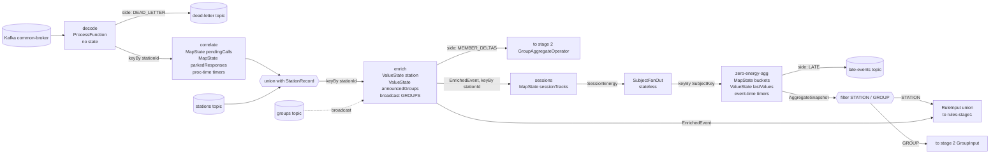
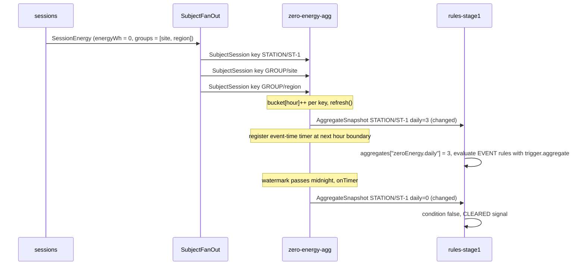

# 17. Flink job: ingest pipeline

**Goal.** After this chapter you can follow one OCPP frame from the moment the Flink job reads
it off Kafka until it becomes a `RuleInput` that the rule evaluator understands. You will know
what each of the first six operators does (`decode`, `correlate`, `enrich`, `sessions`,
`SubjectFanOut`, `zero-energy-agg`), which key it runs under, what state it keeps, which timers
it sets, which side outputs it has, and which *pure* class from `ocpp-codec` or `rule-engine`
it hands the real decision to. The second half of the job (rules, lifecycle, sinks) is
[chapter 18](18-flink-job-rules-lifecycle-sinks.md).

**Prerequisites.**
[06 Flink programming model](06-flink-programming-model.md),
[07 State, timers, serialization](07-flink-state-timers-serialization.md),
[08 Broadcast state](08-flink-broadcast-state-and-connected-streams.md),
[09 Event time and connectors](09-flink-event-time-connectors-and-delivery.md),
[12 OCPP codec](12-ocpp-codec-parsing-mapping-correlation.md),
[15 Evaluators and windows](15-rule-engine-evaluators-and-windows.md).

## Concepts (from scratch)

**Pipeline, operator, stage.** A Flink job is a chain of *operators*. Each operator receives
records, may keep some memory (*state*), and emits records to the next one. The chain in this
repo is called the *topology*. This chapter covers the *ingest* half: everything that turns raw
bytes into clean, enriched facts. Nothing in this half knows what a rule is.

**Thin adapter over a pure core.** Every operator here follows one pattern: the Flink class
owns state, timers and metrics, and calls a plain Java class that has no Flink imports and makes
the decision. Examples: `CallCorrelationOperator` wraps `CallCorrelator`;
`ZeroEnergySessionDetector` wraps `SessionTracker`; `ZeroEnergyAggregator` wraps
`HourlyBucketAggregator`. The pure class is unit-tested without a cluster. The Flink class is
tested once, end to end, on a MiniCluster. Keep this in mind while reading: when you ask "where
is the logic?", the answer is almost always "in the pure class".

**Port and adapter.** A *port* is an interface that the pure class needs but does not
implement, for example "somewhere to store pending CALLs". An *adapter* implements that
interface on top of a concrete technology, here Flink `MapState`. The pure class never learns
that Flink exists.

**Union stream.** Flink can only key a stream by one type. When one operator needs two kinds
of input under the same key (for example OCPP events *and* station master data, both keyed by
station id), the two streams are mapped into one wrapper record with one field set and the other
`null`, then `union`ed. `StationStreamElement` and `RuleInput` are such wrappers.

**Side output.** An operator's "second exit". Records that do not belong on the main path
(undecodable frames, late sessions, group membership changes) are tagged with an `OutputTag` and
picked up separately by `getSideOutput(tag)`.

**Event time versus processing time in this half.** Correlation timeouts use *processing time*
(wall clock), because "no answer within 60 seconds" is a real-world promise. The zero-energy
aggregator uses *event time* (the session's `endedAt`, driven by watermarks), because "3
sessions today" must mean the same thing during a replay as it did live.

## In this repo

All paths below are under
[`../flink-processor/src/main/java/com/chargemon/flink/`](../flink-processor/src/main/java/com/chargemon/flink/).
The wiring lives in
[`topology/TopologyBuilder.java`](../flink-processor/src/main/java/com/chargemon/flink/topology/TopologyBuilder.java);
lines 70-111 are this chapter.

### 1. Sources: the `Sources` port and `KafkaSources`

[`source/Sources.java`](../flink-processor/src/main/java/com/chargemon/flink/source/Sources.java)
is an interface with five methods: `events`, `rules`, `stations`, `groups` and `ruleLoader`.
`TopologyBuilder.build` receives a `Sources` and a `Sinks`, so the same graph runs on Kafka in
production and on in-memory lists in tests (chapter 18 shows the test side).

[`source/KafkaSources.java`](../flink-processor/src/main/java/com/chargemon/flink/source/KafkaSources.java)
is the production implementation. Two things matter:

```java
WatermarkStrategy<KafkaRecord> wm = WatermarkStrategy
        .<KafkaRecord>forBoundedOutOfOrderness(cfg.maxOutOfOrderness())
        .withIdleness(cfg.sourceIdleness());
return env.fromSource(source, wm, "common-broker").uid("src-events");
```
(`KafkaSources.java:38-41`)

The event source starts from the consumer group's committed offsets (earliest if none), assigns
event time from the Kafka record timestamp and tolerates `MAX_OUT_OF_ORDERNESS` (default 5
minutes) of disorder. `withIdleness` stops a quiet partition from holding back the watermark.
The three *compacted* topics (`stations`, `groups`, `rules`) are read by `compacted(...)`
(lines 65-75): always from the beginning, with `WatermarkStrategy.noWatermarks()`, each under its
own consumer group suffix so replaying them never touches the events group.

The deserializer
[`source/KafkaRecordDeserializer.java`](../flink-processor/src/main/java/com/chargemon/flink/source/KafkaRecordDeserializer.java)
"never fails": it wraps the raw bytes in
[`model/KafkaRecord.java`](../flink-processor/src/main/java/com/chargemon/flink/model/KafkaRecord.java)
(`key, value, timestamp, sourceRef`) where `sourceRef` is `topic-partition-offset`. Parsing
happens one operator later, so a bad payload becomes a dead letter instead of killing the source.

### 2. `decode`: `FrameDecodeFunction` and `DeadLetter`

| | |
|---|---|
| Class | [`decode/FrameDecodeFunction.java`](../flink-processor/src/main/java/com/chargemon/flink/decode/FrameDecodeFunction.java), a `ProcessFunction<KafkaRecord, DecodedFrame>` |
| Key | none (not keyed); parallelism copied from the source so it chains |
| State | none |
| Timers | none |
| Side output | `DEAD_LETTER` of [`DeadLetter`](../flink-processor/src/main/java/com/chargemon/flink/decode/DeadLetter.java) `(sourceRef, reason, payload)` |
| Delegates to | `EnvelopeParser` and `FrameParser` from `ocpp-codec` (chapter 12) |
| Metrics | `framesDecoded`, `framesRejected` |

```java
Result<RawEnvelope, String> env = envelopes.parse(rec.value(), rec.sourceRef());
if (env instanceof Result.Err<RawEnvelope, String> err) {
    reject(ctx, rec, err.error());
    return;
}
RawEnvelope envelope = ((Result.Ok<RawEnvelope, String>) env).value();
Result<RawFrame, String> frame = frames.parse(envelope.frame());
```
(`FrameDecodeFunction.java:38-44`)

Two parses, two chances to fail, both routed to the side output by `reject` (lines 53-57). The
output record is
[`model/DecodedFrame.java`](../flink-processor/src/main/java/com/chargemon/flink/model/DecodedFrame.java)
`(RawEnvelope envelope, RawFrame frame)`. Why `setParallelism(raw.getParallelism())` in the
builder (line 76)? Same parallelism means Flink *chains* decode onto the Kafka source task: no
network shuffle, and the per-partition order Kafka gave us survives until the first `keyBy`. That
order is what keeps a CALL ahead of its CALLRESULT for the same station.

### 3. `correlate`: `CallCorrelationOperator`

| | |
|---|---|
| Class | [`correlate/CallCorrelationOperator.java`](../flink-processor/src/main/java/com/chargemon/flink/correlate/CallCorrelationOperator.java), a `KeyedProcessFunction<String, DecodedFrame, OcppEvent>` |
| Key | `envelope().stationId()` |
| State | `MapState<String, PendingCall>` `pendingCalls` and `MapState<String, PendingResponse>` `parkedResponses`, both with TTL `PENDING_CALL_TTL` (default 5 min) |
| Timers | one processing-time timer per registered CALL or parked response, at `now + CORRELATION_TIMEOUT` (default 60 s) |
| Side output | none |
| Delegates to | `CallCorrelator` with `MapperRegistry.fromServiceLoader()` (chapter 12) |
| Metrics | `callsTimedOut`, `responsesParked`, `responsesExpiredUnmatched`, `mappingFailed` |

The heart of `processElement` is one call into the codec plus bookkeeping of what it asked for:

```java
CorrelationOutcome outcome = correlator.onFrame(frame.envelope(), frame.frame(), new MapStateStore(pending, parked));
...
outcome.events().forEach(out::collect);
if (outcome.registered().isPresent()) {
    CorrelationOutcome.Registered r = outcome.registered().get();
    pending.put(r.key(), r.call());
    ctx.timerService().registerProcessingTimeTimer(ctx.timerService().currentProcessingTime() + timeout.toMillis());
}
```
(`CallCorrelationOperator.java:79-89`)

`CorrelationOutcome` is a small record of intents: events to emit, a CALL to remember, a key to
release, an early response to park. The operator executes those intents against Flink state. It
never looks inside a frame.

**The `MapStateStore` adapter pattern.** The codec declares the port
[`PendingCallStore`](../ocpp-codec/src/main/java/com/chargemon/ocpp/codec/correlate/PendingCallStore.java)
(six methods: `get/put/remove` for calls, `getResponse/putResponse/removeResponse` for parked
responses). The operator's private record `MapStateStore` (lines 137-193) implements it over the
two `MapState`s, wrapping the checked exceptions Flink state throws:

```java
private record MapStateStore(MapState<String, PendingCall> state, MapState<String, PendingResponse> responses)
        implements PendingCallStore {
    @Override
    public Optional<PendingCall> get(String key) {
        try {
            return Optional.ofNullable(state.get(key));
        } catch (Exception e) {
            throw new IllegalStateException(e);
        }
    }
```
(`CallCorrelationOperator.java:138-147`)

Port in the codec, adapter in Flink. The codec's own tests use a `HashMap`-backed store.

**Timers.** `onTimer` (lines 105-130) does not know which CALL the timer was for; it sweeps every
pending call whose `sentAt + timeout` has passed, emits `correlator.onTimeout(call, now)` for each
(that becomes a `CallTimedOut` canonical event) and drops parked responses older than the timeout.
Sweeping is cheap because the map is per station and usually holds zero or one entry. The TTL on
both maps is a safety net for keys that never get another frame or timer.

### 4. `enrich`: `StationEnrichmentOperator`, `GroupHierarchy`, `EnrichedEvent`, `GroupMemberDelta`

Before enrichment, the builder builds the union input (lines 87-89): every `OcppEvent` becomes
`StationStreamElement.of(event)` and every `StationRecord` from the compacted topic becomes
`StationStreamElement.of(station)`;
[`model/StationStreamElement.java`](../flink-processor/src/main/java/com/chargemon/flink/model/StationStreamElement.java)
exposes `stationId()` from whichever side is set. The `groups` stream is broadcast.

| | |
|---|---|
| Class | [`enrich/StationEnrichmentOperator.java`](../flink-processor/src/main/java/com/chargemon/flink/enrich/StationEnrichmentOperator.java), a `KeyedBroadcastProcessFunction<String, StationStreamElement, GroupRecord, EnrichedEvent>` |
| Key | `stationId()` |
| Keyed state | `ValueState<StationRecord>` `station`; `ValueState<List<String>>` `announcedGroups` |
| Broadcast state | `GROUPS`: `MapState<String, GroupRecord>` replicated to every task |
| Timers | none |
| Side output | `MEMBER_DELTAS` of [`GroupMemberDelta`](../flink-processor/src/main/java/com/chargemon/flink/model/GroupMemberDelta.java) `(groupId, stationId, added)` |
| Delegates to | [`enrich/GroupHierarchy.java`](../flink-processor/src/main/java/com/chargemon/flink/enrich/GroupHierarchy.java) |
| Metrics | `unknownStationEvents` |

`processElement` has two branches. A station record updates keyed state. An event looks up the
station, computes its transitive group closure and wraps both:

```java
StationRecord rec = station.value();
StationContext context;
if (rec == null || rec.deleted()) {
    unknownStations.inc();
    context = StationContext.unknown(ctx.getCurrentKey());
} else {
    Set<String> closure = hierarchy.closure(rec.groupIds(), lookup(groups));
    announce(rec.stationId(), closure, ctx);
    context = StationContext.from(rec, closure);
}
out.collect(new EnrichedEvent(el.event(), context));
```
(`StationEnrichmentOperator.java:64-75`)

An *unknown* station is not an error: the event still flows, with `known() == false` and no
groups. This is the "fresh start" limitation named in the root README: until the `stations`
replay reaches this key, events are enriched as unknown.

`GroupHierarchy.closure` walks `parentId` links up to 64 levels (a cycle guard) and caches the
ancestor set per group id. `processBroadcastElement` (lines 113-124) writes the group into
broadcast state and calls `hierarchy.invalidate()`, which clears the whole cache. Group changes
are rare and lookups are hot, so a wholesale clear is the right trade.

`announce` (lines 89-111) diffs the closure against `announcedGroups` and emits one
`GroupMemberDelta` per added or removed group. It runs on every event, not only on station
records, so a group record that arrives late self-heals on the station's next message. Chapter 18
shows who consumes these deltas (`GroupAggregateOperator`, for percentage thresholds).

The output,
[`model/EnrichedEvent.java`](../flink-processor/src/main/java/com/chargemon/flink/model/EnrichedEvent.java)
`(OcppEvent event, StationContext station)`, is the record the rest of the job is built on.

### 5. `sessions`: `ZeroEnergySessionDetector` and `SessionTracker`

| | |
|---|---|
| Class | [`energy/ZeroEnergySessionDetector.java`](../flink-processor/src/main/java/com/chargemon/flink/energy/ZeroEnergySessionDetector.java), a `KeyedProcessFunction<String, EnrichedEvent, SessionEnergy>` |
| Key | `EnrichedEvent::stationId` |
| State | `MapState<String, SessionTrack>` `sessionTracks`, TTL `SESSION_TRACK_TTL` (default 48 h), keyed by canonical session id |
| Timers | none |
| Side output | none |
| Delegates to | [`energy/SessionTracker.java`](../flink-processor/src/main/java/com/chargemon/flink/energy/SessionTracker.java) (pure) |
| Metrics | `sessionsEnded`, `zeroEnergySessions` |

The operator is nine lines of real work: ask the tracker which session the event belongs to,
load that track, apply, store or remove the track, emit if the session ended (lines 47-73). The
name says "zero energy" but it emits *every* ended session as
[`SessionEnergy`](../flink-processor/src/main/java/com/chargemon/flink/energy/SessionEnergy.java)
`(sessionId, stationId, startedAt, endedAt, energyWh, groupIds)`; filtering is downstream.

`SessionTracker.apply` is a pattern switch over the canonical events (chapter 11):

| OCPP version | Start | Progress | End | Energy |
|---|---|---|---|---|
| 1.6 | `SessionStarted` (the correlated StartTransaction) carries `meterStart` | `MeterValues` with a `transactionId` updates `lastRegister` | `StopTransaction` carries `meterStop` | `meterStop - meterStart` |
| 2.0.1 | `TransactionEvent` `STARTED` with an energy register in its meter values | `UPDATED` updates `lastRegister` (and fills `meterStart` if the start was missed) | `ENDED` with a register, or falling back to the last seen | `end - start` |

Two rules apply in both versions. First, the unit: a `SampledValue` in `kWh` is moved three
decimal places to make Wh; anything else is taken as Wh already:

```java
private static long toWh(MeterValue.SampledValue sv) {
    if (sv.value() == null) {
        return 0;
    }
    return "kWh".equalsIgnoreCase(sv.unit()) ? sv.value().movePointRight(3).longValue() : sv.value().longValue();
}
```
(`SessionTracker.java:129-134`)

Second, a sampled value with *no* `measurand` is treated as `Energy.Active.Import.Register`, both
in `MeterValue.find` (ocpp-model) and in `beginFrom` (`SessionTracker.java:120`). OCPP makes that
measurand the default, so stations may omit it.

If a session ends and no start reading exists (`start == null`), the tracker returns a `Step`
with no `ended` value: energy is *unknown*, not zero. "Zero" means exactly `energyWh == 0`
(`SessionEnergy.isZeroEnergy`), and the subtraction is clamped at zero with `Math.max(0, ...)` so
a meter reset cannot produce a negative session.

### 6. `SubjectFanOut`, `SubjectSession`, `SubjectKey`

[`aggregate/SubjectFanOut.java`](../flink-processor/src/main/java/com/chargemon/flink/aggregate/SubjectFanOut.java)
is a stateless `FlatMapFunction`. It drops sessions with energy, then emits one
[`SubjectSession`](../flink-processor/src/main/java/com/chargemon/flink/aggregate/SubjectSession.java)
for the station and one for every group in the session's closure:

```java
out.collect(new SubjectSession(SubjectKey.station(s.stationId()), s.sessionId(), s.endedAt(), s.groupIds()));
for (String g : s.groupIds()) {
    out.collect(new SubjectSession(SubjectKey.group(g), s.sessionId(), s.endedAt(), s.groupIds()));
}
```
(`SubjectFanOut.java:15-18`)

[`SubjectKey`](../flink-processor/src/main/java/com/chargemon/flink/aggregate/SubjectKey.java)
`(subjectType, subjectId)` is a plain record with two `String` fields so Flink can key by it as a
POJO (`Types.POJO(SubjectKey.class)` in the builder, line 105). A station under
`site > region > country` produces four records per zero-energy session. That is the price of
answering "how many zero-energy sessions in Germany today?" without a join.

### 7. `zero-energy-agg`: `ZeroEnergyAggregator`

| | |
|---|---|
| Class | [`aggregate/ZeroEnergyAggregator.java`](../flink-processor/src/main/java/com/chargemon/flink/aggregate/ZeroEnergyAggregator.java), a `KeyedProcessFunction<SubjectKey, SubjectSession, AggregateSnapshot>` |
| Key | `SubjectSession::subject` |
| State | `MapState<Long, Integer>` `buckets` (epoch hour to count); `ValueState<Map<String, Long>>` `lastValues`; `ValueState<List<String>>` `lastGroups`. No TTL: buckets expire by window length instead |
| Timers | **event-time** timer at the next hour boundary where any window value would change |
| Side output | `LATE` of [`LateSession`](../flink-processor/src/main/java/com/chargemon/flink/aggregate/LateSession.java) |
| Delegates to | `HourlyBucketAggregator` and `WindowSpec.parseList` from `rule-engine` (chapter 15) |
| Metrics | `lateSessions` |

Acceptance is decided against the watermark, not the wall clock:

```java
long eventHour = HourlyBucketAggregator.hourOf(s.endedAt());
long wm = ctx.timerService().currentWatermark();
long nowHour = wm == Long.MIN_VALUE ? eventHour : Math.max(eventHour, Math.floorDiv(wm, 3_600_000L));
if (!agg.accepts(eventHour, nowHour)) {
    late.inc();
    ctx.output(LATE, new LateSession(s.subject().subjectType(), s.subject().subjectId(), s.sessionId(),
            s.endedAt().toEpochMilli(), wm));
    return;
}
```
(`ZeroEnergyAggregator.java:65-75`)

A session older than the longest configured window (30 days by default) is *late* and goes to the
`late-events` topic rather than a bucket that would immediately expire. Otherwise the bucket for
that hour is incremented and `refresh` runs.

`refresh` (lines 90-116) copies the buckets into a `TreeMap`, lets the aggregator expire buckets
that fell out of every window, computes every window's value, and emits an
[`AggregateSnapshot`](../flink-processor/src/main/java/com/chargemon/flink/model/AggregateSnapshot.java)
`(source="zeroEnergy", subjectType, subjectId, windows, asOf, groupIds)` **only if the map of
values differs from `lastValues`**. Then it asks `nextChangeHour` when any window would next
change and registers one event-time timer for that hour. When the watermark passes that hour,
`onTimer` calls `refresh` again, a daily window rolls to zero, a new snapshot is emitted, and a
rule that was triggered on `agg.zeroEnergy.daily >= 3` can clear. Without this timer, the count
would only ever be recomputed when a new session arrived.

The "emit on change" guard matters at scale: a rolling 30-day window whose value has not moved
does not generate a Postgres upsert or a rule evaluation per session.

### 8. Into stage 1: `RuleInput`

The builder splits snapshots by subject type (lines 110-111). Station snapshots are wrapped in
[`model/RuleInput.java`](../flink-processor/src/main/java/com/chargemon/flink/model/RuleInput.java)
`(EnrichedEvent event, AggregateSnapshot snapshot)`, unioned with the enriched events, keyed by
`stationId()` and connected to the rules broadcast (lines 114-118). Group snapshots go to stage 2.
From here on chapter 18 takes over.

## Diagrams

Operators of this chapter with their state and side outputs:



One zero-energy session travelling to a rule:



## Hands-on exercises

1. **A 2.0.1 session whose start was missed.**
   *What to do:* open
   [`SessionTrackerTest.java`](../flink-processor/src/test/java/com/chargemon/flink/energy/SessionTrackerTest.java)
   and add a test that applies `TransactionEvent` `Updated` (register 150 Wh) with `current ==
   null`, then `Ended` (register 180 Wh) with the track from the first step. Build the events with
   `Frames.txEvent201("Updated", "t3", 1, ..., "MeterValuePeriodic", 150L, 1)` exactly like the
   existing test. Run `./gradlew :flink-processor:test --tests '*SessionTrackerTest*'`.
   *What you should observe:* `ended()` is present with `energyWh == 30`, because `UPDATED` on a
   null track creates one and `withRegister` fills `meterStart` from the first register it sees.
   *Hint:* read `onTransactionEvent`, `UPDATED` branch (`SessionTracker.java:81-84`) and
   `SessionTrack.withRegister`.

2. **Watch the aggregator emit only on change.**
   *What to do:* run the end-to-end scenario
   `./gradlew :flink-processor:test --tests '*TopologyEndToEndTest.threeZeroEnergySessions*' --debug-jvm`
   and attach your IDE debugger to port 5005 with a breakpoint on the `if (!values.equals(previous))`
   line of `ZeroEnergyAggregator.refresh`.
   *What you should observe:* the breakpoint hits three times for key `STATION/ST-Z` with
   `values` going `{hourly=1, daily=1, ...}`, `2`, `3`; each time a snapshot is emitted. The fourth
   session (2500 Wh) never reaches the aggregator: `SubjectFanOut` dropped it. No `GROUP` key
   appears because the test seeds no station records, so the closure is empty. The event-time
   timer registered for the next hour boundary never fires inside the test because the watermark
   does not advance that far.
   *Hint:* `lastSinks.snapshots()` in the test collects every emitted snapshot; print it.

3. **Confirm the unknown-station path.**
   *What to do:* start the stack (chapter 20) but run the generator **without** `--seed-master`:
   `java -jar event-generator/build/libs/event-generator-all.jar --stations 5 --rate 10 --profiles normal`.
   Open the Flink UI at `http://localhost:8081`, pick the running job, the `enrich` operator, and
   the Metrics tab; add `unknownStationEvents`. Then stop the generator, run it again with
   `--seed-master`, and watch the counter.
   *What you should observe:* the counter climbs with every frame in the first run and stops
   climbing shortly after the second run seeds the `stations` topic. Alerts raised in the first
   run (for example from `sample-rules.sql`) have an empty `groupIds`.
   *Hint:* the same counter is exported on the Prometheus port 9249 of the taskmanager as
   `flink_taskmanager_job_task_operator_unknownStationEvents`.

## Self-check

1. Why is `decode` given the same parallelism as the Kafka source instead of the job default?
2. `CallCorrelationOperator` registers a timer but `onTimer` receives only a timestamp. How does it
   know which pending CALL expired?
3. A station's group record is re-parented while the station is silent. When does the group
   aggregate operator learn about it?
4. A 2.0.1 `TransactionEvent Ended` arrives with a meter value in `kWh` of `0.000`. Is that a
   zero-energy session? What if the value is absent?
5. What would break if `ZeroEnergyAggregator` used processing-time timers?

<details><summary>Answers</summary>

1. Equal parallelism lets Flink chain `decode` onto the source task (no shuffle), so the order of
   records within a Kafka partition survives until the first `keyBy`. That keeps a CALL ahead of
   its CALLRESULT for the same station.
2. It does not. `onTimer` sweeps every entry of `pendingCalls` and expires those whose
   `sentAt + timeout` has passed (`registeredBefore`), then does the same for parked responses.
   The map is per station, so the sweep is tiny.
3. On the station's next event. `processBroadcastElement` only stores the group and clears the
   closure cache; `announce` re-diffs the closure when the next `StationStreamElement` for that
   station is processed and emits ADD/REMOVE deltas then. This is the second "known limitation"
   in the root README.
4. Yes: `toWh` turns `0.000 kWh` into `0` Wh and `isZeroEnergy` is `energyWh == 0`. If the
   register is absent and the track has no `lastRegister`, `end` is null and the tracker returns
   no `SessionEnergy` at all: energy unknown, not zero.
5. Replays. A 24-hour replay done in ten minutes would fire "midnight" timers at the wrong
   moments relative to the sessions, and the daily counts would be wrong. Event-time timers
   follow the watermark, so counts are identical live and replayed.

</details>

## Glossary terms

- [side output](glossary.md#side-output)
- [keyed state](glossary.md#keyed-state)
- [state TTL](glossary.md#state-ttl)
- [timer](glossary.md#timer)
- [KeyedProcessFunction](glossary.md#keyedprocessfunction)
- [KeyedBroadcastProcessFunction](glossary.md#keyedbroadcastprocessfunction)
- [broadcast state](glossary.md#broadcast-state)
- [operator chaining](glossary.md#operator-chaining)
- [watermark](glossary.md#watermark)
- [event time](glossary.md#event-time)
- [processing time](glossary.md#processing-time)
- [dead-letter topic](glossary.md#dead-letter-topic)
- [envelope](glossary.md#envelope)
- [frame](glossary.md#frame)
- [correlation](glossary.md#correlation)
- [parked response](glossary.md#parked-response)
- [zero-energy session](glossary.md#zero-energy-session)
- [hourly bucket](glossary.md#hourly-bucket)
- [aggregate snapshot](glossary.md#aggregate-snapshot)
- [member delta](glossary.md#member-delta)
- [subject](glossary.md#subject)

## Further reading

- Flink ProcessFunction and timers: <https://nightlies.apache.org/flink/flink-docs-release-1.20/docs/dev/datastream/operators/process_function/>
- Flink broadcast state pattern: <https://nightlies.apache.org/flink/flink-docs-release-1.20/docs/dev/datastream/fault-tolerance/broadcast_state/>
- Flink working with state (TTL, MapState): <https://nightlies.apache.org/flink/flink-docs-release-1.20/docs/dev/datastream/fault-tolerance/state/>
- Flink Kafka connector (watermarks, idleness, offsets): <https://nightlies.apache.org/flink/flink-docs-release-1.20/docs/connectors/datastream/kafka/>
- Flink side outputs: <https://nightlies.apache.org/flink/flink-docs-release-1.20/docs/dev/datastream/side_output/>
- OCPP 2.0.1 Part 2, section on `TransactionEvent` and `MeterValue` (Open Charge Alliance download): <https://openchargealliance.org/protocols/open-charge-point-protocol/>
