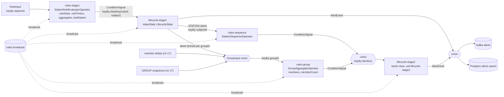
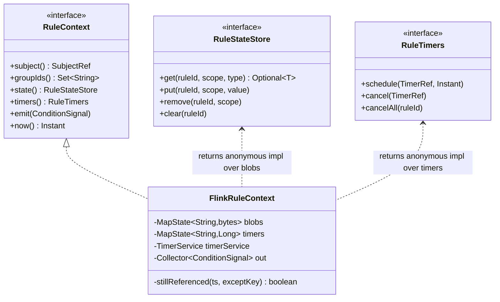
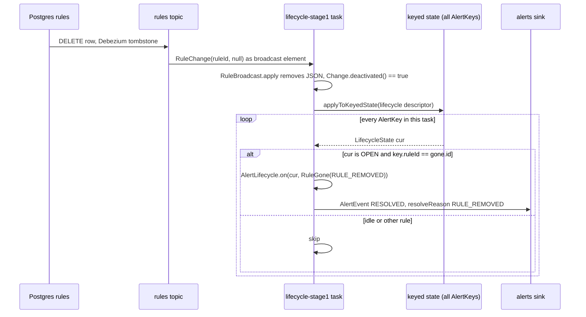

# 18. Flink job: rules, lifecycle, sinks

**Goal.** After this chapter you can read the second half of the topology: how enriched events
and aggregate snapshots are turned into `ConditionSignal`s by the stage-1 rule operator, how the
alert lifecycle operator turns signals into `AlertEvent`s, how stage 2 re-evaluates those alerts
per station and per group, how rules reach every operator (broadcast plus seeding), how alerts
and bookkeeping land in Kafka and Postgres, and how `JobMain` wires and configures it all. You
will also understand the two test harnesses well enough to add an end-to-end scenario yourself.

**Prerequisites.**
[16 Alert lifecycle](16-alert-lifecycle-and-alert-model.md),
[17 Ingest pipeline](17-flink-job-ingest-pipeline.md),
[08 Broadcast state](08-flink-broadcast-state-and-connected-streams.md),
[15 Evaluators and windows](15-rule-engine-evaluators-and-windows.md).

## Concepts (from scratch)

**Three ports, one adapter.** The rule engine (chapter 15) never touches Flink. An evaluator gets
a `RuleContext` that offers three things: `state()` (a `RuleStateStore`: get/put/remove small
records per rule and scope), `timers()` (a `RuleTimers`: schedule/cancel by a logical
`TimerRef`), and `emit(signal)`. In Flink all three are implemented by one class,
`FlinkRuleContext`, on top of the current key's `MapState`s and the operator's `TimerService`.
The same evaluator runs in unit tests against hash maps.

**Blob state.** Flink state needs a serializer per type. Evaluators keep many small records of
different types. Rather than registering a serializer for each, the adapter serializes the record
to bytes (Smile, a binary JSON) and stores `byte[]` under the key `ruleId|scope`. Flink only ever
sees bytes.

**Reference-counted timers.** Flink timers are identified by *timestamp only*, per key. Two
logical timers for the same key at the same millisecond are one Flink timer. If the adapter
deleted the Flink timer when cancelling one of them, the other would silently never fire. So the
adapter keeps a map `TimerRef.key -> timestamp` and only deletes the Flink timer when no other ref
still points at that timestamp.

**Stale timer guard.** Timers cannot always be cancelled cheaply, and they survive checkpoints.
The lifecycle operator therefore stores the *deadline* it expects (`graceDeadline`,
`suppressedUntil`, `autoResolveAt`) in state; when a timer fires, its timestamp must equal one of
those deadlines, otherwise the firing is stale and ignored.

**`applyToKeyedState`.** A broadcast element arrives once per parallel task, not per key. When a
rule is deleted, *every* key under that rule needs its open alert resolved. Flink's
`Context.applyToKeyedState(descriptor, fn)` in a `KeyedBroadcastProcessFunction` iterates all keys
in this task's state, which is exactly the tool for "resolve everything for rule X".

**Seeding.** Broadcast state fills up only as the `rules` topic is read. Events could arrive
first. To close that window each operator reads the compacted topic to its end in `open()`
(`RuleLoader`) and keeps that snapshot until the broadcast has caught up, key by key.

**Idempotent sink.** Kafka delivery here is at-least-once, so the JDBC writes must be safe to
repeat: an `INSERT ... ON CONFLICT DO UPDATE ... WHERE` with a monotonic guard (`last_seq`, `as_of`)
makes a replayed row a no-op.

## In this repo

Paths are under
[`../flink-processor/src/main/java/com/chargemon/flink/`](../flink-processor/src/main/java/com/chargemon/flink/);
wiring is in
[`topology/TopologyBuilder.java`](../flink-processor/src/main/java/com/chargemon/flink/topology/TopologyBuilder.java)
lines 113-164.

### Stage 1: `StationRuleEvaluatorOperator` and `FlinkRuleContext`

| | |
|---|---|
| Class | [`rules/StationRuleEvaluatorOperator.java`](../flink-processor/src/main/java/com/chargemon/flink/rules/StationRuleEvaluatorOperator.java), a `KeyedBroadcastProcessFunction<String, RuleInput, RuleChange, ConditionSignal>` |
| Key | `RuleInput::stationId` |
| Keyed state (all TTL `STATION_STATE_TTL`, default 30 d) | `MapState<String, byte[]>` `ruleState`; `MapState<String, Long>` `ruleTimers`; `MapState<String, Long>` `aggregates` (`"source.window"` to value); `ValueState<StationContext>` `lastStation` |
| Broadcast state | `RuleBroadcast.DESCRIPTOR` (`rules`: id to raw JSON) |
| Timers | processing time, one per `TimerRef` |
| Delegates to | `EvaluatorRegistry.fromServiceLoader()` (EVENT, ABSENCE, STATE_DURATION evaluators), `OcppEventFact` |
| Metrics | `rulesEvaluated`, `signalsEmitted` |

`processElement` builds a `StationInput` from either side of the union, then filters rules with
`applies` and dispatches:

```java
private boolean applies(RuleDefinition rule, StationContext station, Fact fact, EvalContext ec) {
    if (!rule.enabled() || rule.kind().stage() != 1) {
        return false;
    }
    if (!rule.appliesToGroups(station.allGroupIds())) {
        return false;
    }
    return rule.stationFilter() == null || rule.stationFilter().test(fact, ec);
}
```
(`StationRuleEvaluatorOperator.java:169-177`)

Gating is three-fold: the rule must be enabled and stage 1; `targetGroupIds` (if any) must
intersect the station's transitive group closure from enrichment; the optional `stationFilter`
condition is tested against the same Fact the rule will see. A snapshot input first stores each
window value into `aggregates` (lines 111-114), so subsequent *event* inputs can read
`agg.zeroEnergy.daily` too; `lastStation` remembers the context for snapshot and timer inputs,
which carry no station of their own.

`onTimer` (lines 142-167) collects every `ruleTimers` entry whose value equals the firing
timestamp, removes them, and for each either dispatches `dispatchTimer` or, if the rule is gone or
disabled, clears the rule's blobs. `processBroadcastElement` only applies the change; cleanup for
removed rules is lazy (stale timers ignored, blobs expire by TTL).

[`rules/FlinkRuleContext.java`](../flink-processor/src/main/java/com/chargemon/flink/rules/FlinkRuleContext.java)
implements
[`RuleContext`](../rule-engine/src/main/java/com/chargemon/rules/eval/RuleContext.java) and
returns anonymous implementations of
[`RuleStateStore`](../rule-engine/src/main/java/com/chargemon/rules/eval/RuleStateStore.java) and
[`RuleTimers`](../rule-engine/src/main/java/com/chargemon/rules/eval/RuleTimers.java). Blobs:

```java
public <T> void put(String ruleId, String scope, T value) {
    try {
        blobs.put(ruleId + "|" + scope, SMILE.writeValueAsBytes(value));
    } catch (Exception e) {
        throw new IllegalStateException(e);
    }
}
```
(`FlinkRuleContext.java:74-80`)

Reference-counted timers:

```java
public void schedule(TimerRef ref, Instant at) {
    ...
    long ts = at.toEpochMilli();
    Long previous = timers.get(ref.key());
    if (previous != null && !stillReferenced(previous, ref.key())) {
        timerService.deleteProcessingTimeTimer(previous);
    }
    timers.put(ref.key(), ts);
    timerService.registerProcessingTimeTimer(ts);
```
(`FlinkRuleContext.java:114-122`)

`stillReferenced` (lines 161-168) scans the timer map for another key with the same timestamp.
[`TimerRef`](../rule-engine/src/main/java/com/chargemon/rules/eval/TimerRef.java) is
`(ruleId, scope, tag)` joined by `|`, so `cancelAll(ruleId)` is a prefix scan.

### Lifecycle: `AlertLifecycleOperator` and `AlertKey`

| | |
|---|---|
| Class | [`lifecycle/AlertLifecycleOperator.java`](../flink-processor/src/main/java/com/chargemon/flink/lifecycle/AlertLifecycleOperator.java), a `KeyedBroadcastProcessFunction<AlertKey, ConditionSignal, RuleChange, AlertEvent>` |
| Key | [`AlertKey.of(ruleId, subject)`](../flink-processor/src/main/java/com/chargemon/flink/model/AlertKey.java) = `(ruleId, subjectType, subjectId)`, keyed as `Types.POJO` |
| Keyed state | `ValueState<LifecycleState>` `lifecycle`, set to `null` when idle with `seq == 0` |
| Timers | processing time, kinds GRACE, SUPPRESSION, AUTO_RESOLVE |
| Delegates to | `AlertLifecycle` (pure, chapter 16) |
| Metrics | `alertsOpened`, `alertsResolved` |

Everything funnels through `apply`:

```java
LifecycleState cur = Optional.ofNullable(state.value()).orElse(LifecycleState.idle());
AlertLifecycle.Decision d = lifecycle.on(cur, in, rule, key.subject(), now);
state.update(d.next().isIdle() && d.next().seq() == 0 ? null : d.next());
for (TimerRequest t : d.timers()) {
    if (!t.isCancel()) {
        timerService.registerProcessingTimeTimer(t.at().toEpochMilli());
    }
    // Cancels are implicit: a fired timer whose timestamp no longer matches a stored deadline is ignored.
}
d.emits().forEach(e -> emit(e, out));
```
(`AlertLifecycleOperator.java:118-128`)

`onTimer` (lines 91-114) implements the stale guard: for each `TimerKind` it reads the matching
deadline from state and only feeds `TimerFired(kind)` to the lifecycle when
`deadline.toEpochMilli() == timestamp`. A grace timer left over from a signal that has since
cleared simply does nothing.

Rule removal is the `applyToKeyedState` case:

```java
RuleBroadcast.Change c = rules.apply(change, ctx.getBroadcastState(RuleBroadcast.DESCRIPTOR));
if (!c.deactivated()) {
    return;
}
RuleDefinition gone = c.before().orElseThrow();
ResolveReason reason = c.after().isPresent() ? ResolveReason.RULE_DISABLED : ResolveReason.RULE_REMOVED;
...
ctx.applyToKeyedState(desc, (AlertKey key, ValueState<LifecycleState> s) -> {
    LifecycleState cur = s.value();
    if (cur == null || cur.isIdle() || !key.ruleId().equals(gone.id())) {
        return;
    }
    AlertLifecycle.Decision d = lifecycle.on(cur, new LifecycleInput.RuleGone(reason), gone, key.subject(), now);
```
(`AlertLifecycleOperator.java:72-85`)

Note that this is the *only* place a rule edit touches existing alert state; editing a condition
does not reset evaluator blobs, which is the last "known limitation" in the root README.

### Stage 2: `Stage2Support`, `StationSequenceOperator`, `GroupAggregateOperator`, `GroupInput`

[`stage2/Stage2Support.java`](../flink-processor/src/main/java/com/chargemon/flink/stage2/Stage2Support.java)
is only two static descriptor factories (`ruleState`, `ruleTimers`, same TTL config as stage 1),
so both stage-2 operators reuse `FlinkRuleContext` unchanged.

[`stage2/StationSequenceOperator.java`](../flink-processor/src/main/java/com/chargemon/flink/stage2/StationSequenceOperator.java)
receives stage-1 alerts whose subject is a STATION, keyed by `subjectId`. For each enabled
`SEQUENCE` rule that `appliesToGroups(alert.groupIds())` it calls
`SequenceEvaluator.dispatchAlert` (lines 50-59). The evaluator keeps a map `ruleId -> openedAt` of
currently open source alerts and is satisfied when all of `allOf` are open and their `openedAt`
values lie within `within` of each other. It schedules no timers, so `onTimer` here only drops
bookkeeping entries.

[`stage2/GroupAggregateOperator.java`](../flink-processor/src/main/java/com/chargemon/flink/stage2/GroupAggregateOperator.java)
is keyed by group id and takes the three-way union
[`GroupInput`](../flink-processor/src/main/java/com/chargemon/flink/stage2/GroupInput.java)
`(groupId, alert, delta, snapshot)`. The builder (lines 140-148) fans each station alert out once
per `groupIds()` entry, maps `GroupMemberDelta` to `GroupInput.delta`, and group snapshots to
`GroupInput.snapshot`. Extra keyed state: `MapState<String, Boolean>` `members` and
`ValueState<Integer>` `memberCount`, maintained from deltas (lines 65-81); a change in count is
pushed to `dispatchMemberCount` so percentage thresholds re-evaluate. Alerts go to
`dispatchAlert(rule, alert, count, rc)`, snapshots to `dispatchAggregate(rule, source, windows,
count, rc)`. `onTimer` (lines 98-122) dispatches to the evaluator when the rule is still an enabled
`GROUP_AGGREGATE`, otherwise clears its blobs.

The two signal streams are unioned, keyed by `AlertKey` again and fed to a **second instance of
the same** `AlertLifecycleOperator` under uid `lifecycle-stage2` (lines 156-161). Finally
`sinks.alerts(alerts.union(stage2Alerts))`. Stage 2 consumes stage-1 alerts only: one level of
nesting, by design.

### Rules everywhere: `RuleBroadcast`, `RuleLoader`, `KafkaRuleLoader`, `RuleChangeDeserializer`

[`control/RuleBroadcast.java`](../flink-processor/src/main/java/com/chargemon/flink/control/RuleBroadcast.java)
is shared by all five rule-aware operators. Broadcast state holds *raw JSON* (`DESCRIPTOR` is
`MapStateDescriptor<String, String>`), which is what Flink checkpoints; the parsed
`RuleDefinition` lives in a per-operator cache keyed by the JSON text. `apply` (lines 57-75)
handles deletes, keeps the last good version if the new JSON fails parsing or validation, and
returns a `Change(before, after)` whose `deactivated()` the lifecycle operator uses. Seeding:

```java
public void seed(RuleLoader loader) {
    for (RuleChange c : loader.load()) {
        if (!c.isDelete()) {
            parse(c.ruleId(), c.ruleJson()).ifPresent(d -> seeded.put(c.ruleId(), d));
        }
    }
}
```
(`RuleBroadcast.java:48-54`)

Every operator calls `rules.seed(loader)` in `open()`. `apply` removes the id from `seeded` as
soon as the broadcast delivers it (line 60), and `lookup`/`all` fall back to `seeded` for ids not
yet in broadcast state. [`control/RuleLoader.java`](../flink-processor/src/main/java/com/chargemon/flink/control/RuleLoader.java)
is a `Serializable` functional interface with `none()` and `of(list)` for tests;
[`control/KafkaRuleLoader.java`](../flink-processor/src/main/java/com/chargemon/flink/control/KafkaRuleLoader.java)
opens a throw-away consumer, assigns all partitions, reads to the end offsets, keeps the last
record per key and drops tombstones.
[`control/RuleChangeDeserializer.java`](../flink-processor/src/main/java/com/chargemon/flink/control/RuleChangeDeserializer.java)
accepts an unwrapped Debezium row, a full Debezium envelope (`payload.after`) or a plain rule
document; a `null` value (tombstone) or `__deleted: "true"` becomes a delete.

### Sinks: `Sinks`, `ProductionSinks`, `JdbcSinks`, `JsonKafkaSink`

[`sink/Sinks.java`](../flink-processor/src/main/java/com/chargemon/flink/sink/Sinks.java) has six
methods: `alerts`, `deadLetters`, `stationMirror`, `groupMirror`, `aggregates`, `lateSessions`.
[`sink/ProductionSinks.java`](../flink-processor/src/main/java/com/chargemon/flink/sink/ProductionSinks.java):

| Stream | Destination | Key / statement |
|---|---|---|
| alerts | Kafka `alerts` **and** Postgres `alerts` | key `alertKey`; `ALERT_UPSERT` |
| dead letters | Kafka `dead-letter` | key `sourceRef` |
| stations, groups | Postgres via `CALL upsert_station(?::jsonb)` / `CALL upsert_group(?::jsonb)` | stored procedures from `V002__station_groups.sql` |
| aggregates | flatMap `aggregate-rows` to `WindowRow`, then two JDBC sinks | tumbling rows to `zero_energy_aggregates`, rolling rows to `zero_energy_rolling` |
| late sessions | Kafka `late-events` | key `subjectId` |

[`sink/JsonKafkaSink.java`](../flink-processor/src/main/java/com/chargemon/flink/sink/JsonKafkaSink.java)
builds a `KafkaSink` with `DeliveryGuarantee.AT_LEAST_ONCE` and Jackson JSON values.
[`sink/JdbcSinks.java`](../flink-processor/src/main/java/com/chargemon/flink/sink/JdbcSinks.java)
holds the SQL. The upsert guard is the important part:

```sql
ON CONFLICT (alert_id) DO UPDATE SET
    status = EXCLUDED.status, resolved_at = EXCLUDED.resolved_at, resolve_reason = EXCLUDED.resolve_reason,
    context = EXCLUDED.context, last_seq = EXCLUDED.last_seq, rule_version = EXCLUDED.rule_version,
    group_ids = EXCLUDED.group_ids, updated_at = now()
WHERE alerts.last_seq < EXCLUDED.last_seq
```
(`JdbcSinks.java:25-29`)

`seq` is incremented by the lifecycle on every emitted event for an alert, so a replayed OPENED
(seq 1) arriving after RESOLVED (seq 2) is rejected by the `WHERE`. The two aggregate upserts use
`as_of <= EXCLUDED.as_of` the same way. `sink(...)` (lines 129-144) configures batches of 500 rows
or 200 ms, 3 retries, `buildAtLeastOnce`.

### `JobMain` and `JobConfig`

[`JobMain.java`](../flink-processor/src/main/java/com/chargemon/flink/JobMain.java):

```java
public static Configuration baseConfig() {
    Configuration c = new Configuration();
    c.set(PipelineOptions.GENERIC_TYPES, false);      // fail fast on Kryo fallback
    c.set(PipelineOptions.OBJECT_REUSE, true);        // everything we carry is immutable
    return c;
}
```
(`JobMain.java:28-33`)

`GENERIC_TYPES=false` makes Flink refuse any type without a proper serializer, so a forgotten
`JsonTypes.of(...)` fails at graph build instead of silently using Kryo. `configure` (lines 35-44)
sets STREAMING mode, exactly-once checkpointing at `CHECKPOINT_INTERVAL` (30 s default), a minimum
pause of half the interval, a 10-minute checkpoint timeout, three tolerable failures, and the
parallelism if `PARALLELISM > 0`. `main` reads
[`config/JobConfig.java`](../flink-processor/src/main/java/com/chargemon/flink/config/JobConfig.java)
from the environment, builds the topology with `KafkaSources` and `ProductionSinks`, and calls
`env.execute("chargemon-event-processor")`.

| Env var | Default | Used by |
|---|---|---|
| `KAFKA_BOOTSTRAP`, `KAFKA_GROUP` | `localhost:9092`, `chargemon-processor` | sources, sinks, rule loader |
| `TOPIC_EVENTS/STATIONS/GROUPS/RULES/ALERTS/DEAD_LETTER/LATE_EVENTS` | `common-broker`, `stations`, `groups`, `rules`, `alerts`, `dead-letter`, `late-events` | sources, sinks |
| `CORRELATION_TIMEOUT`, `PENDING_CALL_TTL` | 60 s, 5 min | correlate |
| `MAX_OUT_OF_ORDERNESS`, `SOURCE_IDLENESS` | 5 min, 1 min | event source watermarks |
| `STATION_STATE_TTL` | 30 d | stage-1 and stage-2 keyed state |
| `SESSION_TRACK_TTL` | 48 h | sessions |
| `CHECKPOINT_INTERVAL`, `PARALLELISM` | 30 s, 0 (cluster default) | `configure` |
| `DB_URL`, `DB_USER`, `DB_PASSWORD` | local Postgres | JDBC sinks |
| `ZERO_ENERGY_WINDOWS` | `hourly=TUMBLING_HOUR,daily=TUMBLING_DAY,rolling7d=ROLLING:P7D,rolling30d=ROLLING:P30D` | aggregator, aggregate sinks |

### Tests: `ProductionTopologyTest` versus `TopologyEndToEndTest`

[`ProductionTopologyTest`](../flink-processor/src/test/java/com/chargemon/flink/topology/ProductionTopologyTest.java)
builds the real graph with `KafkaSources` and `ProductionSinks` and calls
`env.getStreamGraph().getJobGraph()` without executing. Flink's closure cleaner serializes every
user function at that point, so a lambda that captured a non-serializable object (a `JdbcSinks`
holding a live connection, say) fails here rather than at deploy time. It needs no Kafka.

[`TopologyEndToEndTest`](../flink-processor/src/test/java/com/chargemon/flink/topology/TopologyEndToEndTest.java)
runs the same `TopologyBuilder.build` on a `MiniClusterWithClientResource` (1 TaskManager, 4
slots) with parallelism 2, a 2-second correlation timeout and 5-second checkpoints
(`testConfig`, lines 45-52). The `run` helper (lines 61-88) starts the job asynchronously, polls
`sinks.alerts()` every 100 ms until it has at least `expected` alerts and the `done` predicate
holds, then cancels.

[`ListSources`](../flink-processor/src/test/java/com/chargemon/flink/topology/ListSources.java)
replaces Kafka. Its rules source emits the list and counts down a static latch; the event source
waits on that latch, sleeps `eventDelayMillis` so the broadcast propagates, emits the envelopes
with `System.currentTimeMillis()` as timestamp, and then **stays open** so processing-time timers
keep firing (lines 116-128). `ruleLoader()` returns `RuleLoader.of(rules)`, so seeding works as in
production. Flink refuses an empty `fromData`, so empty station or group lists become a single
deleted sentinel record `__none__` (lines 86-101).
[`CollectingSinks`](../flink-processor/src/test/java/com/chargemon/flink/topology/CollectingSinks.java)
stores alerts, dead letters and snapshots in static concurrent queues keyed by a per-test id,
which works because MiniCluster sinks run in the test JVM.

| # | Test | Input | Rules | Asserts |
|---|---|---|---|---|
| 1 | `faultedStatusOpensAlertAndAvailableResolvesIt` | ST-1 (1.6) Faulted then Available | EVENT `faulted`, grace/suppression PT0S | OPENED then RESOLVED with the same `alertId`; context `event.errorCode=GroundFailure` |
| 2 | `heartbeatAbsenceFiresAfterTimerAndGraceWindowIsHonoured` | ST-2 one Heartbeat | ABSENCE within PT1S, grace PT1S | one OPENED ABSENCE; `openedAt - triggeredAt >= 1 s`; wall time >= 300+1000+1000 ms |
| 3 | `ruleScopedToGroupAppliesThroughHierarchyAndCarriesGroupIds` | ST-EU (site:berlin > region:eu > country:de) and ST-US both Faulted | EVENT with `targetGroupIds=[country:de]` and vendor filter | exactly one alert, for ST-EU, carrying all three group ids |
| 4 | `threeZeroEnergySessionsRaiseAggregateRule` | ST-Z: 3 zero-Wh 2.0.1 sessions plus one 2500 Wh session | EVENT with `trigger.aggregate=zeroEnergy`, `daily >= 3` | one alert with context `input=zeroEnergy` |
| 5 | `groupAggregateAndSequenceRulesFireOverStageOneAlerts` | G1, G2 Faulted; G1 SecurityEventNotification; all in site:a | `faulted`, `sec`, SEQUENCE `both`, GROUP_AGGREGATE `site-faults` count 2 | alerts for all four rules; `both` on G1 with kind SEQUENCE; `site-faults` on GROUP site:a with `count=2`, `members=3` |
| 6 | `stuckPreparingFiresAfterMaxDurationPerConnector` | ST-P connectors 1 and 2 Preparing, connector 2 then Charging | STATE_DURATION PT2S scoped by `event.connectorId` | one alert, context `scope=1` |
| 7 | `bootRejectedViaCorrelationAndMalformedGoesToDeadLetter` | garbage line; Boot CALL id 7; CALLRESULT Rejected from CSMS | EVENT on `BootCompleted` with status REJECTED | one alert with `event.status=REJECTED`; the garbage line is in `sinks.dead()` |

**Adding scenario 8.** Copy test 5's shape: build envelopes with `envelope(...)`, rules as
`RuleChange(id, json)` (use `RuleFixtures` where one exists), call `run(...)` with an `expected`
count and a `done` predicate that names the rule ids you wait for, then assert. If your scenario
needs groups, use the five-argument `ListSources` constructor with station and group records and
a longer `eventDelayMillis` (1500) so the compacted replays land first.

## Diagrams

Stage 1, lifecycle, stage 2 with keys:



One adapter, three ports:



A rule is deleted while alerts are open:



## Hands-on exercises

1. **Scenario 8: SEQUENCE over heartbeat-drop then boot-rejected.**
   *What to do:* add a test to `TopologyEndToEndTest` for station `ST-8`: one `Heartbeat` CALL,
   then a `BootNotification` CALL with id `9` and a CSMS `CALLRESULT` `9` with status `Rejected`
   (copy from test 7). Rules: `hb` = `RuleFixtures.heartbeatAbsenceRule("hb", "PT1S")`, `boot` =
   the JSON from test 7, and `seq` = `RuleFixtures.sequenceRule("seq", "hb", "boot", "PT15M")`.
   Call `run(envelopes, rules, 3, a -> a.stream().anyMatch(x -> x.ruleId().equals("seq")),
   Duration.ofSeconds(30))`.
   *What you should observe:* three OPENED alerts: `boot` almost immediately, `hb` about a second
   later, and `seq` on `ST-8` with kind `SEQUENCE` right after `hb` opens. The `seq` context
   contains `alert.hb.openedAt` and `alert.boot.openedAt`.
   *Hint:* `SequenceEvaluator.satisfied` needs both source alerts OPEN with `openedAt` values
   less than `within` apart; order does not matter.

2. **Count timer registrations per kind.**
   *What to do:* in `FlinkRuleContext.timers().schedule`, add a debug log line printing
   `ref.ruleId()`, `ref.tag()` and whether `previous` was replaced. Run tests 2 and 6 with
   `--info` and grep the output for your line.
   *What you should observe:* the ABSENCE test schedules one timer per heartbeat (the tag names
   the expected action) and re-schedules it, deleting the previous Flink timer because nothing
   else references that timestamp; the STATE_DURATION test schedules one timer per connector
   scope. The counts match the number of `ruleTimers` entries you would see in a savepoint.
   *Hint:* `TimerRef.key()` is `ruleId|scope|tag`; the scope for STATE_DURATION is the
   `scopeField` value (`1`, `2`).

3. **Prove the `last_seq` guard.**
   *What to do:* start the local stack (chapter 20), run the generator with the
   `boot-rejected` profile and the sample rules, and in `psql` note `last_seq` for one alert. Then
   replay the `alerts` sink input by resetting the Flink job's Kafka consumer group for
   `common-broker` to an earlier offset (`kafka-consumer-groups.sh --reset-offsets --to-earliest
   --group chargemon-processor --topic common-broker --execute`, with the job stopped), restart
   the job and watch the row. Optionally add a `LOG.warn` inside a small wrapper around the
   statement builder in `JdbcSinks.alerts()` that logs when `a.seq()` is lower than the row you
   last saw for that `alertId`.
   *What you should observe:* the `alerts` row keeps the higher `last_seq` and `updated_at` does
   not move for the replayed OPENED events; the notifier's ledger shows `duplicate` outcomes.
   *Hint:* the guard is the `WHERE alerts.last_seq < EXCLUDED.last_seq` clause; the Kafka sink
   has no such guard, which is why the notifier needs its ledger (chapter 19).

## Self-check

1. Why does `FlinkRuleContext` check `stillReferenced` before deleting a Flink timer?
2. A rule's `stationFilter` says `station.vendor == "ACME"`. An unknown station sends a Faulted
   status. Does the rule evaluate?
3. What does the lifecycle operator do when a GRACE timer fires but the state's `graceDeadline`
   is a different instant?
4. Why do both `lifecycle-stage1` and `lifecycle-stage2` need the rules broadcast?
5. `ProductionTopologyTest` passes but the job fails at deploy. Name one class of bug it can and
   one it cannot catch.

<details><summary>Answers</summary>

1. Flink identifies timers per key by timestamp only. Two `TimerRef`s scheduled for the same
   millisecond share one Flink timer; deleting it for one ref would also cancel the other.
2. No. `StationContext.unknown` has no vendor, so `station.vendor` is null and `eq` is false;
   `applies` returns false. (`targetGroupIds` would also fail because the closure is empty.)
3. Nothing. `onTimer` compares the firing timestamp with each stored deadline and only applies
   `TimerFired` on an exact match; a mismatched firing is a stale timer from a cancelled window.
4. The lifecycle needs the rule definition for grace, suppression, auto-resolve, severity and
   channels, and it must see deletes/disables to resolve open alerts via `applyToKeyedState`.
   Stage-2 rules are different rule ids, so the second instance needs the same feed.
5. It catches non-serializable captures in lambdas and missing `TypeInformation` (with
   `GENERIC_TYPES=false`). It cannot catch runtime problems such as an unreachable Kafka broker,
   a wrong SQL column, or a timer semantics bug; those need `TopologyEndToEndTest` or the stack.

</details>

## Glossary terms

- [broadcast state](glossary.md#broadcast-state)
- [KeyedBroadcastProcessFunction](glossary.md#keyedbroadcastprocessfunction)
- [keyed state](glossary.md#keyed-state)
- [timer](glossary.md#timer)
- [state TTL](glossary.md#state-ttl)
- [alert key](glossary.md#alert-key)
- [lifecycle phase](glossary.md#lifecycle-phase)
- [grace window](glossary.md#grace-window)
- [suppression window](glossary.md#suppression-window)
- [auto-resolve](glossary.md#auto-resolve)
- [ConditionSignal](glossary.md#conditionsignal)
- [rule kind](glossary.md#rule-kind)
- [stage 1 / stage 2](glossary.md#stage-1--stage-2)
- [target groups](glossary.md#target-groups)
- [station filter](glossary.md#station-filter)
- [at-least-once](glossary.md#at-least-once)
- [checkpoint](glossary.md#checkpoint)
- [job graph](glossary.md#job-graph)
- [MiniCluster](glossary.md#minicluster)
- [tombstone](glossary.md#tombstone)
- [operator uid](glossary.md#operator-uid)

## Further reading

- Flink broadcast state and `applyToKeyedState`: <https://nightlies.apache.org/flink/flink-docs-release-1.20/docs/dev/datastream/fault-tolerance/broadcast_state/>
- Flink timers and `TimerService`: <https://nightlies.apache.org/flink/flink-docs-release-1.20/docs/dev/datastream/operators/process_function/>
- Flink state and serializers: <https://nightlies.apache.org/flink/flink-docs-release-1.20/docs/dev/datastream/fault-tolerance/state/>
- Flink JDBC connector: <https://nightlies.apache.org/flink/flink-docs-release-1.20/docs/connectors/datastream/jdbc/>
- Flink Kafka sink delivery guarantees: <https://nightlies.apache.org/flink/flink-docs-release-1.20/docs/connectors/datastream/kafka/>
- Flink testing (MiniCluster, harnesses): <https://nightlies.apache.org/flink/flink-docs-release-1.20/docs/dev/datastream/testing/>
- Flink checkpointing configuration: <https://nightlies.apache.org/flink/flink-docs-release-1.20/docs/dev/datastream/fault-tolerance/checkpointing/>
- Jackson Smile binary format: <https://github.com/FasterXML/jackson-dataformats-binary/tree/master/smile>
