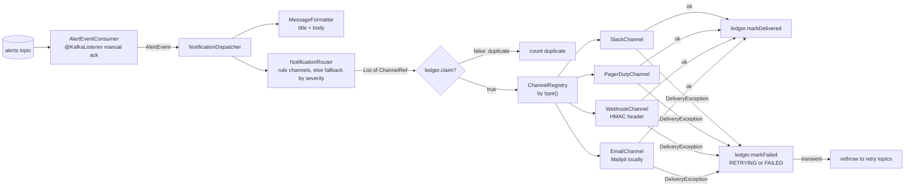
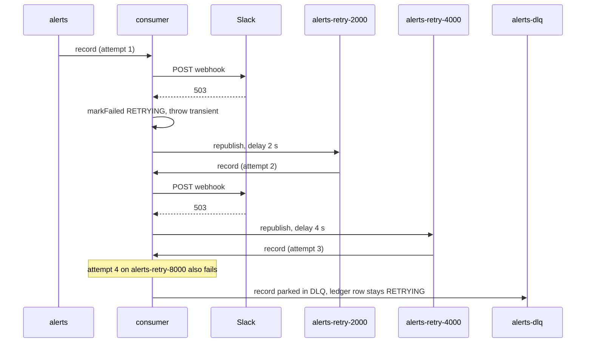
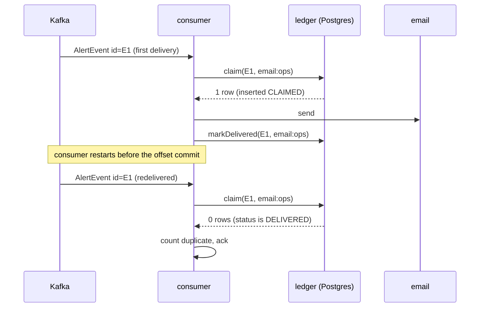

# 19. Notifier (Spring Boot)

**Goal.** After this chapter you can read the notifier from `main` to the HTTP call that reaches
Slack, and explain why a Kafka record delivered twice produces one email. You will learn just
enough Spring Boot to follow the code (beans, injection, configuration properties, actuator), how
`@KafkaListener` with manual acknowledgement and `@RetryableTopic` behaves, how the delivery
ledger makes sending idempotent, and how each channel classifies failures as transient or
permanent.

**Prerequisites.**
[16 Alert lifecycle and alert model](16-alert-lifecycle-and-alert-model.md) (the `AlertEvent`
contract), [04 Kafka and CDC basics](04-kafka-and-cdc-basics.md) (consumer groups, offsets).

## Concepts (from scratch)

**Spring Boot in five sentences.** Spring is a Java framework whose core job is to create your
objects and hand them to each other. An object Spring manages is called a *bean*. You mark a
class as a bean with `@Component` (or a specialization: `@Service`, `@Repository`,
`@Configuration`), and Spring instantiates it once. When a bean's constructor asks for another
bean by type, Spring passes it in; this is *dependency injection*, and it is why you will see no
`new` for collaborators anywhere in the notifier. Spring Boot adds *auto-configuration*: put
`spring-kafka` on the classpath and a Kafka consumer factory appears; put `spring-boot-starter-mail`
there and a `JavaMailSender` appears, both configured from `application.yml`.

**`@Configuration` and `@Bean`.** When a bean is not your own class (an `ObjectMapper`, a
`RestClient`), you write a `@Configuration` class with `@Bean` methods; the return value of each
method becomes a bean.

**`@ConfigurationProperties`.** A plain class with getters and setters, annotated with a prefix
(`notifier`). Spring reads `application.yml` keys under that prefix (`notifier.topic`,
`notifier.slack.webhooks.#ops`) into it, converting types (`PT5S` to `Duration`). `${ENV:default}`
placeholders in the YAML pull from environment variables.

**Profiles and actuator.** A Spring *profile* is a named set of overrides
(`application-<profile>.yml`, activated by `SPRING_PROFILES_ACTIVE`). This repo uses none in
`main`; tests carry their own `application.yml`. *Actuator* is a starter that exposes operational
HTTP endpoints: `/actuator/health`, `/actuator/metrics`, `/actuator/prometheus`.

**`@KafkaListener` and manual acknowledgement.** Spring Kafka runs a consumer loop in the
background and calls your annotated method per record. With `ack-mode: manual` the offset is
only committed when you call `ack.acknowledge()`. If your method throws, the record is not
acknowledged and the container's error handler decides what happens next.

**`@RetryableTopic`.** Instead of blocking the partition while retrying, Spring Kafka republishes
the failed record to `<topic>-retry-<delay>` topics with a delay and finally to a dead-letter topic
`<topic>-dlq`. Each hop has its own consumer, so healthy records keep flowing. Only exceptions
listed in `include` are retried; everything else goes straight to the DLQ.

**Transient versus permanent failure.** A 503 or a connection timeout may succeed later:
transient, retry. A 400, a missing webhook configuration, or an SMTP authentication failure will
fail the same way forever: permanent, record it and move on.

**Idempotent delivery.** Kafka is at-least-once here. To send once, the notifier writes a row
`(alert_event_id, channel_ref)` *before* sending. A second delivery of the same record finds the
row already `DELIVERED` and skips.

## In this repo

Paths are under
[`../notifier/src/main/java/com/chargemon/notifier/`](../notifier/src/main/java/com/chargemon/notifier/).

### Boot and configuration

[`NotifierApplication.java`](../notifier/src/main/java/com/chargemon/notifier/NotifierApplication.java)
is the whole entry point: `@SpringBootApplication` plus `SpringApplication.run`.
[`config/NotifierConfig.java`](../notifier/src/main/java/com/chargemon/notifier/config/NotifierConfig.java)
provides two beans, the shared Jackson mapper (so the notifier parses `AlertEvent` with the same
settings as the Flink job) and a `RestClient` whose connect and read timeouts come from
`notifier.webhook.timeout`:

```java
@Configuration
@EnableConfigurationProperties(NotifierProperties.class)
public class NotifierConfig {

    @Bean
    public ObjectMapper objectMapper() {
        return JsonMapperFactory.standard();
    }
```
(`NotifierConfig.java:12-19`)

[`config/NotifierProperties.java`](../notifier/src/main/java/com/chargemon/notifier/config/NotifierProperties.java)
is the `@ConfigurationProperties(prefix = "notifier")` class: `topic`, `retry`, `fallback`
(severity to channel refs), `slack.webhooks`, `pagerduty.eventsUrl/routingKeys`, `email.from`,
`webhook.hmacSecret/timeout`. [`resources/application.yml`](../notifier/src/main/resources/application.yml)
fills it; the Kafka part is worth reading once:

```yaml
    consumer:
      group-id: chargemon-notifier
      auto-offset-reset: earliest
      enable-auto-commit: false
    listener:
      ack-mode: manual
      concurrency: ${NOTIFIER_CONCURRENCY:2}
```
(`application.yml:6-14`)

`management.endpoints.web.exposure.include: health,info,prometheus,metrics` (lines 23-27) turns
on the actuator endpoints on port 8080.

### The listener: `AlertEventConsumer`

```java
@RetryableTopic(
        attempts = "${notifier.retry.attempts:4}",
        backoff = @Backoff(delay = 2000, multiplier = 2.0, maxDelay = 60000),
        dltStrategy = DltStrategy.FAIL_ON_ERROR,
        dltTopicSuffix = "-dlq",
        retryTopicSuffix = "-retry",
        include = DeliveryException.class)
@KafkaListener(topics = "${notifier.topic}", groupId = "${spring.kafka.consumer.group-id}")
public void onAlert(String payload, Acknowledgment ack) {
```
(`AlertEventConsumer.java:34-42`)

Four attempts with delays of 2 s, 4 s, 8 s (capped at 60 s) means `alerts`, then
`alerts-retry-2000`, `alerts-retry-4000`, `alerts-retry-8000` (Spring Kafka suffixes each retry topic with
its delay in milliseconds by default), then `alerts-dlq`. The method body (lines
43-59) has three outcomes: malformed JSON is logged and acknowledged (it can never succeed); a
`DeliveryException` that `isTransient()` is rethrown, which is what sends the record to the next
retry topic; a permanent one is acknowledged because the ledger already recorded the failure.

### The dispatcher: `NotificationDispatcher`, `NotificationRouter`, `ChannelRegistry`

[`consumer/NotificationDispatcher.java`](../notifier/src/main/java/com/chargemon/notifier/consumer/NotificationDispatcher.java)
formats the message once and loops over the channel refs:

```java
if (!ledger.claim(event.alertEventId(), ref)) {
    count("duplicate", ref);
    continue;
}
try {
    channel.get().send(n, ref.target());
    ledger.markDelivered(event.alertEventId(), ref);
    count("delivered", ref);
} catch (DeliveryException e) {
    ledger.markFailed(event.alertEventId(), ref, e.getMessage(), e.isTransient());
    count(e.isTransient() ? "retry" : "failed", ref);
```
(`NotificationDispatcher.java:57-67`)

A ref with no channel implementation is counted as `skipped`. After the loop, if any channel
failed transiently, one aggregated transient `DeliveryException` is thrown (lines 75-77) so the
whole record is retried; channels that already succeeded are protected by the ledger on the
retry. Every outcome increments the Micrometer counter `notifier.deliveries{outcome,channel}`,
visible at `/actuator/prometheus`.

[`routing/NotificationRouter.java`](../notifier/src/main/java/com/chargemon/notifier/routing/NotificationRouter.java)
decides *where*: the rule's own `channels` list wins; otherwise `notifier.fallback.<SEVERITY>`;
otherwise `notifier.fallback.DEFAULT`, each a comma-separated list of `type:target` strings
parsed by `ChannelRef.parse`.
[`channel/ChannelRegistry.java`](../notifier/src/main/java/com/chargemon/notifier/channel/ChannelRegistry.java)
decides *how*: Spring injects `List<NotificationChannel>` (every bean implementing the
interface) and the registry maps each by its lower-cased `type()`. Adding a channel is therefore
one new bean; nothing else changes.

### The ledger: `DeliveryLedger` and `JdbcDeliveryLedger`

[`ledger/DeliveryLedger.java`](../notifier/src/main/java/com/chargemon/notifier/ledger/DeliveryLedger.java)
has three methods: `claim`, `markDelivered`, `markFailed`.
[`ledger/JdbcDeliveryLedger.java`](../notifier/src/main/java/com/chargemon/notifier/ledger/JdbcDeliveryLedger.java)
implements them with `JdbcTemplate` on the table from
[`V006__notification_deliveries.sql`](../schema/src/main/resources/db/migration/V006__notification_deliveries.sql)
(primary key `(alert_event_id, channel_ref)`, `status` in CLAIMED / DELIVERED / FAILED plus
RETRYING, `attempts`, `last_error`, `delivered_at`). The claim is one statement:

```sql
INSERT INTO notification_deliveries (alert_event_id, channel_ref, status, attempts, updated_at)
VALUES (?, ?, 'CLAIMED', 1, now())
ON CONFLICT (alert_event_id, channel_ref) DO UPDATE
    SET status = 'CLAIMED', attempts = notification_deliveries.attempts + 1, updated_at = now()
    WHERE notification_deliveries.status <> 'DELIVERED'
```
(`JdbcDeliveryLedger.java:11-17`)

`claim` returns `update > 0`. A new row inserts (1 row). A row in RETRYING or FAILED is updated
and its `attempts` bumped (1 row): retry allowed. A row already DELIVERED fails the `WHERE`
(0 rows): duplicate, skip. `alertEventId` is unique per emitted event, so OPENED and RESOLVED of
the same alert are two independent deliveries.

### Channels

All implement
[`channel/NotificationChannel.java`](../notifier/src/main/java/com/chargemon/notifier/channel/NotificationChannel.java)
(`type()`, `send(Notification, target)`) and throw
[`channel/DeliveryException.java`](../notifier/src/main/java/com/chargemon/notifier/channel/DeliveryException.java)
via `transientError(...)` or `permanent(...)`.

| Channel | Ref example | Transport | Transient | Permanent |
|---|---|---|---|---|
| [`slack/SlackChannel`](../notifier/src/main/java/com/chargemon/notifier/channel/slack/SlackChannel.java) | `slack:#ops` | POST `{"text": ...}` to the incoming-webhook URL configured for the target | 5xx, I/O error | other 4xx, unknown target |
| [`pagerduty/PagerDutyChannel`](../notifier/src/main/java/com/chargemon/notifier/channel/pagerduty/PagerDutyChannel.java) | `pagerduty:svc` | Events API v2 `enqueue` with the routing key for the target | 5xx, I/O error, 429 | other 4xx, unknown target |
| [`webhook/WebhookChannel`](../notifier/src/main/java/com/chargemon/notifier/channel/webhook/WebhookChannel.java) | `webhook:https://...` | POST the raw `AlertEvent` JSON to the target URL | 5xx, I/O error | other 4xx, serialization error |
| [`email/EmailChannel`](../notifier/src/main/java/com/chargemon/notifier/channel/email/EmailChannel.java) | `email:a@b` | `JavaMailSender` with a `SimpleMailMessage` | any `MailException` | `MailAuthenticationException` |

PagerDuty deserves a closer look:

```java
body.put("routing_key", routingKey);
body.put("dedup_key", n.event().alertId());
body.put("event_action", n.event().type() == AlertEventType.OPENED ? "trigger" : "resolve");
...
payload.put("severity", switch (n.event().severity()) {
    case CRITICAL -> "critical";
    case HIGH -> "error";
    case MEDIUM -> "warning";
    case LOW, INFO -> "info";
});
```
(`PagerDutyChannel.java:41-52`)

`dedup_key` is the `alertId`, which is the same on the OPENED and the RESOLVED event of one
alert. PagerDuty collapses events with the same key into one incident, so `trigger` opens it and
`resolve` closes it: two Kafka records, one incident.

The webhook channel signs the body when `notifier.webhook.hmac-secret` is set: header
`X-Chargemon-Signature: sha256=<hex HMAC-SHA256 of the exact bytes>` plus
`X-Chargemon-Event-Id`. A receiver verifies it like this (Python, standard library only):

```python
import hmac, hashlib
def verify(secret: str, body: bytes, header: str) -> bool:
    expected = "sha256=" + hmac.new(secret.encode(), body, hashlib.sha256).hexdigest()
    return hmac.compare_digest(expected, header)
```

Compute over the raw request bytes, never over re-serialized JSON.

For local runs the email channel points at Mailpit (`SMTP_HOST=mailpit`, port 1025) and the
docker-compose file sets every fallback to `email:ops@example.test`, so every alert without rule
channels shows up at `http://localhost:8025`.

### Formatting: `MessageFormatter`

[`template/MessageFormatter.java`](../notifier/src/main/java/com/chargemon/notifier/template/MessageFormatter.java)
renders one `Notification(event, title, body)` for all channels. The title is
`[SEVERITY] OPEN|RESOLVED: station <id>` (line 16); the body lists rule, subject, groups,
timestamps, duration for RESOLVED, every `context` entry and the alert id.

### Tests

| Test | Kind | What it proves |
|---|---|---|
| [`channel/HttpChannelsTest`](../notifier/src/test/java/com/chargemon/notifier/channel/HttpChannelsTest.java) | unit with WireMock (a fake HTTP server) | Slack posts the title, 503 is transient, 400 and unknown target are permanent; PagerDuty sends `dedup_key`, `trigger`, `critical`; the webhook signature equals an independently computed HMAC |
| [`ledger/JdbcDeliveryLedgerIT`](../notifier/src/test/java/com/chargemon/notifier/ledger/JdbcDeliveryLedgerIT.java) | integration with Testcontainers Postgres and the Flyway migrations | claim, fail, re-claim, deliver, then claim returns false; a different channel is independent; `attempts == 2` |
| [`routing/NotificationRouterTest`](../notifier/src/test/java/com/chargemon/notifier/routing/NotificationRouterTest.java) | unit | rule channels beat fallback; severity fallback beats DEFAULT |
| [`template/MessageFormatterTest`](../notifier/src/test/java/com/chargemon/notifier/template/MessageFormatterTest.java) | unit | title and body layout |

[`Fixtures.java`](../notifier/src/test/java/com/chargemon/notifier/Fixtures.java) builds one
OPENED `AlertEvent`. `JdbcDeliveryLedgerIT` is annotated `@Testcontainers(disabledWithoutDocker =
true)`, so it is skipped rather than failing on a machine without Docker.

## Diagrams

From topic to channel, with the ledger gate:



Retry and dead-letter path for a transient failure:



A duplicate record rejected by the ledger:



## Hands-on exercises

1. **A log-only SMS channel.**
   *What to do:* create `channel/sms/SmsChannel.java` as a `@Component` implementing
   `NotificationChannel` with `type()` returning `"sms"` and `send` that logs the target and
   title at INFO. Add a rule row with `channels = '{sms:+15550001234}'` (or set
   `NOTIFIER_FALLBACK_DEFAULT=sms:+15550001234` in docker-compose), rebuild, restart the notifier
   and send traffic.
   *What you should observe:* a log line per alert event, a `notification_deliveries` row with
   `channel_ref = 'sms:+15550001234'` and `status = 'DELIVERED'`, and
   `notifier_deliveries_total{channel="sms",outcome="delivered"}` on `/actuator/prometheus`. No
   registration step was needed: the registry collects every `NotificationChannel` bean.
   *Hint:* `ChannelRef.parse("sms:+15550001234")` splits on the first colon; the `+` survives.

2. **Verify the HMAC on a local receiver.**
   *What to do:* set `NOTIFIER_WEBHOOK_SECRET=s3cret` on the notifier service and route a rule to
   `webhook:http://host.docker.internal:9999/hook` (on Linux add
   `extra_hosts: ["host.docker.internal:host-gateway"]` to the service). Run a tiny listener:
   `python3 -m http.server 9999` shows the request line only, so prefer a 15-line
   `http.server.BaseHTTPRequestHandler` that reads `Content-Length` bytes, prints the
   `X-Chargemon-Signature` header and runs the `verify` function above; answer `204`.
   *What you should observe:* `verify` returns `True` for every POST, and the body's `alertId`
   matches the `X-Chargemon-Event-Id`'s event. Answer `500` instead and watch the record travel
   through the `alerts-retry-*` topics in Kafka UI (`http://localhost:8090`) and land in `alerts-dlq`.
   *Hint:* `HttpChannelsTest.webhookSignsBody` does the same check in Java.

3. **Replay the alerts topic and prove no duplicate emails.**
   *What to do:* with the stack running and some emails in Mailpit, stop the notifier
   (`docker compose -f deploy/docker-compose.yml stop notifier`), reset its offsets:
   `docker compose -f deploy/docker-compose.yml exec kafka /opt/kafka/bin/kafka-consumer-groups.sh
   --bootstrap-server localhost:19092 --group chargemon-notifier --topic alerts --reset-offsets
   --to-earliest --execute`, then start the notifier again.
   *What you should observe:* the Mailpit message count does not change; `SELECT status,
   count(*) FROM notification_deliveries GROUP BY 1` is unchanged; the Prometheus counter
   `notifier_deliveries_total{outcome="duplicate"}` grows by the number of replayed records.
   *Hint:* the guard is the `WHERE ... status <> 'DELIVERED'` clause in `JdbcDeliveryLedger`.

## Self-check

1. A rule lists `slack:#ops` and `email:a@b`. Slack returns 503, email succeeds. What happens to
   the Kafka record, and will the email be sent again on retry?
2. Why is a malformed JSON payload acknowledged instead of sent to the DLQ?
3. OPENED and RESOLVED for the same alert both reach PagerDuty. How many incidents appear?
4. What makes `ChannelRegistry` find your new channel without any registration code?
5. Why must the webhook receiver compute the HMAC over the raw bytes?

<details><summary>Answers</summary>

1. The dispatcher marks the Slack row RETRYING, the email row DELIVERED, then throws one
   transient `DeliveryException`; the record is republished to `alerts-retry-0`. On retry the
   email claim returns 0 rows (DELIVERED) and is skipped; only Slack is attempted.
2. It can never succeed, and `@RetryableTopic` only retries `DeliveryException`. Logging and
   acknowledging keeps the partition moving; the raw record is still in the `alerts` topic if you
   need it.
3. One. `dedup_key = alertId` is identical on both events; `trigger` opens the incident and
   `resolve` closes it.
4. Spring injects `List<NotificationChannel>` into the registry's constructor with every bean
   that implements the interface; the registry keys them by `type()`.
5. The signature was computed over the exact bytes the notifier sent. Re-serializing the parsed
   JSON may reorder keys or change whitespace and produce different bytes, so the digest would
   not match.

</details>

## Glossary terms

- [at-least-once](glossary.md#at-least-once)
- [consumer group](glossary.md#consumer-group)
- [offset](glossary.md#offset)
- [retry topic](glossary.md#retry-topic)
- [dead-letter topic](glossary.md#dead-letter-topic)
- [delivery ledger](glossary.md#delivery-ledger)
- [ChannelRef](glossary.md#channelref)
- [Flyway](glossary.md#flyway)
- [subject](glossary.md#subject)

## Further reading

- Spring Boot reference (beans, configuration properties, actuator): <https://docs.spring.io/spring-boot/reference/>
- Spring Kafka `@KafkaListener`: <https://docs.spring.io/spring-kafka/reference/kafka/receiving-messages/listener-annotation.html>
- Spring Kafka non-blocking retries (`@RetryableTopic`): <https://docs.spring.io/spring-kafka/reference/retrytopic.html>
- PagerDuty Events API v2, send an alert event: <https://developer.pagerduty.com/docs/send-alert-event>
- Slack incoming webhooks: <https://api.slack.com/messaging/webhooks>
- Testcontainers for Java: <https://java.testcontainers.org/>
- WireMock: <https://wiremock.org/docs/>
- Mailpit: <https://mailpit.axllent.org/>
