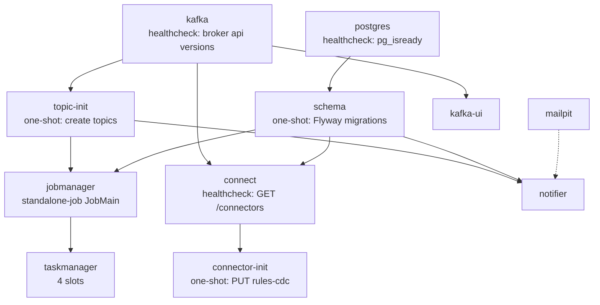
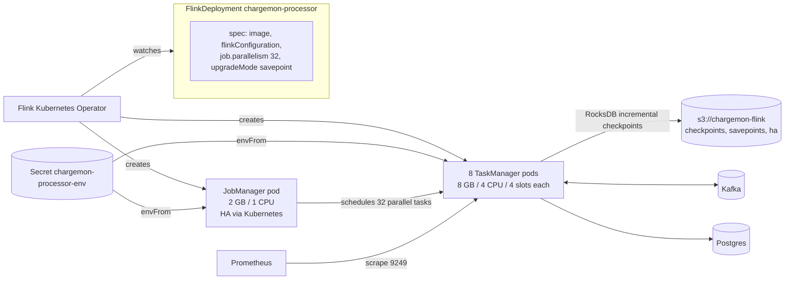
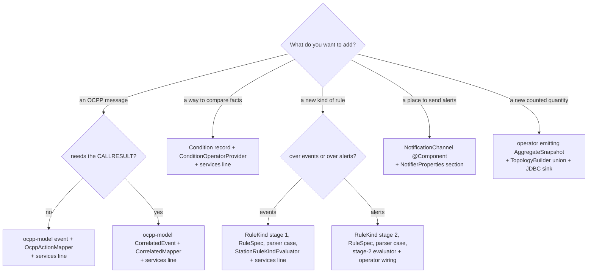

# 20. Deploy, generator, testing, extending

**Goal.** After this chapter you can run and reset the local stack and explain what each
container is for; find out why Debezium is not producing rule changes; read the Kubernetes
`FlinkDeployment` and reason about sizing for a million stations; drive the event generator to
reproduce any of the built-in fault profiles; run exactly the tests you need; and extend the
system along one of the six recipes from the root README with a file-by-file checklist.

**Prerequisites.**
[13 Architecture overview](13-architecture-overview.md),
[17 Ingest pipeline](17-flink-job-ingest-pipeline.md),
[18 Rules, lifecycle, sinks](18-flink-job-rules-lifecycle-sinks.md),
[19 Notifier](19-notifier-spring-boot.md).

## Concepts (from scratch)

**docker compose.** One YAML file describes a set of containers (*services*), their images,
ports, environment variables and volumes. `docker compose up` starts them all on a private
network where each service is reachable by its name. `depends_on` with a `condition` orders
start-up: `service_healthy` waits for a *healthcheck* command to succeed,
`service_completed_successfully` waits for a one-shot container to exit with code 0.

**Kafka Connect and Debezium.** Kafka Connect is a worker process that runs *connectors*
configured over a REST API on port 8083. Debezium's Postgres connector is one such connector: it
creates a *replication slot* (Postgres remembers where the connector is in the write-ahead log)
and a *publication* (which tables to stream), takes an initial snapshot, then streams every row
change as a Kafka record.

**Flink Kubernetes Operator.** A Kubernetes controller that understands a custom resource
`FlinkDeployment`. You describe the cluster and the job in YAML; the operator creates the
JobManager and TaskManager pods, submits the jar, and on spec changes takes a savepoint and
redeploys.

**State sizing.** Flink keyed state lives in RocksDB on the TaskManager's local disk and is
copied to object storage at each checkpoint. Total state is roughly *keys x bytes per key*, and
throughput per TaskManager depends on how many keys it owns. Parallelism spreads keys; more slots
mean fewer keys per slot.

**Test pyramid.** Many fast unit tests of pure classes (milliseconds, no I/O); fewer MiniCluster
tests that run the real topology in-process (seconds); a handful of integration tests that need
Docker (Testcontainers starts Postgres or Kafka for the test). All three tiers run under the same
Gradle `test` task in this repo; the Docker-backed ones skip themselves when Docker is absent.

**Property-based simulation.** The event generator is deterministic: same `--seed`, same
traffic. That is what makes "run this profile and expect that alert" repeatable.

## In this repo

### docker-compose anatomy

[`../deploy/docker-compose.yml`](../deploy/docker-compose.yml) defines eleven services. Start
order is driven by health and completion conditions:

| Service | Image / build | Port | Waits for | Role |
|---|---|---|---|---|
| `kafka` | `apache/kafka:3.9.1`, KRaft (no ZooKeeper) | 9092 external, 19092 internal | health: `kafka-broker-api-versions.sh` | the broker; 8 default partitions |
| `topic-init` | same image, one-shot | | kafka healthy | creates `common-broker` (8), `alerts` (4), `alerts-dlq`, `dead-letter`, `late-events`, and compacted `stations`, `groups`, `rules` |
| `postgres` | `postgres:16-alpine` with `wal_level=logical` | 5432 | health: `pg_isready` | tables and the Debezium source |
| `schema` | [`Dockerfile.java-app`](../deploy/docker/Dockerfile.java-app) with `schema-all.jar`, one-shot | | postgres healthy | runs the Flyway migrations |
| `connect` | `quay.io/debezium/connect:3.1` | 8083 | kafka healthy, schema completed | Kafka Connect worker |
| `connector-init` | `curlimages/curl`, one-shot | | connect healthy | `PUT /connectors/rules-cdc/config` with `rules-connector.json` |
| `jobmanager` | [`Dockerfile.flink`](../deploy/docker/Dockerfile.flink), `standalone-job --job-classname com.chargemon.flink.JobMain` | 8081 UI, 9249 Prometheus | topic-init and schema completed | the Flink job, `PARALLELISM=2`, RocksDB, checkpoints in `/tmp/flink-checkpoints` every 30 s |
| `taskmanager` | same image | | jobmanager | 4 slots |
| `notifier` | `Dockerfile.java-app` with `notifier.jar` | 8080 | topic-init and schema completed | fallback channels all `email:ops@example.test` |
| `mailpit` | `axllent/mailpit` | 8025 UI, 1025 SMTP | | catches every email |
| `kafka-ui` | `ghcr.io/kafbat/kafka-ui` | 8090 | kafka | browse topics and the Connect cluster |

Two details are easy to miss. The compacted topics get `min.compaction.lag.ms=600000` (line 50)
so a freshly written record is not compacted away for ten minutes. And the jobmanager passes
Flink settings through the `FLINK_PROPERTIES` environment variable:

```yaml
      FLINK_PROPERTIES: |
        jobmanager.rpc.address: jobmanager
        state.backend.type: rocksdb
        state.checkpoints.dir: file:///tmp/flink-checkpoints
        execution.checkpointing.interval: 30s
        metrics.reporter.prom.factory.class: org.apache.flink.metrics.prometheus.PrometheusReporterFactory
        metrics.reporter.prom.port: 9249
```
(`docker-compose.yml:125-131`)

[`Dockerfile.flink`](../deploy/docker/Dockerfile.flink) overlays a Temurin 21 JRE on the official
`flink:1.20.5-scala_2.12-java17` image (there is no official Java 21 Flink image) and copies
`flink-processor-all.jar` to `/opt/flink/usrlib`, where `standalone-job` finds it.

Day-to-day commands (from the repo root):

```bash
./gradlew build -x test                                    # jars the images copy in
docker compose -f deploy/docker-compose.yml up -d --build  # start everything
docker compose -f deploy/docker-compose.yml logs -f jobmanager notifier
docker compose -f deploy/docker-compose.yml exec -T postgres psql -U chargemon -d chargemon < deploy/local/sample-rules.sql
docker compose -f deploy/docker-compose.yml down           # stop, keep data
docker compose -f deploy/docker-compose.yml down -v        # stop and wipe volumes: Kafka logs, Postgres, checkpoints
```

There are no named volumes; `down -v` removes the anonymous ones the images declare. After
`down -v` the whole boot sequence, including migrations and connector registration, runs again.

[`sample-rules.sql`](../deploy/local/sample-rules.sql) inserts six rules matching the generator
profiles: connector faulted, no heartbeat 2 min (grace 30 s), stuck preparing 3 min, boot
rejected, zero-energy sessions today (>= 3), CSMS call errors.

### Debezium lifecycle and troubleshooting

[`../deploy/debezium/rules-connector.json`](../deploy/debezium/rules-connector.json) streams
one table:

```json
  "plugin.name": "pgoutput",
  "slot.name": "chargemon_rules",
  "publication.name": "chargemon_rules_pub",
  "publication.autocreate.mode": "filtered",
  "table.include.list": "public.rules",
  "snapshot.mode": "initial",
  "tombstones.on.delete": "true",
```
(`rules-connector.json:10-16`)

Three SMTs (lines 20-27) unwrap the Debezium envelope to the row itself (deletes become
tombstones), replace the JSON key with the plain `id` string, and route `cdc.public.rules` to the
`rules` topic. The result is exactly what `RuleChangeDeserializer` (chapter 18) expects.

Lifecycle: on first start the connector snapshots the `rules` table (every existing row becomes a
record), creates the slot and publication, then streams. On restart it resumes from the slot's
position. Useful REST calls against `http://localhost:8083`:

| Question | Call |
|---|---|
| Is the connector registered and running? | `curl -s localhost:8083/connectors/rules-cdc/status` |
| What config is live? | `curl -s localhost:8083/connectors/rules-cdc/config` |
| Restart a failed task | `curl -X POST localhost:8083/connectors/rules-cdc/tasks/0/restart` |
| Re-register after editing the JSON | re-run the `connector-init` container or the same `PUT` |
| Delete (also drops the slot) | `curl -X DELETE localhost:8083/connectors/rules-cdc` |

Common failures:

- *`status` shows `FAILED` with "replication slot ... already exists"*: a previous connector
  instance left the slot. `SELECT pg_drop_replication_slot('chargemon_rules');` in psql, restart
  the task.
- *Rows inserted but nothing on the `rules` topic*: check `SELECT * FROM pg_publication_tables;`
  contains `rules`; with `autocreate.mode=filtered` the publication is created only on first
  start, so a table created *after* the connector will be missing.
- *WAL growing on disk*: a slot whose connector is down retains WAL forever. Drop the slot if the
  connector is gone for good.
- *`wal_level` error*: Postgres must run with `wal_level=logical` (the compose file sets it on the
  command line).
- *Job sees no rules after a fresh start*: `KafkaRuleLoader` logs "Preloaded N rule(s)". Zero
  means the topic was empty at job start; the broadcast still picks rules up later.

### Kubernetes: the `FlinkDeployment`

[`../deploy/k8s/flink-deployment.yaml`](../deploy/k8s/flink-deployment.yaml):

| Field | Value | Why |
|---|---|---|
| `spec.image`, `flinkVersion` | your registry image, `v1_20` | the operator validates version-specific config |
| `state.backend.type`, `state.backend.incremental` | `rocksdb`, `true` | state larger than heap; incremental checkpoints upload only changed SST files |
| `state.checkpoints.dir`, `state.savepoints.dir`, `high-availability.storageDir` | `s3://chargemon-flink/...` | durable storage outside the pods |
| `execution.checkpointing.interval`, `min-pause`, `unaligned` | 60 s, 30 s, `true` | unaligned checkpoints finish under backpressure |
| `high-availability.type: kubernetes` | | JobManager failover keeps the job id and checkpoints |
| `restart-strategy.type: exponential-delay` | | back off on repeated failures instead of hammering Kafka or Postgres |
| `pipeline.generic-types: "false"` | | same as `JobMain.baseConfig` |
| `podTemplate ... secretRef chargemon-processor-env` | | `KAFKA_BOOTSTRAP`, `DB_URL`, `DB_USER`, `DB_PASSWORD` as env vars |
| `jobManager.resource` | 2 GB, 1 CPU | coordination only |
| `taskManager.replicas`, `resource`, `numberOfTaskSlots` | 8 x (8 GB, 4 CPU), 4 slots | 32 slots total |
| `job.jarURI`, `entryClass`, `parallelism` | `local:///opt/flink/usrlib/flink-processor.jar`, `JobMain`, 32 | one slot per parallel task |
| `job.upgradeMode: savepoint` | | a spec change triggers savepoint, stop, redeploy from it |

**Sizing for about one million stations.** Count the keyed state per station: correlation
(usually empty, bounded by TTL), enrichment (`StationRecord` plus the announced group list, about
1 KB), sessions (one `SessionTrack` while charging), stage-1 rule blobs and timers (a few hundred
bytes per active rule), lifecycle (one `LifecycleState` per open or pending alert), zero-energy
buckets (up to 720 hourly counters per subject for a 30-day window, but only for subjects with
zero-energy sessions). A few KB per station is a fair planning number, so a million stations is
a few GB of live state: comfortably inside 8 TaskManagers with incremental checkpoints. The
bigger dial is throughput: with 32 parallel `correlate`/`enrich`/`rules-stage1` tasks each owns
about 30 000 stations; heartbeats every 30 s from a million stations are about 33 000
frames per second, or roughly 1 000 per task per second, which RocksDB handles. Grow
`parallelism` with partitions of `common-broker` (the source cannot use more parallel readers
than partitions), keep `PARALLELISM` divisible into the slot count, and prefer a 60 s checkpoint
interval to the local 30 s once state is in the gigabytes. Changing parallelism is a savepoint
restart; changing an operator `uid` loses that operator's state.

### The event generator

[`../event-generator/src/main/java/com/chargemon/generator/`](../event-generator/src/main/java/com/chargemon/generator/):

- [`GeneratorMain.java`](../event-generator/src/main/java/com/chargemon/generator/GeneratorMain.java):
  picocli command. Builds the `Fleet`, optionally seeds master data, runs the `Simulation`.
- [`Fleet.java`](../event-generator/src/main/java/com/chargemon/generator/Fleet.java): stations
  `ST-000000...`, vendors `ACME`, `VoltCo`, `ChargeMax` round-robin, models `M0..M3`, profiles
  assigned round-robin, OCPP 1.6 with probability `--v16-ratio`. Three-level groups:
  `country:{de,fr,us}` > `region:<c>{1,2}` > `site:<c><r>-{1,2,3}`; each station sits in one site.
- [`StationSim.java`](../event-generator/src/main/java/com/chargemon/generator/StationSim.java):
  identity plus a `Scenario.State` scratch map and a per-station `Random`.
- [`Simulation.java`](../event-generator/src/main/java/com/chargemon/generator/Simulation.java):
  loops over the fleet, `simNow = wallStart + elapsed * speedup`, publishes what is due, sleeps
  so the cumulative rate stays at `--rate`, prints `sent=... rate=... simTime=...` every 5 s.
- [`Publisher.java`](../event-generator/src/main/java/com/chargemon/generator/Publisher.java):
  Kafka producer keyed by station id (per-station order), lz4, `acks=1`;
  `publishMasterData` writes group and station JSON to the compacted topics.
- [`scenario/`](../event-generator/src/main/java/com/chargemon/generator/scenario/):
  `Scenario` interface, `Emit` envelope builders for both directions,
  [`NormalScenario`](../event-generator/src/main/java/com/chargemon/generator/scenario/NormalScenario.java)
  and the catalogue in
  [`Scenarios`](../event-generator/src/main/java/com/chargemon/generator/scenario/Scenarios.java).

`NormalScenario.tick` is the template every profile overrides:

```java
if (heartbeatsEnabled(s, now) && Duration.between(st.get("lastHb", now), now).compareTo(HEARTBEAT) >= 0) {
    String uid = st.uniqueId();
    out.add(Emit.call(s, now, uid, "Heartbeat", Frames.heartbeat()));
    out.add(Emit.result(s, now.plusMillis(50), uid, Frames.obj("currentTime", now.toString())));
    st.put("lastHb", now);
}
session(s, now, out);
extra(s, now, out);
```
(`NormalScenario.java:38-45`)

| Profile | OCPP sequence | Hook overridden | Sample rule it trips |
|---|---|---|---|
| `normal` | BootNotification + Accepted; StatusNotification Available; Heartbeat every 30 s; every ~4 min: Preparing, StartTransaction / TransactionEvent Started, Charging, 2 min later StopTransaction / TransactionEvent Ended with 500-20500 Wh, Available. 2.0.1 reports Preparing and Charging as `Occupied` | none | none |
| `heartbeat-drop` | as normal, heartbeats stop 90 s after first tick | `heartbeatsEnabled` | No heartbeat 2 min |
| `stuck-preparing` | boot, then one StatusNotification Preparing and no sessions ever | `extra` (sets `nextSession` to `Instant.MAX`) | Stuck preparing |
| `zero-energy` | as normal, every session ends with `meterStop == meterStart` | `sessionEnergyWh` returns 0 | Zero-energy sessions today (after 3 sessions) |
| `boot-rejected` | BootNotification answered `Rejected`, then normal traffic | `bootStatus` | Boot rejected (via `BootCompleted` correlation) |
| `call-error` | as normal plus, every minute, CALL `NotifyChargingLimit` answered by CALLERROR `InternalError` | `extra` | CSMS call errors |

CLI flags (all optional): `--bootstrap` (localhost:9092), `--topic` (common-broker),
`--stations-topic`, `--groups-topic`, `--stations` (100), `--rate` envelopes/s (100),
`--profiles` comma list (normal), `--v16-ratio` (0.2), `--duration` ISO-8601, `PT0S` = forever,
`--speedup` simulated seconds per wall second (1), `--seed-master` publish stations and groups
first (false), `--seed` (42). With `--speedup 10` a 4-minute session gap passes in 24 wall
seconds, so aggregate and absence rules fire in a demo; but note that heartbeat *absence* is
judged by the Flink job in wall time, so a 2-minute rule still needs 2 real minutes of silence.

### Test pyramid and commands

| Tier | Examples | Needs | Command |
|---|---|---|---|
| Unit (pure classes) | `SessionTrackerTest`, rule-engine condition/evaluator/lifecycle tests, `NotificationRouterTest`, `HttpChannelsTest` (WireMock in-process) | nothing | `./gradlew :rule-engine:test`, `./gradlew :flink-processor:test --tests '*SessionTrackerTest*'`, `./gradlew :notifier:test` |
| Graph build | `ProductionTopologyTest` | nothing | `./gradlew :flink-processor:test --tests '*ProductionTopologyTest*'` |
| MiniCluster | `TopologyEndToEndTest` | nothing (in-process Flink, about 30-60 s) | `./gradlew :flink-processor:test --tests '*TopologyEndToEndTest*'` |
| Integration | `JdbcDeliveryLedgerIT` (Testcontainers Postgres plus Flyway) | Docker | `./gradlew :notifier:test --tests '*IT'` |
| Everything | | Docker for the ITs | `./gradlew build` |

The convention plugins in [`../buildSrc/src/main/kotlin/`](../buildSrc/src/main/kotlin/) apply
JUnit 5 to every module (`chargemon.java-library`), add Flink as compile-only and test
dependencies (`chargemon.flink-app`), and Spring Boot's test starter (`chargemon.spring-app`).
Set `JAVA_HOME` to a JDK 21 before running Gradle; there is no system Java on the reference
machine.

### Extension recipes

Each recipe expands one row of the root README's "Extending" table into files to touch and
tests to write.

**New OCPP action (dedicated mapper).**
1. Add a canonical event record in `ocpp-model/.../model/` implementing `StationMessage` (or
   `CorrelatedEvent` if it needs the CALLRESULT); add it to the `permits` list of
   [`OcppEvent`](../ocpp-model/src/main/java/com/chargemon/ocpp/model/OcppEvent.java).
2. Add a mapper per version under `ocpp-codec/.../mapper/v16` or `v201` implementing
   [`OcppActionMapper`](../ocpp-codec/src/main/java/com/chargemon/ocpp/codec/mapper/OcppActionMapper.java)
   (or [`CorrelatedMapper`](../ocpp-codec/src/main/java/com/chargemon/ocpp/codec/mapper/CorrelatedMapper.java)).
3. Register it: one line in
   [`META-INF/services/com.chargemon.ocpp.codec.mapper.OcppActionMapper`](../ocpp-codec/src/main/resources/META-INF/services/com.chargemon.ocpp.codec.mapper.OcppActionMapper)
   (or the `CorrelatedMapper` file next to it).
4. Expose fields to rules in
   [`OcppEventFact`](../ocpp-codec/src/main/java/com/chargemon/ocpp/codec/fact/OcppEventFact.java)
   if the generic `event.payload.*` path is not enough.
5. Tests: a mapper test under `ocpp-codec/src/test/.../mapper`, a `Frames` fixture, and, if the
   event feeds a rule, an end-to-end scenario. Until step 3, the action is still evaluable as
   `GenericOcppEvent`.

**New OCPP version.**
1. Add the constant to
   [`OcppVersion`](../ocpp-model/src/main/java/com/chargemon/ocpp/model/OcppVersion.java) and
   its wire aliases in the parser there.
2. Create a `v2xx` mapper package; copy the `v201` mappers whose payloads did not change and
   register every mapper in the services file.
3. Add fixtures to `Frames` and a generator branch in `NormalScenario` if you want traffic.
4. Tests: mapper tests per action plus `SessionTrackerTest` if the energy semantics differ.

**New condition operator.**
1. Implement [`Condition`](../rule-engine/src/main/java/com/chargemon/rules/condition/Condition.java)
   (a record with `test(Fact, EvalContext)`), typically next to
   [`ops/BuiltinOperators`](../rule-engine/src/main/java/com/chargemon/rules/condition/ops/BuiltinOperators.java).
2. Return it from a
   [`ConditionOperatorProvider`](../rule-engine/src/main/java/com/chargemon/rules/condition/ConditionOperatorProvider.java)
   (`operators()` maps the JSON `op` name to the class) registered in
   `META-INF/services/com.chargemon.rules.condition.ConditionOperatorProvider`.
3. Tests: a `ConditionParser` round-trip and truth-table test in `rule-engine/src/test`.

**New rule kind.**
1. Add the constant with its stage to
   [`RuleKind`](../rule-engine/src/main/java/com/chargemon/rules/definition/RuleKind.java) and a
   spec record to [`RuleSpec`](../rule-engine/src/main/java/com/chargemon/rules/definition/RuleSpec.java).
2. Add a `case` to the per-kind `switch` in
   [`RuleDefinitionParser`](../rule-engine/src/main/java/com/chargemon/rules/definition/RuleDefinitionParser.java)
   (around line 132) and validation in
   [`RuleValidator`](../rule-engine/src/main/java/com/chargemon/rules/definition/RuleValidator.java).
3. Stage 1: implement
   [`StationRuleKindEvaluator`](../rule-engine/src/main/java/com/chargemon/rules/eval/StationRuleKindEvaluator.java)
   and add the line to `META-INF/services/com.chargemon.rules.eval.StationRuleKindEvaluator`;
   `StationRuleEvaluatorOperator` picks it up through `EvaluatorRegistry`. Stage 2: implement
   `AlertRuleKindEvaluator` or
   [`GroupRuleKindEvaluator`](../rule-engine/src/main/java/com/chargemon/rules/eval/stage2/GroupRuleKindEvaluator.java)
   and wire it in the matching stage-2 operator, which currently instantiates its evaluator
   directly.
4. Tests: an evaluator test with a fake `RuleContext`, a lifecycle test if timing differs, and an
   end-to-end scenario.

**New notification channel.**
1. One `@Component` implementing
   [`NotificationChannel`](../notifier/src/main/java/com/chargemon/notifier/channel/NotificationChannel.java)
   whose `type()` is the ref prefix; throw `DeliveryException.transientError` or `permanent`.
2. Configuration under `notifier.<type>` in `NotifierProperties` and `application.yml` if the
   channel needs secrets or URLs.
3. Tests: a WireMock test in the style of `HttpChannelsTest`.

**New aggregate source.**
1. A Flink operator that emits `AggregateSnapshot` with a new `source` name (copy
   `ZeroEnergyAggregator` and its fan-out) and wire it in `TopologyBuilder` into the same
   `snapshots` union.
2. Nothing in the rule engine changes: `StationRuleEvaluatorOperator` stores every snapshot as
   `agg.<source>.<window>` and `EventSpec.trigger.aggregate` names the source.
3. Persistence: `ProductionSinks.aggregates` and the `zero_energy_*` tables are specific to the
   existing source; add a table and sink or generalize `JdbcSinks.rows`.
4. Tests: a pure aggregator test and an end-to-end scenario like test 4.

### Observability

| Where | What |
|---|---|
| Flink UI `http://localhost:8081` | job graph, backpressure, checkpoint sizes and durations, per-operator metrics (`framesRejected`, `callsTimedOut`, `unknownStationEvents`, `zeroEnergySessions`, `rulesEvaluated`, `alertsOpened`, ...) |
| Prometheus `:9249` on jobmanager and taskmanager | the same metrics for scraping |
| `dead-letter` topic (Kafka UI `:8090`) | undecodable frames with `sourceRef` and reason |
| `late-events` topic | sessions that missed every window |
| `alerts-dlq` topic | alerts whose notification failed transiently four times |
| Postgres `alerts`, `zero_energy_rolling`, `zero_energy_aggregates` | what the job believes right now |
| Postgres `notification_deliveries` | per event and channel: CLAIMED / RETRYING / DELIVERED / FAILED, attempts, last error |
| Mailpit `http://localhost:8025` | every email the notifier sent locally |
| Notifier actuator `http://localhost:8080/actuator/health`, `/prometheus` | liveness, `notifier_deliveries_total{outcome,channel}` |
| Kafka Connect `http://localhost:8083/connectors/rules-cdc/status` | Debezium state |

### Known limitations and suggested follow-ups

The root README lists four limitations; here is what each would take to lift.

1. *Unknown station on a fresh start.* Events arriving before the `stations` replay are enriched
   as unknown. Follow-up: buffer events per key in enrichment until the first station record or a
   short timer, or seed station state from Postgres in `open()` the way rules are seeded.
2. *Group membership counters converge lazily.* Deltas are re-diffed on the station's next event.
   Follow-up: on `processBroadcastElement`, use `applyToKeyedState` to re-announce closures for
   affected stations immediately (costly for large fleets, so gate it by group size).
3. *One level of stage-2 nesting.* Follow-up: feed `lifecycle-stage2` alerts back into the
   sequence and group operators with a depth guard on `AlertEvent`.
4. *Editing a rule's condition does not reset evaluator state.* Follow-up: include
   `rule.version()` in the blob key (`ruleId|version|scope`) and clear older versions on
   broadcast.

Other worthwhile improvements: exactly-once Kafka sink for `alerts` (transactions, at the cost
of checkpoint-interval latency); a schema-registry contract for `AlertEvent`; a Grafana dashboard
over the metrics above.

## Diagrams

Compose start order:



Kubernetes deployment:



Which files to touch:



## Hands-on exercises

1. **Add a `meter-spike` generator profile.**
   *What to do:* in `Scenarios.java` add `static final class MeterSpike extends NormalScenario`
   that overrides `sessionEnergyWh` to return `500_000` (500 kWh in two minutes) every third
   session (keep a counter in `s.state()`), add `case "meter-spike"` to `byName`, and list it in
   the `--profiles` description in `GeneratorMain`. Rebuild with `./gradlew :event-generator:build
   -x test` and run `--profiles meter-spike --speedup 10 --stations 3`.
   *What you should observe:* `TransactionEvent Ended` / `StopTransaction` frames whose register
   jumps by 500 000 Wh; the `sessions` operator's `sessionsEnded` counter climbs but
   `zeroEnergySessions` does not. Then write an EVENT rule on `StopTransaction` (or add
   `energyWh` to the fact) and watch it fire.
   *Hint:* `Frames.stopTx16` and `Frames.txEvent201` take the meter reading in Wh.

2. **Scale the TaskManagers and the job.**
   *What to do:* set `PARALLELISM: "4"` on the jobmanager service, then
   `docker compose -f deploy/docker-compose.yml up -d --scale taskmanager=2 jobmanager taskmanager`.
   Open the Flink UI.
   *What you should observe:* the job needs 4 slots per operator chain; with two TaskManagers
   (8 slots) it schedules. Run the generator with `--seed-master --stations 200 --rate 200` and
   compare the "Records Received" split between the four `rules-stage1` subtasks. Stop one
   TaskManager: the job restarts from the last checkpoint on the remaining slots only if 4 slots
   are free; otherwise it waits. Because `standalone-job` uses a fresh job on container restart,
   note which uid-keyed state came back (checkpoints live in `/tmp/flink-checkpoints` inside the
   jobmanager container and are gone after `down -v`).
   *Hint:* `PARALLELISM=0` means "use the cluster default", which is 1 in this image.

3. **Complete one extension recipe end to end.**
   *What to do:* pick the SMS channel from chapter 19, exercise 1, or the `startsWithIgnoreCase`
   operator: implement `Condition`, add it to a `ConditionOperatorProvider`, write a parser
   truth-table test in `rule-engine/src/test`, then use it in a rule in the local stack
   (`{"op":"startsWithIgnoreCase","field":"station.vendor","value":"acme"}`).
   *What you should observe:* `./gradlew :rule-engine:test` green; `RuleBroadcast` logs no
   "Rejecting rule" line when you insert the rule; alerts open only for ACME stations.
   *Hint:* `RuleValidator` runs on every broadcast; an unknown `op` is rejected there and the
   last good version stays active, so check the jobmanager log first when a rule seems ignored.

## Self-check

1. `docker compose up` shows `jobmanager` waiting forever. Which two services must finish first,
   and how would you check them?
2. After `docker compose down` (without `-v`) and `up`, does Debezium re-snapshot the `rules`
   table? After `down -v`?
3. You raise `job.parallelism` from 32 to 64 in the `FlinkDeployment`. What happens to the
   running job and its state?
4. Why does the generator's `--speedup` not make a "no heartbeat for 2 minutes" rule fire faster?
5. Which recipe needs no change in the rule engine at all?

<details><summary>Answers</summary>

1. `topic-init` and `schema` must exit successfully. `docker compose ps -a` shows their exit
   codes; `docker compose logs topic-init schema` shows why they failed (usually Kafka or Postgres
   not healthy in time).
2. Without `-v` the Connect offsets topics and the Postgres slot survive, so it resumes streaming
   without a snapshot. With `-v` everything is wiped: the connector is re-registered by
   `connector-init` and takes a new initial snapshot of the freshly migrated (empty) table.
3. `upgradeMode: savepoint` makes the operator take a savepoint, stop the job, and start it from
   that savepoint with 64 parallel tasks; keyed state is redistributed by key group. Operator
   uids must be unchanged for the state to map.
4. Speedup compresses the *simulated* timestamps in the envelopes, but ABSENCE rules use
   processing-time timers in the Flink job: two minutes of silence is two minutes of wall time.
5. A new aggregate source: the evaluator already reads any `agg.<source>.<window>` fact and
   `EventSpec.trigger.aggregate` names the source; only Flink operators and sinks change.

</details>

## Glossary terms

- [Debezium](glossary.md#debezium)
- [CDC](glossary.md#cdc)
- [pgoutput](glossary.md#pgoutput)
- [SMT](glossary.md#smt)
- [compacted topic](glossary.md#compacted-topic)
- [tombstone](glossary.md#tombstone)
- [Flyway](glossary.md#flyway)
- [shadow jar](glossary.md#shadow-jar)
- [convention plugin](glossary.md#convention-plugin)
- [JobManager](glossary.md#jobmanager)
- [TaskManager](glossary.md#taskmanager)
- [slot](glossary.md#slot)
- [parallelism](glossary.md#parallelism)
- [RocksDB](glossary.md#rocksdb)
- [checkpoint](glossary.md#checkpoint)
- [savepoint](glossary.md#savepoint)
- [operator uid](glossary.md#operator-uid)
- [MiniCluster](glossary.md#minicluster)
- [ServiceLoader](glossary.md#serviceloader)
- [mapper](glossary.md#mapper)
- [rule kind](glossary.md#rule-kind)

## Further reading

- Flink Kubernetes Operator: <https://nightlies.apache.org/flink/flink-kubernetes-operator-docs-main/>
- Flink state backends and RocksDB tuning: <https://nightlies.apache.org/flink/flink-docs-release-1.20/docs/ops/state/state_backends/>
- Flink production readiness checklist: <https://nightlies.apache.org/flink/flink-docs-release-1.20/docs/ops/production_ready/>
- Flink testing: <https://nightlies.apache.org/flink/flink-docs-release-1.20/docs/dev/datastream/testing/>
- Debezium Postgres connector: <https://debezium.io/documentation/reference/stable/connectors/postgresql.html>
- Kafka Connect REST API: <https://kafka.apache.org/documentation/#connect_rest>
- Docker Compose `depends_on` and healthchecks: <https://docs.docker.com/compose/how-tos/startup-order/>
- picocli user manual: <https://picocli.info/>
- Testcontainers for Java: <https://java.testcontainers.org/>
- Mailpit: <https://mailpit.axllent.org/>
