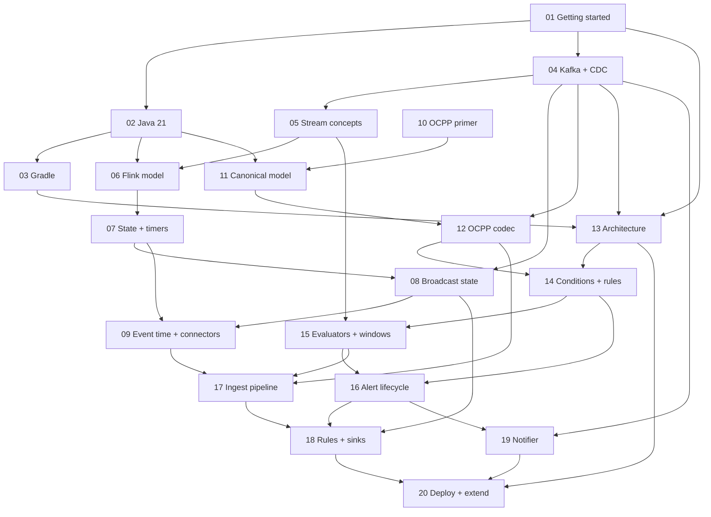

# chargemon learning guide

chargemon is a stream processor that watches roughly one million EV charging stations speaking
OCPP 1.6 and 2.0.1. It decodes raw OCPP frames from Kafka, evaluates alert rules that live in
Postgres, manages the life of every alert (grace, suppression, auto-resolve), and hands alerts to a
notifier that talks to Slack, PagerDuty, email and webhooks.

These chapters teach three things at once: **Apache Flink**, the **OCPP protocol**, and **this
repository**. They assume little Java and no prior knowledge of Kafka, Flink or OCPP. For the
quick-start commands see the [root README](../README.md).

## How to use these docs

Every chapter has the same shape:

| Section | What you get |
|---|---|
| Goal + Prerequisites | what you will be able to do afterwards, and which chapters to read first |
| Concepts (from scratch) | the theory, no repo code |
| In this repo | where the concept lives in this codebase, with links and short quoted snippets |
| Diagrams | Mermaid diagrams (rendered by GitHub, VS Code and most Markdown viewers) |
| Hands-on exercises | 2-3 tasks you can run with `./gradlew`, `docker compose` and the event generator |
| Self-check | 3-5 questions, answers hidden in a fold-out |
| Glossary terms | links into [glossary.md](glossary.md) |
| Further reading | official docs and spec sections |

Budget about 45-90 minutes per chapter including exercises. Read with the repo open in an editor.

## Chapters

| # | Chapter | Track | Goal | Prereqs |
|---|---|---|---|---|
| 01 | [Getting started](01-getting-started.md) | Foundations | Run the whole stack once and watch one alert travel end to end | none |
| 02 | [Java 21 for this repo](02-java-21-for-this-repo.md) | Foundations | Records, sealed interfaces, pattern switch, Optional, ServiceLoader, Jackson, tests | 01 |
| 03 | [Gradle multi-module build](03-gradle-multi-module-build.md) | Foundations | Build, test and find outputs for any module | 02 |
| 04 | [Kafka and CDC basics](04-kafka-and-cdc-basics.md) | Foundations | Topics, keys, partitions, compaction, Debezium | 01 |
| 05 | [Stream processing concepts](05-stream-processing-concepts.md) | A Flink | State, time, watermarks, windows, checkpoints | 04 |
| 06 | [Flink programming model](06-flink-programming-model.md) | A Flink | Read `JobMain` and `TopologyBuilder` line by line | 02, 05 |
| 07 | [Flink state, timers, serialization](07-flink-state-timers-serialization.md) | A Flink | Keyed state, timers, TTL, backends, custom serializers | 06 |
| 08 | [Broadcast state and connected streams](08-flink-broadcast-state-and-connected-streams.md) | A Flink | Hot-reloaded rules and the group hierarchy join | 07, 04 |
| 09 | [Event time, connectors, delivery](09-flink-event-time-connectors-and-delivery.md) | A Flink | Watermarks in practice, Kafka/JDBC connectors, delivery guarantees, k8s | 07, 08 |
| 10 | [OCPP protocol primer](10-ocpp-protocol-primer.md) | B OCPP | OCPP from zero: actors, framing, actions, 1.6 vs 2.0.1 | none |
| 11 | [Canonical OCPP model](11-canonical-ocpp-model.md) | B OCPP | The version-neutral sealed event vocabulary | 02, 10 |
| 12 | [OCPP codec: parsing, mapping, correlation](12-ocpp-codec-parsing-mapping-correlation.md) | B OCPP | Bytes to typed events, CALL/RESULT correlation, the `Fact` bridge | 11, 04 |
| 13 | [Architecture overview](13-architecture-overview.md) | C Project | Modules, streams, topics, tables, ports and adapters | 01, 03, 04 |
| 14 | [Rule engine: conditions and definitions](14-rule-engine-conditions-and-definitions.md) | C Project | Condition AST, fact paths, the `rules` row format | 12, 13 |
| 15 | [Rule engine: evaluators and windows](15-rule-engine-evaluators-and-windows.md) | C Project | How each rule kind turns events and timers into signals | 14, 05 |
| 16 | [Alert lifecycle and alert model](16-alert-lifecycle-and-alert-model.md) | C Project | The pure alert state machine and the `AlertEvent` contract | 14, 15 |
| 17 | [Flink job: ingest pipeline](17-flink-job-ingest-pipeline.md) | C Project | decode, correlate, enrich, sessions, zero-energy aggregate | 06-09, 12, 15 |
| 18 | [Flink job: rules, lifecycle, sinks](18-flink-job-rules-lifecycle-sinks.md) | C Project | stage 1, lifecycle, stage 2, sinks, `JobMain`, end-to-end tests | 16, 17, 08 |
| 19 | [Notifier (Spring Boot)](19-notifier-spring-boot.md) | C Project | Kafka listener, retries, routing, idempotent delivery, channels | 16, 04 |
| 20 | [Deploy, generator, testing, extending](20-deploy-generator-testing-extending.md) | C Project | Operate the stack, simulate traffic, extend the system | 13, 17, 18, 19 |

## Learning paths

**I want to learn Flink**
01 → 02 (skim) → 04 → 05 → 06 → 07 → 08 → 09 → 13 → 17 → 18 → 20 (deploy section)

**I want to learn OCPP**
01 → 02 (records and sealed interfaces only) → 10 → 11 → 12 → 17 (decode and correlate sections) → 20 (generator section)

**I want to hack on this repo**
01 → 02 → 03 → 04 → 13 → 14 → 15 → 16 → 11 → 12 → 06 → 07 → 08 → 17 → 18 → 19 → 20, with 05 and 09 on demand

## Chapter prerequisites

## References

- [Glossary](glossary.md)
- Apache Flink 1.20 documentation: <https://nightlies.apache.org/flink/flink-docs-release-1.20/>
- OCPP specifications (Open Charge Alliance, free download): <https://openchargealliance.org/protocols/open-charge-point-protocol/>
  - OCPP 1.6 edition 2 and OCPP-J 1.6 (JSON over WebSocket)
  - OCPP 2.0.1 Part 2 (specification) and Part 4 (JSON over WebSocket)
- Debezium Postgres connector: <https://debezium.io/documentation/reference/stable/connectors/postgresql.html>
- Debezium transformations (SMTs): <https://debezium.io/documentation/reference/stable/transformations/index.html>
- Spring for Apache Kafka reference: <https://docs.spring.io/spring-kafka/reference/>
- jqwik property-based testing: <https://jqwik.net/docs/current/user-guide.html>

## Contributing to these docs

- One chapter per file, named `NN-slug.md`. Keep the section skeleton above.
- Link source files relatively (`../module/src/main/java/...`) so links work on GitHub and in editors.
- Every new domain term gets a glossary entry; link it from the chapter's "Glossary terms" list.
- Preview Mermaid before committing (GitHub preview, or VS Code "Markdown Preview Mermaid Support").
- Quote short snippets only. If a snippet drifts from the source, fix the doc, not the code.
