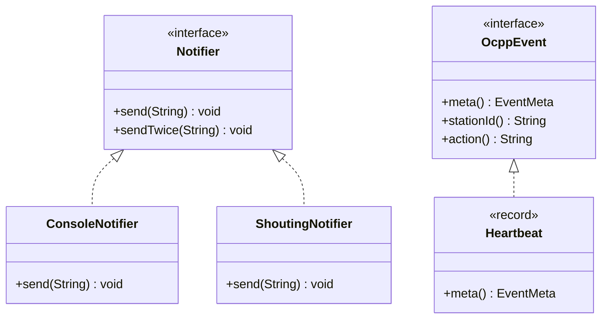

# 04. Interfaces

## In one sentence

An interface is a list of method names without bodies; a class that `implements` it promises to
supply those bodies.

## Why you need it

Chapter 02 is built on interfaces: `OcppEvent`, `RawFrame`, `Result`, `Fact`,
`StationRuleKindEvaluator` are all interfaces. Sealed interfaces (lesson 06), functional
interfaces (lesson 11) and `ServiceLoader` plugins (lesson 12) are all just interfaces with one
extra rule each. Get this lesson solid and those three become small steps.

## Toy program

File: [code/Interfaces.java](code/Interfaces.java)

```java
// Lesson 04. Run with:  java Interfaces.java
public class Interfaces {

    // An interface is a promise: "anything that is a Notifier can send(msg)".
    // It says WHAT, not HOW. No method bodies (except "default" ones).
    interface Notifier {
        void send(String message);

        // A default method has a body. Every implementation gets it for free.
        default void sendTwice(String message) {
            send(message);
            send(message);
        }
    }

    // Two different HOWs. Each class "implements" the promise in its own way.
    static class ConsoleNotifier implements Notifier {
        public void send(String message) {
            System.out.println("[console] " + message);
        }
    }

    static class ShoutingNotifier implements Notifier {
        public void send(String message) {
            System.out.println("[shout] " + message.toUpperCase() + "!!!");
        }
    }

    // This method does not care which implementation it gets. It only knows the promise.
    static void alert(Notifier n, String what) {
        n.send("ALERT: " + what);
    }

    public static void main(String[] args) {
        Notifier quiet = new ConsoleNotifier();   // variable type = interface, object = class
        Notifier loud = new ShoutingNotifier();

        alert(quiet, "connector 2 faulted");
        alert(loud, "connector 2 faulted");

        quiet.sendTwice("heartbeat missing");     // default method, never written in ConsoleNotifier
    }
}
```

Run it:

```bash
java Interfaces.java
```

Output:

```
[console] ALERT: connector 2 faulted
[shout] ALERT: CONNECTOR 2 FAULTED!!!
[console] heartbeat missing
[console] heartbeat missing
```

## Read it line by line

1. `interface Notifier { void send(String message); ... }` declares an **interface**. The line
   `void send(String message);` ends with `;` and has no `{ }` body. It is only a **signature**:
   name, parameters, return type. Such a method is called **abstract**.
2. `default void sendTwice(String message) { ... }` is a **default method**: a method in an
   interface that *does* have a body. Every implementing class inherits it without writing it.
   Inside, `send(message)` calls whichever `send` the real class provides.
3. `static class ConsoleNotifier implements Notifier { ... }` **implements** the interface. The
   compiler now insists this class has a `public void send(String)` method. Miss it and you get
   `ConsoleNotifier is not abstract and does not override abstract method send(String)`.
4. `public void send(String message) { ... }` is the body that fulfils the promise. It must be
   `public` because interface methods are always public.
5. `static void alert(Notifier n, String what)` takes a parameter of the **interface type**.
   This method has no idea whether it will receive a console notifier or a shouting one, and it
   does not need to. It only uses what the interface promises. This is the reason interfaces
   exist: code written against the promise works with every implementation, including ones
   written later.
6. `Notifier quiet = new ConsoleNotifier();` The variable's type is the interface, the object is
   the class. You may only call methods the interface declares through `quiet`, even though the
   object might have more.
7. `quiet.sendTwice(...)` works although `ConsoleNotifier` never wrote `sendTwice`. It came from
   the `default` method.

One more rule: a class can implement many interfaces (`class A implements X, Y, Z`), but it can
**extend** only one parent class. That is why Java code models "kinds of things" with
interfaces.

## Now in chargemon

[OcppEvent.java](../../ocpp-model/src/main/java/com/chargemon/ocpp/model/OcppEvent.java) is the
root of every event in the system. Ignore the annotations above it for now (lesson 13) and the
words `sealed` and `permits` (lesson 06). What remains is exactly the toy:

```java
public sealed interface OcppEvent permits StationMessage, CorrelatedEvent, GenericOcppEvent {

    EventMeta meta();

    default String stationId() {
        return meta().stationId();
    }

    /** Rule-facing action name; equals the OCPP action or the synthetic correlated name. */
    default String action() {
        return meta().action();
    }
}
```

- `EventMeta meta();` is the one abstract method, like `send`. Every event must be able to hand
  over its metadata.
- `default String stationId() { return meta().stationId(); }` is a default method, like
  `sendTwice`. It calls the abstract `meta()` and asks the result for its station id. So every
  one of the fifteen event types gets `stationId()` for free by implementing only `meta()`.

A leaf event is as small as `public record Heartbeat(EventMeta meta) implements StationMessage { }`.
Lesson 05 explains why a record with a field `meta` automatically has a method `meta()`, which
is what fulfils the promise.



The dotted arrow means "implements". The toy and the repo have the same shape.

## Try it

Add a third class `CountingNotifier implements Notifier` with an `int sent` field that
`send` increments and prints, for example `[count 1] ...`. In `main`, call `sendTwice` on it.

Expected:

```
[count 1] heartbeat missing
[count 2] heartbeat missing
```

The `alert` method and `sendTwice` did not change at all, yet they work with your new class.
That is the payoff.

Hint: fields in a nested static class work exactly as in lesson 02.

## Check yourself

1. What happens if `ShoutingNotifier` forgets to write `send`?
2. Why is the parameter of `alert` typed `Notifier` and not `ConsoleNotifier`?
3. In `OcppEvent`, which method must each event write itself, and which two come free?

<details><summary>Answers</summary>

1. Compile error: the class claims to implement `Notifier` but does not provide the abstract
   method. Java refuses to build it.
2. So the method works with every implementation, present and future. Typed as
   `ConsoleNotifier` it could never receive a `ShoutingNotifier`.
3. `meta()` must be written (a record does it automatically). `stationId()` and `action()` are
   default methods and come free.

</details>

## Next

[05. Records](05-records.md). In chapter 02 this lesson covers the interface sentence of
[Classes, interfaces, enums, packages](../02-java-21-for-this-repo.md#classes-interfaces-enums-packages)
and the `default` method paragraph under
[A three-level sealed hierarchy](../02-java-21-for-this-repo.md#a-three-level-sealed-hierarchy-ocppevent).
