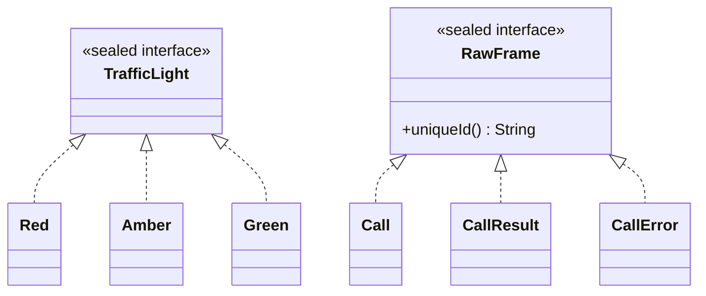

# 06. Sealed interfaces and switch

## In one sentence

A sealed interface lists every type that may implement it, so a `switch` over it can prove it
handled every case and the compiler complains when one is missing.

## Why you need it

This is the single most important idea in chapter 02. `OcppEvent`, `RawFrame`, `RuleSpec`,
`Result`, `AlertEvent`: all sealed. The chapter says "add a rule kind and the compiler tells you
every place to update". This lesson makes you *see* that happen. It combines lesson 03 (switch on
an enum), 04 (interfaces) and 05 (records).

## Toy program

File: [code/SealedAndSwitch.java](code/SealedAndSwitch.java)

```java
// Lesson 06. Run with:  java SealedAndSwitch.java
public class SealedAndSwitch {

    // "sealed" + "permits": the COMPLETE list of types allowed to be a TrafficLight.
    // Nobody can add a fourth one elsewhere. The compiler knows the list is closed.
    sealed interface TrafficLight permits Red, Amber, Green { }

    record Red() implements TrafficLight { }
    record Amber(int secondsLeft) implements TrafficLight { }
    record Green() implements TrafficLight { }

    // switch on the TYPE of the value. Each case tests the type AND names the value.
    // No "default": the compiler checks that all three permitted types are covered.
    static String advice(TrafficLight light) {
        return switch (light) {
            case Red r -> "stop";
            case Amber(int s) -> "wait " + s + " more seconds";   // pull the field out directly
            case Green g -> "go";
        };
    }

    // The same idea in an "if": test the type and bind a variable in one step.
    static String describe(Object anything) {
        if (anything instanceof Amber a) {
            return "an amber light with " + a.secondsLeft() + "s left";
        }
        if (anything instanceof String text) {
            return "a piece of text: " + text;
        }
        return "something else: " + anything;
    }

    public static void main(String[] args) {
        TrafficLight[] lights = { new Red(), new Amber(4), new Green() };
        for (TrafficLight light : lights) {
            System.out.println(light + " -> " + advice(light));
        }
        System.out.println(describe(new Amber(9)));
        System.out.println(describe("hello"));
        System.out.println(describe(42));
    }
}
```

Run it:

```bash
java SealedAndSwitch.java
```

Output:

```
Red[] -> stop
Amber[secondsLeft=4] -> wait 4 more seconds
Green[] -> go
an amber light with 9s left
a piece of text: hello
something else: 42
```

## Read it line by line

1. `sealed interface TrafficLight permits Red, Amber, Green { }` is an interface (lesson 04) with
   two new words. **`sealed`** means the set of implementations is closed. **`permits`** lists
   them. Any other class that tries `implements TrafficLight` gets a compile error. The interface
   body is empty here; it could declare methods like any interface.
2. `record Red() implements TrafficLight { }` is a record with zero components. It carries no
   data; it only *is* a red light. `Amber(int secondsLeft)` carries one number. Each record is
   `final` automatically, which sealed requires of its leaves.
3. `return switch (light) { case Red r -> "stop"; ... };` is a switch expression (lesson 03) but
   over a **type** instead of a value. `case Red r ->` reads: "if `light` is a `Red`, call it `r`
   and produce `"stop"`". This is a **type pattern**: test and bind in one go. We do not use `r`,
   but it must be named.
4. `case Amber(int s) -> ...` is a **record pattern**: match an `Amber` *and* pull its
   `secondsLeft` component straight into `s`. It saves writing `case Amber a -> ... a.secondsLeft()`.
5. There is **no `default`**. Because `TrafficLight` is sealed with exactly three permitted
   types and all three appear, the compiler accepts the switch as **exhaustive**. If the interface
   were not sealed, the compiler could not know the list is complete and would demand a `default`.
6. `if (anything instanceof Amber a) { ... a.secondsLeft() ... }` is the same test-and-bind in an
   `if`. **`instanceof`** asks "is this object of that type?"; adding a name after the type binds
   it when the answer is yes. Old Java needed a second line with a cast; you may still see
   `Amber a = (Amber) anything;` in older code, which means the same.
7. `TrafficLight[] lights = { ... }` is an array, a fixed-size list. `for (TrafficLight light : lights)`
   is the short loop form: "for each element". You will see this form far more than the counting
   loop from lesson 01.

Now the part that matters. Do this before reading on: add a fourth record
`record FlashingAmber() implements TrafficLight { }`, add it to the `permits` list, and run.

```
SealedAndSwitch.java:15: error: the switch expression does not cover all possible input values
        return switch (light) {
               ^
1 error
error: compilation failed
```

The program did not even start. The compiler found the `switch` that forgot the new case and
pointed at it. In a real code base with fifty such switches, it points at all fifty. That is what
chapter 02 means by "the compiler tells you every place to update". Add
`case FlashingAmber f -> "proceed with care";` and it runs again.

## Now in chargemon

[RawFrame.java](../../ocpp-codec/src/main/java/com/chargemon/ocpp/codec/frame/RawFrame.java) is a
decoded OCPP message. OCPP has exactly three message shapes, so:

```java
public sealed interface RawFrame permits RawFrame.Call, RawFrame.CallResult, RawFrame.CallError {

    String uniqueId();

    record Call(String uniqueId, String action, JsonNode payload) implements RawFrame {
        // ...
    }

    record CallResult(String uniqueId, JsonNode payload) implements RawFrame {
        // ...
    }

    record CallError(String uniqueId, String errorCode, String description, JsonNode details) implements RawFrame {
        // ...
    }
}
```

Same as `TrafficLight`, with the records nested *inside* the interface, which is why they are
written `RawFrame.Call`. The interface declares `String uniqueId();`, and every record has a
`uniqueId` component, so the accessor fulfils it (lesson 05).

The switch is in
[CallCorrelator.java](../../ocpp-codec/src/main/java/com/chargemon/ocpp/codec/correlate/CallCorrelator.java)
at line 55:

```java
public CorrelationOutcome onFrame(RawEnvelope env, RawFrame frame, PendingCallStore store) {
    return switch (frame) {
        case RawFrame.Call call -> onCall(env, call, store);
        case RawFrame.CallResult result -> onResponse(env, toPending(env, result), store);
        case RawFrame.CallError error -> onResponse(env, toPending(env, error), store);
    };
}
```

Three type patterns, no `default`, identical to `advice`. If OCPP ever grew a fourth frame kind
and someone added it to `permits`, this method would stop compiling until it handled it.

The `instanceof` form is in
[FieldPathResolver.java](../../ocpp-codec/src/main/java/com/chargemon/ocpp/codec/fact/FieldPathResolver.java)
at line 72:

```java
if (v instanceof BigDecimal bd) {
    return Optional.of(bd);
}
if (v instanceof Number num) {
    return Optional.of(new BigDecimal(num.toString()));
}
```

Same as `describe`: `v` is an `Object` that could be anything, and each `if` tests one type and
binds it. `Optional` is lesson 07.



Chapter 02 also mentions `yield`. When a `case` needs several statements, wrap them in `{ }` and
end with `yield value;` instead of `-> value`. You will see it in `RuleDefinitionParser.parseSpec`.

## Try it

This is chapter 02's exercise 1, which you can now do. You already added `FlashingAmber` above.
Now remove the `case Green g -> "go";` line but keep `Green` in `permits`, and run.

Expected: the same "does not cover all possible input values" error, now because `Green` is
missing. Then put the line back and instead delete `sealed` and `permits Red, Amber, Green` from
the interface. Run.

Expected: `error: the switch expression does not cover all possible input values` again, this time
because a *non-sealed* interface could have implementations the compiler cannot see, so it wants
a `default`. Add `default -> "unknown light";` and it compiles. That `default` is exactly what
sealed lets you avoid.

Hint: after each change, read only the first error line.

## Check yourself

1. What does `permits` promise the compiler?
2. Why does `advice` need no `default` branch, and when would it need one?
3. What is the difference between `case Amber a ->` and `case Amber(int s) ->`?

<details><summary>Answers</summary>

1. That the listed types are the *only* implementations. No other class anywhere may implement
   the interface.
2. Because the interface is sealed and every permitted type has a case, so the switch is
   exhaustive. It would need `default` if the interface were not sealed, or if a permitted type
   had no case (then adding `default` is one fix; adding the missing case is the better one).
3. Both match an `Amber`. The first binds the whole record as `a`; you call `a.secondsLeft()`.
   The second deconstructs it and binds the component directly as `s`.

</details>

## Next

[07. Optional](07-optional.md). In chapter 02 this lesson covers
[Sealed interfaces and exhaustiveness](../02-java-21-for-this-repo.md#sealed-interfaces-and-exhaustiveness),
[Pattern matching in switch and instanceof](../02-java-21-for-this-repo.md#pattern-matching-in-switch-and-instanceof)
and
[Exhaustive switch on a sealed type](../02-java-21-for-this-repo.md#exhaustive-switch-on-a-sealed-type-callcorrelatoronframe).
