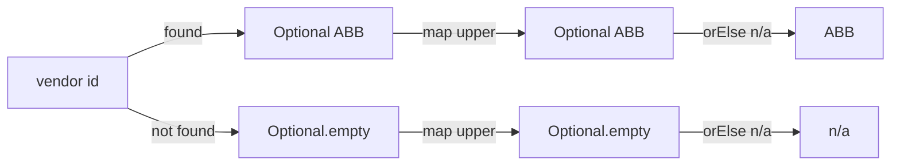

# 07. Optional

## In one sentence

`Optional<T>` is a box that either holds one `T` or is empty, and returning it instead of `null`
forces the caller to handle the empty case.

## Why you need it

Lesson 02 showed that calling a method on `null` crashes the program. In a stream processor
that runs for months, one forgotten null check is an outage. chargemon therefore returns
`Optional` wherever a value might be absent: `Fact.get(path)`, `EvaluatorRegistry.station(kind)`,
`Durations.parseOptional`. Chapter 02 lists the `Optional` methods in one paragraph; this lesson
runs each one.

## Toy program

File: [code/Optionals.java](code/Optionals.java)

```java
// Lesson 07. Run with:  java Optionals.java
import java.util.HashMap;
import java.util.Map;
import java.util.Optional;

public class Optionals {

    static Map<String, String> vendorByStation = new HashMap<>();

    // Old style: returns null when not found. The caller can forget to check.
    static String vendorOrNull(String stationId) {
        return vendorByStation.get(stationId);
    }

    // New style: returns a box that is either full or empty. The caller MUST decide.
    static Optional<String> vendor(String stationId) {
        return Optional.ofNullable(vendorByStation.get(stationId));
    }

    public static void main(String[] args) {
        vendorByStation.put("ST-001", "ABB");

        Optional<String> found = vendor("ST-001");
        Optional<String> notFound = vendor("ST-999");

        System.out.println(found);                       // Optional[ABB]
        System.out.println(notFound);                    // Optional.empty
        System.out.println(found.isPresent());           // true
        System.out.println(notFound.isEmpty());          // true

        // orElse: the value if present, otherwise the fallback
        System.out.println(found.orElse("unknown"));
        System.out.println(notFound.orElse("unknown"));

        // map: change the value if present; an empty box stays empty
        Optional<Integer> length = found.map(v -> v.length());
        System.out.println(length);                      // Optional[3]
        System.out.println(notFound.map(v -> v.length()));   // Optional.empty

        // Read this aloud: "if vendor exists, upper-case it, otherwise 'n/a'"
        System.out.println(vendor("ST-001").map(String::toUpperCase).orElse("n/a"));
        System.out.println(vendor("ST-999").map(String::toUpperCase).orElse("n/a"));

        // The null way, for comparison. Forget the check and you get a NullPointerException.
        String v = vendorOrNull("ST-999");
        if (v != null) {
            System.out.println(v.toUpperCase());
        } else {
            System.out.println("n/a (null checked by hand)");
        }
    }
}
```

Run it:

```bash
java Optionals.java
```

Output:

```
Optional[ABB]
Optional.empty
true
true
ABB
unknown
Optional[3]
Optional.empty
ABB
n/a
n/a (null checked by hand)
```

## Read it line by line

1. `Map<String, String> vendorByStation = new HashMap<>();` A **`Map`** stores key-to-value pairs,
   here station id to vendor. `get(key)` returns the value, or `null` if the key is absent. This
   is the classic source of null. The angle brackets are lesson 09; read `Map<String, String>`
   as "a map from String to String".
2. `static Optional<String> vendor(String stationId)` returns an **`Optional<String>`**: a box
   that holds a `String` or nothing. The return type itself tells the caller "this may be absent".
3. `Optional.ofNullable(x)` builds the box: empty if `x` is `null`, otherwise holding `x`. The
   other two builders are `Optional.of(x)` (x must not be null) and `Optional.empty()`.
4. `found.isPresent()` and `notFound.isEmpty()` ask whether the box is full or empty. There is
   also `get()`, which returns the value but *throws* if the box is empty, so only call it right
   after an `isPresent()` check. Chapter 02 lists it; the repo rarely uses it.
5. `found.orElse("unknown")` opens the box: the value if there is one, otherwise the fallback you
   pass. This is the most common way to finish an Optional chain. `orElseThrow()` is the strict
   version: the value, or an exception (lesson 08) if empty.
6. `found.map(v -> v.length())` transforms the *contents* without opening the box. If the box is
   full, apply the function and box the result: `Optional[ABB]` becomes `Optional[3]`. If the box
   is empty, skip the function and stay empty. `v -> v.length()` is a lambda (lesson 11); for
   now read it as "given v, compute v.length()".
7. `vendor("ST-001").map(String::toUpperCase).orElse("n/a")` chains the two. Read it left to
   right, out loud: "look up the vendor; if present, upper-case it; give me that, or `n/a`". No
   `if`, no `null`, and no way to forget the missing case because `orElse` demands a fallback.
   `String::toUpperCase` is another way of writing `v -> v.toUpperCase()`.
8. The last block is the old way for contrast. It works, but only because we remembered the
   `if (v != null)`. Nothing forced us to.



## Now in chargemon

[Fact.java](../../rule-engine/src/main/java/com/chargemon/rules/condition/Fact.java) is how the
rule engine reads any value from an event:

```java
@FunctionalInterface
public interface Fact {

    Optional<Object> get(String path);

    static Fact empty() {
        return path -> Optional.empty();
    }
}
```

`get("event.status")` returns `Optional<Object>`: the value at that path, or empty if the event
has no such field. A rule that compares `event.status` to `"Faulted"` cannot crash on a message
that has no status; it gets an empty box and evaluates to false. `Fact.empty()` is a fact with
nothing in it: every `get` returns `Optional.empty()`. The lambda is lesson 11.

The chained form appears at line 88 of
[CallCorrelator.java](../../ocpp-codec/src/main/java/com/chargemon/ocpp/codec/correlate/CallCorrelator.java):

```java
return joined.drop().map(out::withDrop).orElse(out);
```

Read it like the toy's line 7: `joined.drop()` is an `Optional` (a reason to drop the message, if
any). If present, call `out.withDrop(reason)` and return that. Otherwise return `out` unchanged.
One line, no null, no forgotten branch.

`Durations.parseOptional` in
[Durations.java](../../common/src/main/java/com/chargemon/common/time/Durations.java) shows the
producing side:

```java
public static Optional<Duration> parseOptional(String iso) {
    if (iso == null || iso.isBlank()) {
        return Optional.empty();
    }
    return Optional.of(parse(iso));
}
```

Blank input becomes an empty box; anything else is parsed and boxed with `Optional.of`.

## Try it

Add a second map `Map<String, Integer> connectorsByStation` with one entry `"ST-001" -> 2`, and a
method `Optional<Integer> connectors(String stationId)`. Then print, for `ST-001` and `ST-999`,
the text `"<n> connectors"` or `"no data"`, using one `map(...).orElse(...)` chain each.

Expected:

```
2 connectors
no data
```

Hint: the lambda inside `map` is `n -> n + " connectors"`.

## Check yourself

1. What does `Optional.ofNullable(null).map(x -> x.toString()).orElse("none")` return, and why
   does the `map` not crash?
2. When is it safe to call `get()` on an Optional?
3. Why does the repo return `Optional<Object>` from `Fact.get` instead of `Object` with `null`
   for missing?

<details><summary>Answers</summary>

1. `"none"`. `ofNullable(null)` is an empty box; `map` skips its function on an empty box; `orElse`
   supplies the fallback.
2. Only when you have just checked `isPresent()` is true. Otherwise prefer `orElse`,
   `orElseThrow` or `map`, which cannot be misused.
3. So callers cannot forget the missing case. With `null`, one missing check anywhere crashes the
   job; with `Optional`, the type forces every caller to say what happens when the value is
   absent.

</details>

## Next

[08. Exceptions](08-exceptions.md). In chapter 02 this lesson covers
[Optional](../02-java-21-for-this-repo.md#optional) and
[Optional as the "may be absent" answer: Fact](../02-java-21-for-this-repo.md#optional-as-the-may-be-absent-answer-fact).
