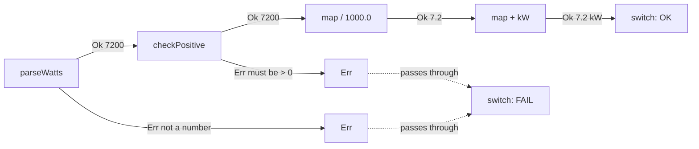

# 10. The Result type

## In one sentence

`Result<T, E>` is a sealed interface with two records, `Ok(value)` and `Err(error)`, so a method
can return "it worked" or "it failed" as a plain value instead of throwing.

## Why you need it

Chapter 02 presents the repo's `Result` in eight lines and calls `map`, `flatMap` and
`orElseThrow` "combinators". Every piece of it is something you now know: a sealed interface
(lesson 06), two records (lesson 05), type parameters (lesson 09), a switch with no default
(lesson 06), and the exception cost it avoids (lesson 08). This lesson builds it from those
pieces so the real file holds no surprises.

## Toy program

File: [code/ResultType.java](code/ResultType.java)

```java
// Lesson 10. Run with:  java ResultType.java
import java.util.function.Function;

public class ResultType {

    // Our own Result, built from lessons 05 (records), 06 (sealed + switch) and 09 (generics).
    // T = the type of a good value, E = the type of an error.
    sealed interface Result<T, E> {

        record Ok<T, E>(T value) implements Result<T, E> { }

        record Err<T, E>(E error) implements Result<T, E> { }

        // map: if Ok, apply f to the value; if Err, pass the error through untouched
        default <U> Result<U, E> map(Function<T, U> f) {
            return switch (this) {
                case Ok<T, E> ok -> new Ok<>(f.apply(ok.value()));
                case Err<T, E> err -> new Err<>(err.error());
            };
        }

        // flatMap: like map, but f itself may fail and returns a Result
        default <U> Result<U, E> flatMap(Function<T, Result<U, E>> f) {
            return switch (this) {
                case Ok<T, E> ok -> f.apply(ok.value());
                case Err<T, E> err -> new Err<>(err.error());
            };
        }
    }

    // A parser that never throws. Bad input becomes an Err value instead.
    static Result<Integer, String> parseWatts(String text) {
        try {
            return new Result.Ok<>(Integer.parseInt(text.trim()));
        } catch (NumberFormatException e) {
            return new Result.Err<>("not a number: '" + text + "'");
        }
    }

    // A second step that can also fail
    static Result<Integer, String> checkPositive(int watts) {
        return watts > 0 ? new Result.Ok<>(watts) : new Result.Err<>("watts must be > 0, got " + watts);
    }

    public static void main(String[] args) {
        String[] inputs = { " 7200 ", "abc", "-5" };
        for (String in : inputs) {
            Result<String, String> r = parseWatts(in)      // Ok(7200) / Err / Ok(-5)
                    .flatMap(w -> checkPositive(w))        // Ok(7200) / Err / Err
                    .map(w -> w / 1000.0)                  // Ok(7.2)  / Err / Err
                    .map(kw -> kw + " kW");                // Ok("7.2 kW") / Err / Err

            // The caller MUST handle both cases; the switch will not compile otherwise.
            String line = switch (r) {
                case Result.Ok<String, String> ok -> "OK   " + ok.value();
                case Result.Err<String, String> err -> "FAIL " + err.error();
            };
            System.out.println(line);
        }
    }
}
```

Run it:

```bash
java ResultType.java
```

Output:

```
OK   7.2 kW
FAIL not a number: 'abc'
FAIL watts must be > 0, got -5
```

## Read it line by line

1. `sealed interface Result<T, E>` A sealed interface (lesson 06) with two type parameters
   (lesson 09): `T` for the good value, `E` for the error. There is no `permits` clause because
   the permitted records are nested inside the interface; Java then fills the list in itself.
2. `record Ok<T, E>(T value) implements Result<T, E> { }` and `record Err<T, E>(E error) ...`
   are the two possible shapes. An `Ok` carries a `T`, an `Err` carries an `E`. A `Result` is
   always exactly one of them. Chapter 02 compares this to a railway with two tracks.
3. `default <U> Result<U, E> map(Function<T, U> f)` A default method (lesson 04) that is also a
   generic method (lesson 09): it introduces `U`, the type the value will have *after* the
   function. `Function<T, U>` is "a function from T to U" (lesson 11). Read the whole header:
   "given a function from T to U, produce a Result whose value type is U and whose error type is
   still E".
4. `return switch (this) { case Ok<T, E> ok -> ...; case Err<T, E> err -> ...; };` The body is
   the lesson-06 switch over `this`, the result itself. On `Ok`, apply the function to the value
   and wrap the answer in a new `Ok`. On `Err`, build a new `Err` with the *same* error. No
   default: the compiler knows there are exactly two cases.
5. `flatMap` is `map` for a function that can itself fail. The function returns a whole
   `Result<U, E>`, so on `Ok` we return what the function returns, without wrapping it again.
   On `Err` we short-circuit as before. That is the difference: `map` wraps, `flatMap` does not.
6. `parseWatts` catches the library's exception at the boundary and turns it into an `Err`. From
   here on nothing throws. `checkPositive` is a second step that returns `Ok` or `Err`.
7. `parseWatts(in).flatMap(w -> checkPositive(w)).map(w -> w / 1000.0).map(kw -> kw + " kW")` is
   a chain. Follow the three inputs through it, as the comments do: the good input stays on the
   `Ok` track and is transformed three times; `"abc"` derails at `parseWatts` and every later step
   passes its `Err` through untouched; `"-5"` derails at `checkPositive`. The steps after a
   failure never run, exactly like the code after a `throw`, but with no stack trace and no
   `try`/`catch` anywhere in the middle.
8. `String line = switch (r) { case Result.Ok<String, String> ok -> ...; case Result.Err<...> err -> ...; };`
   At the end the caller must open the result, and the switch forces both cases. There is no
   way to "forget the error", which is the thing that happens with a `null` return and the thing
   that silently escapes with an unchecked exception.



## Now in chargemon

[Result.java](../../common/src/main/java/com/chargemon/common/result/Result.java) is the toy
plus three small additions:

```java
public sealed interface Result<T, E> {

    record Ok<T, E>(T value) implements Result<T, E> {
    }

    record Err<T, E>(E error) implements Result<T, E> {
    }

    static <T, E> Result<T, E> ok(T value) {
        return new Ok<>(value);
    }

    static <T, E> Result<T, E> err(E error) {
        return new Err<>(error);
    }

    default boolean isOk() {
        return this instanceof Ok<T, E>;
    }

    default <U> Result<U, E> map(Function<? super T, ? extends U> f) {
        return switch (this) {
            case Ok<T, E> ok -> new Ok<>(f.apply(ok.value()));
            case Err<T, E> err -> new Err<>(err.error());
        };
    }

    default <U> Result<U, E> flatMap(Function<? super T, Result<U, E>> f) {
        return switch (this) {
            case Ok<T, E> ok -> f.apply(ok.value());
            case Err<T, E> err -> new Err<>(err.error());
        };
    }

    default T orElseThrow(Function<? super E, ? extends RuntimeException> f) {
        return switch (this) {
            case Ok<T, E> ok -> ok.value();
            case Err<T, E> err -> throw f.apply(err.error());
        };
    }
}
```

The additions:

- `static <T, E> Result<T, E> ok(T value)` and `err(...)` are convenience builders, so callers
  write `Result.ok(x)` instead of `new Result.Ok<>(x)`. Generic static methods, lesson 09.
- `isOk()` uses `instanceof` (lesson 06) for a quick yes/no.
- `orElseThrow(f)` is the exit at the edge: on `Ok` give the value, on `Err` build an exception
  from the error with `f` and throw it. This is where the repo decides "here, and only here, an
  exception is the right tool".
- `Function<? super T, ? extends U>` instead of `Function<T, U>` is the bounded-wildcard form
  from lesson 09. It accepts slightly more functions and behaves the same. Read it as
  `Function<T, U>`.

The envelope parser returns `Result<RawEnvelope, String>`: on the good track a parsed envelope,
on the bad track a message. The decode operator switches on it and routes `Err` messages to the
dead-letter topic. Millions of good messages pay nothing for the possibility of a bad one.

## Try it

Add `orElse(T fallback)` to the toy `Result`: return the value on `Ok`, the fallback on `Err`.
Replace the final switch in `main` with `System.out.println(r.orElse("no reading"));`.

Expected:

```
7.2 kW
no reading
no reading
```

Then delete the `case Err ...` line from your `orElse` switch. Expected:
`error: the switch expression does not cover all possible input values`. Even inside `Result`
itself, the compiler will not let you forget the error track.

Hint: the header is `default T orElse(T fallback)`, and the body is a two-case switch like `map`.

## Check yourself

1. What is the difference between `map` and `flatMap`?
2. What happens to the steps after the first `Err` in a chain?
3. Where in the repo does an `Err` finally become an exception, and why there?

<details><summary>Answers</summary>

1. Both do nothing on `Err`. On `Ok`, `map` applies a function that returns a plain `U` and wraps
   it in `Ok`; `flatMap` applies a function that already returns a `Result<U, E>` and returns it
   as is, so a step that can fail does not produce a `Result` inside a `Result`.
2. They never run. Each `map`/`flatMap` sees an `Err`, skips its function, and passes the same
   `Err` on.
3. `orElseThrow`, called by code at the edge that genuinely wants to stop (for example config
   loading). On the hot path the `Err` is switched on and routed as a value instead.

</details>

## Next

[11. Lambdas and streams](11-lambdas-and-streams.md). In chapter 02 this lesson covers
[The repo's own Result](../02-java-21-for-this-repo.md#the-repos-own-result).
