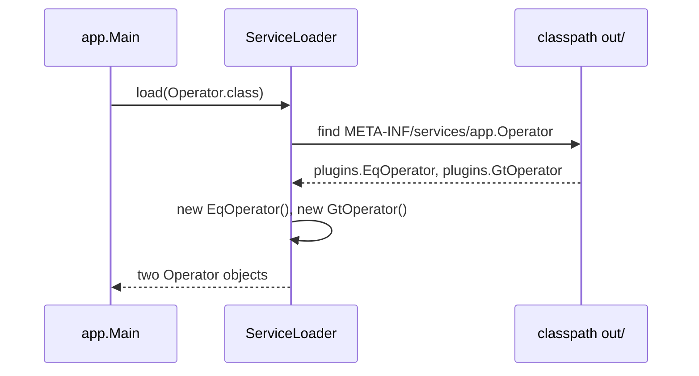

# 12. ServiceLoader

## In one sentence

`ServiceLoader` finds every class on the classpath that is listed in a text file named after an
interface, and creates one object of each, so you can add a plugin without editing the code that
uses it.

## Why you need it

Chapter 02 says chargemon discovers its 15 OCPP mappers, its rule evaluators and its condition
operators this way, and that adding one "means adding a class and one line in a file". That
sounds like magic until you have done it once by hand. This lesson first shows the problem with a
single file, then solves it with a three-file mini project you compile yourself.

## Toy program, part 1: the problem

File: [code/Registry.java](code/Registry.java)

```java
// Lesson 12, part 1. Run with:  java Registry.java
import java.util.LinkedHashMap;
import java.util.Map;

public class Registry {

    // The "plugin" contract: an operator has a name and does one comparison
    interface Operator {
        String name();
        boolean test(int left, int right);
    }

    static class Eq implements Operator {
        public String name() { return "eq"; }
        public boolean test(int l, int r) { return l == r; }
    }

    static class Gt implements Operator {
        public String name() { return "gt"; }
        public boolean test(int l, int r) { return l > r; }
    }

    public static void main(String[] args) {
        // Hand-rolled registry: a map from name to plugin.
        // Problem: to add an operator you must EDIT THIS FILE and add a line here.
        Map<String, Operator> byName = new LinkedHashMap<>();
        byName.put("eq", new Eq());
        byName.put("gt", new Gt());

        // A "rule" arrives as text, and we look the operator up by name at run time
        String[][] rules = { { "eq", "3", "3" }, { "gt", "2", "9" }, { "lt", "1", "2" } };
        for (String[] rule : rules) {
            Operator op = byName.get(rule[0]);
            if (op == null) {
                System.out.println(rule[0] + ": unknown operator");
                continue;
            }
            boolean result = op.test(Integer.parseInt(rule[1]), Integer.parseInt(rule[2]));
            System.out.println(rule[0] + "(" + rule[1] + ", " + rule[2] + ") = " + result);
        }
        System.out.println("Lesson 12 part 2 removes the put(...) lines with ServiceLoader.");
    }
}
```

Run it:

```bash
java Registry.java
```

Output:

```
eq(3, 3) = true
gt(2, 9) = false
lt: unknown operator
Lesson 12 part 2 removes the put(...) lines with ServiceLoader.
```

This works, and it is how the repo's `BuiltinOperators` fills its own map. The weakness is the
two `put` lines: every new operator means editing `main`. If operators lived in a separate jar
written by someone else, they could not add themselves. `ServiceLoader` fixes exactly that.

## Toy program, part 2: the fix

Folder: [code/serviceloader/](code/serviceloader/). Five files:

```
serviceloader/
  app/Operator.java                 the contract (interface)
  app/Main.java                     the app; never names a plugin class
  plugins/EqOperator.java           plugin 1
  plugins/GtOperator.java           plugin 2
  META-INF/services/app.Operator    the registration file: one class name per line
```

[app/Operator.java](code/serviceloader/app/Operator.java):

```java
package app;

// The contract. Plugins implement this. Lives in the "app".
public interface Operator {
    String name();
    boolean test(int left, int right);
}
```

[app/Main.java](code/serviceloader/app/Main.java):

```java
package app;

import java.util.ServiceLoader;

// The app. It never names a single plugin class. It asks ServiceLoader to find them.
public class Main {
    public static void main(String[] args) {
        System.out.println("Operators found on the classpath:");
        for (Operator op : ServiceLoader.load(Operator.class)) {
            System.out.println("  " + op.name() + " -> " + op.getClass().getName()
                    + "   test(3, 3) = " + op.test(3, 3));
        }
    }
}
```

[plugins/EqOperator.java](code/serviceloader/plugins/EqOperator.java) (`GtOperator` is the same
with `>`):

```java
package plugins;

import app.Operator;

// A plugin. Public class, public no-argument constructor (the default one is fine).
public class EqOperator implements Operator {
    public String name() { return "eq"; }
    public boolean test(int l, int r) { return l == r; }
}
```

[META-INF/services/app.Operator](code/serviceloader/META-INF/services/app.Operator):

```
plugins.EqOperator
plugins.GtOperator
```

This one needs a real compile step, because `ServiceLoader` looks for the `META-INF` folder on the
classpath, not in a source file:

```bash
cd docs/java-tutorial/code/serviceloader
javac -d out app/*.java plugins/*.java     # compile everything into out/
cp -r META-INF out/                        # put the registration file on the classpath too
java -cp out app.Main                      # run, with out/ as the classpath
```

Output:

```
Operators found on the classpath:
  eq -> plugins.EqOperator   test(3, 3) = true
  gt -> plugins.GtOperator   test(3, 3) = false
```

Now the proof. Delete the registration file from the classpath and run again:

```bash
rm -r out/META-INF
java -cp out app.Main
```

Output:

```
Operators found on the classpath:
```

Nothing. The plugin classes are still in `out/`, compiled and correct, but without the text file
`ServiceLoader` does not know they exist. Clean up with `rm -r out` when done.

## Read it line by line

1. **Classpath.** When you run `java -cp out app.Main`, the `-cp out` says "look for classes and
   resources in the folder `out`". In a real application the classpath is a list of folders and
   jar files. Everything the program can load, code or text, comes from there.
2. `package app;` and `package plugins;` Two packages (lesson 03). The plugins import the
   contract from `app`; the app never imports anything from `plugins`. That one-way arrow is the
   point: the app compiles and runs without knowing any plugin.
3. `META-INF/services/app.Operator` The file's **name** is the fully qualified name of the
   interface. Its **contents** are the fully qualified names of the implementing classes, one per
   line. Spelling must be exact on both counts; chapter 02's exercise 2 warns "check the resource
   path spelling character by character" because a typo produces no error, only silence, as you
   just saw.
4. `ServiceLoader.load(Operator.class)` reads every `META-INF/services/app.Operator` file it can
   find on the classpath (there may be one per jar), and for each listed class calls its
   **no-argument constructor** to create one object. `Operator.class` is the class object for the
   interface, the same `Class<S>` idea from lesson 09.
5. `for (Operator op : ServiceLoader.load(...))` The loader can be looped over like a list. Each
   `op` is typed as the interface, so `Main` uses `name()` and `test()` and nothing else, exactly
   like `alert(Notifier n, ...)` in lesson 04.
6. **Requirements on a plugin class**, which chapter 02's self-check asks about: it must be
   `public`, it must `implement` the interface named by the file, and it must have a `public`
   constructor that takes no arguments (if you write no constructor at all, Java provides one).
   `ServiceLoader` cannot pass arguments, so a plugin that needs configuration reads it later.



## Now in chargemon

[MapperRegistry.java](../../ocpp-codec/src/main/java/com/chargemon/ocpp/codec/mapper/MapperRegistry.java)
at line 34:

```java
public static MapperRegistry fromServiceLoader() {
    List<OcppActionMapper<?>> calls = new ArrayList<>();
    ServiceLoader.load(OcppActionMapper.class).forEach(calls::add);
    List<CorrelatedMapper<?>> correlated = new ArrayList<>();
    ServiceLoader.load(CorrelatedMapper.class).forEach(correlated::add);
    return of(calls, correlated);
}
```

Two `load` calls for two plugin interfaces, each collected into a list with the lesson-11 method
reference. The registration file for the first is
[META-INF/services/com.chargemon.ocpp.codec.mapper.OcppActionMapper](../../ocpp-codec/src/main/resources/META-INF/services/com.chargemon.ocpp.codec.mapper.OcppActionMapper)
with fifteen lines, one mapper per OCPP action and version. It lives under `src/main/resources`
because Gradle copies that folder onto the classpath, which is what `cp -r META-INF out/` did by
hand above.

The rule engine has two more. The file
[META-INF/services/com.chargemon.rules.eval.StationRuleKindEvaluator](../../rule-engine/src/main/resources/META-INF/services/com.chargemon.rules.eval.StationRuleKindEvaluator)
lists the three evaluators that `EvaluatorRegistry.fromServiceLoader()` (lesson 09) collects.
And [META-INF/services/com.chargemon.rules.condition.ConditionOperatorProvider](../../rule-engine/src/main/resources/META-INF/services/com.chargemon.rules.condition.ConditionOperatorProvider)
has a single line, `com.chargemon.rules.condition.ops.BuiltinOperators`, whose `operators()`
method is the part-1 hand-rolled map:

```java
public Map<String, Class<? extends Condition>> operators() {
    Map<String, Class<? extends Condition>> m = new LinkedHashMap<>();
    m.put(AndCondition.OP, AndCondition.class);
    m.put(OrCondition.OP, OrCondition.class);
```

So the repo uses both levels: `ServiceLoader` to find *providers*, and each provider hands over
a plain map of the operators it knows. A second jar can ship its own provider with its own
operators, and the parser picks them all up. Chapter 02's exercise 2 has you do exactly that.

One trap the chapter mentions: when several jars are merged into one "shadow" jar, files with
the same path collide, and the build must *merge* the `META-INF/services` files instead of
keeping one. That is the `mergeServiceFiles()` line chapter 03 insists on.

## Try it

Add a third plugin `plugins/LtOperator.java` (name `"lt"`, test `l < r`), add the line
`plugins.LtOperator` to the registration file, and rebuild with the three commands above.

Expected: three lines under "Operators found", the new one reading
`lt -> plugins.LtOperator   test(3, 3) = false`. You did not touch `Main.java`.

Then misspell the line as `plugins.LtOperators` and rebuild. Expected: the `eq` line prints, then
the program dies with
`java.util.ServiceConfigurationError: app.Operator: Provider plugins.LtOperators not found`.
That is the one case where you do get an error: a listed class that does not exist. A missing
line, by contrast, is silent.

Hint: after editing the registration file you must run `cp -r META-INF out/` again, otherwise
`out/` still has the old copy.

## Check yourself

1. What must the file under `META-INF/services` be named, and what goes inside it?
2. Why does `app.Main` compile without any reference to `plugins.EqOperator`?
3. What happens if a plugin class has only a constructor that takes a `String`?

<details><summary>Answers</summary>

1. Named exactly after the fully qualified interface name (`app.Operator`); inside, one fully
   qualified implementing class name per line.
2. It only uses the `Operator` interface. `ServiceLoader` finds the implementations at run time
   from the text file, so no compile-time reference is needed.
3. `ServiceLoader` cannot instantiate it and fails with a `ServiceConfigurationError` at run
   time. Plugins need a public no-argument constructor.

</details>

## Next

[13. Jackson and tests](13-jackson-and-tests.md). In chapter 02 this lesson covers
[ServiceLoader](../02-java-21-for-this-repo.md#serviceloader) and
[ServiceLoader in three places](../02-java-21-for-this-repo.md#serviceloader-in-three-places).
