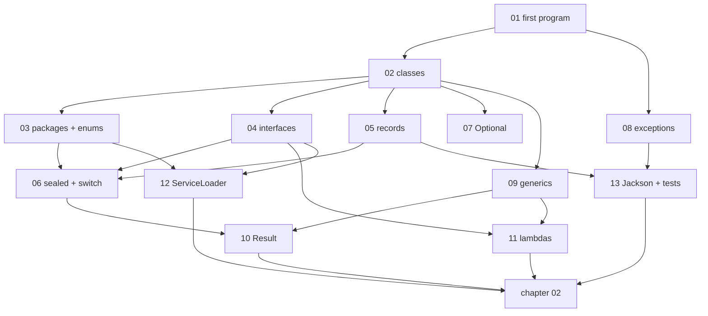

# Java from zero, for chapter 02

[Chapter 02](../02-java-21-for-this-repo.md) explains the Java features this repo uses, but it
assumes you have already written a Java class. These lessons assume nothing. Each one teaches one
idea with a tiny program you run yourself, then shows the same idea inside chargemon. When you
finish lesson 13, go back to chapter 02 and it will read like a summary of things you already know.

## Before you start

You need JDK 21. The repo already expects it at `~/.jdks/jdk-21.0.12.1+1`. Open a terminal and run:

```bash
export JAVA_HOME=~/.jdks/jdk-21.0.12.1+1
export PATH=$JAVA_HOME/bin:$PATH
java -version
```

You should see a line starting with `openjdk version "21`. Every toy program in this tutorial is a
single file. Java 21 can run a single file directly, with no build tool:

```bash
cd docs/java-tutorial/code
java FirstProgram.java
```

That is all the setup. Keep this folder open in your editor so you can change the programs.

## How each lesson is built

1. **In one sentence.** The idea, no jargon.
2. **Why you need it.** The problem it solves.
3. **Toy program.** A complete file from [code/](code/), with the command and the exact output.
4. **Read it line by line.** Every new piece of syntax explained.
5. **Now in chargemon.** The same idea in a real repo file, linked.
6. **Try it.** Change the toy, run it, see what happens.
7. **Check yourself.** Three questions, answers hidden.
8. **Next.** The next lesson and the chapter-02 section it unlocks.

Budget 10 to 15 minutes per lesson. Do them in order; each one uses the ones before it.

## Lessons

| # | Lesson | You learn | Unlocks in chapter 02 |
|---|---|---|---|
| 01 | [Your first program](01-first-program.md) | `main`, variables, `if`, `for`, methods, `static` | the vocabulary for everything else |
| 02 | [Classes and objects](02-classes-and-objects.md) | class, object, field, constructor, `new`, `this`, `final`, `null` | "Classes, interfaces, enums, packages" |
| 03 | [Packages, imports, enums](03-packages-imports-enums.md) | `package`, `import`, enum, `switch` on an enum | "Classes, interfaces, enums, packages" |
| 04 | [Interfaces](04-interfaces.md) | interface, `implements`, `default` methods | "Classes, interfaces, enums, packages", `OcppEvent` |
| 05 | [Records](05-records.md) | record, compact constructor, `withX` copies | "Records", `EventMeta` |
| 06 | [Sealed interfaces and switch](06-sealed-and-switch.md) | `sealed`, `permits`, type `switch`, `instanceof` pattern | "Sealed interfaces", "Pattern matching", `RawFrame` |
| 07 | [Optional](07-optional.md) | `Optional`, `map`, `orElse`, why not `null` | "`Optional`", `Fact` |
| 08 | [Exceptions](08-exceptions.md) | `throw`, `try`/`catch`, checked vs unchecked | "Checked versus unchecked exceptions" |
| 09 | [Generics](09-generics.md) | `List<String>`, `Box<T>`, `<T>` methods, `?` wildcards | "Generics", `EvaluatorRegistry` |
| 10 | [The Result type](10-result-type.md) | build `Result` yourself, `map`, `flatMap` | "The repo's own `Result`" |
| 11 | [Lambdas and streams](11-lambdas-and-streams.md) | lambda, functional interface, `::`, streams | "Lambdas, functional interfaces, streams" |
| 12 | [ServiceLoader](12-serviceloader.md) | classpath, `META-INF/services`, plugins | "`ServiceLoader`", `MapperRegistry` |
| 13 | [Jackson and tests](13-jackson-and-tests.md) | JSON to objects, `@JsonTypeInfo`, JUnit, AssertJ | "Jackson", "Tests" |

## How the lessons build on each other



## If you get stuck

- **`java: command not found`**: run the two `export` lines above again in the same terminal.
- **`error: class X is public, should be declared in a file named X.java`**: you renamed the
  file but not the class, or the other way round. They must match.
- **Output differs from the lesson**: check you saved the file. Then compare character by
  character; Java is case sensitive, so `string` and `String` are different.
- **A compile error you do not understand**: read the first line only. It names the file, the
  line number and the problem. The lines after it are usually detail.
